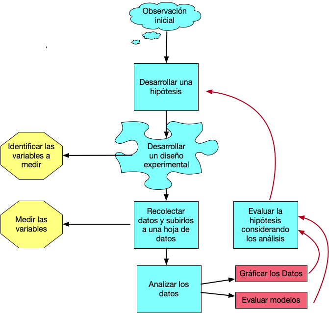
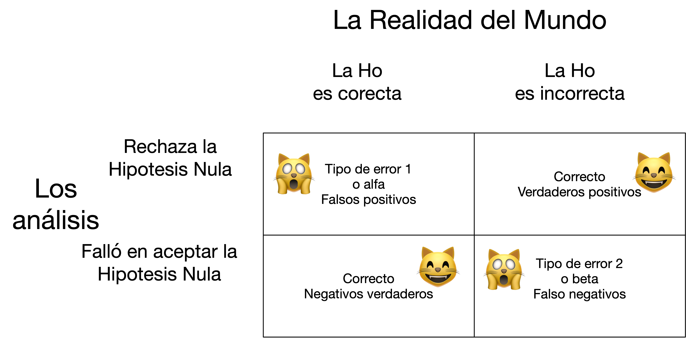

# Introducción a la BioEstadística


```{r c02-setup, include=FALSE}
knitr::opts_chunk$set(echo = TRUE, warning=FALSE, message = FALSE)
#knitr::opts_chunk$set(fig.width = 8, collapse = TRUE)
```


```{r c02-hex, echo=FALSE, fig.show="hold", out.width="20%", fig.align="default"}
knitr::include_graphics(c("Graficos/hex_ggversa.png", "Graficos/hex_error.png"))
```

```{r c02-colorize, eval=TRUE, echo=FALSE}
colorize <- function(x, color) {
  if (knitr::is_latex_output()) {
    sprintf("\\textcolor{%s}{%s}", color, x)
  } else if (knitr::is_html_output()) {
    sprintf("<span style='color: %s;'>%s</span>", color, 
      x)
  } else x
}

#`r colorize("some words in red", "red")`
```


## El libro de la clase

Ningún libro es obligatorio

Libros sugeridos:

Discovering Statistics Using R, Andy Field, Jeremy Miles, Zoë Field. 2012. Sage Publications. ISBN: 978-1-4462-0462-1


\pagebreak

***********
Fecha de la última revisión
```{r c02-fecha, echo=FALSE}

Sys.Date()
```

## El proceso de investigación:

En este curso se estará enfatizando los análisis cuantitativo, esto es simplemente que analizamos los datos para llegar a una conclusión o interpretación sobre un tema. Naturalmente el proceso de seleccionar los datos puede ser un reto grande. Cómo uno selecciona los datos y el desarrollo de la investigación depende del diseño experimental. El diseño es el procedimiento de como uno recolecta los datos y como los vamos a analizar.  En este curso no estaremos evaluando métodos cualitativos de análisis. Este método cualitativo se refiere a evaluar principalmente opiniones, motivaciones o razones que influencia o impacta una situación.  En los métodos cuantitativos es necesario que los resultados sean de una forma o otra numéricos o categóricos.    

El proceso de investigación cuantitativo tiene múltiples pasos y podemos visualizar los pasos con un diagrama de flujo. 


```{r c02-fig-proceso, echo=FALSE, fig.cap="El proceso de investigación", out.width='60%'}

```

***
## El primer paso: 

Todo comienza con una pregunta que te llama la atención. Esta pregunta proviene de haber observado tu ambiente. Puede que sea algo muy sencillo (por ejemplo: si la cantidad de estudiantes registrado en una sección impacta su rendimiento), o puede ser una pregunta más complicada (por ejemplo, cuál es el impacto de la lactancia sobre el desarrollo de las células, órganos, la bioquímica y inteligencia de los niños).  

***
## El segundo paso

El próximo paso es desarrollar una hipótesis. Hay dos tipos de hipótesis, la hipótesis nula y la hipótesis alterna.  SIEMPRE uno comprueba la hipótesis NULA. La nula en la forma más sencilla, es que los grupos son iguales.  En otras palabras, si regresamos a la pregunta del primer paso, el rendimiento de los estudiantes es irrelevante de la cantidad de estudiantes en el salón; en otras palabras, es igual si hay pocos o muchos estudiantes. La hipótesis alterna es que "que la cantidad de estudiantes en un salón impacta el rendimiento de los estudiantes".  Hay otros tipos de hipótesis nula que veremos más tarde. 


::: {.definicion}
La **hipótesis nula ($H_0$)** propone que no hay efecto ni diferencia entre los grupos. La **hipótesis alterna ($H_1$)** propone que sí existe un efecto o diferencia. En una prueba estadística **siempre se pone a prueba la hipótesis nula**.
:::

 * Si **no se rechaza** la hipótesis nula, quiere decir que NO hay evidencia suficiente de que los grupos sean diferentes (ojo: esto no prueba que sean iguales).
 * Si se **rechaza** la hipótesis nula, hay evidencia de que los dos grupos son diferentes.

::: {.nota}
En estadística **no se "acepta" la hipótesis nula**: una prueba solo puede darnos evidencia para **rechazarla** o no. Que no la rechacemos significa que los datos no aportaron evidencia suficiente en su contra, no que sea verdadera. Por eso en este libro decimos **"no rechazar"** en lugar de "aceptar".
:::
  
***

## El tercer paso:

Ahora hay que definir cuáles son las variables (datos) que se van a recolectar para evaluar la hipótesis.  Por ejemplo, cuántos grupos de estudiantes se seleccionarán (2, 3, 10 salones?), La información se recolectará de cuántos estudiantes por salón (todos, la mitad, los que aparezcan, o se seleccionarán los estudiantes al azar, y si se seleccionan al azar, cuál es el mecanismo para seleccionarlos de esta forma).  Cuál será el índice de "rendimiento" (el entusiasmo de cada estudiante, la nota de un examen, de un trabajo, la nota final). Si se selecciona la nota final, la información será la nota numérica o alfabética (A, B, C, D, o F).  

Tomando la información anterior en consideración esto determinará el diseño experimental y las pruebas estadísticas que se deberán utilizar en el quinto paso. 

***

## El cuarto paso:

Recolectar los datos. Este se debe hacer de una forma sistemática, con la información bien apuntado y subir la información en una hoja de cálculo (spreadsheet), como MS Excel, Google Sheet y Numbers.  Es mi sugerencia de **NUNCA** utilizar un programa como SPSS o JMP para poner los datos, ya que con estos programas si en el futuro se quiere tener acceso a los datos, y no tiene el programado o el programado ha cambiado de versión muchas veces los datos no se pueden leer (experiencia personal).

::: {.consejo}
Guarda siempre tus datos en un formato abierto (`.csv` o `.xlsx`). Evita capturarlos directamente dentro de programas propietarios: si cambias de programa o de versión, corres el riesgo de no poder volver a leer tus propios datos.
:::

***
## El quinto paso:

En este paso se hará los gráficos y los análisis estadísticos para evaluar la hipótesis.

***
## El sexto paso:

Rechazar o no rechazar la hipótesis nula. 

***
## Tipo de error de interpretación en estadística


El concepto básico en estadística, y probablemente el más difícil a captar es que en el mundo existe la *verdad*, pero cuando uno recolecta datos, no necesariamente los datos de la muestra representa la *verdad* o se acerca a la realidad.  Por consecuencia siempre hay una posibilidad de que los datos nos engañen, y si nos engañan estamos cometiendo un error al rechazar o no rechazar la hipótesis nula. Por consecuencia aunque uno tome todas las precauciones para tener un diseño experimental adecuado es posible que los datos no representen el universo de los datos (la verdad). 

Típicamente se rechaza la hipótesis nula si el valor de **p** es *menor* de 0.05 (p < 0.05). No es necesario que el valor sea menor de 0.05 para rechazar la hipótesis, en cierta condiciones el valor crítico pudiese ser mayor o menor de 0.05.  El valor de **p** representa la probabilidad de observar datos tan extremos como los obtenidos (o más), **suponiendo que la hipótesis nula es cierta**. Un valor de **p** pequeño constituye evidencia en contra de la hipótesis nula. Por consecuencia un valor de **p** = 0.05, significa que hay 5% de probabilidad de cometer un error al rechazar la hipótesis nula cuando en realidad es cierta, si repetimos la investigación 100 veces (una razón de 1:20). Entonces este representa un tipo de error posible, frecuentemente nominado tipo de error 1 o alfa. En otras palabras, es la probabilidad de rechazar la hipótesis nula cuando en realidad es cierta.  El otro tipo de error, tipo 2 o beta, representa el error de no rechazar la hipótesis nula cuando en realidad es falsa (se debería haber rechazado). 

Los tres términos usado en estadística para de los dos tipos de errores

  + Tipo de error I, alfa, falso positivos
  + Tipo de error II, beta, falso negativos

::: {.nota}
**Error de tipo I ($\alpha$)**: rechazar una hipótesis nula que en realidad es cierta (un *falso positivo*).
**Error de tipo II ($\beta$)**: no rechazar una hipótesis nula que en realidad es falsa (un *falso negativo*).
:::


Aquí un gráfico de los tipos de errores.  El gráfico representa los dos tipos de error y las dos condiciones en que no se hace un error.  

```{r c02-fig-errores, echo=FALSE, fig.cap="Los dos tipos de error en una prueba de hipótesis", out.width='70%'}

```
***


Ahora vamos a considerar un ejemplo básico de preguntas que se podría evaluar.  En este tiempo moderno un tipo de programas a la televisión bien común son los "Reality Shows".  Donde típicamente participa individuos supuestamente "normal" que no sean actores profesionales.  Aquí una lista de algunos de los "Reality Shows".     

### Consideramos los Reality Shows:

  + Kardashians
  + The Bachelorette
  + Survivors
  + Big Brother
  + Shark Tank
  + Skin Wars
  + Hell's Kitchen
  
###  Personalidad de las personas

Uno se podría preguntar qué tipo de personas son seleccionadas para participar en estos tipos de programas. Una hipótesis que son gente con tipo de personalidad bien específica o que sean personas "normales".  Una hipótesis es que son gente que cumple con unas características tal como *Trastorno de personalidad narcisista* (TPN): estas personas, a veces caracterizadas como megalómanas, muestran un patrón a largo plazo de comportamiento anormal caracterizado por sentimientos exagerados de importancia personal, necesidad excesiva de admiración y falta de empatía.   
  

***
En un ejemplo de **Field et al. 2014** se demuestra la siguiente información sobre personas que solicitaron ser parte de uno de estos *Reality Show* que se llama *Big Brother*. 

  Una hipótesis es que los productores de estos *Reality Shows* seleccionan gente con características de TPN más a menudo que las gente que no tienen esta condición. Podemos comprobar esto recolectando datos de los que solicitan y los que fueron aceptados o no para participar en Big Brother (United Kingdom). Se entrevistaron 7662 personas para seleccionar 12, a cada uno se le hizo una prueba para ver si tenía síntomas de TPN.  
  ***
  
|             | No TNP | TPN | Total |
|-------------|--------:|-----:|-------:|
| Seleccionado |      3 |   9 |    12 |
| Rechazado   |   6805 | 845 |  7650 |
| Total       |   6808 | 854 |  7662 |


Lo que uno observa es que la gente identificada con características que cumplen con **TPN** son más propensas a ser seleccionadas para participar en el programa.  Si fuese que la selección hubiese sido al azar, uno esperaría solamente 1 o 2 personas al máximo con la condición de TPN, no 9 personas. Más tarde aprenderemos como calcular el valor esperado exacto. 

***


## ¿Cuándo una hipótesis no es una hipótesis?

### Una hipótesis tiene que ser falsificable
  Esto quiere decir hay que tener un mecanismo para determinar la veracidad de una expresión.  Por ejemplo, de las 4 expresiones siguientes hay 2 que no pueden ser falsificables. Ahora tómate el tiempo de evaluar las siguientes expresiones y trata de determinar si son hipótesis falsificables.  Desafortunadamente, en el vocabulario popular los términos hipótesis y teoría se usan para describir cualquier pensamiento que la gente QUISIERA que fuera verídico. También se hace hipótesis o mejor dicho expresiones que no son falsificable. En nuestra sociedad, donde cualquier persona se puede llamar especialista en un tema, los comentarios no falsificables dominan y resultan en confusión para la gente. Es importante en ciencia que los temas y las áreas de investigación sean falsificables.

::: {.historia}
La idea de que una hipótesis científica debe ser **falsable** proviene del filósofo **Karl Popper**, en su obra *Logik der Forschung* (1934), traducida al español como *La lógica de la investigación científica*.
:::

***
### Ejercicio 1

+ Lin Manuel es el mejor actor del mundo
+ Todos los cisnes son blancos
+ El aumento en producción de semillas en una planta X aumenta con el tamaño poblacional de esta especie. 
+ Los Beatles vendieron más discos que cualquier otro grupo artístico. 


***

### Evaluación de las expresiones falsificables 

+ Lin Manuel es el mejor actor del mundo.

  Esta expresión no es una hipótesis falsificable porque el concepto de **mejor** es uno que es basado en un juicio individual. En otras palabras, ¿cómo se mide lo "**mejor**" y quién toma la decisión sobre esta medida cualitativa? Si Ud. proviene de una cultura diferente la apreciación a la música cambia dramáticamente.  
  
  
+ Todos los cisnes son blancos

  El problema con esta expresión es la palabra "Todos".  En ningún momento aun que uno trate nunca se podría encontrar "todos" los cisnes para evaluar si son blancos o no. Por consecuencia no es falsificable. El concepto de "todos" aquí asume que ninguno quedará sin evaluar, lo cual es imposible.    


+ El aumento en producción de semillas en una planta X aumenta el tamaño poblacional de esta especie.

  Este es una hipótesis falsificable por que uno puede hacer un experimento para evaluar la relación que hay entre la producción de semillas y el tamaño poblacional de una especie de plantas. 
  
  
+ Los Beatles vendieron más discos que cualquier otro grupo artístico.

  Este es una hipótesis falsificable porque se puede contabilizar la cantidad de discos vendidos por los Beatles y otros grupos y determinar si es cierto o no. 

***
## Variables Independientes y Dependientes

 -La variable Independiente: es la variable que impacta (teóricamente) la variable dependiente (puede ser que no impacta el resultado).  Típicamente la **x** en un modelo es la variable independiente.  
 

 -La variable Dependiente: es la variable que recibe el efecto (teóricamente) de la variable independiente. La variable dependiente depende de la variable independiente.  Las **y's** en un modelo son las variables dependientes.  

***

## Niveles de mediciones

::: {.historia}
La clasificación de las variables en escalas **nominal, ordinal, de intervalo y de razón** fue propuesta por el psicólogo **Stanley Smith Stevens** en 1946. Es una de las bases para decidir qué análisis estadístico es apropiado para cada tipo de dato.
:::

### Variables continuas

- Las variables con datos continuos:

  - Son valores que son contiguos o por lo menos existe o pudiese existir los valores intermedios. 
  
  - Ejemplo 1
   - la distancia entre el valor 13 y 15 es igual que 101 y 103, hay dos unidades que los separa. 
   - Aunque no se haya observado el 14 ni el 102 en un recogido de datos estos valores tienen potencialmente existir, en otra palabra estos valores son posibles en el universo de los datos. 
   
  - Ejemplo 2
    - Si se mide el tamaño de una célula biológica en micrómetros (µm, $10^{-6}$).  Los valores intermedios y contiguos existen.  Por ejemplo, el largo de las células de *Escherichia coli* (*E. coli*) adulta son de 5.27µm en promedio con una desviación estándar de 0.87µm.  Esto significa que hay células de diferentes tamaños que van de menos de 2µm a más de 10µm de largo, y todos los valores pueden existir en este rango (ref: https://doi.org/10.1098/rsos.160417). Más tarde veremos como se puede llegar a la conclusión que las células varían entre  2µm a más de 10µm de largo, cuando uno tiene solamente el promedio y la desviación estándar.     
  
   Ejemplo 3
   - El número de hermanos, si por ejemplo yo pregunto a seis estudiantes cuantos hermanos tiene. Yo podría tener la siguiente lista. Aunque que no hubo ningún estudiante que tenga 1 hermano o 6 hermanos, es posible esta alternativas.  Note algo especial aquí es que nadie puede tener 2.4 hermanos, los valores tienen que ser números enteros. Cuando son conteos así, la distribución de los datos provienen de una distribución **Poisson** (veremos más tarde).    
    - Números de hermanos (0, 2, 5, 3, 8, 4)
        
### Variables Discretas

- Categórica o Discreta
  - Variables Nominales
      - Hombres y Mujeres
      - Omnívoro, vegetariano, vegano, carnívoro
          
- Variable Ordinal
  - Datos donde hay un orden en los valores
      - primero, segundo, tercero, etc. 
      - A, B, C, D, F (nota de estudiantes)
      - pequeño, mediano, grande
 
- Variable Binomial
  - Tiene solamente dos alternativas
      - Vivo o muerto
      - Vive en PR o No vive en PR
      - Está embarazada o No está embarazada
      - Tiene flores o no tiene flores

***


