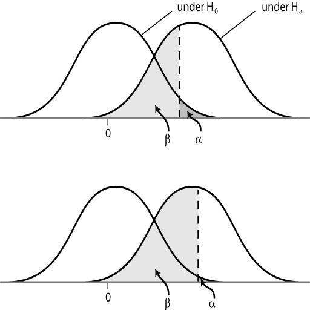

# Inferencias e Hipótesis
 
 


```{r c04-colorize, eval=TRUE, echo=FALSE}
colorize <- function(x, color) {
  if (knitr::is_latex_output()) {
    sprintf("\\textcolor{%s}{%s}", color, x)
  } else if (knitr::is_html_output()) {
    sprintf("<span style='color: %s;'>%s</span>", color, 
      x)
  } else x
}

#`r colorize("some words in red", "red")`


```

Fecha de la última revisión
```{r c04-fecha, echo=FALSE}

Sys.Date()
```

```{r c04-hex, echo=FALSE, fig.show="hold", out.width="20%", fig.align="default"}
knitr::include_graphics(c("Graficos/hex_ggversa.png", "Graficos/hex_error.png"))
```


## Introducción

Los parámetros versus un muestreo:  

En algunas instancias se podría calcular el parámetro (por ejemplo, el promedio), es decir, medir toda la población (todos los individuos sin que falte ni uno). Si es así tenemos todos los datos.   Por ejemplo, si la población es cuántos médicos fueron infectados por el COVID-19 en un hospital específico entre unas fechas delimitadas, es probable que se pueda conseguir la información de cada uno de los médicos y calcular la proporción de infectados.   

Pero cuando la población es más grande será necesario tener solamente una muestra de la población, si se usa un método al azar de recolección de los datos uno podría inferir cuál es el estado con base en las estadísticas recolectadas.  

## Ejemplo 1:
Por ejemplo en un estudio hecho por la Dra. Patricia Burrowes sobre la frecuencia de una infección común de los coquíes, evaluó la presencia del hongo sobre la piel de estos anfibios y encontró que los individuos del bosque nublado eran infectados con más frecuencia que los del bosque enano.   Ella y sus estudiantes muestrearon 299 individuos del bosque nublado y 130 del bosque enano, este esfuerzo fue muy grande. Encontrar los coquíes en el campo no es fácil y no hay manera de conseguir todas las pequeñas ranas. 


Costo potencial en aptitud evolutiva de *Batrachochytrium dendrobatidis* en *Eleutherodactylus coqui*, y comentarios sobre el riesgo de infección relacionado con el ambiente”. 
 
 El tamaño corporal (longitud hocico a cloaca) en adultos de *Eleutherodactylus coqui* infectados y no infectados con *Batrachochytrium dendrobatidis* (Bd) fue comparado para determinar el costo potencial en aptitud evolutiva de quitridiomicosis en poblaciones resistentes.  Los estudios fueron realizados en dos tipos de bosque a diferentes elevaciones, Bosque Nublado (650 m)  y Bosque Nublado Enano (850 m), en El Yunque, Puerto Rico.  Nuestros resultados demuestran que los machos infectados con Bd son significativamente más pequeños que los no infectados en el Bosque Nuboso, sin embargo no sucede lo mismo en el Bosque Nublado Enano.  Aunque las hembras que están infectadas por Bd también son más pequeñas que las no infectadas, este efecto no es estadísticamente significativo. La prevalencia de Bd y la probabilidad de infección por este hongo son significativamente más altas en el Bosque Nublado (44.1%) que en el Bosque Nublado Enano (20.7%) para ambos sexos.  Reportamos las diferencias en factores ambientales en estos dos tipos de bosque en Puerto Rico y discutimos las implicaciones en el crecimiento de Bd y la vulnerabilidad de las ranas a la infección por este patógeno. 
> 
> > Burrowes, P. A., A. V. Longo, and C. A. Rodríguez. 2008b. Potential fitness cost of *Batrachochytrium dendrobatidis* in *Eletherodactylus coqui*, and comments on environment-related risk of infection. Herpetotropicos 4:51-57.


## Ejemplo 2:

 En este segundo ejemplo se demuestra la eficiencia de dos vacunas para proteger del virus papiloma humano (VPH) que es una causa principal del cáncer del útero.  Hay un estimado que 25% de los adultos están infectado por HPV en un momento en su vida (Lowndes, doi: 10.1017/S0950268805005728) y que este cáncer es el segundo más común en el mundo (Bosch et al. 2002, doi: 10.1136/jcp.55.4.244). El siguiente ejemplo demuestra que las vacunas pueden ser muy efectiva. 


¿Qué tan eficaces son las vacunas contra el VPH?


Las vacunas contra el VPH son altamente eficaces para prevenir la infección por los tipos de VPH a los que atacan cuando las vacunas se administran antes de la exposición inicial al virus — es decir, antes de que el individuo tenga actividad sexual.


En los estudios que llevaron a la aprobación de Gardasil y de Cervarix, se encontró que estas vacunas proveen casi 100 % de protección contra infecciones persistentes del cuello uterino por los tipos 16 y 18 de VPH y contra los cambios celulares del cuello uterino que pueden causar estas infecciones persistentes. Gardasil 9 es tan eficaz como Gardasil para la prevención de las enfermedades causadas por los cuatro tipos de VPH (6, 11, 16 y 18), según reacciones similares de anticuerpos en participantes de estudios clínicos. Los estudios que llevaron a la aprobación de Gardasil 9 encontraron que es casi 100 % eficaz en la prevención de enfermedades cervicales (de cuello uterino), de vulva y de vagina causadas por los otros cinco tipos de VPH (31, 33, 45, 52 y 58) a los que se dirige (4). En un documento de posición de 2017, la Organización Mundial de la Salud declaró que las vacunas contra el VPH tienen una eficacia equivalente (5). Se ha encontrado que Cervarix provee protección parcial contra algunos otros tipos de VPH que pueden también causar cáncer pero que no están incluidos en la vacuna, un fenómeno llamado protección cruzada (6).
>

> > Fuente de información: <https://www.cancer.gov/espanol/cancer/causas-prevencion/riesgo/germenes-infecciosos/hoja-informativa-vacuna-vph>


## Inferencias en estadística

El concepto de inferencia en estadística se refiere al proceso de sacar conclusiones con base en una muestra.  Por ejemplo en el primer ejemplo de la infección de hongos en los coquis, uno podría inferir que la proporción de ranas infectadas será igual (o muy similar) en otros bosques nublados y enanos de Puerto Rico.  

## Hipótesis 

En la sección 6.2 del libro de Havel et al. leer y evaluar la tabla 6.2 para tener unos ejemplos de expresiones que no son una hipótesis y las que sí lo son.   NOTA: es importante notar que las que el autor menciona aquí son las hipótesis alternas, es decir, lo que uno piensa que podría ocurrir.   Pero esa no es la hipótesis que se prueba, lo que se prueba es la hipótesis NULA, Ho. Cuando se dice la hipótesis NULA es que no hay diferencias entre los grupos.  Vea la tabla 6.2 del libro para más ejemplos. 

Ejemplo de hipótesis nula y alterna

|  | NULA, Ho  | ALTERNA, Ha | No es una hipótesis  |
|----|-------:|:---------:|:-------------:|
| 1  | Tratamiento con la vacuna de Salk no tiene efecto sobre el riesgo de infección de polio en niños   |      El efecto de la vacuna Salk reduce el riesgo de infección de polio en los niños     | El polio es malo |
| 2  | Los Beatles no vendieron más discos que cualquier otro grupo de rock    |  Los Beatles vendieron más discos que cualquier otro grupo de rock         | La música de los Beatles es obsoleta       |


## El valor de p

El valor de *p* es la probabilidad de obtener una estadística tan extrema (o más) si la hipótesis nula es verdadera (es decir, si Ho es correcta). Uno podría decir que es un índice de la evidencia **CONTRA** la hipótesis nula. PERO OJO: es incorrecto decir que es la probabilidad de que Ho sea correcta. Si el valor de p > 0.05, decimos que no hay evidencia suficiente para rechazar la hipótesis nula (lo cual **no** significa que la hipótesis nula sea correcta).

::: {.definicion}
El **valor $p$** es la probabilidad de obtener un resultado tan extremo como el observado (o más), **suponiendo que la hipótesis nula es cierta**. Un valor $p$ pequeño es evidencia en contra de $H_0$; **no** es la probabilidad de que $H_0$ sea cierta.
::: 

Antes de comenzar el estudio se debería decidir *a priori* cuál será el nivel de **alfa** ($\alpha$) para rechazar la hipótesis nula. Típicamente el valor crítico de $\alpha$ es 0.05 (5%). Esto quiere decir que, si uno repite el experimento 100 veces, en 5 de ellas la investigación daría un resultado equivocado: rechazar Ho cuando en realidad es cierta. Es decir, una vez en cada 20 experimentos con las mismas condiciones.  En muchas ramas de investigación como la física el nivel de $\alpha$ es frecuentemente 0.01 o menos.

::: {.nota}
El nivel de significancia $\alpha$ se elige **antes** de recolectar los datos, no después de ver el valor $p$. $\alpha$ es el riesgo de error de tipo I que estamos dispuestos a aceptar; $p$ es lo que calculamos a partir de los datos. Se rechaza $H_0$ cuando $p \le \alpha$.
:::  

## Los errores de tipo I y tipo II

::: {.historia}
La forma moderna de probar hipótesis nació de dos escuelas que rivalizaron en los años 1920-1930. **Ronald A. Fisher** introdujo la **hipótesis nula** y el **valor-p** como medida de evidencia. **Jerzy Neyman** y **Egon Pearson** añadieron la **hipótesis alterna**, los **errores de tipo I y II**, el nivel $\alpha$ fijado de antemano y la **potencia**. Lo que hoy enseñamos es una síntesis (a veces incómoda) de ambos enfoques.
:::

Vea el módulo anterior.  


## El poder (potencia) de las pruebas inferenciales y los parámetros que lo influyen

Si la hipótesis nula es falsa es probable que se podría rechazar con cierta confianza. El complemento de beta, $(1-\beta)$, es la **potencia** de la prueba (*statistical power*): la probabilidad de rechazar correctamente la hipótesis nula cuando es falsa. Para aclarar: la $\beta$ es la probabilidad de cometer un error de tipo II, y la **potencia** $(1-\beta)$ es la probabilidad de rechazar correctamente una hipótesis nula falsa.

::: {.definicion}
La **potencia** (*power*) de una prueba es $1-\beta$: la probabilidad de detectar un efecto real (rechazar $H_0$ cuando de verdad es falsa). Aumenta con un mayor tamaño de muestra, un efecto más grande y un $\alpha$ menos estricto.
:::  

Evalúa el siguiente gráfico:

La potencia de la prueba está influida por tres propiedades.

+ El nivel del tipo de error I, o sea el $\alpha$.
+ La diferencia entre dos o más promedios que queremos evaluar.
+ El tamaño de muestra (n).

La línea vertical entrecortada representa el valor crítico. El área gris oscuro representa el error $\alpha$: la probabilidad de rechazar la hipótesis nula cuando en realidad es cierta. El área gris claro representa el error $\beta$.   

```{r c04-fig-poder, echo=FALSE, out.width='50%'}

```

Una ilustración de cómo el $\alpha$ afecta el $\beta$.


