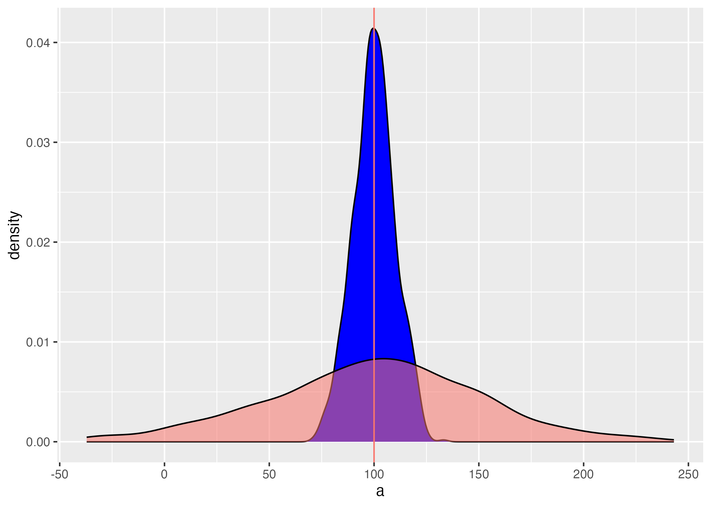
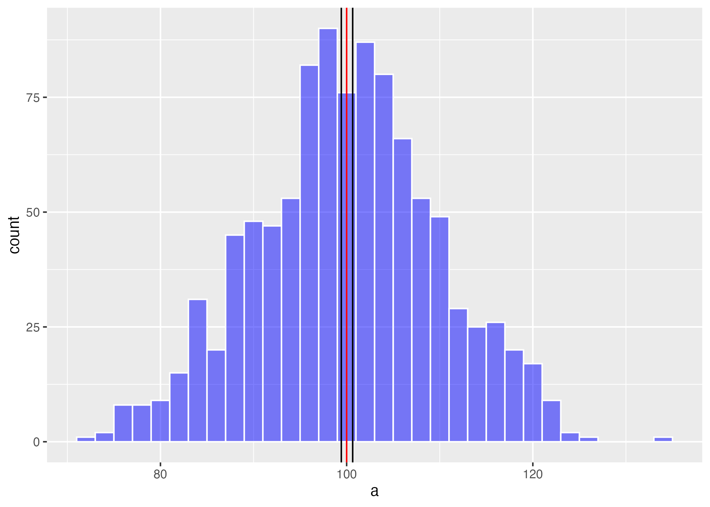
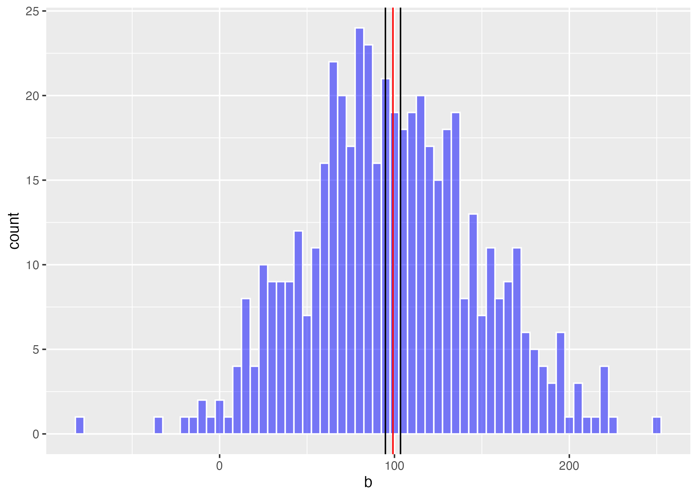
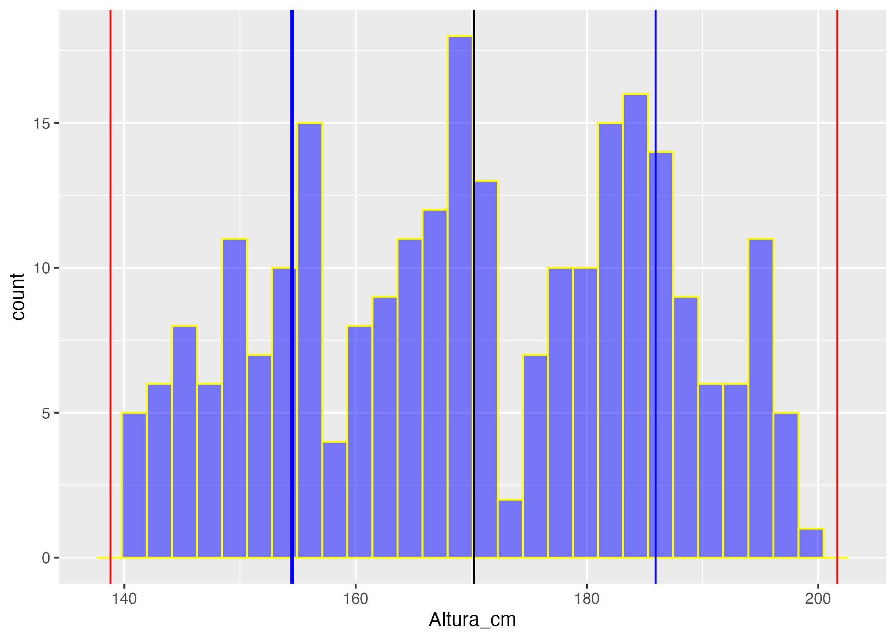

# Medidas de dispersión

Fecha de la última revisión
```{r c07-1, echo=FALSE}

Sys.Date()
```

```{r c07-2, echo=FALSE, fig.show = "hold", out.width = "20%", fig.align = "default"}
knitr::include_graphics(c("Graficos/hex_ggversa.png", "Graficos/hex_error.png"))
```

```{r c07-3, eval=TRUE, echo=FALSE}
colorize <- function(x, color) {
  if (knitr::is_latex_output()) {
    sprintf("\\textcolor{%s}{%s}", color, x)
  } else if (knitr::is_html_output()) {
    sprintf("<span style='color: %s;'>%s</span>", color, 
      x)
  } else x
}

#`r colorize("some words in red", "red")`
```


```{r c07-4, eval=TRUE, echo=FALSE}


library(ggplot2)
library(Hmisc)
library(gridExtra) # Un paquete para organizar las figuras de ggplot2
library(gt)
library(tidyverse)
```


***

## Qué es la dispersión en estadística


Las medidas o índices de dispersión son indicadores de cuán variables son los datos entre sí. Si todos los valores son iguales, no hay dispersión. Hay múltiples índices de dispersión; vamos a evaluar solamente algunos de ellos. Para más información pueden ir al siguiente enlace <https://en.wikipedia.org/wiki/Statistical_dispersion>.  

Los indices que estaremos estudiando son los siguientes

  - el rango
  - la varianza
  - la desviación estándar
  - el error estándar
  - el rango intercuartil
  - el intervalo de confianza de 95%
 
***
 
## Visualizando la dispersión
  
Primero miramos un gráfico donde tenemos datos donde el promedio es igual pero las dispersiones son diferentes. Lo que uno observa es que en la distribución azul los datos son más similares entre sí, y en la distribución roja los valores son más diferentes.  En el primer conjunto de datos se usa 500 valores con un promedio de 100 y una desviación estándar de 10, en el segundo se produce un conjunto de datos de 500 valores con un promedio de 100 y una desviación estándar de 30.


```{r c07-5}

set.seed(8690) # esto es para que los valores se queden iguales cada vez que se corre el análisis
a=rnorm(1000, 100, 10) # la función para generar datos al azar con una distribución normal
#a
dfa=data.frame(a)
head(dfa, n=10)
 # r is for random
 # norm =distribución normal
#a
b=rnorm(500, 100, 50)
dfb=data.frame(b)


```


```{r c07-6, out.width = '60%'}
library(ggplot2)

ggplot(dfa, aes(a))+
  geom_density(fill="blue")+
  geom_density(dfb, mapping=aes(b,fill="red", alpha=.5 ))+
  theme(legend.position = "none") +
  geom_vline(aes(xintercept = 100, colour="red"))
ggsave("Graficos/dispersion.png")
```

```{r c07-7, echo=FALSE, fig.align='center', out.width = '60%'}

```


***

## El rango

::: {.funcion}
**`range(x)`** — rango de los datos.

- **Qué hace:** devuelve el valor mínimo y el máximo de `x` (dos números).
- **Relacionadas:** `min(x)` y `max(x)` los dan por separado; `diff(range(x))` da la amplitud.
:::

El rango está definido por el valor mínimo y el valor máximo de un conjunto de datos.  Se usa la función **range()**.  Usamos los dos conjuntos de datos ya creado anteriormente para visualizar los rangos de la distribuciones de los gráficos. Lo que uno observa es que el valor mínimo del primer conjunto de datos es 59.17 y el máximo es 137.12.  Para el segundo conjunto de datos el valor mínimo es 1.86 y el máximo es 203.88.  


```{r c07-8}
range(dfa$a) 

range(dfb$b)

```


## Mínimo y máximo

El rango de una distribución es lo mismo que el mínimo y máximo


```{r c07-9}
min(dfa$a)
max(dfa$a)

min(dfb$b, na.rm=TRUE) # si hay valores NA en los datos
max(dfb$b)

```


***

## Ejemplo de la clase

### ¿Cuál es el rango de la edad de los padres de los estudiantes cuando nacieron sus hijos?

```{r c07-10}
# Create mode() function to calculate mode
mode <- function(x, na.rm = FALSE) {
  
  if(na.rm){ #if na.rm is TRUE, remove NA values from input x
    x = x[!is.na(x)]
  }

  val <- unique(x)
  return(val[which.max(tabulate(match(x, val)))])
}

```

```{r c07-11}
Edad=c(23, 27, 33, 23, 21, 25, 30, 27, 26, 23,
       21, 28, 33, 35, 27, 15, 21, 22, 28, 33,
       29, 23, 22, 26, 21, 27, 29, 28)
#Edad
Edad_df=data.frame(Edad)
Edad_df
range(Edad)
range(Edad_df$Edad)

mean(Edad_df$Edad)
median(Edad_df$Edad)
mode(Edad) # para correr "mode" necesita correr la función mode arriba

var(Edad)

```


```{r c07-12}
Edad_papa=c(25, 29, 35, 25, 25, 25, 30, 29, 31, 28,
            26, 29, 31, 36, 27, 21, 21, 22, 48, 15, 
            62, 21, 24, 32, 25, 26, 28, 33)

Edad_papa_df=data.frame(Edad_papa)

mean(Edad_papa_df$Edad_papa)
median(Edad_papa_df$Edad_papa)
mode(Edad_papa_df$Edad_papa)
range(Edad_papa_df$Edad_papa)
var(Edad_papa_df$Edad_papa)
```


```{r c07-13}
Dist_V=c(14, 71, 16, 43, 32, 17.1, 11, 53, 16.2, 47, 18.2, 39, 9, 16.2)

df=data.frame(Dist_V) # para poner los datos un un data frame

df
```

Calcular la varianza

```{r c07-14}
var(df$Dist_V)
```


Desviación estándar

```{r c07-15}
sd(df$Dist_V)
```


Error estándar

```{r c07-16}
error_e= sd(df$Dist_V)/sqrt(length(df$Dist_V))
error_e
```


95% de la distribución


```{r c07-17}
Limite_inferior_a=mean(df$Dist_V)-(error_e*1.96)

Limite_superior_a=mean(df$Dist_V)+(error_e*1.96)


Limite_inferior_a
Limite_superior_a
```


***

## La varianza

::: {.historia}
El término **desviación estándar** fue acuñado por **Karl Pearson** en 1893, y el de **varianza** por **Ronald A. Fisher** en 1918. Ambos conceptos son la base para medir cuánto se dispersan los datos alrededor de su promedio.
:::

::: {.definicion}
La **varianza** ($s^2$) es el promedio de las diferencias al cuadrado entre cada valor y la media (dividido entre $n-1$). La **desviación estándar** ($s$) es su raíz cuadrada, y tiene las mismas unidades que los datos.
:::

Los pasos para calcular la varianza son los siguientes

+ tener un conjunto de datos, aquí lo llamamos **Data**
+ convertir esta lista en un data frame 
+ Calcular el promedio de los datos
+ restar el promedio a cada valor y elevar la diferencia al cuadrado
+ sumar esos cuadrados y dividir entre **n-1**, donde **n** es la cantidad de datos
+ el numerador se llama la **suma de los cuadrados** = SS


$${ s }^{ 2 }=\frac { \sum { { ({ x }_{ i }-\bar { x }  })^{ 2 } }  }{ n-1 }=\frac{SS}{n-1}$$

```{r c07-18}
library(tidyverse)
Data=c(1,2,3,4,5,6)
Data_df=data.frame(Data)
Data_df
Data_df$mean_Data=mean(Data)   # Aqui se añade el promedio a cada fila
Data_df
Data_df$Diff=Data_df$Data-Data_df$mean_Data 
          # Calcular la diferencia entre el promedio y el valor x
sum(Data_df$Diff) # si las diferencias no se elevan al cuadrado, la suma será cero.

Data_df$SS=(Data_df$Data-Data_df$mean_Data)^2 # SS para la suma de los cuadrados 
Data_df
sum(Data_df$SS)
```
 
###  Este indice se llama la desviación del promedio que es la suma de los cuadrados


***

## Calcular la varianza con **var()**

::: {.funcion}
**`var(x)`** — varianza muestral.

- **Qué hace:** calcula el promedio de las diferencias al cuadrado respecto a la media, dividido entre $n-1$.
- **Nota:** está en unidades **al cuadrado**; para volver a las unidades originales se usa `sd()`.
:::

Ahora la manera fácil de hacer los análisis, usar la función **var**, y no hay que hacer ninguno de los pasos anteriores.   Pero es importante que sepa como es el procedimiento de calcular la varianza. Nota que la varianza es un índice de la diferencia entre el promedio y cada valor. Es importante elevar al cuadrado las diferencias; de lo contrario, la suma sería cero. La varianza es más informativa cuando los datos provienen de una distribución aproximadamente normal y no están muy sesgados.   

```{r c07-19}
var(Data)
```

*** 


## La desviación estándar

::: {.funcion}
**`sd(x)`** — desviación estándar muestral.

- **Qué hace:** es la raíz cuadrada de la varianza (`sqrt(var(x))`); mide la dispersión en las **mismas unidades** que los datos.
- **Uso:** junto con la media resume la distribución; también entra en el cálculo del error estándar ($s/\sqrt{n}$).
:::

La varianza es un índice que no está en la misma unidad que los valores recolectados; por ejemplo, si se recolectan los datos en centímetros, la varianza está en centímetros cuadrados. Por eso no siempre es la mejor para describir la dispersión. Para resolver esto, sacamos la raíz cuadrada de la varianza. La desviación estándar se usa para describir la dispersión; en otras palabras, cuán diferentes son los datos entre sí. Es más informativa cuando los datos provienen de una distribución aproximadamente normal y no están muy sesgados.   
  
  $${ s }=\sqrt { \frac { \sum { { ({ x }_{ i }-\bar { x }  })^{ 2 } }  }{ n-1 }  }$$ 
  o más sencillo
  
  $$s=\sqrt{s^2}$$
  
la función **sd**, "standard deviation" es sumamente fácil de calcular en R. 


```{r c07-20}
sd(Data_df$Data)  # deviación estandard
```

***

## El rango intercuartil

::: {.funcion}
**`quantile(x, probs = ...)`** — cuantiles y rango intercuartil.

- **Qué hace:** por defecto devuelve los cuartiles (0%, 25%, 50%, 75%, 100%); con `probs` pides percentiles específicos (p. ej. `c(0.025, 0.975)`).
- **Relacionada:** `IQR(x)` da el rango intercuartil (Q3 − Q1), una medida de dispersión robusta a los valores atípicos.
:::

La función básica es **quantile**; si la dejamos sin más instrucciones, calcula las siguientes probabilidades: 0%, 25%, 50% (mediana), 75% y 100%. Pero si uno quiere los valores que se encuentran en una posición específica hay que usar **type = 1**, como se ve en el segundo ejemplo. Hay 9 tipos de cuantiles con esta función, definidos en RStudio. Escribe **?quantile** en la consola o en el área de **help** para ver las otras alternativas.   

```{r c07-21}
quantile(Data) # la función básica (0%, 25%, 50% (mediana), 75%, 100%)

# Seleccionar los cuantiles específicos.
quantile(Data, probs = c(0.025, 0.25, 0.50,.75, .975))   


```


Para explicar estos conceptos mejor visualizamos los datos 


| i  | x[i]  | Mediana | Cuartiles   |
|----|-------:|:---------:|:-------------:|
| 1  | 03    |           |  |
| 2  | 19     |           |          |
| 3  | 27      |         |             |
| 4  | 33    |         |    Q1=33         |
| 5  | 52    |         |             |
| 6  | 60    |         |            |
| 7  | 77    |         |             |
| 8  | 87    |  Q2=87       |             |
| 9  | 99    |       |             |
| 10 | 101   |         |             |
| 11 | 122   |         |             |
| 12 | 137   |         | Q3=137    |
| 13 | 140   |         |             |
| 14 | 142   |         |             |
| 15 | 150   |         |             |

Ahora usamos la función **quantile** con el type=1 de calcular los cuartiles y ver si tenemos los mismos resultados.

```{r c07-22}

dat=c(3,19,27,33,52,60,77,87,99,101,122,137,140,142,150)

quantile(dat, type =1)

sd(dat)

```


***

## El error estándar

El término correcto es *error estándar de la media*, pero típicamente se acorta a *error estándar*. El error estándar describe la posible dispersión del **promedio**; en otras palabras, cuán confiados estamos en el estimado del promedio. Cuanto más grande es el error estándar, menos confiados estamos en el promedio.

::: {.nota}
No confundas la **desviación estándar** con el **error estándar**. La desviación estándar describe cuánto varían **los datos** entre sí. El error estándar describe cuánto variaría **el promedio** si repitiéramos el muestreo: $ES = s/\sqrt{n}$. Por eso el error estándar siempre es menor que la desviación estándar y disminuye al aumentar $n$.
:::   

La formula de error estándar es la siguiente usando la desviación estándar

$$s_{\overline{x}}=\frac{s}{\sqrt{n}}$$

o usando la varianza, donde la **n** es la cantidad de datos

$$s_{\overline{x}}=\sqrt{\frac{s^2}{n}}$$

Ahora usamos los datos mostrados al principio del módulo. Calculamos el error estándar de ambas distribuciones (es = error estándar). No hay una función en R base para el error estándar, así que creamos la fórmula. Vemos que cuando hay más dispersión, el error estándar es más grande.  

```{r c07-23}
length(dfa$a)
es_a= sd(dfa$a)/sqrt(length(dfa$a))

es_b= sd(dfb$b)/sqrt(length(dfb$b))

es_a
es_b
```

***

## El intervalo de confianza de 95% del promedio

Ya que hemos calculado el error estándar podemos calcular la dispersión de los promedios. Esto quiere decir que, si repitiéramos el estudio muchas veces, el 95% de los intervalos calculados así contendrían el verdadero promedio de la población. Uno calcula los límites usando las siguientes fórmulas.

::: {.interpretacion}
Un intervalo de confianza del 95% **no** significa que haya 95% de probabilidad de que el verdadero promedio esté en *este* intervalo concreto. Significa que, si repitiéramos el estudio muchas veces, aproximadamente el 95% de los intervalos así construidos contendrían el verdadero promedio de la población.
:::  

$$\text{Límite 95\% superior} = \overline{x} + \left(ES \cdot 1.96\right)$$


$$\text{Límite 95\% inferior} = \overline{x} - \left(ES \cdot 1.96\right)$$

```{r c07-24}
Limite_inferior_a=mean(dfa$a)-(es_a*1.96)

Limite_superior_a=mean(dfa$a)+(es_a*1.96)

Limite_inferior_a # limite inferior 95%
mean(dfa$a)   # El promedio
Limite_superior_a # el limite superior 95%
```

```{r c07-25}
Limite_inferior_b=mean(dfb$b)-(es_b*1.96)
Limite_superior_b=mean(dfb$b)+(es_b*1.96)

mean_b=mean(dfb$b)
Limite_inferior_b
mean(dfb$b)
Limite_superior_b
```

Visualizando el intervalos de confianza del promedio. Lo que uno observa es que el promedio puede quedar en lugares diferentes porque el conjunto de datos fue más pequeño en el segundo gráfico. Además vemos que el intervalo de 95% de confianza del promedio en el segundo es más amplio.  

```{r c07-26, echo=FALSE, fig.align='center', out.width = '60%'}
CI_a1=ggplot(dfa, aes(a))+
  geom_histogram(fill="blue", colour="white",alpha=.5, binwidth = 2)+
  theme(legend.position = "none") +
  geom_vline(aes(xintercept = 100), colour="red")+
  geom_vline(aes(xintercept = Limite_inferior_a), colour="black")+
  geom_vline(aes(xintercept = Limite_superior_a), colour="black")
ggsave("Graficos/CI_a1.png")
```


```{r c07-27, echo=FALSE, fig.align='center', out.width = '60%'}

```


```{r c07-28, fig.align='center', warning=TRUE}

CI_b=ggplot(dfb, aes(b))+
  geom_histogram(fill="blue", colour="white", alpha=.5, binwidth = 5)+
  theme(legend.position = "none") +
  geom_vline(aes(xintercept =mean_b), colour="red")+
  geom_vline(aes(xintercept = Limite_inferior_b), colour="black")+
  geom_vline(aes(xintercept = Limite_superior_b), colour="black")


ggsave("Graficos/CI_b.png")
```


```{r c07-29, echo=FALSE, fig.align='center', out.width = '60%'}

```


```{r c07-30, eval=FALSE, include=FALSE}

#library(cowplot)
#grDevices::pdf(NULL)
#g2<-plot_grid(CI_a,CI_b)
#grDevices::dev.off()
#g2
```


```{r c07-31}
#library(easyGgplot2)
#ggplot2.multiplot(CI_b.png,CI_b.png, cols=2)
```

```{r c07-32, eval=FALSE, include=FALSE}
#library(png)
#library(grid)
#library(gridExtra)

#plot1 <- readPNG('Graficos/CI_a.png')
#plot2 <- readPNG('Graficos/CI_a.png')

#grid.arrange(rasterGrob(plot1),rasterGrob(plot2),ncol=2)
```


***

## El intervalo de confianza de los datos

Para tener una idea de la distribución de los datos y de cuál es el porcentaje de valores incluido (asumiendo una distribución normal), podemos crear un gráfico que muestra el porcentaje incluido según la desviación estándar. Nota que aquí no se trata de la dispersión del promedio, sino de la dispersión de los datos en la población.  


***

## Rangos incluidos en intervalos de confianza 

Calculamos el promedio y la desviación estándar de los datos; lo haremos por género. El rango promedio ± 1 sd incluye 68.2% de los datos, promedio ± 2 sd incluye 95.4% de los datos, 


```{r c07-33, message=FALSE, warnings=FALSE, results='asis'}
require(pander)
panderOptions('table.split.table', Inf)
set.caption("Rangos incluidos en intervalos de confianza")
my.data <- "
| sd  | rango incluido |
| 0  | el promedio    | 
| ±1 |  68.2% |
| ±2 |  95.4% |
| ±3 | 99.7% |
| ±4 | 99.99% |"

df <- read.delim(textConnection(my.data),header=FALSE,sep="|",strip.white=TRUE,stringsAsFactors=FALSE)
names(df) <- unname(as.list(df[1,])) # put headers on
df <- df[-1,c(-1,-4)] # remove first row
row.names(df)<-NULL
pander(df, style = 'rmarkdown')
```

***

## Ejemplo del intervalo de confianza

### El intervalo de confianza del colesterol en los iraníes

Comenzamos con evaluar el intervalo de confianza de los datos con datos teóricos.  Por ejemplo, el nivel de colesterol en el plasma varía en los humanos. En el siguiente artículo *Plasma total cholesterol level and some related factors in northern Iranian people*. <https://www.ncbi.nlm.nih.gov/pmc/articles/PMC3783780/>  

Usamos los datos para las mujeres con un promedio de 196.7 y una desviación estándar de 39.11.  Con estos datos asumimos que provienen de una distribución normal y que representan a las mujeres del resto del mundo.   

```{r c07-34, message=FALSE, warnings=FALSE}
# Creamos un conjunto de datos para los análisis

Col=rnorm(200000, 196.7, 39.11)
Col=data.frame(Col)

promCol=Col%>%
  summarise(Mean=mean(Col))
  
sdCol=Col%>%
  summarise(sd=sd(Col))

```

***

Visualizar los datos:  ¿Conoce su nivel de colesterol total? ¿Dónde se encuentra en esta distribución? ¿Está dentro del 68%? Nota que la suma de todos los porcentajes es igual a 100%.  


```{r c07-35, out.width = '60%'}
library(grid)
library(gtable)

lims <- c(28, 350)

breaks.major2<-c(0, 79, 118, 157, 
                 197, 235, 274, 314)
breaks.minor2= c(79, 118, 157,197, 
                235, 274, 314,379)
breaks.comb <- sort(c(breaks.major2, breaks.minor2-1.0E-6))
labels.comb<- c(0, 79, "\n-3sd", 118, "\n-2sd", 157, "\n-1sd", 197, "\npromedio",
                 235,  "\n+1sd",274, "\n+2sd", 314,"\n+3sd", 379)
```


```{r c07-36, out.width = '60%'}
Colesterol_Inter=Col%>%
ggplot(aes(Col))+
  geom_histogram(fill="blue", colour="white",alpha=.5, binwidth = 5)+
  theme(legend.position = "none")+
  geom_vline(xintercept=as.numeric(promCol), colour="black")+
  geom_vline(aes(xintercept = as.numeric(promCol-sdCol)), colour="blue")+
  geom_vline(aes(xintercept = as.numeric(promCol+sdCol)), colour="blue")+
geom_vline(aes(xintercept = as.numeric(promCol-2*sdCol)), colour="red")+
  geom_vline(aes(xintercept = as.numeric(promCol+2*sdCol)), colour="red")+
geom_vline(aes(xintercept = as.numeric(promCol-3*sdCol)), colour="orange")+
  geom_vline(aes(xintercept = as.numeric(promCol+3*sdCol)), colour="orange")+
  scale_x_continuous(expand=c(0,0), limit=lims, 
                                minor_breaks=breaks.minor2, 
                                breaks=breaks.comb,
                                labels=labels.comb)+
  xlab("Nivel de colesterol")+
  annotate("text", x=180, y = 10000, label="34.1%")+
  annotate("text", x=210, y = 10000, label="34.1%")+
  annotate("text", x=140, y = 10000, label="13.6%")+
  annotate("text", x=250, y = 10000, label="13.6%")+
  annotate("text", x=90, y = 10000, label="2.1%")+
  annotate("text", x=295, y = 10000, label="2.1%")+
  annotate("text", x=70, y = 10000, label="0.1%")+
  annotate("text", x=330, y = 10000, label="0.1%")
Colesterol_Inter

ggsave("Graficos/Colesterol_Inter.png")

```


***

## Otro ejemplo de los intervalos de confianza

### La altura de los humanos


Para evaluar el 95% de intervalo de confianza usaremos datos de la alturas de 500 adultos. Estos datos fueron descargados del siguiente sitio web. Están disponibles debajo, en la pestaña de "Los Datos".  <https://www.kaggle.com/yersever/500-person-gender-height-weight-bodymassindex/data>


***

```{r c07-37, message=FALSE, warning=FALSE}
library(readr)
library(gt)
Alturas_Humanos <- read_csv("Data_files_csv/Alturas_Humanos.csv")
gt(head(Alturas_Humanos))
```


Calculamos los promedios y las desviación estándar para añadirlos al gráfico 


```{r c07-38, out.width = '60%'}
library(tidyverse)
head(Alturas_Humanos)
length(Alturas_Humanos$Genero)


# Parametros para las Mujeres
promM=Alturas_Humanos%>%
  dplyr::select(Genero, Altura_cm)%>%
  filter(Genero=="Mujer")%>%
  summarise(MeanM=mean(Altura_cm))
promM 

sdM=Alturas_Humanos%>%
  dplyr::select(Genero, Altura_cm)%>%
  filter(Genero=="Mujer")%>%
  summarise(sd=sd(Altura_cm))

sdM 

# Parametros para las Hombres
promH=Alturas_Humanos%>%
  dplyr::select(Genero, Altura_cm)%>%
  filter(Genero=="Hombres")%>%
  summarise(Mean=mean(Altura_cm))


sdH=Alturas_Humanos%>%
  dplyr::select(Genero, Altura_cm)%>%
  filter(Genero=="Hombres")%>%
  summarise(sd=sd(Altura_cm))

```

Aquí el gráfico de la distribución de los datos con un histograma, y promedio (negro), el rango de 68% entre las barras azules y el de 95% entre las barras rojas.


```{r c07-39, out.width = '60%'}
Alturas_Mujer=Alturas_Humanos%>%
  dplyr::select(Genero, Altura_cm)%>%
  filter(Genero=="Mujer")%>%
ggplot(aes(Altura_cm))+
  geom_histogram(fill="blue", colour="yellow",alpha=.5)+
  theme(legend.position = "none")+
  geom_vline(xintercept=as.numeric(promM), colour="black")+
  geom_vline(aes(xintercept = as.numeric(promM-sdM)), colour="blue", size=1)+
  geom_vline(aes(xintercept = as.numeric(promM+sdM)), colour="blue")+
geom_vline(aes(xintercept = as.numeric(promM-2*sdM)), colour="red")+
  geom_vline(aes(xintercept = as.numeric(promM+2*sdM)), colour="red")


ggsave("Graficos/Alturas_Mujer.jpeg") # .png, .tiff, etc
```


```{r c07-40, echo=FALSE, eval=FALSE}
#
```


***

## Ejercicios de práctica para entender el concepto de **Medidas de dispersión**

### Ejercicio 1: Ahora prepara el mismo gráfico para los hombres.  


### Ejercicio 2: Calcula los siguientes indices de dispersión 

  - el rango
  - la varianza
  - la desviación estándar
  - el error estándar
  - el rango intercuartil
  - el intervalo de confianza de 95%
 
 La cantidad de pisos de los edificios más altos del mundo.  

88, 88, 110, 88, 80, 69, 102, 78, 70, 55,
79, 85, 80, 100, 60, 90, 77, 55, 75, 55,
54, 60, 75, 64, 105, 56, 71, 70, 65, 72


```{r c07-41, echo=FALSE, eval=FALSE}
Edificios=c(88, 88, 110, 88, 80, 69, 102, 78, 70, 55,
79, 85, 80, 100, 60, 90, 77, 55, 75, 55,
54, 60, 75, 64, 105, 56, 71, 70, 65, 72)
```


```{r c07-42, echo=FALSE, eval=FALSE}
# El rango

range(Edificios)
```


```{r c07-43, echo=FALSE, eval=FALSE}
# El variance

var(Edificios)
```


```{r c07-44, echo=FALSE, eval=FALSE}
# Standard deviation

sd=sd(Edificios)
sd
```


```{r c07-45, echo=FALSE, eval=FALSE}
# Standard error

se=sd(Edificios)/sqrt(length(Edificios))
se
```


```{r c07-46, echo=FALSE, eval=FALSE}
# Interquartile range

quantile(Edificios, probs = c(0.025, 0.25, 0.50,.75, .975))
```


```{r c07-47, echo=FALSE, eval=FALSE}
# Interquartile range

quantile(Edificios, probs = c(0.025, 0.25, 0.50,.75, .975))
```


```{r c07-48, echo=FALSE, eval=FALSE}

Limite_inferior=mean(Edificios)-(sd*1.96)

Limite_superior=mean(Edificios)+(sd*1.96)

Limite_inferior # limite inferior 95%
mean(Edificios)   # El promedio
Limite_superior # el limite superior 95%
```


