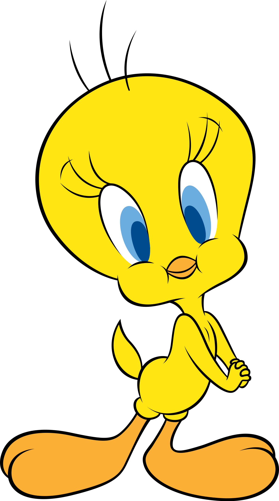

# Estadística Frecuentista

Fecha de la última revisión
```{r c11-1, echo=FALSE}
Sys.Date()
```

```{r c11-2, eval=TRUE, echo=FALSE}
colorize <- function(x, color) {
  if (knitr::is_latex_output()) {
    sprintf("\\textcolor{%s}{%s}", color, x)
  } else if (knitr::is_html_output()) {
    sprintf("<span style='color: %s;'>%s</span>", color, 
      x)
  } else x
}

#`r colorize("some words in red", "red")`


```

------------------------------------------------------------------------

## Bondad de ajuste y Tabla de contingencia

Este tipo de prueba es frecuentemente conocido erróneamente como la prueba de Chi cuadrado. Los tipos de datos necesarios son distintos a las pruebas anteriores. En las pruebas que en los próximos módulos siempre habrá por lo menos una variable donde la unidad era el número de individuos, el largo o ancho en una unidad (cm, metro, celsius, etc) o sea una variable continua. Ahora para la pruebas de Bondad de ajuste y Tabla de Contingencia se contabiliza el número de eventos por categoría. En otras palabras, es la frecuencia con que ocurre un evento.

En esta sección no estamos interesados en evaluar datos continuos como la altura o el tamaño. Las variables que se usan son categóricas; es decir, los valores son la frecuencia de un evento (o su ausencia).

> Los datos tienen que caer exactamente en una categoría, por ejemplo

> -   vivo o muerto.
> -   presente o ausente.
> -   blanco, rojo, verde, azul.
> -   estar embarazada o no.
> -   Tiene el fenotipo dominante o recesivo.
> -   En una herencia mendeliana, los individuos son homocigóticos recesivo, dominantes o heterocigóticos.

------------------------------------------------------------------------

## Qué son supuestos

Cuando hablamos de supuestos estamos hablando de las condiciones necesarias para que la prueba sea utilizada. El incumplimiento de los supuestos hace que los resultados de la prueba tengan una tasa de error de tipo I y de tipo II mayor que la especificada (por ejemplo, si se elige un $\alpha$ de 0.05, el error real sería mayor). Si se usan datos erróneos, la prueba puede ser completamente inválida.

------------------------------------------------------------------------

## Los supuestos de las pruebas de frecuencias.

::: {.supuestos}
- Los datos son **frecuencias** (conteos), no medidas continuas.
- Las categorías son **mutuamente exclusivas** (cada observación cae en una sola).
- Las observaciones son **independientes** unas de otras.
- Las **frecuencias esperadas** son suficientemente grandes: ninguna menor de 5 cuando hay 4 o menos categorías; con más categorías, no más del 20% con esperado < 5 y ninguna menor de 1.
:::

------------------------------------------------------------------------

## Instalar y activar los siguientes packages

```{r c11-3}
#----Instalar los paquetes si es necesario-----
#install.packages("gmodels")
#install.packages("MASS")
if (!require("pacman")) install.packages("pacman")
pacman::p_load(gmodels, MASS, gt)

#------Activar los paquetes-----

library(gmodels) ## Análisis de datos de frecuencia
library(MASS) ## graficar los datos con la función "mosaicpLot"
library(gt) ## "Grammer of Tables", tablas más bonitas

```

------------------------------------------------------------------------

## Gregory Mendel y sus guisantes

Gregor Mendel (1822–1884), el padre de la herencia "mendeliana", estaba interesado en determinar cómo se heredan las características de los organismos. En clases de biología y genética uno de los primeros ejemplos de herencia mendeliana es evaluar si cumple con lo que Mendel sugerió que es la razón de herencia. Si un fenotipo es heredado por un mecanismo sencillo de un gen con solamente dos alelos donde uno de los alelos es dominante y el otro es recesivo entonces hay solamente dos fenotipos posible. Por consecuencia lo más básico es determinar si la frecuencia de los fenotipos en una población sigue una razón mendeliana de 3:1, en otra palabra por cada 3 individuos de un fenotipo "x" hay un individuo del fenotipo "y".

Los datos que usaremos provienen directamente de los trabajos de Mendel. Aquí está la publicación original en alemán y la referencia a la traducción en inglés.

Mendel, J.G. (1866). "Versuche über Pflanzenhybriden", Verhandlungen des naturforschenden Vereines in Brünn, Bd. IV für das Jahr, 1865, Abhandlungen: 3–47, [1]. For the English translation, see: Druery, C.T.; Bateson, William (1901). "Experiments in plant hybridization" (PDF). Journal of the Royal Horticultural Society. 26: 1–32.

Tabla de los resultados de experimentos original de Gregor Mendel con semillas redondas y arrugadas. Cada uno represente un experimento y la cantidad de guisantes redondos o arrugadas.

| Plantas | redonda | arrugada |
|---------|--------:|---------:|
| 1       |      45 |       12 |
| 2       |      27 |        8 |
| 3       |      24 |        7 |
| 4       |      19 |       10 |
| 5       |      32 |       11 |
| 6       |      26 |        6 |
| 7       |      88 |       24 |
| 8       |      22 |       10 |
| 9       |      28 |        6 |
| 10      |      25 |        7 |
| Total   |     336 |      101 |

En la pagina número 10 del articulo observamos los resultados de diferentes experimentos. En el experimento 1, la Planta #1, produjo un total de 57 semillas donde 45 eran redonda y 12 eran arrugadas. Si lo que esperamos es una razón de 3:1, las proporciones esperadas serían 0.75:0.25. Creamos un vector de datos de los valores observados (obs) y un vector de datos para la proporción esperada (esp).

------------------------------------------------------------------------

## Bondad de Ajuste.

::: {.definicion}
La prueba **ji-cuadrado ($\chi^2$)** compara las frecuencias **observadas** con las **esperadas** bajo la hipótesis nula. La **bondad de ajuste** compara una variable con proporciones teóricas; la **tabla de contingencia** evalúa si dos variables categóricas son independientes.
:::

La prueba de bondad de ajuste y de tabla de contingencia son pruebas que evalúa la cantidad/frecuencia en las categorías y lo compara con un modelo nulo. En este caso lo que se compará es la cantidad de la frecuencia observada $o$, con la frecuencia esperada $e$. La formula es la siguiente


$$\chi^2=\sum_{i=1}^{k}\frac{(o_i-e_i)^2}{e_i}$$


Usamos un ejemplo sencillo de los datos de Mendel haciendo los cálculos a mano de una proporción 3:1 de herencia de los fenotipos redonda:arrugada. Los datos son de la primer linea de uno de los experimentos que hizo Mendel.

```{r c11-4}

57*.75
57*.25


library(knitr)
library(kableExtra)
df <- data.frame(Calculos = c("Observado","Esperado", "(o-e)", "(o-e)^2", "$$\\frac{(o-e)^2}{e}$$", "$$\\chi_{total}^2$$"),
                 Redonda = c(45, 42.75, 2.25,5.0625, 0.1184, ""),
                 Arrugada = c(12,14.25, -2.25,5.0625 ,0.3553, ""),
                 Total = c("","","","","",0.4737))

kable(df, escape=FALSE)

```

> Los pasos para calcular el Chi Cuadrado:

> -   Los valores esperados, en este caso fue una proporción de 3:1
> -   Las diferencias
> -   Cuadrar las diferencias
> -   División por el valor esperado (da los Chi Square parcial)
> -   Sumar los valores en #4.
> -   buscar en una tabla de Chi Square el valor critico de Chi Square para la cantidad de grupos menos 1 y el $\alpha$ correspondiente. En este caso se busca un $\alpha$ de 0.05 y el grado de libertad (n-1) = 2-1, n es el número de grupos.

Para determinar si es significado el valor de Chi Square observado se compara con el valor critico (de la tabla). Aquí usamos R para conseguir este valor. Note aquí se usa (1-0.05= 0.95) y el grado de libertad que es 1. Ahora se compara ese valor con 0.4737, Si el valor observado es menor que 3.841459, no se rechaza la hipótesis nula. En este caso no hay evidencia que los fenotipos se hereden diferente a 3:1.

```{r c11-5}
qchisq(0.95, 1)
```

No hay ninguna razón de hacer los cálculos a mano si tenemos a R para hacerlo. Nota aquí se hace la misma prueba con los mismos datos y tenemos el mismo resultado.

------------------------------------------------------------------------

## Primer ejemplo

Lo que uno observa es el valor de la prueba de Bondad de ajuste tiene un Chi Cuadrado de 0.48, p =.49. Como el valor de *p* es mayor a 0.05, no se rechaza la hipótesis nula y que la frecuencia no es diferente de una proporción de 3:1.

```{r c11-6}
obs<-c(45,12) # los valores observado
esp<-c(0.75,0.25) # este el modelo nulo

chisq.test(x=obs, p=esp)


# Cuando el valor de p es mayor a 0.05 no se rechaza la hipótesis nula
# Es el caso presente que la la herencia es de 3:1
```

------------------------------------------------------------------------

## Segundo ejemplo

Ahora evaluamos si la frecuencia de semillas redondas:arrugadas de todo el experimento sigue un patrón de 3:1. Se observa un Chi cuadrado de 0.83 y un valor de p=0.36; otra vez el valor está por encima de 0.05, y se concluye que la frecuencia de semillas redondas:arrugadas no es distinta de 3:1. No se rechaza la hipótesis nula.

Vemos que, al reevaluar los experimentos de G. Mendel, obtenemos un resultado que apoya sus predicciones. Nota que G. Mendel **NO** tenía pruebas estadísticas para determinar si las frecuencias eran diferentes o no de 3:1; él hizo observaciones y llegó a sus conclusiones. ¿Recuerdas cuándo y por quién fue desarrollado este método?

```{r c11-7}
obs<-c(336,101)
esp<-c(0.75,0.25)

chisq.test(x=obs, p=esp)
```

```{r c11-8}

obs<-c(6, 16)
esp<-c(0.50,0.50)

chisq.test(x=obs, p=esp)

```

### ¿Este ejercicio cumple con los supuestos?

------------------------------------------------------------------------

```{r c11-9, echo=FALSE, out.width= "25%", out.extra='style="float:right; padding:10px"'}

```

1.  Ejercicio: Cien pajaritos recibieron semillas de girasol con rayas negras o semillas negras. Setenta y cinco eligieron semillas negras. ¿Podemos concluir que la población de la que se tomó esta muestra tiene preferencia por las semillas de girasol negras sobre las semillas de girasol rayadas? (traducido del extracto 7.1 de Havel et al.).

    -   ¿Cuál es la hipótesis nula?
    -   ¿Cuál es la hipótesis alterna?
    -   Calcula los valores esperados
    -   Calcula el chi cuadrado
    -   ¿Se rechaza o no se rechaza la Ho?

```{r c11-10, eval=FALSE, echo=FALSE}
obs<-c(75,25)
esp<-c(0.5,0.5)

chisq.test(x=obs, p=esp)

```

### ¿Este ejercicio cumple con los supuestos?

------------------------------------------------------------------------

------------------------------------------------------------------------

## Prueba de Bondad de Ajuste, Tabla de contingencia RxC

```{r c11-11}
#install.packages("MASS", dependencies = TRUE)
```

Esta prueba se usa para

Los siguientes datos son de Field, Miles and Field 2012.

Este conjunto de datos represente un experimento ficticio de tratar de entrenar 200 gatos para que bailen según si se les da una recompensa o no. Está basado en el concepto del psicólogo ruso Iván Pávlov (1849–1936) de que se puede motivar una acción dando una recompensa. Ese proceso se llama "condicionamiento": un aprendizaje que ocurre por la asociación entre un estímulo ambiental y un comportamiento.

\<<https://en.wikipedia.org/wiki/Ivan_Pavlov>\>

Primero entramos los datos directamente en una tabla

Los datos son los siguientes:

A 38 gatos se les dio una recompensa, y de estos 28 bailaron y 10 no bailaron. A 162 no se les dio recompensa, y de estos 48 bailaron y 114 no bailaron.

Se crean dos listas con los resultados, se unen con **cbind()** y después se les añade un nombre a las filas con **rownames()**. Vemos ahora la tabla de frecuencias de cuantos gatos bailaron o no y si fueron entrenado por comido o cariño. Nota que no se puede añadir la tilde **\~** a la **n** de cariño.

```{r c11-12}
#Crear la tabla de contingencia

comida <- c(10, 28)
carino <- c(114,48)
catsTable <- cbind(comida, carino) # la función "cbind", une listas en columnas, la "c" es para columna


rownames(catsTable)<-c("No_bailan", "bailan") # Añade el nombre a las filas

catsTable

```

------------------------------------------------------------------------

## La hipótesis NULA

La hipótesis nula es que la cantidad de gatos que bailan o no es independiente de si recibieron comida o cariño.

## La hipótesis alterna

La cantidad de gatos que bailan depende que si recibieron cariño o comida.

## Gráfico de Mosaico

Podemos visualizar la frecuencia de los datos con un gráfico de mosaico. Si la hipótesis nula fuera cierta, la organización de las cajas debería ser más o menos de la misma proporción (relativa a su frecuencia). En este caso, la caja de los que reciben comida y no bailan es mucho más pequeña que la de los que bailan y reciben comida. Nota que esto no es una prueba es una visualización de los datos y puede ayudar a entender el patrón.

```{r c11-13}
mosaicplot(catsTable, color =TRUE) # El packete MASS

```

------------------------------------------------------------------------

Haz una tabla con diferentes frecuencias y grafícalas con mosaicplot para evaluar cómo cambia el gráfico.

------------------------------------------------------------------------

## Prueba de Independencia de frecuencia.

En ingles se le conoce como "Contingency Tables"

Los valores esperados en esta caso son calculados directamente de la tabla. Para cada celda $E_{ij}$ donde la {i} representa la fila y la {j} las columnas. El valor esperado se calcula multiplicando la suma de la fila por la suma ${R_i}$ de la suma de la columna ${C_j}$. La formula de los valores esperados es la siguiente, donde la N es la suma total de datos. El primer paso es sumar la filas y la columnas de la tabla.

```{r c11-14}
catsTable

library(tidyverse)
ct=tribble(~fila, ~comida, ~carino, ~suma,
           "No_bailan", 10, 114, 124,
           "bailan", 28, 48, 64,
           "suma", 38, 162, 200)
ct
```

-   R= Rows
-   C= Columns
-   E = Estimate
-   N = Sum

$$E_{ij}=\frac{\left(R_i\cdot C_j\right)}{N}$$

-   F= Fila
-   C= Columna
-   E = Estimado
-   N = Suma

$$E_{ij}=\frac{\left(F_i\cdot C_j\right)}{N}$$.

Calculemos dos de los valores esperados

-   Los gatos que reciben comida y bailan

$$E_{12}=\frac{\left(R_2\cdot C_1\right)}{N}= \frac{(38*76)}{200}=14.44$$

-   Los gatos que reciben cariño y no bailan

$$E_{21}=\frac{\left(R_1\cdot C_2\right)}{N}= \frac{(124*162)}{200}=100.44$$ La prueba es exactamente igual como la anterior donde comparamos el valor observado con el valor esperado. Por ser más de una fila la formula cambia.

$$\chi^2=\sum_{i}\sum_{j}\frac{(o_{ij}-e_{ij})^2}{e_{ij}}$$

El Chi Cuadrado final es

$$\chi^2=\frac{(10-23.56)^2}{23.56}+\frac{(28-14.44)^2}{14.44}+\frac{(114-100.44)^2}{100.44}+\frac{(48-61.56)^2}{61.56}=25.36$$

$$\chi^2=25.36$$ 


## Como calcular el grado de libertad

##### N columnas = 4

##### N filas = 2

```{r c11-15}
df=(4-1)*(2-1)
df
```

Cual es valor de Chi Cuadrado critico

1-.95 = 0.05

```{r c11-16}
qchisq(.95,1 )
```

### ¿Este ejercicio cumple con los supuestos?

------------------------------------------------------------------------

## La función *CrossTable*

Con esta función se calcula el chi cuadrado con los valores esperados. Nota la leyenda al principio para poder entender la organización de los datos. El grado de liberta se calcula con la siguiente formula, el numero de filas -1 multiplicado por la cantidad de columnas -1, df= (R-1)(C-1). df = es para grado de libertad. Si tiene solamente 1 grado de libertad hay que usar el resultado de la prueba de **Yates de continuidad**, que hace una corrección para la poca cantidad de grados de libertad.

$$\chi^2=\sum_{i}\sum_{j}\frac{(|o_{ij}-e_{ij}|-0.5)^2}{e_{ij}}$$

Instalar el paquete **gmodels** para la función CrossTable

p \<0.05 se rechaza la hipótesis nula

p \>0.05 no se rechaza la hipótesis nula

```{r c11-17}
library(gmodels)
CrossTable(catsTable, fisher = TRUE, chisq = TRUE, 
           expected = TRUE, sresid = TRUE, format = "SAS")

```

p = 0.000000477

------------------------------------------------------------------------

[Enlace a un Video de la serpiente](https://www.youtube.com/watch?v=Uw6W8NaJmfo)

```{r c11-18, echo=FALSE, out.width= "60%", out.extra='style="float:right; padding:10px"'}

```

2.  Ejercicio: Un herpetólogo sospecha que las serpientes de agua hembras que se alimentan en el lago Michigan migran a los estanques del interior en el otoño para dar a luz a sus crías. Si esta hipótesis es correcta, cabría esperar que las hembras fueran mucho más propensas a migrar en ese momento que los machos. Se recopilaron los siguientes datos. (De Havel et al.)

|        | Migrantes | No Migrantes |
|--------|----------:|-------------:|
| Hembra |        25 |            2 |
| Machos |         4 |           30 |

```         
- ¿Cuál es la hipótesis nula?
- ¿cual es la hipótesis alterna?
- calcula los valores esperados
- calcula el chi cuadrado
- ¿Se rechaza o no se rechaza la Ho?
```

------------------------------------------------------------------------

```{r c11-19, eval=FALSE, echo=FALSE}
#Crear la tabla de contingencia

Hembra <- c(25, 2)
Machos <- c(4,30)
snakeTable <- cbind(Hembra, Machos)


rownames(snakeTable)<-c("Migrantes", "No_Migrantes") # Añade el nombre a las filas

snakeTable


CrossTable(snakeTable, fisher = TRUE, chisq = TRUE, 
           expected = TRUE, sresid = TRUE, format = "SAS")
```

### ¿Este ejercicio cumple con los supuestos?

## Análisis con datos en formato de tabla

Estos son los mismos datos pero no sumado, en otra palabra es información específica sobre cada gato y su tratamiento y si bailo o no. La ventaja de este método es que uno no tiene que hacer el calculo y sumar la frecuancias, se deja la función **CrossTable** hacer la suma. Miran bien la tabla.

```{r c11-20}

## La data sin sumar

Training<-c(rep(0, 38), rep(1, 162))

Dance<-c(rep(1, 10), rep(0, 28),  rep(1, 114), rep(0, 48))

Training<-factor(Training, labels = c("Food as Reward", "Affection as Reward"))

Dance<-factor(Dance, labels = c("No", "Yes"))

catsData<-data.frame(Training, Dance)
## catsData Los datos completos
gt(head(catsData, n=6))
gt(tail(catsData, n=5))


```

------------------------------------------------------------------------

Nota que aquí se llama cada columna aparte en la función (catsData$Training, catsData$Dance).

## Prueba de independencia

```{r c11-21}
# usando los datos en formato de data frame **catsData**
CrossTable(catsData$Training, catsData$Dance, 
           fisher = TRUE, chisq = TRUE, expected = TRUE, 
           sresid = TRUE, format = "SPSS")


# Se puede hacer un grafico de los resultados

Ta2= xtabs(~Training+Dance, data=catsData)
Ta2
mosaicplot(Ta2, shade=TRUE)
```

------------------------------------------------------------------------

## El color de pelo es independiente del sexo

En la siguiente tabla se encuentra el color de pelo de estudiantes de la UPR. La hipótesis es que el color de pelo no está asociado al sexo de los estudiantes.

| Color de pelo | Mujer | Hombre |
|---------------:|------:|-------:|
|          Negro |    32 |     55 |
|         Marrón |    43 |     65 |
|          Rubio |    16 |     64 |
|           Rojo |     9 |     16 |

Creamos

```{r c11-22}

Negro=c(32,55)
Marron=c(43, 65)
Rubio=c(16,64)
Rojo=c(9,16)

HairColour=cbind(Negro,Marron, Rubio,Rojo) 
rownames(HairColour)<-c("Mujer", "Hombre") # Añade el nombre a las filas

HairColour

```

-   Cada categoría tiene una **frecuencia esperada** suficientemente grande:
    -   ninguna de las **frecuencia esperada** sea menor de 5 cuando hay 4 o menos categorías
    -   no más de 20% de las categorías que tengan un valor esperado de \< 5 cuando hay más de 5 categorías y ninguna tiene un valor **esperado** menor de 1. Puediese tener valores esperados entre 1 y 5 pero no más de 20% de las categorias

¿Cuál es la hipótesis nula? ¿Cuál es la hipótesis alterna?

El resultado de la prueba. ¿Se acepta o rechaza la hipótesis nula?

```{r c11-23}
CrossTable(HairColour, fisher = TRUE, chisq = TRUE, expected = TRUE, sresid = TRUE, format = "SPSS")


#df=(R-1)*(C-1)
df=(2-1)*(4-1)
df

.2*8
```

```{r c11-24}
qchisq(.95,3 )
```

### ¿Este ejercicio cumple con los supuestos?

------------------------------------------------------------------------

## Prueba Exacta de Fisher

La prueba Exacta de Fisher es similar a la de Bondad de Ajuste para evaluar si hay asociación entre dos variables categóricas. La diferencia importante es que no es necesario que el valor esperado sea mayor de 5. Por consecuencia se puede usar con muestras más pequeñas.

::: {.consejo}
Cuando alguna frecuencia esperada es pequeña (< 5) en una tabla 2×2, usa la **prueba exacta de Fisher** en lugar de la ji-cuadrado: no depende de la aproximación de frecuencias grandes.
:::

------------------------------------------------------------------------

### Los supuestos de las prueba Exacta de Fisher.

> -   Los datos son frecuencias.
> -   Las frecuencias son mutuamente exclusivas (no caen en múltiples categorías).
> -   Las observaciones son independientes unas de otras.
> -   La tabla tiene 2 filas y 2 columnas.

Usando los datos de serpientes del ejemplo 7.4 del libro de Havel et al.

```{r c11-25}
responde <- c(6,3)
no_responde <- c(1,6)
serpiente <- cbind(responde, no_responde)
rownames(serpiente)<-c("Estimulo_arriba", "Estimulo_lateral") # Añade el nombre a las filas

serpiente


CrossTable(serpiente, fisher = TRUE, chisq = TRUE, 
           expected = TRUE, sresid = TRUE, format = "SAS") # esa prueba no deberia usarse


### ¿Este ejercicio cumple con los supuestos?
```

Se puede visualizar los datos con el Mosaico

```{r c11-26}
mosaicplot(serpiente)

```

Nota que se usa la misma función que anterior pero en los resultados hay que fijarse en la sección que dice **Fisher's Exact test**. Lo que uno observa es que el valor de **p** es menor de 0.05 por consecuencia se rechaza la hipótesis nula. Esto significa que, para la serpiente, el ángulo del que proviene el estímulo produce una respuesta diferente.

------------------------------------------------------------------------

```{r c11-27}

fisher.test(serpiente)

```
