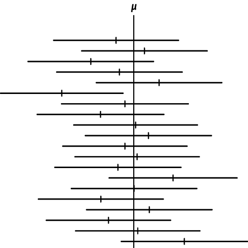

# Prueba de una Muestra


```{r c13-1}
library(gridExtra)
library(tidyverse)
```


```{r c13-2, echo=FALSE}


rlt_theme <- theme(axis.title.y = element_text(colour="grey20",size=15,face="bold"),
        axis.text.x = element_text(colour="grey20",size=10, face="bold"),
        axis.text.y = element_text(colour="grey20",size=15,face="bold"),  
        axis.title.x = element_text(colour="grey20",size=15,face="bold"))+
  theme(
  # Remove panel border
  panel.border = element_blank(),  
  # Remove panel grid lines
  panel.grid.major = element_blank(),
  panel.grid.minor = element_blank(),
  # Remove panel background
  panel.background = element_blank(),
  # add thicker border lines
    axis.line.x = element_line(colour = "black", size = 1),
    axis.line.y = element_line(colour = "black", size = 1)
  )

# The palette with grey:
cbPalette1 <- c("#999999", "#E69F00", "#56B4E9", "#009E73", "#F0E442", "#0072B2", "#D55E00", "#CC79A7")

# The palette with black:
cbPalette2 <- c("#000000", "#E69F00", "#56B4E9", "#009E73", "#F0E442", "#0072B2", "#D55E00", "#CC79A7")

# To use for fills, add
#  scale_fill_manual(values=cbPalette)

# To use for line and point colors, add
  #scale_colour_manual(values=cbPalette)

```

```{r c13-3, eval=TRUE, echo=FALSE}
colorize <- function(x, color) {
  if (knitr::is_latex_output()) {
    sprintf("\\textcolor{%s}{%s}", color, x)
  } else if (knitr::is_html_output()) {
    sprintf("<span style='color: %s;'>%s</span>", color, 
      x)
  } else x
}

#`r colorize("some words in red", "red")`


```

Fecha de la última revisión
```{r c13-4, echo=FALSE}

Sys.Date()
```


```{r c13-5, eval=TRUE, echo=FALSE}
colorize <- function(x, color) {
  if (knitr::is_latex_output()) {
    sprintf("\\textcolor{%s}{%s}", color, x)
  } else if (knitr::is_html_output()) {
    sprintf("<span style='color: %s;'>%s</span>", color, 
      x)
  } else x
}

#`r colorize("some words in red", "red")`


```


```{r c13-6, echo=FALSE, fig.show = "hold", out.width = "20%", fig.align = "default"}
knitr::include_graphics(c("Graficos/hex_ggversa.png", "Graficos/hex_error.png"))
```


***

## El promedio, un estimado

En este módulo se evalúan el promedio y las propiedades de una distribución normal y el muestreo para estimar el promedio. También se evalúa la hipótesis de un muestreo y se estima el intervalo de confianza para el posible rango del promedio. Es importante reconocer que el promedio estimado a partir de un muestreo, $\overline{x}$, es solamente un estimado. En otras palabras, no es necesariamente la VERDAD, o dicho de forma estadística, el promedio del universo, $\mu$, de esta variable. 


Con frecuencia se quiere conocer información sobre el verdadero promedio, $\mu$, basado en un muestreo. Por ejemplo, cuál es el promedio de la edad de las Palmas de Sierra en Puerto Rico, cuál es el promedio de la presión arterial de los humanos, o cuál es la producción promedio de mangos en los árboles de mango. En cada caso no sabemos cuál es el promedio universal, $\mu$, y tampoco sabemos el valor exacto de la desviación estándar, $\sigma$.  

Para evaluar la hipótesis sobre el promedio de la población $\mu$, uno puede utilizar datos recogidos al azar (un muestreo) y usarlos para inferir cuál es el promedio y la desviación estándar del universo.

## Ejemplo 9.1 y 9.2. 

Lean estos dos ejercicios y consideren cuáles son los valores del universo, $\mu$ y $\sigma$, y el promedio del muestreo, $\overline{x}$. 

## La distribución de t

Cuando queremos inferir información sobre el promedio o la desviación del universo a partir de un muestreo, hay que utilizar la distribución de *t*. La razón es que la forma de la distribución cambia con el tamaño de muestra cuando no sabemos cuál es la desviación estándar del universo. A medida que uno reduce el tamaño de muestra, la distribución se desvía de una distribución normal. Para tomar esto en cuenta no usamos la distribución normal, sino la distribución de *t*, también llamada la distribución *t* de Student.  


```{r c13-7, include=FALSE}
x <- seq(from=-5, to=5, by=0.1)

df1=plot(function(x) dt(x, df = 1), -7, 7, ylim = c(0, 0.42),
     main="", yaxs="i")
df1x=df1$x
df1y=df1$y

df=cbind(df1x, df1y)
df

df3=plot(function(x) dt(x, df = 3), -7, 7, ylim = c(0, 0.42),
     main="", yaxs="i")
df3x=df3$x
df3y=df3$y

df3=cbind(df3x, df3y)

df5=plot(function(x) dt(x, df = 5), -7, 7, ylim = c(0, 0.42),
     main="", yaxs="i")

df5x=df5$x
df5y=df5$y

df5=cbind(df5x, df5y)

dfinf=plot(function(x) dt(x, df = 1000000), -7, 7, ylim = c(0, 0.42),
     main="", yaxs="i")

dfinfx=dfinf$x
dfinfy=dfinf$y

dfinf=cbind(dfinfx, dfinfy)


```

```{r c13-8, include=FALSE}
dfc=cbind(df1x, df1y, df3y, df5y, dfinfy )
dfcc=as.data.frame(dfc)
dfcc
head(dfcc, n=4)

```


```{r c13-9, include=FALSE}
library(tidyverse)
out <- dfcc %>% 
         gather(key=df, val, -df1x)%>%
  arrange(desc(df1x))
head(out, 12)
```


```{r c13-10}

ggplot(out,aes(df1x, val, colour=df) )+
  geom_line()+
  rlt_theme+
  scale_colour_manual(name = "Grado de \nlibertad", values = c("blue", "red", "springgreen4", "black"), 
                     labels = expression(nu[1], nu[2],nu[5], nu[infinity]))+
                     theme(legend.position = c(0.8, 0.8))+
                     xlab("Valores")+
                     ylab("Densidad")

ggsave("t-distribution.png")
```

Observa cómo cambia la distribución de *t* cuando cambia el tamaño de muestra (el grado de libertad es $\nu=n-1$). Hay que observar dos componentes: 1. hay menos datos centrados en el promedio y 2. hay más datos en las colas.  

Se usa la distribución de *t* para calcular el intervalo de confianza y la hipótesis del promedio de una muestra, debido a que la forma de la distribución de *t* cambia con el tamaño de muestra ($\nu=n-1$) y también con la tasa de error Tipo I, $\alpha$.  


La prueba de un muestreo es 

$$t=\frac{\overline{x}-\mu}{s/\sqrt{n}}$$

::: {.formula}
En la prueba de *t* de una muestra: $\overline{x}$ es el promedio de la muestra, $\mu$ es el valor propuesto por la hipótesis nula, $s$ es la desviación estándar de la muestra y $n$ es el tamaño de muestra. El denominador $s/\sqrt{n}$ es el **error estándar** del promedio.
:::


***

## Cuando es que uno rechaza la hipótesis nula

Regresamos a la idea de Tipo de error I.  Cuando se selecciona un $\alpha=0.05$, lo que estamos diciendo es que hay un 5% de probabilidad de cometer un error Tipo I, que es `r colorize("rechazar la hipótesis nula cuando en realidad es verdadera", "blue")`. Este 5% se puede dividir en dos componentes, uno cuando el valor es más pequeño y otro cuando es más grande que el valor esperado. Por consiguiente, el área de rechazo de la hipótesis nula es 0.025 en la parte negativa y 0.025 en la positiva.

Seleccionamos la curva con un grado de libertad de 5 y evaluamos el área de la curva que está dentro del 95% del intervalo de confianza y la que queda fuera de este rango. Si el promedio estimado de una prueba de *t* cae dentro del área en gris, no se rechaza la hipótesis nula; si cae en el área roja, se rechaza la hipótesis nula. Nota que para esta hipótesis hay dos maneras de rechazar la hipótesis nula (por ambos extremos).   


```{r c13-11, include=FALSE}
library(tidyverse)


subdf5=out%>%
  dplyr::select(df, df1x,val)%>%
filter(df=="df5y")
subdf5
  
 d5=ggplot(subdf5, aes(df5x, val) )+
  geom_area(fill="grey")+
  xlab("Valores")+
  ylab("Densidad")
d5

rand5=2.571

# subset region and plot
db5 <- ggplot_build(d5)$data[[1]]
head(db5, n=3)
```

```{r c13-12}

d6 <- d5 + geom_area(data = subset(db5, x > rand5), aes(x=x, y=y), fill="red")+
  geom_area(data = subset(db5, x < -rand5), aes(x=x, y=y), fill="red")+
  rlt_theme
d6

```

***

La alternativa es que nuestra hipótesis sea de un solo lado, donde el total del 5% está en la parte inferior o en la superior. En este caso se rechaza solamente si el valor se encuentra en esa proporción de los valores de *t*.  Nota ahora que el área en esta sección es más grande (incluye más valores, no solamente el 2.5% pero el 5% de los valores).  


```{r c13-13}

randsup=2.015
d8 <- d5 + geom_area(data = subset(db5, x > randsup), aes(x=x, y=y), fill="red")+
  rlt_theme


d7 <- d5 + 
  geom_area(data = subset(db5, x < -randsup), aes(x=x, y=y), fill="red")+
  rlt_theme

gridExtra::grid.arrange(d7,d8, ncol=2)
```

***

## El intervalo de confianza de $\mu$


Ahora se demuestra cómo calcular el intervalo de confianza de $\mu$.  Seleccionando un conjunto de datos al azar **n** se puede calcular el promedio $\overline{x}$ y el estimado de la desviación estándar **s**, con estos valores podemos calcular el rango donde pudiese estar el promedio del universo $\mu$ con cierto nivel de confianza (Tipo de Error I, $\alpha$).  

## Ejemplo 9.3

  Se selecciona 20 peces machos de una misma especie en un riachuelo de Puerto Rico y se mide el largo en milímetros. El promedio es $\overline{x}=21.0mm$ y una desviación estándar $s=1.76mm$. Queremos construir un intervalo de confianza de 95%. El tamaño de los peces es aproximadamente normal.  

Queremos calcular el intervalo que incluye el 95%; por consiguiente, es el rango que hay en el área gris de la primera figura.

::: {.definicion}
**Intervalo de confianza (IC).** Es un rango de valores, calculado a partir de una muestra, que con cierto nivel de confianza (por ejemplo, 95%) se espera que contenga el verdadero parámetro poblacional ($\mu$). Un IC del 95% significa que, si repitiéramos el muestreo muchas veces, aproximadamente el 95% de los intervalos construidos contendrían el verdadero $\mu$. NO significa que haya un 95% de probabilidad de que $\mu$ esté en un intervalo particular ya calculado.
:::  

***

## Los limites del intervalo


Para calcular el intervalo se necesita solamente el valor de *t* con el tipo de error I del 5% (95% de confianza) que corresponde a un tamaño de muestra de 20, $t_{0.05,\ n-1}$. Para conocer este valor hay que ir a una tabla de la distribución de t (vea p. 217 en el libro) o usar R para calcular el valor.  En la tabla busca el error I deseado (0.05) y se busca el grado de libertad *n-1*, $t_{0.05,\ 19}$. El valor del libro es $t = 2.093$. Si se quisiera un tipo de error I de solamente 1%, el valor sería $t=2.8609$ (busca la información en la tabla o usa la función **qt()**).  
 
```{r c13-14}
abs(qt(0.025, 19)) # nota que se usa la mitad de 0.05, por que es una prueba de dos lados. 


21+abs(qt(0.025, 19)*(1.76/sqrt(20)))
```


***

## El limite superior
 
Ahora falta sustituir los valores en la fórmula

$$UL_{0.95}=\overline{x}+\left(t_{0.05,\ n-1}\cdot\frac{s}{\sqrt{n}}\right)$$

$$UL_{0.95}=21+2.093\cdot\left(\frac{1.76}{\sqrt{20}}\right)=21.824$$


***

## El limite inferior

$$LL_{0.95}=\overline{x}-\left(t_{0.05,\ n-1}\cdot\frac{s}{\sqrt{n}}\right)$$


$$LL_{0.95}=21-2.093\cdot\left(\frac{1.76}{\sqrt{20}}\right)=20.176$$


***

El intervalo de confianza de $\mu$ está entre 20.176 y 21.824 con un 95% de confianza. 

```{r c13-15}
UL=21+abs(qt(0.025, 19)*1.76/sqrt(20))
LL=21-abs(qt(0.025, 19)*1.76/sqrt(20))
UL
LL
```

***

## Menos grados de libertad

Nota lo que pasa si uno tiene menos datos o más datos con el intervalo de confianza. 

Con un tamaño de muestra de solamente 5 datos, el IC de 95% está entre 18.815 y 23.185. Por tener menos datos, el intervalo es más ancho: tenemos menos precisión sobre dónde se encuentra el promedio del universo. 

```{r c13-16}
UL=21+abs(qt(0.025, 4)*1.76/sqrt(5))
LL=21-abs(qt(0.025, 4)*1.76/sqrt(5))
UL
LL
```


***

## Más grados de libertad

Ahora con un tamaño de muestra de 100. El intervalo de confianza está más estrecho: 20.651 a 21.349.

```{r c13-17}
UL=21+abs(qt(0.025, 99))*1.76/sqrt(100)
LL=21-abs(qt(0.025, 99))*1.76/sqrt(100)
UL
LL
```

***

## Muchos muestreos y el universo

Para demostrar lo que quiere decir el intervalo de confianza evaluamos el siguiente gráfico. Cada linea horizontal representa un muestreo independiente, la pequeña linea vertical representa el promedio de este muestreo $\overline{x}$, y la linea vertical que cruza todos los muestreos representa el promedio universal $\mu$.  Nota que en este caso el intervalo de confianza casi siempre cruza $\mu$, aparte de uno. Ese muestreo, aunque proviene de la misma población, no incluyó el promedio del universo.   

```{r c13-18, echo=FALSE, fig.cap="Su promedio incluye el promedio del universo?", out.width = '70%'}

```


***

### QUIZ: estas preguntas la tienen que contestar en una asignación.

1.  Titulo: Ultrasound evaluation of the morphometric patterns of lymph nodes of the head and neck in young and middle-aged individuals. Ogassavara et al. 2016, 49:225-228, Radiologia Brasileira.  doi: 10.1590/0100-3984.2015.0002. 

    + En este trabajo evaluaron los ganglios linfáticos de 20 individuos sanos. Encontraron que la media de los ganglios linfáticos mastoideos de los hombres era de 0,9 cm con una desviación estándar de 0,4 cm. 
    + ¿Cuál es el intervalo de confianza al 95% de los ganglios linfáticos mastoideos en hombres? . 

```{r c13-19, eval=FALSE, echo=FALSE}
UL=0.9+abs(qt(0.025, 19)*0.4/sqrt(20))
LL=0.9-abs(qt(0.025, 19)*0.4/sqrt(20))
UL
LL

```


 

2. Usando los mismo datos de la pregunta #1. Titulo: Ultrasound evaluation of the morphometric patterns of lymph nodes of the head and neck in young and middle-aged individuals. Ogassavara et al. 2016, 49:225-228, Radiologia Brasileira.  doi: 10.1590/0100-3984.2015.0002. 

    + En este trabajo evaluaron los ganglios linfáticos de 20 individuos sanos. Encontraron que la media de los ganglios linfáticos mastoideos de los hombres era de 0,9 cm con una desviación estándar de 0,4 cm.  Ya se pudo medir el tamaño de los ganglios linfáticos mastoideos de TODOS los hombres del planeta, y se determino que que el promedio es de 0.7 cm con una desviación estándar de 0,2 cm.
    + Usando los siguientes datos haga la prueba correspondiente en R para determinar el valor de t, observado y el valor critico.  

```{r c13-20, eval=FALSE, echo=FALSE}
t=abs((0.9-0.7)/((0.4)/sqrt(20)) )
t # Valor t de observado
abs(qt(0.025, 18))  # valor de t-critico, de la tabla
```


```{r c13-21}
UL=21+abs(qt(0.025, 4)*1.76/sqrt(5))
LL=21-abs(qt(0.025, 4)*1.76/sqrt(5))
UL
LL
```


***


## La prueba de t de una muestra


Esta prueba esencialmente calcula la media de los datos y construye un intervalo de confianza. Si el valor que estamos probando cae dentro de ese intervalo de confianza, concluimos que el valor del universo está incluido dentro del rango; de lo contrario, concluimos que no es la verdadera media. Nota que $\mu$ representa el modelo nulo, o sea la hipótesis nula. Si $\mu=0$ decimos que el universo es igual a cero.  

Por ejemplo, evaluamos el promedio del nivel de colesterol en mujeres. Sabemos que las mujeres en el universo tienen un nivel de colesterol de $\mu=209.4$, y ahora evaluamos un grupo de puertorriqueñas con un promedio de $\overline{x}= 196.7$ y una desviación estándar de $s=39.1$, en un muestreo de 30. 

¿Es la diferencia suficiente para decir que lo que se observó es significativamente diferente del universo a un nivel de error $\alpha=0.05$? Lo que necesitamos hacer ahora es sustituir los valores en la fórmula. Observamos un valor de *t* observado de $|t|=1.78$, y lo comparamos con el valor de *t* crítico $=2.045$ (para 29 grados de libertad, valor absoluto).

El resultado: el valor de *t* observado (1.78) es **menor** que el valor crítico (2.045) y, por consiguiente, **no rechazamos** la hipótesis nula. No hay evidencia suficiente para concluir que el nivel de colesterol de la muestra ($\overline{x}= 196.7$) sea significativamente diferente del nivel universal ($\mu=209.4$) a un nivel de $\alpha=0.05$.

::: {.interpretacion}
Revisa el resultado de la próxima celda de código: R calcula $|t|=1.78$ y un *t* crítico de $2.045$. Como el *t* observado no supera al crítico, **no rechazamos** la hipótesis nula. Recuerda: no rechazar Ho no prueba que $\mu=209.4$; solo indica que no tenemos evidencia suficiente en contra.
:::   

  + Ho: $\overline{x}=\mu$
  + Ha: $\overline{x}≠\mu$

$$|t|=\frac{\left(\overline{x}-\mu_0\right)}{\frac{s}{\sqrt{n}}}$$
Sustitución de los valores en la prueba de t. 

```{r c13-22}
t=abs((196.7-209.4)/((39.1)/sqrt(30)) )
t # Valor t de observado
abs(qt(0.025, 29))  # valor de t-critico, de la tabla
```


Para enterder mejor como cambia el valor de t critico con el tamaño de muestra vea la siguiente tabla. https://numiqo.com/tutorial/t-distribution


***

## Propinas

Un ejemplo con datos en una tabla
Usamos un conjunto de datos en el paquete **reshape**, que llama **tips**.  Se refiere a las propinas que reciben los meseros.  

Nuestra hipótesis es que en promedio, las personas dan una propina de $2.50, Esta es nuestra hipótesis **nula**

Nuestra hipótesis **alternativa** es que las personas dan significativamente más o menos de $2.50.

+ Ho: $\overline{x}=\mu$
+ Ha: $\overline{x}≠\mu$

```{r c13-23, echo=FALSE}
data(tips, package="reshape2")
head(tips)
```

***

Con la función **t.test()** es muy sencillo hacer la prueba; no hay que calcular a mano, solamente hay que añadir la información.  

Las opciones para esta prueba son las siguientes (en rojo)

  + t.test(`r colorize("x", "red")`, y = NULL,
    + `r colorize("alternative = c(two.sided, less, greater)", "red")`,
    +  `r colorize("mu = 0", "red")`, paired = FALSE, var.equal = FALSE,
    +  `r colorize("conf.level = 0.95", "red")`, ...).
       


```{r c13-24}

tipTTest<-t.test(tips$tip, alternative = "two.sided", mu=2.50)

tipTTest
```

El resultado: el valor de *t* observado es de 5.625, con 243 grados de libertad (n=244) y un valor de *p* < 0.0001. Por consiguiente, se rechaza la hipótesis nula. El intervalo de confianza del promedio es $2.82 – $3.17, con un promedio de $3.00.

***


## ¿Cómo graficar el resultado de una prueba t?


Pasos

> + Crear una distribución normal de la hipótesis **NULA** con un promedio igual al valor propuesto por la hipótesis nula ($\mu$)
> + Calcule las estadísticas t.test
> + Dibuje la media de la estadística t en la figura
>    - la linea entrecortada representa el intervalo de confianza de 95%
>    - la linea roja representa la estadística de los datos.

En este ejemplo observamos que el promedio estimado está por encima del intervalo de confianza (las líneas entrecortadas).  


```{r c13-25}

# The calculated t-statistic
t_calculated <- tipTTest$statistic

# The degrees of freedom
df <- tipTTest$parameter

# The critical t-values for a two-sided 95% test
t_critical_upper <- qt(0.975, df = df)
t_critical_lower <- qt(0.025, df = df)

library(ggplot2)

# Create a sequence of t-values for the density curve
t_values <- seq(-4, 4, length.out = 500)
t_distribution <- data.frame(t = t_values, density = dt(t_values, df = df))

ggplot(t_distribution, aes(x = t, y = density)) +
  # Plot the theoretical t-distribution
  geom_line(color = "grey", linewidth = 1) +
  geom_area(fill = "grey", alpha = 0.5) +
  
  # Plot the Critical t-values (defining the rejection regions)
  geom_vline(xintercept = c(t_critical_lower, t_critical_upper), 
             linetype = "dashed", color = "black", linewidth = 1) +
  
  # Plot the Calculated t-statistic from the test
  geom_vline(xintercept = t_calculated, colour = "red", linewidth = 1) +
  
  # Add labels
  labs(
    x = "t-statistic Value",
    y = "Density",
    title = "Calculated t-statistic vs. t-Distribution"
  ) +
  theme_minimal()
```


***

## Ejercicio de práctica 1: Amigos de Facebook

 
 Mucha gente cree que la cantidad promedio de amigos en Facebook es 338, con una desviación estándar de 43.2. En un muestreo al azar de 50 estudiantes universitarios en un país se calculó que el promedio de estos estudiantes es de 350 amigos. A un nivel de 5% de error, determina si hay evidencia de que los estudiantes tengan mayor número de amigos que el promedio anunciado por Facebook.  
 
 
 
```{r c13-26}
library(tidyverse)
FB_friends=tribble(
  ~amigos,
 3000, 3100, 1348, 5000, 620, 400, 300, 10, 1500, 400,
  600, 700, 800, 900, 1000, 1100, 1200, 1300, 1400, 1500)

FB_friends

t.test(FB_friends$amigos, alternative="two.sided", mu=350, conf.level = .95)

```
 

```{r c13-27, onesample=20, include=FALSE}
t=abs((328-350)/((43.2)/sqrt(50)) )
t # Valor t de observado
abs(qt(0.025, 49))  # valor de t-critico, de la tabla
```

4. Cual es valor de t

5. Cual es el valor de t critico

6. ¿Se rechaza o acepta la hipótesis nula?

***


## Ejercicio de práctica 2: Dias de enfermedades


El dueño de una empresa insiste en que la cantidad promedio de días de enfermedad de sus empleados es menor que el promedio nacional de 10. Los datos de 40 empleados siguen a continuación. Determina si hay evidencia para creer el comentario del dueño de esta empresa.

```{r c13-28}
dias_E=tribble(
  ~Enfermedad,
  0,6,12,3,3,5,4,1,
  3,9,6,0,7,6,3,4,
  7,4,7,1,0,8,12,3,
  2,5,10,5,15,3,2,5,
  3,11,8,2,2,4,1,9
)
dias_E
```


## **Supuesto**

::: {.supuestos}
El supuesto principal de la prueba de *t* de una muestra es que los datos son aproximadamente normales (o que el tamaño de muestra es suficientemente grande). Este supuesto se puede evaluar con un histograma o una gráfica Q-Q. La prueba también asume que las observaciones son independientes.
:::

En este caso los datos parecen ser aproximadamente normales.

En otras palabras, no se puede usar esta prueba si los datos no son aproximadamente normales, por ejemplo si tienen una distribución de Poisson (conteos) o si son categóricos. 
