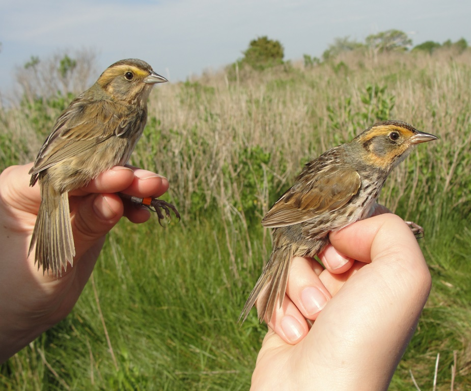

# (APPENDIX) Appendix {-}

# Ejercicios A 

## En esta actividad estarán comenzando a utilizar la plataforma R.  

Recuerda que este libro esta disponible gratuitamente en el internet tanto en Español, https://es.r4ds.hadley.nz/index.html como en Ingles https://r4ds.had.co.nz/index.html.

NOTA que si no tiene experiencia esto le va tomar tiempo.   

### Primer paso

Haber instalado R
Haber Instalado RStudio
Haber Instalado RMarkdown en Rstudio

### Segundo paso

1. Seguir el Capitulo #1, y practicar instalar los paquetes "Packages", por ejemplo el paquete de "tidyverse"
2. Probar las funciones básica de suma, resta, división y multiplicación en R.


# Ejercicios B

```{r, eval=TRUE, echo=FALSE}
colorize <- function(x, color) {
  if (knitr::is_latex_output()) {
    sprintf("\\textcolor{%s}{%s}", color, x)
  } else if (knitr::is_html_output()) {
    sprintf("<span style='color: %s;'>%s</span>", color, 
      x)
  } else x
}

#`r colorize("some words in red", "red")`


```


## `r colorize("Tarea para entregar, fecha limite el 24 de agosto a la media noche 11:59pm", "red")`


En esta actividad seguirán utilizando la plataforma R para visualizar los datos.  
Ud someterá su trabajo como un documento .html y lo cargará a Edmodo.


Recuerda que este libro esta disponible gratuitamente en el internet tanto en Español Español, <https://es.r4ds.hadley.nz/index.html> como en Ingles, <https://r4ds.had.co.nz/index.html> . En Edmodo ya le envie los enlaces.


## Segundo paso
Del libro R4DS, leer y entender las secciones 3.4 HASTA 3.6.1.

Reproducir la **mayoría** de las gráficas y someter el trabajo.    


### Tercer Paso

3. Leer el capitulo #2, entender lo que quiere decir cada uno de los términos en la figura.  
   Por ejemplo que quiere decir modelos "model" en estadística?
  
  
### Cuarto Paso

4. Abrir un documento nuevo de RMarkdown
  - Quitar/remover lo que no es necesario
  - Seguir los pasos hasta la sección 3.3 del libro **r4ds** y reproducir las gráficas como aparece en el libro y contestar las preguntas y hacer los ejercicios.


# Ejercicios C

## Ejercicio de practica

Los siguientes ejercicios son para practicar el uso de R y RStudio. Se asume que Uds. practica lo siguiente. Tiene acceso a R y Rstudio, RMarkdown, el internet, libros. Después de hacer los ejercicios discuta tus resultados con otros estudiantes.  Este ejercicio NO tiene puntuación. 

R Practica
Usa R como una calculadora


### Ejercicio #1
Pon esta formula en R correctamente y calcula el resultado.

$1+2(3+4)$


```{r, echo=FALSE, eval=FALSE}
1+2*(3+4)
```

### Ejercicio #2
Pon esta fomula en R correctamente y calcula el resultado.

$\sqrt{(4+1)(2+1)}$

```{r, echo=FALSE, eval=FALSE}
sqrt((4+1)*(2+1))
```

### Ejercicio #3
Re-esribir esta fomula en R correctamente y calcula el resultado.

$(2 + 3) * 4$

```{r, echo=FALSE, eval=FALSE}
(2+3)*4
```

### Ejercicio #4

Calcular lo siguiente en R, enseña el codigo y el resultado

$$\frac{0.25-2}{\sqrt{(0.2(1-0.2)/100})}$$ 


```{r, echo=FALSE, eval=FALSE}
(0.25-2)/sqrt(0.2*((1-0.2)/100))
```

### Ejercicio #5
Asigna una variable a los valores del 2 hasta el 5.  Después usando las variable multiplica todos los valores.

```{r, echo=FALSE, eval=FALSE}
a=2
b=3
c=4
d=5
a*b*c*d
```

### Ejercicio #6

El data set **rivers** se sube con R.  Escribe **rivers** en un chunk y determina cual es el ultimo valor del archivo y cual es su posición en la lista. 
```{r, echo=FALSE, eval=FALSE}
rivers
```

### Ejercicio #7

Instala y activa el paquete **UsingR** y evalúa los datos que se encuentra en el archivo/data frame **exe.pay**. Calcula cual es el promedio, mínimo y máximo de los datos usando las funciones *mean, min y max*.  


```{r, echo=FALSE, eval=FALSE}
library(UsingR)
#exec.pay
mean(exec.pay)
min(exec.pay)
max(exec.pay)
```


### Ejercicio #8

El data set que se llama **Orange** es un data frame con tres variables. Como se llama las variables?

```{r, echo=FALSE, eval=FALSE}
Orange
```


### Ejercicio #9

Calcula la edad promedia de los arboles de naranja que esta en el archivo **Orange**

```{r, echo=FALSE, eval=FALSE}
mean(Orange$age)
```

### Ejercicio #10

Haz un gráfico de puntos entre la x=circunferencia del árbol y la y=edad, y añadele un color diferente a cada árbol. 

```{r eval=FALSE, include=FALSE}
library(ggplot2)
ggplot(Orange, aes(circumference, age, color=Tree))+
  geom_point()
```


# Ejercicios D

## ANOVA exercices

```{r}
library(tidyverse)
library(gt)
library(Rmisc)
library(multcomp)
library(car)
```

***

### El estudiante entregará el trabajo en el formato de .html en MSTeam.  

  - Uds tuvieron su experiencia de como montar un documento en .Rmd y convertirlo en .html.  (no se aceptará trabajo en Word).
  
  ES SUMAMENTE IMPORTANTE: que el trabajo sea bien organizado y profesional. Hará puntos extra por la presentación (10 puntos).
    - recuerda que NO se enseña todos los datos.  
 
 ***
 
### Los datos se encuentrán en la pestaña del website debajo "Los Datos", "Archivos de Datos". El nombre del archivo se llama 
 - "Births In USA since 1933"; USAbirthbymonth_4.csv


***

### Human Birth Database

#### Reliability and Accuracy Matter

The Human Birth Database (HMD) is the world´s leading scientific data resource on Births in developed countries. The HMD provides detailed high-quality harmonized mortality and population estimates to researchers, students, journalists, policy analysts, and others interested in the human longevity. The HMD follows open data principles.

https://www.mortality.org/Home/Index


Usando los datos de natalidad en estados unidos desde 1933 a 2020.  

 - En el archivo encontrarán tres columnas informativas, 
    - Year, 
    - Month y 
    - Births (total de nacimiento en este mes y año)

***

El archivo de datos esta incluido en MSTEAM. "USAbirthbymonth_4 months.csv"


```{r include=FALSE}
library(readr)
USAbirthbymonth <- read_csv("Data_files_csv/USAbirthbymonth_4 months.csv")
birth=USAbirthbymonth
head(birth)
```


***

### Aqui los primeras 6 filas del df
```{r echo=FALSE}
library(gt)

gt(head(birth))
```

 


 1. Haz un gráfico del promedio de nacimiento y la variación en natalidad por mes. (5 pts)


```{r include=FALSE}
library(ggplot2)
ggplot(birth, aes(x=Month, y=Births, colour=Year))+
geom_point()+
  stat_summary(fun = mean, geom = "point", size = 2, 
                    aes(group=1), colour = "black")+
  stat_summary(fun = mean, geom = "line", size = 1, 
             aes(group=1), colour = "red")
```


```{r include=FALSE}

library(Rmisc)
sum = summarySE(birth, 
                measurevar="Births", 
                groupvars="Month")
sum
```


 2. Haz un gráfico del promedio y intervalo de 95% por mes (5 pts)


```{r include=FALSE}


ggplot(sum, aes(x=Month, 
                y=Births)) +
  geom_point(colour="blue")+ 
  geom_errorbar(aes(ymin=Births-2*se,
                    ymax=Births+2*se), 
                width=.2, size=0.7)
```


3. Haz la prueba que corresponde para determinar si los grupos son iguales (8 pts).
    - Cual es la hipótesis NULA?
    - Cual es la hipótesis ALTERNA?
    
    
4. Haz la prueba de ANOVA correspondiente (enseñe la resultados) (4 puntos)

5. Interprete los resultados de la prueba de ANOVA (10 puntos)
    - Cual es el resultado de la prueba?
    - Cual es el grado de libertad?
    - Cuantos datos totales hay en el análisis?
    

```{r include=FALSE}
model_b=aov(Births~Month, data=birth)
summary(model_b)
```


6. Evalúa los supuestos de esta prueba, explicando si acepta que los datos cumple con los supuestos (10 pts)
    - Homogeneidad de Varianza
    - Normalidad
    - Explica claramente cada prueba y si interpretación
  


```{r eval=FALSE, include=FALSE}
plot(model_b)
```


```{r eval=FALSE, include=FALSE}
leveneTest(birth$Births, birth$Month)
```


```{r include=FALSE}

#6. Haz la prueba de Post-Hoc de Bonferroni y contesta la siguientes pregunta. (6 pts)
 #  - Cual(es) es/son los mes(es) que la natalidad difiere de enero.
  # - Cual(es) es/son los mes(es) que la natalidad difiere de agosto.

pairwise.t.test(birth$Births, birth$Month, p.adjust.method = "bonferroni")


#postHocs.1<-glht(model_b, linfct = mcp(Month = "Tukey"))  
#summary(postHocs.1)
```


# Ejercicios E


## ANOVA Excercise 2


### Superheroes y Lesiones

Los datos representa la gravedad de lesiones que tienen niños que se disfrazan de su superheroes favorito y después llegan a un hospital por alguna lesión.  Los niños son categorizados con un nivel gravedad de lesión, más alto el valor más serio era la lesión. Los datos provienen de Field et al. 


Subir los datos de **Superhero.csv**


```{r data super heroes2}
library(readr)
Superhero <- read_csv("Data_files_csv/Superhero.csv")

head(Superhero)

unique(Superhero$heronames)
```


Renombrar los nombres de las categorías para los tipos de Superheroes. En el archivo como están identificados las categorías de superheroes?  

```{r rename variables2}
#Superhero
Superhero$heronames<-factor(Superhero$hero, levels = c(1:4), 
     labels = c("Spiderman","Superman", "Hulk", "Ninja Turtle"))
Superhero
names(Superhero)
```
### La preguntas

Contestar cada una de las siguientes preguntas.

1. Evaluar la distribución de los datos de respuestas (los en Y)
2. Evaluar la homogeneidad de varianza
3. Visualizar los datos Puntos y promedios y intervalo de confianza
4. Hacer la prueba de ANOVA con aov()
5. Evaluar la figura de residuales
6. Evaluar la gráfica de qq, para la normalidad
7. Hacer la prueba de post-hoc si es necesario!!!!!

***

# Ejercicios F

## Ejercicio de Corelación: 

### Despues de hacer los ejercicios habrá preguntas en MSTeam para contestar. 

  Objetivos:
  
  + Determinar si el estudiante puede evaluar si las variables tienen una distribución normal o no
  + Basado en lo anterior seleccionar la prueba de correlación correspondiente
  + Calcular el coeficiente de determinación
  + Visualizar la correlación

```{r, eval=FALSE, echo=FALSE}
library(MASS)
# data() # To see all the datasets available 

```


***

### Los Datos

The data were obtained from Andrews, D.F. and Herzberg, A.M. (1985) Data: A Collection of Problems from Many Fields for the Student and Research Worker. Springer-Verlag.

Las variables en el archivo **urine** en el paquete **boot**

+ r = Indicator of the presence of calcium oxalate crystals.

+ gravity = The specific gravity of the urine.

+ ph = The pH reading of the urine.

+ osmo = The osmolarity of the urine. Osmolarity is proportional to the concentration of molecules in solution.

+ cond = The conductivity of the urine. Conductivity is proportional to the concentration of charged ions in solution.

+ urea = The urea concentration in millimoles per litre.

+ calc = The calcium concentration in millimoles per litre.


```{r}
library(boot)
head(urine) 
```

***

1. Evaluar si las 6 variables (excluye la variable "r") cumple con distribución normales. 

 - Usa dos de los métodos que hemos aprendido para evaluar cada variable si cumple con distribución normal.
  
  - Explicar que prueba utilizas y interpretas los resultados.
  

```{r, eval=FALSE, echo=FALSE}

shapiro.test(urine$gravity)
shapiro.test(urine$ph)
shapiro.test(urine$cond)
shapiro.test(urine$urea)
shapiro.test(urine$calc)

```


2. Usando el gráfico de qq-plot gráfica la correlación "menos normal" de las pruebas anteriores.  Salva este gráfico en .png o .jpeg.  


```{r eval=FALSE, include=FALSE}
library(ggplot2)

ggplot(urine, aes(sample=calc))+
  geom_qq()+
  geom_qq_line()
```


***

2. Estimado de correlación entre las seis variables

+ Tomando en cuenta lo que observaste en la pruebas anterior, selecciona la prueba correcta entre Pearson o Kendall, para evaluar la correlaciones entre las variables.   Tiene que seleccionar la prueba correcta.  

    + Cual variables tienen una correlación mayor
    + Cual variables tiene la correlación menor


```{r, eval=FALSE, echo=FALSE}
cor(urine[, c("gravity", "ph", "cond", "urea", "calc")], use = "pairwise.complete.obs",
    method = 'kendall')
```


***

3. Coeficiente de determinación

 + Calcula el coeficiente de determinación entre:
     + calcium y urea
     + ph y calc
     
  + Cual de estos pares explica mejor la relación entre una variable y la otra (2 puntos)  

```{r, eval=FALSE, echo=FALSE}
cor(urine$calc, urine$urea)^2
cor(urine$ph, urine$calc)^2
```


***

4. ¿Como se interpreta el coeficiente de determinación?

***

5.  Usa la funcción **ggMarginal** del paquete ggEXTRA

Selecciona un par de variables de la correlación anterior:

  + Prepare un gráfico para demostrar la correlación y su distribución usando **ggMarginal**. 
  + Interpretar el gráfico y compara con la prueba de normalidad que hiciste anteriormente
  + salva el grafico en formato .jpeg o .png

```{r, eval=FALSE, echo=FALSE}
library(ggplot2)
p <- ggplot(urine, aes(gravity, urea)) + 
  geom_point() + 
  theme_classic()
p
# add marginal histograms
ggExtra::ggMarginal(p, type = "histogram")
```

***

6. ¿Cual son los supuestos para usar la correlación de Pearson?


***


# Ejercicios G

##  Regresión Logística

Este ejercicio es para practicar como hacer una Regresión logística

Los temas incluye.

+ Construir un modelo de una regresión logística
+ Determinar si los coeficientes son diferentes de cero
+ Construir un gráfico de la relación logística usando ggplot2
+ Determinar los valores de probabilidades especifico para algunos valores "X"


### Karn and Penrose data Set


### Los Datos

Los datos provienen de un estudio realizado por Mary N. Karn and L. S. Penrose publicado en **Annals of Eugenics**, titulado **Birth Weight and gestation time in relation to maternal age, parity and infant survival** publicado en 1951.  Estaremos usando solamente una parte de los datos. El periodo de gestación y el peso de los bebés varones al nacer y su supervivencia (fallecio= 0 y sobrevivio= 1).  Para facilitar el trabajo he modificado los datos un poco para cumplir con las tareas asignada.

En el archivo "Karn_Penrose_infant_survivorship.csv" tiene datos sobre 7036 nacimientos entre los años 1935 y 1946. El archivo tiene 4 columnas:

  - Line_number = la secuencia de los datos
  - Gestation_Time_days  = El periodo de gestación en días
  - Weigth_lb = El peso del bebe en libras
  - Surv_Index = "0" o "1"


```{r}
library(ggplot2)
library(readr)
Karn_Penrose_infant_survivorship <- read_csv("Data_files_csv/Karn_Penrose_infant_survivorship.csv")
KPdata=Karn_Penrose_infant_survivorship

```

***

1. Pregunta: Explique en sus propias palabras cuales son las hipótesis que se pueden probar. Especificamente mencione si la hipótesis es una hipótesis nula o alterna. (4 puntos)


```{r, echo=FALSE}
#  - Hipótesis Nula: El peso de los varones y el periodo de gestación no afectan el indice de supervivencia. 
  
#  - Hipótesis Alterna #1: Los varones con un periodo de  mayor gestación tienen mayor probabilidad de supervivencia que los varones con un mayor peso.

#  - Hipótesis Alterna #2: Los varones con mayor peso al nacer tienen mayor probabilidad de supervivencia que los varones con un mayor periodo de gestación.
```

***

2. Pregunta: Graficar la variable de respuesta (2 puntos)

```{r variable de respuesta, echo=FALSE, eval=FALSE, message=FALSE}
names(KPdata)
library(ggplot2)
ggplot(KPdata, aes(Survival))+
  geom_histogram(binwidth= .10, colour="white", fill="red")+
  labs(x = "Peso de los bebe, lbs", y = "Frecuencia")+
  ggtitle("Frecuencia vs survival of babies")

```


***

3. Pregunta: Grafique las variables explicativas
    - Periodo de gestación (2 puntos)
    - Peso de los varones al nacer (2 puntos)

```{r periodo de gestacion, echo=FALSE, eval=FALSE, message=FALSE}
ggplot(KPdata, aes(Gestation_Time_days))+
  geom_histogram(binwidth= 4, fill="white", colour="red")+
  labs(x= "Duración de Gestación", y="Frecuancia")+
  
  ggtitle("Frecuencia vs Duración de Gestación")
 
```

***

Evaluando la distribución de la variable de respuesta

```{r weight-index,  echo=FALSE, eval=FALSE, message=FALSE}
ggplot(KPdata,aes(Weigth_lb))+
  geom_histogram(fill="white", colour="red")+
  labs(x="Survival")+
  ggtitle("Count vs Weight of babies")

```

***

4. Pregunta: Usando la prueba correcta evalúa la relación entre la supervivencia y:
  - periodo de gestación (2 puntos)
  - peso de los varones al nacer (2 puntos)
  - determina si los coeficientes son significativos de cada una de las pruebas y explica que quiere decir la prueba (4 puntos)

  
  

```{r, Periodo de Gestacion y supervivencia, echo=FALSE, eval=FALSE, message=FALSE}
library(car)
names(KPdata)
modelweight<-glm(Survival~Weigth_lb, data= KPdata, family = binomial())

summary(modelweight)


modelgest<-glm(Survival~Gestation_Time_days, data= KPdata, family = binomial())

summary(modelgest)
```

***

5. Graficar la Relación entre la supervivencia y el peso de los bebes (2 puntos)

```{r,echo=FALSE, eval=FALSE, message=FALSE}


ggplot(KPdata, aes(x=Weigth_lb, y=Survival)) +
  geom_point() +
  stat_smooth( method="glm", method.args = list(family = "binomial"), se=F) 
```


***

6. Cual es la probabilidad de un bebe de 4 lbs sobrevivir (2 puntos)
7. Cual es la probabilidad de un bebe de 7 lbs sobrevivir (2 puntos)
8. Preguntar a su familia cual era el peso de nacer cuando Ud. nacio, calcula la probabilidad de sobrevivir (3 puntos)


# Ejercicios H

## Bondad de Ajuste
***

```{r message=FALSE}
library(tidyverse)
library(gt)
library(gmodels)
```


###  Encontrarán dos ejercicios de los análisis de Bondad de Ajuste.

### Ejercicio #1 

### Musaraña

Un total de 125 individuals de un mamifero pequeño, musaraña fueron localizado dentro de una jaula, con la misma cantidad de 6 diferentes comida, la frequencia de que cada una de las musaraña selecionarón un tipo de comida esta en la tabla

```{r, echo=FALSE, fig.show = "hold", out.width = "50%", fig.align = "default"}

```

Photo from: https://www.laguiadelvaron.com/wp-content/uploads/2020/08/reaparece-musarana-elefante-www.laguiadelvaron-1.jpg


```{r}
musaraña=tribble(
  ~Tipo_comida, ~frecuencia,
  "C1", 13,
  "C2", 26,
  "C3", 39,
  "C4", 14,
  "C5", 28
)
gt(musaraña)
```


Contesta las siguientes preguntas

 - a) Cual es el (son) valor(es) esperado para cada grupo.
 - b) Prueba si hay preferencia o no para una comida


```{r eval=FALSE, include=FALSE}
library(gmodels)
obs<-c(13, 26, 39, 14, 28)
esp<-c(.2,.2,.2,.2,.2)
chisq.test(x=obs, p=esp)
```

***

### Ejercicio #1 

### Mofetas y rabia

Los siguientes datos son las frecuencias de mofetas encontrada con rabia en dos diferentes región geográficas.


```{r, echo=FALSE, fig.show = "hold", out.width = "50%", fig.align = "default"}
knitr::include_graphics("Graficos/Skunk.jpeg")

R.version

```

Photo from: https://www.britannica.com/animal/skunk


```{r}
mofetas=tribble(
  ~TRegion, ~con_rabia, ~sin_rabia,
  "Region1", 14, 29,
  "Region2", 12, 38
  
)
gt(mofetas)
```


 - a) Cual es la hipótesis nula?
 - b) Conprueba la hipótesis para determinar si tener rabia es igual en las dos regiones?
 - c) Cual es el valor esperado de la mofetas sin rabia en la region 2? 

```{r, eval=FALSE, echo=FALSE}
#Crear la tabla de contingencia

con_rabia <- c(14, 29)
sin_rabia <- c(12,38)
Mofetatable <- cbind(con_rabia, sin_rabia)


rownames(Mofetatable)<-c("Region_1", "Region_2") # Añade el nombre a las filas

Mofetatable


CrossTable(Mofetatable, fisher = TRUE, chisq = TRUE, expected = TRUE, 
           sresid = TRUE, format = "SPSS")
```


### AHORA contesta las preguntas en MSTeam.

Hay una fecha limite para la entrega de los ejercicios.  


# Ejercicios I


## Evaluación de distribución normal

Este documento tiene algunos ejercicios para evaluar si una distribución es normal. Los códigos (scripts) se encuentran en el archivo **T8 La Distribución Normal**. 
  
  Tema:
  
  - construir un histograma de los datos
  - sobreponer una distribución teórica sobre el histograma
  - evaluar si los datos tienen una distribución normal usando qqplot
  - evaluar se los datos tienen una distribución normal usando la prueba de Shaipro_Wilks y Anderson-Darling
    
    
### Construir un histograma con los siguientes datos
 
 1. Usa el paquete **ggversa**, y el archivo **SparrowsElphick** y haga un histograma de los pesos (wt) de los pajaros capturados
 

  
  
```{r C1, echo=FALSE, fig.show = "hold", out.width = "20%", fig.align = "default"}


```

 Foto de : https://birdcallsradio.com/episode-097-chris-elphick/
 

 
```{r, C2}
library(ggversa)
gt(head(SparrowsElphick))
```

***
 
### Constuye un histograma de la distribución de los pesos de los pajaros. 

  - las lineas blancas alrededor de las barras
  - que se cambio el nombre del eje de "x"
  - que se cambio el nombre del eje de "y"
 
```{r, C3, eval=FALSE, message=FALSE, warning=FALSE, include=FALSE}

ggplot(SparrowsElphick, aes(wt))+
         geom_histogram(colour="white")+
  ylab("Fecuencia")+
  xlab("Peso en gramos de los ")
```
 
***
 
Ahora a esta misma gráfica añádele la distribución normal teórica, el gráfico 


```{r, C4, eval=FALSE, message=FALSE, warning=FALSE, include=FALSE}

ggplot(SparrowsElphick, aes(wt))+
         geom_histogram(aes(y=..density..),colour="white")+
  ylab("Fecuencia")+
  xlab("Peso en gramos de los ")+
    stat_function(fun = dnorm, 
                args = list(mean = mean(SparrowsElphick$wt, na.rm = TRUE), 
                sd = sd(SparrowsElphick$wt, na.rm = TRUE)), 
                colour = "green", size = 1)
```

***

### QQPLOT


 - Ahora haz un gráfico de **qqplot** y determina si la distribución de los datos de peso de los finches tienen una distribución normal.

```{r, C5, eval=FALSE, message=FALSE, warning=FALSE, include=FALSE}
ggplot(SparrowsElphick, aes(sample=wt))+
  geom_qq()+
  geom_qq_line(colour="blue")
```

***
### Shapiro-Wilk test


 - Haz la prueba de Shapiro-Wilks para determinar si la distribución de los datos son significativamente diferente de una distribución normal.
 - Basado en los supuestos de esta prueba ¿Se debería utiliza la "Shapiro-Wilks" para evaluar la distribución normal.
 
 
#### Lograste tener este resultado?  
```{r eval=FALSE, message=FALSE, warning=FALSE, C6, echo=FALSE, include=FALSE}
shapiro.test(SparrowsElphick$wt)
length(SparrowsElphick$wt)
```

***

### Anderson-Darling

 - Haz la prueba de Anderson-Darling para determinar si la distribución de los datos son significativamente diferente de una distribución normal.

- ¿La distribución de los pesos es significativamente diferente de una distribución normal?


#### Lograste tener este resultado?
```{r eval=FALSE, message=FALSE, warning=FALSE, include=FALSE}
library(nortest)
ad.test(SparrowsElphick$wt)
```

***

# Ejercicios J

## Pruebas de una muestra

Los siguientes ejercicios provienen de los conceptos aprendidos en "Pruebas de una muestra"

ANTES de abrir el quiz en MSTeam haz todos los ejercicios aqui. 

***

1.  Title: Ultrasound evaluation of the morphometric patterns of lymph nodes of the head and neck in young and middle-aged individuals. Ogassavara et al. 2016, 49:225-228, Radiologia Brasileira.  doi: 10.1590/0100-3984.2015.0002. 

    + En este trabajo evaluaron los ganglios linfáticos de 20 individuos sanos. Encontraron que la media de los ganglios linfáticos mastoideos de los hombres era de 0,9 cm con una desviación estándar de 0,4 cm. 
    + ¿Cuál es el intervalo de confianza al 95% de los ganglios linfáticos mastoideos en hombres? . 

```{r, eval=FALSE, echo=FALSE}
UL=0.9+qt(0.025, 19)*0.4/sqrt(20)
LL=0.9-qt(0.025, 19)*0.4/sqrt(20)
UL
LL

```


***

2. Usando los mismo datos de la pregunta #1. Title: Ultrasound evaluation of the morphometric patterns of lymph nodes of the head and neck in young and middle-aged individuals. Ogassavara et al. 2016, 49:225-228, Radiologia Brasileira.  doi: 10.1590/0100-3984.2015.0002. 

    + En este trabajo evaluaron los ganglios linfáticos de 20 individuos sanos. Encontraron que la media de los ganglios linfáticos mastoideos de los hombres era de 0,9 cm con una desviación estándar de 0,4 cm.  Ya se pudo medir el tamaño de los ganglios linfáticos mastoideos de TODOS los hombres del planeta, y se determino que que el promedio es de 0.7 cm con una desviación estándar de 0,2 cm.
    + Usando los siguientes datos haga la prueba correspondiente en R para determinar el valor de t, observado y el valor critico.  

```{r, eval=FALSE, echo=FALSE}
t=abs((0.9-0.7)/((0.4)/sqrt(20)) )
t # Valor t de observado
abs(qt(0.025, 19))  # valor de t-critico, de la tabla
```


***

### Ejercicio de práctica 1: Amigos de Facebook

 
 Mucha gente creen que la cantidad promedio de amigos en Facebook es 338 con una desviación estandard de 43.2.  En un muestro al azar de 50 estudiantes universitarios en un pais se calculo que el promedio de estos estudiantes es de 350 amigos.  Al nivel de 5% de error determina si hay evidencia que los estudiante tenga mayor numero de amigos que el promedio anunciado por Facebook  

```{r include=FALSE}
t=abs((328-350)/((43.2)/sqrt(50)) )
t # Valor t de observado
abs(qt(0.025, 49))  # valor de t-critico, de la tabla
```

4. Cual es valor de t

5. Cual es el valor de t critico

6. ¿Se rechaza o acepta la hipótesis nula?

***


### Ejercicio de práctica 2: Dias de enfermedades


Un dueño de una impresa dice que su insiste que la cantidad de días promedio de enfermedades de sus empleados es menor que el promedio nacional de 10.  Los datos de 40 empleados sigue.  Determina si hay evidencia para creer el comentario del dueño de esta impresa.

```{r}
dias_E=tribble(
  ~dias_e,
  0,6,12,3,3,5,4,1,
  3,9,6,0,7,6,3,4,
  7,4,7,1,0,8,12,3,
  2,5,10,5,15,3,2,5,
  3,11,8,2,2,4,1,9
)
dias_E
```


7. ¿Cual es la hipótesis nula?

8. Cual es el valor de "t"

9. Cual es le valor de "p"

10. Aceptas o rechazas la hipótesis nula

11. ¿Cual es el intervalo de confianza del número de días enfermo de estos trabajadores?


***

# Ejercicios K

## **prueba de t con datos pareados**.

### El siguiente ejercicio es para una prueba corta donde tendrán que contestar en MSTeam.  

El tema es sobre la **prueba de t con datos pareados**.


La prueba corta tiene los siguientes objetivos. Evalúa cada pregunta antes de abrir el documento en MSTeam (Tendrán un tiempo limitado el momento que abré MSTeam)

1. Poder subir los datos a R
2. Hacer la "prueba de t"
3. Interpretar los resultados
4. Subir una gráfico de los resultados a MSTeam
5. Explicar cúal(es) es(son) el/los supuesto(s) de esta prueba
6. Hacer una prueba para determinar si el/los supuesto(s) es/son validado(s)
7. Escribir claramente la hipótesis nula
8. Escribir claramente la hipótesis alterna


Los datos provienen de una investigación donde se evaluó el impacto del huracán Georges son una pequeña orquídea endémica de Puerto Rico en el Yunque. La especies es *Lepanthes eltoroensis* y crece sobre árboles.  

{width=40%}

***

Usa los datos del archivo "Lepanthes_eltoroensis_Georges_STUDENT.csv"
 - Los datos están en archivo atado tanto al email como en MSTeam.
 
 

En el archivo encontrará datos sobre la cantidad de hojas que tiene cada planta.  Los datos fueron recopilado por 6 años a cada dos meses. El primer muestreo fue la columna T1, y el último muestreo T12 (despues de 6 años). El primer muestreo fue después del huracán Georges. 

Usando estas dos columnas evalúa si las plantas tenían la misma cantidad de hojas al principio y al final de 6 años. 

```{r}
library(readr)
Lepanthes_eltoroensis_Georges_STUDENT <- read_csv("Data_files_csv/Lepanthes_eltoroensis_Georges_STUDENT.csv")

Lep=Lepanthes_eltoroensis_Georges_STUDENT
```
***

### 1. Calcula el promedio y la desviación estandard del número de hoja en cada tiempo.
 
```{r eval=FALSE, include=FALSE}
mean(Lep$T1, na.rm = TRUE)
sd(Lep$T1, na.rm = TRUE)
mean(Lep$T12, na.rm = TRUE)
sd(Lep$T12, na.rm = TRUE)
```
 
***

### 2. Haz la *prueba de t-con datos pareados*

```{r eval=FALSE, include=FALSE}
t.test(Lep$T1, Lep$T12, paired=TRUE)
```

***

### 3. Haz un gráficos "histograma" de las diferencias entre el tiempo T12 y T1.

  - Para salvar el gráfico usa ggsave("nombre_de_tu_grafico.png").  Para subir lo a MSTeam.

  - Ahora su gráfico sera salvado en su proyecto con el nombre que le dio.

```{r eval=FALSE, include=FALSE}
library(tidyverse)
Lep$dif_T12_T1=Lep$T12-Lep$T1

ggplot(Lep, aes(dif_T12_T1))+
  geom_histogram()
```


***

### 4. Determina si la prueba cumple con el/los supuesto(s) de una prueba de t con datos pareados?
 
```{r eval=FALSE, include=FALSE}
shapiro.test(Lep$dif_T12_T1)
```

***

# Ejercicios sobre **prueba de t con datos independiente**

## El siguiente ejercicio es para una prueba corta donde tendrán que contestar en MSTeam.  

El tema es sobre la **prueba de t con datos independiente**.


La prueba corta tiene los siguientes objetivos. Evalúa cada pregunta antes de abrir el documento en MSTeam (Tendrán un tiempo limitado el momento que abré MSTeam)


Los datos son de pacientes que tienen Esclorosis muscular (MS).  A cada uno de estos pacientes se evaluó los niveles de IgG, un indicador de anticuerpo.

Información básica sobre el anticuerpo, tambien conocido como **Immunoglobin**.


```{r include=FALSE}
Tabla= tribble(
  ~Ig, ~"Que es", ~"Posible cause cuando es bajo", ~"Posible cause cuando es alto",
  "IgG", 
  "Major type of antibody found in the blood that can enter tissues and fight infection. In its four forms, provides the majority of antibody-based immunity against invading pathogens. The only antibody capable of crossing the placenta to give passive immunity to the fetus.", 
  "Low levels occur in Waldenstrom's macroglobulinemia, where high levels of IgM antibodies may inhibit the growth of B-cells that make IgG. Other conditions that cause low levels include some types of leukemia and a type of kidney damage (nephrotic syndrome). In rare cases, some people are born with a lack of IgG antibodies. These people are more likely to develop infections.",
  "May mean a long-term (chronic) infection, such as AIDS, is present. Levels of IgG are higher in IgG MGUS, IgG multiple myeloma, long-term hepatitis, and multiple sclerosis (MS). In multiple myeloma, tumor cells make only one type of IgG antibody (monoclonal); the other conditions cause an increase in many types of IgG antibodies (polyclonal)."
)
library(huxtable)
Tabla2=as_hux(Tabla)
```

***

### Tabla de que es IgG y algunos de sus causas
```{r echo=FALSE}
Tabla2 |> set_all_padding(4) %>% 
      set_outer_padding(0) %>% 
      set_number_format(2) %>% 
      set_bold(row = 1, col = everywhere) %>% 
      set_bottom_border(row = 1, col = everywhere) %>% 
      set_width(0.4)
```

***

La prueba corta tiene los siguientes objetivos. Evalúa cada pregunta antes de abrir el documento en MSTeam (Tendrán un tiempo limitado el momento que abré MSTeam)

1. Poder subir los datos a R
2. Hacer la "prueba de t" que corresponde
3. Interpretar los resultados
4. Subir una gráfico de los resultados a MSTeam
5. Explicar cúal(es) es(son) el/los supuesto(s) de esta prueba
6. Hacer una prueba para determinar si el/los supuesto(s) es/son validado(s)
7. Escribir claramente la hipótesis nula
8. Escribir claramente la hipótesis alterna
9. ¿Cuales son las hipótesis de los supuestos?


Los datos

```{r}
library(readxl)
Immuno_markers_MS <- read_excel("Data_files_csv/Immuno_markers_MS.xlsx")
Imm=Immuno_markers_MS

```

***

En este archivo tiene tres columnas. 

  - El sexo del paciente, "F" o "M".
  - Un indice de los IgG, en una mustra de cada paciente con MS
  - Un indice de IgG synthesis rate : 
      - The reference interval is –9.9 to +3.3 mg per day. Negative values are considered normal. Multiple sclerosis patients usually have a synthesis rate >8.0.
  

***

### 1. Calcular el promedio y desviación estandard y el tamaño de muestra de los dos grupos del nivel de IgG  
      
      
```{r eval=FALSE, include=FALSE}


Imm |> dplyr::select(Gender, IgGIdx) |> 
  group_by(Gender) |>
  filter(!is.na(IgGIdx)) |> 
  summarise(mean=mean(IgGIdx),
           sd=sd(IgGIdx),
           n=n())

```


***   

### 2. Hacer la prueba para evaluar si las mujeres y hombres tienen un IgG diferente

```{r eval=FALSE, include=FALSE}

t.test(IgGIdx~Gender, Imm)


```

***

### 3. Haz un histograma de la variable "IgG" por genero, a) un color diferente por "Gender"

  - Para salvar el gráfico usa ggsave("nombre_de_tu_grafico.png").  Para subir lo a MSTeam.

  - Ahora su gráfico sera salvado en su proyecto con el nombre que le dio.

```{r eval=FALSE, include=FALSE}
ggplot(Imm, aes(IgGIdx, fill=Gender))+
  geom_histogram(colour="white")+
  facet_wrap(~Gender)
```


***

### 4. Determina si la prueba cumple con el/los supuesto(s) de una prueba de t con datos independientes?


```{r eval=FALSE, include=FALSE}
library(RVAideMemoire)
byf.shapiro(IgGIdx~Gender, Imm)
```


```{r eval=FALSE, include=FALSE}
bartlett.test(IgGId¿Cual x~Gender, Imm)
```

***

# Ejercicios M

## Ejercicio de Regresión

### Fungal growth

 - Fungal growth from soil samples were cultured in the presence of different concentrations of Cadnium (in µM). The density of fungal growth (x 10^6/ml) in each of the cultures was determined after a period of incubation.  Para conocer más sobre estas interacciones vea el siguiente enlace.  https://bmcmicrobiol.biomedcentral.com/articles/10.1186/s12866-022-02488-z


 
 
```{r}
DATA=tribble(~Cadnium, ~Fungal_Growth,
             0, 6.6,
             0, 6.9,
             0, 7.2,
             1, 6.8, 
             1, 6.0,
             1, 5.6,
             2, 6.4,
             2, 6.0,
             2, 5.4,
             4, 4.8,
             4, 4.4,
             4, 3.9,
             6, 2.6,
             6, 3.1,
             6, 3.4,
             8, 1.0,
             8, 1.3,
             8, 1.7,
             10, 0.2,
             10, 0.3,
             10, 0.5)

DATA
```

***

1. Haz un gráfico de la relación entre la concentración de Cadnium y el crecimiento de hongos
  - Añade la mejor linea ( la regresión lineal)
  - Tenga el gráfico listo para subir a MSTeam
  
2. Evalúa el modelo de la regresión lineal
  - Se acepta o rechaza LAS hipótesis
  
3. Evalúa los supuestos de esta prueba.

***

### Contesta las preguntas en MSTeam


***


### Distancia de las estrellas más brillantes de las que son 100 años luz o menos

### Calcular el promedio, mediana, moda y rango de los datos de las estrellas más cercana a la tierra

```{r}
Distancia_Estrellas=tribble(
  ~Distancia,
  8.6,36.7,42.2,16.8,33.7,87.9,4.4,25.3,11.4,25.1,51.5
)

gt(Distancia_Estrellas)
```

```{r, echo=FALSE, eval=FALSE}
Distancia_Estrellas=tribble(
  ~Distancia,
  8.6,36.7,42.2,16.8,33.7,87.9,4.4,25.3,11.4,25.1,51.5
)

mean(Distancia_Estrellas$Distancia)
median(Distancia_Estrellas$Distancia)
library(e1071)
skewness(Distancia_Estrellas$Distancia)
```


***

### Los datos representan las poblaciones (en 1'000) en Puerto Rico en el año 2020


#### Calular los cuantiles mencionado en la pregunta

```{r}
PR_poblacion=tribble(
  ~Poblacion,
  18.0, 38.1,55.1,24.2,24.6,25.6,87.7,15.8,22.7,28.9,185.2,47.1,127.2
)

gt(PR_poblacion)
```


***

# Ejercicios N

## Ejercicios de tendencia central

### Los datos representan la cantidad de dinero ganado por arttistas (fallecidos) en milliones de dollares


#### Calcular el promedio, mediana, moda de los datos de las estrellas más cercana a la tierra


```{r}
Dinero_Artista=tribble(
  ~Artista, ~Dinero,
 "Kurt Corbain", 50,
 "Elvis Presley",42,
 "Charles Chultz", 35,
 "John Lennon", 24,
 "Ray Charles", 10,
 "Marilyn Monroe",8,
 "Johny Cash",8,
 "J.R.R. Tolkein", 7,
 "George Harrison", 7,
 "Bob Marley",7,
 "Albert Einstein" ,20,
 "And Wharhol",19
)

gt(Dinero_Artista)
```


***

### La catidad de personas fallecidos en acidentes de carro en año especifico en los 50 estados.

### Calcular el rango, varianza, desviación estandard y error estandard
### Haz un histograma de estos datos


```{r}
Fallecidos_Carro=tribble(
  ~Fallecidos,
  778,309,1110,324,705,1067,826,76,205,152,218,492,
  65,186,712,193,262,452,875,82,
  730,1185,2707,1279,390,305,123,948,343,602,
  69,451,951,104,985,155,450,2080,565,875,
  414,981,2786,82,793,214,130,396,620,797

)

gt(Fallecidos_Carro)
```

# Ejercicio O

## Ejercicios de dispersión


```{r, one}
library(gt)
library(tidyverse)
```


***

### Buscar la metadata

```{r, two}
codes<-read.csv('https://raw.githubusercontent.com/owid/covid-19-data/master/public/data/owid-covid-codebook.csv')
```

***
### Visualizar la meta data

```{r, three}
gt(codes)
```

***

### Buscar los datos

```{r, four}
#mydat<- read.csv('https://raw.githubusercontent.com/owid/covid-19-data/master/public/data/owid-covid-data.csv')


#mydat_compl <- read.csv('https://covid.ourworldindata.org/data/owid-covid-data.csv')

#mydat=mydat_compl

library(readxl)
mydat <- read_excel("Data_files_csv/owid-covid-data.xlsx")
```


```{r, five}


head(mydat, 4)
```
***

Seleccionar las variables y filtrar los datos para hacer un subgrupo con datos solamente de Puerto Rico


```{r, six}
df1=mydat %>%
  dplyr::select(location,date, total_cases, new_cases, life_expectancy)%>%
  filter(location == "Puerto Rico") %>%
  head() 

  gt(df1)
```


***

### Ver el nombre de todos los paises incluido en el archivo

```{r, seven}
unique(mydat$location)  # la función "unique" es para saber los valores únicos un una columna
```
***
### Importante

Favor tener un documento bien organizado y fácil de leer, añadir solamente la información necesaria. 

***

### Ejercicio 1 
(5 puntos)

Calcula los siguientes parámetros de números de nuevos casos de COVID-19 por día en Puerto Rico
  - el promedio 
  - la mediana
  - la moda 
  - la desviación estándar 
  - el error estándar 
  - los cuartiles
  
  
  

  
***
  
### Ejercicio 2
(5 puntos)

Selecciona otro país del Caribe y calcula los mismo parámetros

```{r, eight}
mydat%>%
  dplyr::select(location,date, total_cases, new_cases, life_expectancy)%>%
  filter(location %in% c("Puerto Rico", "Cuba"))%>%
  head(3)%>%
  gt()
```
***


```{r, nine}
library(statip)

mydat %>%
  dplyr::select(location,date, total_cases, new_cases, life_expectancy)%>%
  filter(location %in% c("Puerto Rico", "Cuba", "Jamaica", "Costa Rica", "Haiti", "Bahamas"))%>%
  group_by(location) %>%
  summarize(mean=mean(new_cases, na.rm=T),
            median=median(new_cases, na.rm=T), 
            de=sd(new_cases, na.rm=T))  %>%
  gt()


 
```


```{r, ten}
mydat%>%
  dplyr::select(location,date, total_cases, new_cases, life_expectancy)%>%
  filter(location %in% c("Puerto Rico", "Cuba", "Jamaica", "Costa Rica", "Haiti", "Bahamas"))%>%
  group_by(location)%>%
  summarize(mode=statip::mfv(new_cases))


```


Pregunta 1 (5 puntos)

promedio
mediana
moda
desviación estándar
error estándar
cuantiles


Pregunta 2 (5 puntos)

promedio
mediana
moda
desviación estándar
error estándar
cuantiles


### Discusión
(5 puntos)

a. Comparando los valores de los dos países considerando la biología de COVID-19 y la diferencias entre estos dos países.  Discute porque cree que hay similitud o diferencia en los parámetros. (4 puntos)


Discutir y comparar los datos.  En el pais #1 se observó un promedio diario de xx casos nuevos por dia y el pais #2 se observo tal cantidad.  La mediana en los dos paises eran similar/ diferentes ....., de los valores.  Tanto la desviación estándar y los cuantiles eran más grande en el pais 1 versus el pais 2.   

Uno ejemplos de temas que se podría haber tomado encuenta

- tamaño poblacional
- la fecha de cuando comenzó la pandemía en los países
- la conexión social 
- la reacción del gobierno a imponer o no componentes sociales a reducir el proceso de contagiosos
- la densidad poblacional
- la educación de la población
- el respeto de la población a las reglas impuesto del gobierno
- la importancia del turismo exterior y interior (movimiento espacial de la gente). 
  

b. Qué otros parámetros pudiese ser considerando en los análisis que no fue tomado en cuenta para entender la biología de propagación este virus.  (1 puntos)


Aquí se debería haber discutido componentes sociales que podría explicar como se propaga el virus.  

***

# Ejercicios P

## Ejercicios de Pruebas de Frecuencia

***


### Capitulo 7 

Los ejercicio provienen del Capitulo 7 del libro de la clase Havel et al 2019.  Introductory Biological Ststistics, 4th Edition, Waveland Press, Inc. Long Grove, Illinois. 

### Ejericico de Práctica (no para someter)

Los ejercicio de 7.1 al 7.13. son para practicar. Se encuentra las respuestas al final del libro.


### Ejercicio para someter. 

Ud. someterán los las repuestas a los siguientes ejercicios en un documento .html. 

 - Para cada ejercicio siempre tiene que aclarar cual son las hipótesis nula y alterna. 
 - Tiene que explicar el concepto biológico si la pregunta menciona uno.  
 - Enseñar los cálculos/script para hacer los análisis. 
 - Interpretar los resultados basado en la pregunta que se hace en el ejercicio.  
 
 
1. Ejercicio 7.17 (5 puntos)

2. Ejercicio 7.18 (5 puntos)

3. Ejercicio 7.21 (5 puntos)

4. Ejercicio 7.27 (5 puntos)


- 5 puntos para un trabajo bien presentado y organizado

***

# DATA

## Datos de Tremblay.

Los siguientes datos son de R. L. Tremblay. Estos datos no se pueden usar para publicaciones excepto con permiso escrito del autor. 


1. [Lepanthes_eltoroensis.csv](Data_files_csv/Lepanthes_eltoroensis_Georges_STUDENT.csv)


***

## Archivos de Datos de la Naciones Unidas

1. [PoblacionEdad_genero](UNdata_Pop_Size_Caribbean) # Datos poblacional de las islas del caribe (Datos de las Naciones Unidas al siguiente enlace <http://data.un.org/Data.aspx?d=POP&f=tableCode%3A22>)
2. [DominicanRepublicPop](Data/DominicanRepublic.csv) # Datos poblacional de la Republica Dominicana (Igual que #1)

***

## Archivo de datos de "Mortality" 
### (https://www.mortality.org/Account/Auth)

1. [Births In USA since 1933](Data_files_csv/USAbirthbymonth.csv)

***

## NOAA, USA.gov

Los siguientes datos provienen del "National Weather sservice" en este enlace, https://w2.weather.gov/climate/xmacis.php?wfo=pafc

2. [Anchorage_ALASKA](Data/Anchorage_ALASKA.csv)


***

#3 Discovering Statistics Using R.

Los siguientes archivos son de Andy Field, Jeremy Miles and Zoë Field son identificado con las siglas "FMF".

***

Lista de archivos de datos


1. [DownloadFestival_FMF.csv](Data_files_csv/DownloadFestival.csv)
2. [Alturas_Humanos.csv](Data_files_csv/Alturas_Humanos.csv)
3. [Exam Anxiety_FMF](Data_files_csv/Exam Anxiety.csv)
4. [Hiccups_FMF.csv](Data_files_csv/Hiccups.csv)
5. [DownloadFestival_Outliers_FMF.csv](Data_files_csv/DownloadFestival_No_Outlier.csv)
6. [Superhero.csv](Data_files_csv/Superhero.csv)
7. [pubs.csv](Data_files_csv/pubs.csv)

***

## Datos de Karn and Penrose 

Los datos provienen de un estudio realizado por Mary N. Karn and L. S. Penrose publicado en **Annals of Eugenics**, titulado **Birth Weight and gestation time in relation to maternal age, parity and infant survival** publicado en 1951.  Estaremos usando solamente una parte de los datos. El periodo de gestación y el peso de los bebés varones al nacer y su supervivencia (fallecio= 0 y sobrevivio= 1).  Para facilitar el trabajo he modificado los datos un poco para cumplir con las tareas asignada.

1. [Karn_Penrose.csv](Data_files_csv/Karn_Penrose_infant_survivorship.csv)


***

## Introductory Biological Statistics

Los siguientes archivos son de John E. Havel, Raymond E. Hampton y Scott J. Meiners (2019).

>> Agredezco a John E. Havel para el permiso de añadir los archivos de datos en este website, Jul 25th, 2020. 


Lista de archivos por capítulo

### Capítulo 3 

1. [EX 3.1.csv](Data_files_Havel/Chapter3/EX 3.1.csv)
2. [EX 3.6.csv](Data_files_Havel/Chapter3/EX 3.6.csv)
3. [Table_3.3.csv](Data_files_Havel/Chapter3/Table 3.3.csv)
4. [Table_3.4.csv](Data_files_Havel/Chapter3/Table 3.3.csv)

***

### Capítulo 4

1. [EX 4.2.csv](Data_files_Havel/Chapter4/EX 4.2.csv)

***

### Capítulo 9

1. [Table 9.2.csv](Data_files_Havel/Chapter9/Table 9.2.csv)

***

### Capítulo 10

1. [Table 10.17.csv](Data_files_Havel/Chapter10/EX 10.17.csv)

***

### Capítulo 11

1. [EX 11.1.csv](Data_files_Havel/Chapter11/EX11.1.csv)
2. [EX 11.2.csv](Data_files_Havel/Chapter11/EX11.2.csv)
3. [EX 11.3.csv](Data_files_Havel/Chapter11/EX11.3.csv)
4. [EX 11.4.csv](Data_files_Havel/Chapter11/EX11.4.csv)
5. [EX 11.5.csv](Data_files_Havel/Chapter11/EX11.5.csv)
6. [EX 11.6.csv](Data_files_Havel/Chapter11/EX11.6.csv)
7. [EX 11.7.csv](Data_files_Havel/Chapter11/EX11.7.csv)
8. [EX 11.8.csv](Data_files_Havel/Chapter11/EX11.8.csv)
9. [EX 11.9.csv](Data_files_Havel/Chapter11/EX11.9.csv)
10. [EX 11.10.csv](Data_files_Havel/Chapter11/EX11.10.csv)
11. [EX 11.11.csv](Data_files_Havel/Chapter11/EX11.11.csv)
12. [EX 11.12.csv](Data_files_Havel/Chapter11/EX11.12.csv)
13. [EX 11.13.csv](Data_files_Havel/Chapter11/EX11.13.csv)
14. [EX 11.14.csv](Data_files_Havel/Chapter11/EX11.14.csv)
15. [Table 11.3.csv](Data_files_Havel/Chapter11/Table 11.3.csv)
16. [Table 11.10.csv](Data_files_Havel/Chapter11/Table 11.10.csv)

***

### Capítulo 12

1. [EX 12.1.csv](Data_files_Havel/Chapter12/EX12.1.csv)
2. [EX 12.2.csv](Data_files_Havel/Chapter12/EX12.2.csv)
3. [EX 12.3.csv](Data_files_Havel/Chapter12/EX12.3.csv)
4. [EX 12.4.csv](Data_files_Havel/Chapter12/EX12.4.csv)
5. [EX 12.5.csv](Data_files_Havel/Chapter12/EX12.5.csv)
6. [EX 12.6.csv](Data_files_Havel/Chapter12/EX12.6.csv)
7. [EX 12.7.csv](Data_files_Havel/Chapter12/EX12.7.csv)
8. [EX 12.8.csv](Data_files_Havel/Chapter12/EX12.8.csv)
9. [EX 12.9.csv](Data_files_Havel/Chapter12/EX12.9.csv)
10. [EX 12.10.csv](Data_files_Havel/Chapter12/EX12.10.csv)
11. [EX 12.11.csv](Data_files_Havel/Chapter12/EX12.11.csv)
12. [EX 12.12.csv](Data_files_Havel/Chapter12/EX12.12.csv)
13. [EX 12.13.csv](Data_files_Havel/Chapter12/EX12.13.csv)
14. [EX 12.14.csv](Data_files_Havel/Chapter12/EX12.14.csv)
15. [EX 12.16.csv](Data_files_Havel/Chapte12/EX12.16.csv)
16. [Table 12.1.csv](Data_files_Havel/Chapter12/Table 12.1.csv)
17. [Table 12.3.csv](Data_files_Havel/Chapter12/Table 12.3.csv)
18. [Table 12.5.csv](Data_files_Havel/Chapter12/Table 12.5.csv)
19. [Table 12.7.csv](Data_files_Havel/Chapter12/Table 12.7.csv)
20. [Table 12.9.csv](Data_files_Havel/Chapter12/Table 12.9.csv)

***

## Aqui una lista y los archivos de datos 

### Capítulo 13
 
1. [EX 13.1.csv](Data_files_Havel/Chapter13/EX13.1.csv)
2. [EX 13.2.csv](Data_files_Havel/Chapter13/EX13.2.csv)
3. [EX 13.3.csv](Data_files_Havel/Chapter13/EX13.3.csv)
4. [EX 13.4.csv](Data_files_Havel/Chapter13/EX13.4.csv)
5. [EX 13.5.csv](Data_files_Havel/Chapter13/EX13.5.csv)
6. [EX 13.6.csv](Data_files_Havel/Chapter13/EX13.6.csv)
7. [EX 13.8.csv](Data_files_Havel/Chapter13/EX13.8.csv)
8. [Table 13.1.csv](Data_files_Havel/Chapter13/Table 13.1.csv)
9. [Table 13.3.csv](Data_files_Havel/Chapter13/Table 13.3.csv)

***

### Capítulo 14

1. [EX 14.2.csv](Data_files_Havel/Chapter14/EX14.3.csv)
2. [EX 14.3.csv](Data_files_Havel/Chapter14/EX14.3.csv)
3. [EX 14.6.csv](Data_files_Havel/Chapter14/EX14.6.csv)
4. [EX 14.7.csv](Data_files_Havel/Chapter14/EX14.7.csv)
5. [EX 14.8.csv](Data_files_Havel/Chapter14/EX14.8.csv)
6. [Table 14.1.csv](Data_files_Havel/Chapter14/Table 14.1.csv)
7. [Table 14.3.csv](Data_files_Havel/Chapter14/Table 14.3.csv)


