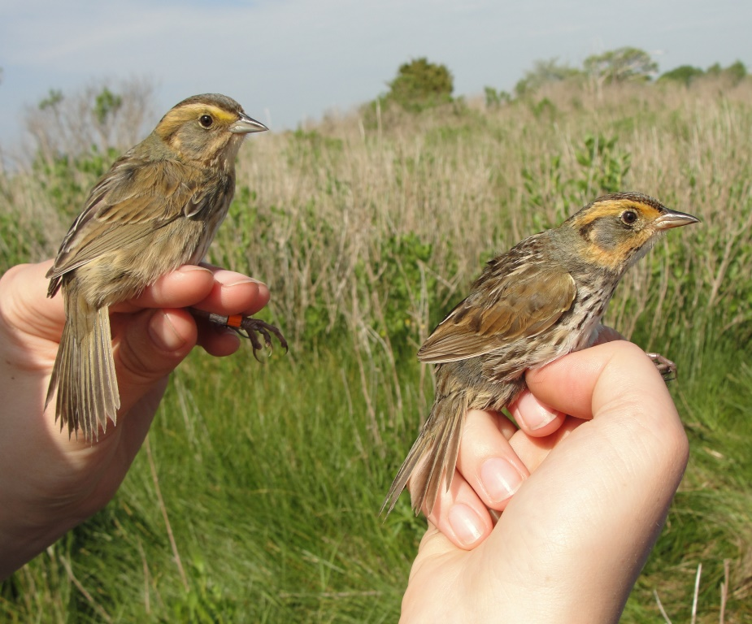

# Introducción al curso de BioEstadística

**Instructor:** Raymond L. Tremblay, PhD  

**Oficina**: NL 104			 		 
**Teléfono**: (787) 850-9497 (dept de biología)			  		
**Coreo electronico**: raymond.tremblay_at_upr_dot_edu	

***

### Horario de clase

**Presentación de temas y discusion**: M, J at 9:00-10:50am (80 mins) 
  (NOTE: Necesita traer su laptop!)   

**Hora de consulta con Estudiantes**:

 - L & W 1:00 - 4:00pm    

***

***
## Libro obligatorio:

Aquí dos sitios donde pueden conseguir el libro

- [Havel et al - Introductory Biological Statistics, 4 edition](https://www.amazon.com/Introductory-Biological-Statistics-Fourth-Havel/dp/1478638184/ref=sr_1_1?dchild=1&keywords=Introductory+Biological+Statistics&qid=1594323793&s=books&sr=1-1)

- [Havel et al - Introductory Biological Statistics, 4 edition](https://www.vitalsource.com/referral?term=9781478639282)


### Libros sugeridos       
- [Garrett Grolemund, Hadley Wickham. R for Data Science](https://r4ds.had.co.nz) En Ingles. 
- [Garrett Grolemund, Hadley Wickham. R para Ciencia de Datos](https://es.r4ds.hadley.nz) En Español.
- [Tremblay y Hernández-Serrano, 2018](https://www.amazon.com/Gráficas-Versátiles-ggplot2-Análisis-Spanish-ebook/dp/B07P2Q87H2/ref=sr_1_1?dchild=1&keywords=Graficas+versatiles&qid=1591404029&sr=8-1).

•	Artículos revisados por pares serán asignados para fomentar el método de utilizar estas herramientas en ciencias. 

***

### Programados
- [R- free statistical programming language](https://cran.r-project.org/) 
- [RStudio](https://rstudio.com)
- MSExcel, Numbers o Google Sheet 

***

### Prerequisitos    
- BIOL 3011-3013: Biología General y Laboratorio primer semestre 
- BIOL 3012-3014: Biología General y Laboratorio segundo semestre  

***
### Descripción del curso  
Estudio de diferentes técnicas estadísticas con aplicación a la Biología. Se enfatizará en la estadística descriptiva, análisis de regresiones y correlaciones, pruebas de hipótesis paramétricas y no paramétricas y análisis de frecuencias y varianza. Se hará énfasis en los supuestos de las pruebas, para seleccionar cual método estadístico es adecuado para el diseño experimental y la distribución de los datos. Además, se utilizarán las computadoras como mecanismos para facilitar y agilizar el cómputo y análisis estadístico.

***

### Objetivos del curso

Al finalizar el curso el estudiante podrá:

  1. Discutir la importancia de la estadística en los estudios biológicos.
  2. Ordenar datos biológicos en forma lógica.
  3. Diferenciar entre los diferentes tipos de datos biológicos.
  4. Diferenciar los diferentes tipos de escalas biológicas.
  5. Organizar y resumir datos en forma de tablas.
  6. Confeccionar polígonos de frecuencia.
  7. Creación de gráficas para demostrar patrones.
  8. Hacer uso adecuado de las diferentes estadísticas descriptivas.
  9. Describir las diferentes medidas de tendencia central.
 10. Basado en las medidas de tendencia central, inferir algunas de las características de la muestra bajo estudio.
  11. Determinar cuándo se deben calcular en forma grupal las medidas de tendencia central y dispersión de la muestra.
  12. Calcular probabilidades en situaciones específicas.
  13. Establecer la diferencia entre distribuciones discretas y continuas.
  14. Formular una hipótesis nula y alterna, adecuada para una situación en particular.
  15. Distinguir de acuerdo al tipo de datos recolectados cuándo utilizar pruebas paramétricas o pruebas no paramétricas.
  16. Evaluar los supuestos de las pruebas, tal como distribución normal e igualdad de varianza
  17. Evaluar la hipótesis nula y determinar el grado de significación de esta hipótesis haciendo uso de los diferentes análisis estadísticos.
  18. Confeccionar tablas de contingencia y establecer homogeneidad.
  19. Determinar cuándo se debe utilizar un análisis de regresión.
  20. Calcular coeficientes de regresión.
  21. Determinar intervalos de confianza y significación de una regresión.
  22. Calcular el coeficiente de correlación.
  23. Realizar comparaciones entre coeficientes de correlación simples.
  24. Desarrollar y analizar diseños experimentales utilizando técnicas de muestreo y recolección de datos apropiados.
  25. Determinar el error de muestra.
  26. Conocer y aplicar las pruebas básicas en estadísticas.
  27. Evaluar situaciones experimentales y poder desarrollar un diseño experimental adecuado y lógico para analizar el problema y llegar a conclusiones.
  28. Se hará énfasis en el uso de programados estadísticos para calcular los índices y probar hipótesis. Los programa de computadora puede incluir R.   

***

### Puntuacion: 
Este curso sera evaluado con los siguiente items:


|Item                    |     Valor              |
|:--------------------|-------------------:|
|Ejercicios práctico (4-6 total) |	  30%|     
|Pruebas cortas (una por semana) |    15%|
|Participación                   |    10%  |   
|Examen parcial # 1 (fecha TBD)	 |   15%  |
|Examen parcial # 2 (fecha TBD)  | 	 15%  |  
|Examen Final (fecha TBD)   	   |   10%  | 

NOTE: 
Escala de Notas: 

  * A (100 to 90) 
  * B (89 to 80) 
  * C (79 to 70) 
  * D (69 to 60) 
  * F (< 60) 
  
  ***
### Examenes:
Habrá dos examen parciales y un examen final *comprensivo*.  Estos exámenes serán de selecciones múltiples, pareo, respuesta corta, y análisis de conceptos.  El examen final será comprensivo (incluye todos los temas del semestre).  En este examen final se hará énfasis en la comprensión y aplicaciones de los supuestos de las pruebas y la capacidad de seleccionar la prueba correcta basado en el diseño experimental y los supuestos. 

```{r, eval=TRUE, echo=FALSE}
colorize <- function(x, color) {
  if (knitr::is_latex_output()) {
    sprintf("\\textcolor{%s}{%s}", color, x)
  } else if (knitr::is_html_output()) {
    sprintf("<span style='color: %s;'>%s</span>", color, 
      x)
  } else x
}

#`r colorize("some words in red", "red")`
```


`r colorize("Si el examen es vitrual es obligatorio tener la camera prendida durante **todo el exámen**. No es permitido usar el celular, Ud. tendrá que demostrar que el celular este detrás de uds antes de comenzar el examen", "red")` 


***
### Conferencias
En la clase las notas serán basado primeramente en la participación y algunas pruebas cortas.  Su participación es esencial para el aprendizaje (y para un ambiente positivo). Aprender *NO* es un proceso pasivo: los estudiantes deben participar haciendo preguntas y discutir el material con su conocimiento anterior (Su bagaje de conocimiento).  

***
### Ejercicios  
Los ejercicios están enfocado en la aplicación de conceptos y métodos discutido en la clase y solución de problemas. Se hará un esfuerza de usar datos reales para demostrar como trabajar con los análisis, tablas, y gráficos en R, RStudio y RMarkdown.  Típicamente, tendrán solamente una semana para hacer los ejercicios y entregarlos en formato *.html*.   

***
### Faltar a clase y examen:
*Los trabajos cortos y pruebas cortas NO se reponen*.  Si falta a la clase es su responsabilidad hablar con los otros estudiantes para saber lo que se discutió en la clase. Los examen se reponen solamente por una escusa valida.    

***
### Derechos de Estudiantes con Impedimentos

La UPR-Humacao cumple con las leyes ADA (Americans with Disabilities Act) y
51 (Servicios Educativos Integrales para Personas con Impedimentos) para garantizar
igualdad en el acceso a la educación y servicios. Estudiantes con impedimentos: informe al (la) profesor(a) de cada curso sobre sus necesidades especiales y/o de acomodo razonable para el curso, en la tarjeta de información de la primera semana y visite la Oficina de Servicios para la Población con Impedimentos (SERPI) a la brevedad posible. Se mantendrá la confidencialidad.

***
### Integridad academica
La Universidad de Puerto Rico promueve los más altos estándares de integridad
académica y científica. El Artículo 6.2 del Reglamento General de Estudiantes de la
Universidad de Puerto Rico (Certificación Núm. 13, 2009-2010, de la Junta de Síndicos)
establece que `r colorize("la deshonestidad académica incluye, pero no se limita a: acciones
fraudulentas, la obtención de notas o grados académicos valiéndose de falsas o
fraudulentas simulaciones, copiar total o parcialmente la labor académica de otra persona,
plagiar total o parcialmente el trabajo de otra persona, copiar total o parcialmente las
respuestas de otra persona a las preguntas de un examen, haciendo o consiguiendo que
otro tome en su nombre cualquier prueba o examen oral o escrito, así como la ayuda o
facilitación para que otra persona incurra en la referida conducta", "red")`. Cualquiera de estas
acciones estará sujeta a sanciones disciplinarias en conformidad con el procedimiento
disciplinario establecido en el Reglamento General de Estudiantes de la UPR vigente.

***
### Comentario sobre grabar videos y/o audio de las clases
Los estudiantes no PUEDEN grabar la clase por forma de video o audio sin el permiso del profesor.  Algunos estudiantes con necesidades especiales pueden hablar con el profesor para pedir el permiso.  La solicitud y aprobación del permiso tiene que ser por escrito (por ejemplo por email).  

***
### Espacio libre de acoso sexual
La Universidad de Puerto Rico prohíbe el descrimen por razón de sexo y género en todas sus modalidades, incluyendo el hostigamiento sexual. Según la Política Institucional contra el hostigamiento sexual, en la Universidad de Puerto Rico, Cert. Núm. 130 (2014-2015) de la Junta de Gobierno, si un(a) estudiante está siendo o fue afectado por conductas relacionadas a hostigamiento sexual, puede acudir ante la Oficina del Procurador Estudiantil, el Decanato de Estudiantes o el Coordinador de Cumplimiento con Título IX para una orientación o presentar una querella.

***
### Protocolo de la Clase
Los teléfonos mobiles serán apagado durante la clase.  Si necesita una calculadora traerla al salón. El teléfono no debería esta visible durante la clase al menos que pide permiso al instructor. Recuerda que que se usara computadoras portátiles en cada sesión.


<!--chapter:end:index.Rmd-->

# Introducción a la BioEstadística


```{r setup, include=FALSE}
knitr::opts_chunk$set(echo = TRUE, warning=FALSE, message = FALSE)
#knitr::opts_chunk$set(fig.width = 8, collapse = TRUE)
```


```{r, echo=FALSE, fig.show = "hold", out.width = "20%", fig.align = "default"}
knitr::include_graphics(c("Graficos/hex_ggversa.png", "Graficos/hex_error.png"))
```

```{r, eval=TRUE, echo=FALSE}
colorize <- function(x, color) {
  if (knitr::is_latex_output()) {
    sprintf("\\textcolor{%s}{%s}", color, x)
  } else if (knitr::is_html_output()) {
    sprintf("<span style='color: %s;'>%s</span>", color, 
      x)
  } else x
}

#`r colorize("some words in red", "red")`
```


## El libro de la clase

[Introductory Biological Statistics by Havel, Hampton and Meiners](https://www.amazon.com/Introductory-Biological-Statistics-Fourth-Havel/dp/1478638184/ref=sr_1_1?dchild=1&keywords=Introductory+Biological+Statistics&qid=1594323793&s=books&sr=1-1) Presione en el titulo para dirigirlo a Amazon. 

\pagebreak

***********
Fecha de la ultima revisión
```{r echo=FALSE}

Sys.Date()
```

## El proceso de investigación:

En este curso se estará enfatizando los análisis cuantitativo, esto es simplemente que analizamos los datos para llegar a una conclusión o interpretación sobre un tema. Naturalmente el proceso de seleccionar los datos puede ser un reto grande. Como uno selecciona los datos y el desarrollo de la investigación depende del diseño experimental. El diseño es el procedimiento de como uno recolecta los datos y como los vamos a analizar.  En este curso no estaremos evaluando métodos cualitativos de análisis. Este método cuanlitativo se refiere a evaluar principalmente opiniones, motivaciones o razones que influencia o impacta una situación.  En los métodos cuantitativos es necesario que los resultados sean de una forma o otra numéricos o categóricos.    

El proceso de investigación cuantitativo tiene múltiples pasos y podemos visualizar los pasos con un diagrama de flujo. 


```{r echo=FALSE, fig.cap="El proceso de Investigación", out.width = '60%'}
knitr::include_graphics("Graficos/Proceso_Investigacion.png")
```

***
## El primer paso: 

Todo comienza con una pregunta que te llama la intención. Esta pregunta proviene de haber observado tu ambiente. Puede que sea algo muy sencillo (por ejemplo: si la cantidad de estudiantes registrado en una sección impacta su rendimiento), o puede ser una pregunta más complicada (por ejemplo cual es el impacto de la lactancia sobre el desarrollo de las células, organos, la bioquímica y inteligencia de los niños).  

***
## El segundo paso

El próximo paso es desarrollar una hipótesis. Hay dos tipos de hipótesis, la hipótesis nula y la hipótesis alterna.  SIEMPRE uno comprueba la hipótesis NULA. La nula en la forma más sencilla, es que los grupos son iguales.  En otra palabra, si regresamos a la pregunta del primer paso, el rendimiento de los estudiantes es irrelevante de la cantidad de estudiantes en el salón en otra palabra es igual si hay pocos o muchos estudiantes. La hipótesis alterna es que "que la cantidad de estudiante en un salón impacta el rendimiento de los estudiantes".  Hay otros tipos de hipótesis nula que veremos más tarde. 


 * Si se **acepta** la hipótesis nula esto quiere decir que NO hay evidencia que los grupos sean diferentes. 
 * Si se **rechaza** la hipótesis nula es que hay evidencia que los dos grupos sean diferentes.
  
***

## El tercer paso:

Ahora hay que definir cual son las variables (datos) que se van a recolectar para evaluar la hipótesis.  Por ejemplo, cuantos grupos de estudiantes se seleccionará (2, 3, 10 salones?), La información se recolectará de cuantos estudiantes por salones (todos, la mitad, los que se aparece, o se seleccionará los estudiantes al azar, y si selecciona al azar cual es el mecanismo para seleccionarlos de esta forma).  Cual sera el indice de "rendimiento" (el entusiasmo de cada estudiante, la nota de un examen, de un trabajo, la nota final). Si se selecciona la nota final la información sera la nota numérica o alfabética (A, B, C, D, o F).  

Tomando la información anterior en consideración esto determinará el diseño experimental y las pruebas estadísticas que se deberá utiliza en el quinto paso. 

***

## El cuarto paso:

Recolectar los datos. Este se debe hacer de una forma sistemática, con la información bien apuntado y subir la información en una hoja de calculo (spreadsheet), como MS Excel, Google Sheet y Numbers.  Es mi sugerencia de **NUNCA** utilizar un programa como SPSS o JMP para poner los datos, ya que con estos programas si en el futuro se quiere tener acceso a los datos, y no tiene el programado o el programado ha cambiado de versión muchas veces los datos no se pueden leer (experiencia personal).  

***
## El quinto paso:

En este paso se hará los gráficos y los análisis estadísticos para evaluar la hipótesis.

***
## El sexto paso:

Aceptar o rechazar la hipótesis NULA. 

***
## Tipo de error de interpretación en estadística


El concepto básico en estadística, y probablemente el más difícil a captar es que en el mundo existe la *verdad*, pero cuando uno recolecta datos, no necesariamente los datos de la muestra representa la *verdad* o se acerca a la realidad.  Por consecuencia siempre hay una posibilidad de que los datos nos engaña, y si nos engaña estamos haciendo un error en rechazar o aceptar la hipótesis nula. Por consecuencia aun que uno tome todas las precauciones para tener un diseño experimental adecuado es posible que los datos no representan el universo de los datos (la verdad). 

Típicamente se rechaza la hipótesis nula si el valor de **p** es *menor* de 0.05 (p < 0.05). No es necesario que el valor sea menor de 0.05 para rechazar la hipótesis, en cierta condiciones el valor crítico pudiese ser mayor o menor de 0.05.  El valor de **p** represente la probabilidad de rechazar la hipótesis nula cuando se debería aceptar. Por consecuencia un valor de **p** = 0.05, significa que hay 5% de probabilidad de cometer un error en que rechazamos la hipótesis cuando se debería aceptar si repetimos la investigación 100 veces (una razón de 1:20). Entonces este representa un tipo de error posible, frecuentemente nominado tipo de error 1 o alfa. En otra palabras significa la probabilidad de rechazar la hipótesis cuando uno debería aceptar la hipótesis.  El otro tipo de error 2 o beta representa el error de aceptar la hipótesis nula cuando se debería haber rechazado. 

Los tres términos usado en estadística para de los dos tipos de errores

  + Tipo de error I, alfa, falso positivos
  + Tipo de error II, beta, falso negativos


Aquí un gráfico de los tipos de errores.  El gráfico representa los dos tipos de error y las dos condiciones en que no se hace un error.  

```{r echo=FALSE, fig.cap="El proceso de Investigación", out.width = '70%'}
knitr::include_graphics("Graficos/Hipothesis_Grid.png")
```
***


Ahora vamos a considerar un ejemplo básico de preguntas que se podría evaluar.  En este tiempo moderno un tipo de programas a la televisión bien común son los "Reality Shows".  Donde típicamente participa individuos supuestamente "normal" que no sean actores profesionales.  Aquí una lista de algunos de los "Reality Shows".     

### Consideramos los Reality Shows:

  + Kardashians
  + The Bachelorette
  + Survivors
  + Big Brother
  + Shark Tank
  + Skin Wars
  + Hell's Kitchen
  
###  Personalidad de las personas

Uno se podría preguntar que tipo de persona son seleccionado para participar en estos tipos de programas. Una hipótesis que son gente con tipo de personalidad bien específica o que sean personas "normales".  Una hipótesis es que son gente que cumple con unas características tal como *Trastorno de personalidad narcisista* (TPN): estas personas de vez en cuando caracterizado como megalomanía, demuestran un patrón a largo plazo de comportamiento anormal caracterizado por sentimientos exagerados de importancia personal, necesidad excesiva de admiración y falta de empatía.   
  

***
En un ejemplo de **Field et al. 2014** se demuestra la siguiente información sobre personas que solicitaron ser parte de uno de estos *Reality Show* que se llama *Big Brother*. 

  Una hipótesis es que los productores de estos *Reality Shows* seleccionan gente con características de TPN más a menudo que las gente que no tienen esta condición. Podemos comprobar esto recolectando datos de los que solicitan y los que fueron aceptado o no a participar en Big Brother (United Kingdom). Se entrevistaron 7662 personas para seleccionar 12, a cada uno se le hizo una prueba si tenia síntomas de TPN.  
  ***
  
|             | No TNP | TPN | Total |
|-------------|--------:|-----:|-------:|
| Seleccionado |      3 |   9 |    12 |
| Rechazado   |   6805 | 845 |  7650 |
| Total       |   6808 | 854 |  7662 |


Lo que uno observa es que la gente que son identificado que tiene características que cumple con **TPN** son más propenso a ser seleccionado para participar en el programa.  Si fuese que la selección hubiese sido al azar, uno esperaría solamente 1 o 2 personas al máximo con la condición de TPN, no 9 personas. Más tarde aprenderemos como calcular el valor esperado exacto. 

***


## Cuando que una hipótesis no es una hipótesis?

### Una hipótesis tiene que ser falsificable
  Esto quiere decir hay que tener un mecanismo para determinar la veracidad de una expresión.  Por ejemplo en las 4 expresiones siguiente hay 2 que no pueden ser falsificable. El concepto de hipótesis falsificable proviene del filósofo Karl Popper en su libro *Logik der Forschung* (1934), traducido al español **La lógica de la investigación científica**. Ahora toma el tiempo de evaluar las siguientes expresiones y trate de determinar si son hipótesis falsificable.  Desafortunademente, en el vocabulario popular el términos hipótesis y teoría se usan para describir cualquier pensamiento que la gente QUISIERA que se verídico. También se hace hipótesis o mejor dicho expresiones que no son falsificable. En nuestra sociedad donde cualquier persona se puede llamar un  especialista en un tema los comentarios no falsificable dominan y resulta en confusión para la gente. Es importante en ciencia que los temas, las áreas de investigación sean falsificable.   

***
### Ejercicio 1

+ Lin Manuel es el mejor actor del mundo
+ Todos la cisnes son blancos
+ El aumento en producción de semillas en una planta X aumenta con el tamaño poblacional de esta especie. 
+ Los Beatles vendieron más discos que cualquier otro grupo artístico. 


***

### Evaluación de las expresiones falsificables 

+ Lin Manuel es el mejor actor del mundo.

  Esta expresión no es una hipótesis falsificable porque el concepto de **mejor** es uno que es basado en un juicio individual. En otra palabra como se mide "**mejor**, y quien toma la decisión sobre este medida cualitativa. Si Ud. proviene de una cultura diferente la apreciación a la música cambia dramáticamente.  
  
  
+ Todos los cisnes son blancos

  El problema con esta expresión es la palabra "Todos".  En ningún momento aun que uno trate nunca se podría encontrar "Todos" los cisnes para evaluar sin son blancos o no. Por consecuencia no es falsificable. El concepto de "Todos" aquí asume que ni uno no sera evaluado, que es imposible.    


+ El aumento en producción de semillas en una planta X aumenta el tamaño poblacional de esta especie.

  Este es una hipótesis falsificable por que uno puede hacer un experimento para evaluar la relación que hay entre la producción de semillas y el tamaño poblacional de una especie de plantas. 
  
  
+ Los Beatles vendieron más discos que cualquier otro grupo artístico.

  Este es una hipótesis falsificable porque se puede contabilizar la cantidad de discos vendidos por los Beatles y otros grupos y determinar si es cierto o no. 

***
## Variables Independientes y Dependientes

 -La variable Independiente: es la variable que impacta (teóricamente) la variable dependiente (puede ser que no impacta el resultado).  Típicamente la **x** en un modelo es la variable independiente.  
 

 -La variable Dependiente: es la variable que recibe el efecto (teóricamente) de la variable independiente. La variable dependiente depende de la variable independiente.  Las **y's** en un modelo son las variables dependientes.  

***

## Niveles de mediciones

### Variables continuas

- Las variables con datos continuos:

  - Son valores que son contiguos o por lo menos existe o pudiese existir los valores intermedios. 
  
  - Ejemplo 1
   - la distancia entre el valor 13 y 15 es igual que 101 y 103, hay dos unidades que los separa. 
   - Aunque no se haya observado el 14 ni el 102 en un recogido de datos estos valores tienen potencialmente existir, en otra palabra estos valores son posibles en el universo de los datos. 
   
  - Ejemplo 2
    - Si se mide el tamaño de una célula biológicas en micrómetros (µm, $10^{-6}$).  Los valores intermedios y contiguos existen.  Por ejemplo, el largo de las células de *Escherichia coli* (*E. coli*) adulta son de 5.27µm en promedio con una desviación estándar de 0.87µm.  Esto significa que hay células de diferentes tamaños que van de menos de 2µm a más de 10µm de largo, y todos los valores pueden existir en este rango (ref: https://doi.org/10.1098/rsos.160417). Más tarde veremos como se puede llegar a la conclusión que las células varían entre  2µm a más de 10µm de largo, cuando uno tiene solamente el promedio y la desviación estándar.     
  
   Ejemplo 3
   - El número de hermanos, si por ejemplo yo pregunto a seis estudiantes cuantos hermanos tiene. Yo podría tener la siguiente lista. Aunque que no hubo ningún estudiante que tenga 1 hermano o 6 hermanos, es posible esta alternativas.  Note algo especial aquí es que nadie puede tener 2.4 hermanos, los valores tienen que ser números enteros. Cuando son conteos así, la distribución de los datos provienen de una distribución **Poisson** (veremos más tarde).    
    - Números de hermanos (0, 2, 5, 3, 8, 4)
        
### Variables Discretas

- Categórica o Discreta
  - Variables Nominales
      - Hombres y Mujeres
      - Omnívoro, vegetariano, vegano, carnívoro
          
- Variable Ordinal
  - Datos donde hay un orden en los valores
      - primero, segundo, tercero, etc. 
      - A, B, C, D, F (nota de estudiantes)
      - pequeño, mediano, grande
 
- Variable Binomial
  - Tiene solamente dos alternativas
      - Vivo o muerto
      - Vive en PR o No vive en PR
      - Esta embrazada o No esta embarazada
      - Tiene flores o no tiene flores

***


<!--chapter:end:02-Intro.Rmd-->

# Población y Muestreos


Fecha de la ultima revisión
```{r echo=FALSE}

Sys.Date()
```

```{r, eval=TRUE, echo=FALSE}
colorize <- function(x, color) {
  if (knitr::is_latex_output()) {
    sprintf("\\textcolor{%s}{%s}", color, x)
  } else if (knitr::is_html_output()) {
    sprintf("<span style='color: %s;'>%s</span>", color, 
      x)
  } else x
}

#`r colorize("some words in red", "red")`
```

```{r, echo=FALSE, fig.show = "hold", out.width = "20%", fig.align = "default"}
knitr::include_graphics(c("Graficos/hex_ggversa.png", "Graficos/hex_error.png"))
```


## ¿Qué es la estadística?

- Usando la definición de Snedecor y Cochran (1989) la estadística  son las técnicas para la "recolección, análisis y la habilidad de tener una conclusión de los datos".  

- También pudiésemos decir que la estadística es el estudio de la incertidumbre.  


## El concepto de población

Estos conceptos en estadística es sumamente diferente a la visión popular. En el concepto popular, social y geográfico una población es un conjunto de individuos de una especie o un concepto nacionalista (por ejemplos los Argentinos, o puertoriqueños). Típicamente se refiere a un grupo de individuos en un país, estado.  El concepto de población en estadística es diferente en que se refiere a **TODOS** en el universo.   Por consecuencia se fuésemos hacer un estudio de la **población** de puertoriqueños, tendríamos que incluir a todos ellos irrelevante de donde vive en el planeta.  Por consecuencia el concepto de población en estadística siempre se refiere a todos los individuos **sin que falte ni uno**.  Pudiésemos modificar nuestro estudio y decir que se va a estudiar una población más reducida. Por ejemplo la población de los puertoriqueños que viven en Puerto Rico en tal fecha.   Aun así seria imposible recolectar datos de cada uno, porque siempre habrá algún individuo que no vamos a poder recolectar los datos.  Por consecuencia el **concepto de población** es uno teórico.  

***
## El concepto de muestreo

Un muestreo es el subgrupo de la población, donde el objetivo es que este muestro sea representativo de la población.  Por ejemplo uno hace una recolección de información para saber cual es el nivel de estrés durante la pandemia de COVID-19 que tuvo los estudiantes universitarios. Seria un trabajo fenomenal recolectar datos sobre **TODOS** los estudiantes, pero su podría recolectar información sobre un subgrupo de ellos con la espera que los datos represente la población de estudiantes universitarios. 


***

## Griego y Latin 

Cuando uno quiere referir a la población/parámetro uno utiliza las letras del alfabeto griego y cuando nos referimos a un muestreo se usa la letra del alfabeto en latín.  

En la siguiente tabla se observa algunos de las variables que veremos en los módulos siguientes. En los próximos módulos regresaremos al significado de estos parámetros. 


```{r width}
library(gt)
library(knitr)
library(kableExtra)
df <- data.frame(variable = c("Promedio", "Mediana","Varianza", "Desviación Estandar", "Proporción"),
                 Griego = c("$$\\mu$$", "$$\\theta$$", "$$\\sigma_{ }^2$$","$$\\sigma$$", "$$p$$"),
                 Latin = c("$$\\bar{x}$$","$$M$$","$$s_{ }^2$$","$$s$$" ,"$$\\hat{p}$$"))

kable(df, escape=FALSE)

```

## La verdad versus un estimado

Cuando uno hace una investigación esta buscando la "verdad" en otra palabra estamos a la búsqueda de la información de la población. Desafortunadamente, raramente podemos tener TODA los datos, por consecuencia esperamos que la muestra sea una buena representación de la "verdad". Se espera que el promedio de la muestra se acerca a promedio del universo (la verdad). Matemáticamente uno lo puede escribir de la siguiente manera  $\overline{x}\approx\mu$. El gran problema en la ciencia es que nunca estamos 100% seguro de los trabajos de investigación porque nunca sabemos el $\mu$.  Este valor es casi siempre desconocido.  


## Muestreos al azar

Una de las áreas de estudio importante es saber organizar un estudio para responder a unas preguntas y que no sea sesgado (en ingles "bias"). Cuando se selecciona los datos necesitamos asegurar que los datos sean representativos de la población de interés, el $\mu$.   Si por ejemplo queremos saber el nivel de colesterol en la población de puertoriqueños que viven en Puerto Rico el diseño del muestreo tiene que tomar en cuenta ese grupo y la muestra tiene que representar ese grupo.  


Pregunta corta:  Explica el sesgo de los diferentes métodos, como se podría mejorar el muestreo?


 1.  ¿Cual de las siguientes alternativas es un mejor diseño experimental para deteminar el nivel de colestrerol de los puertoriqueños que viven en Puerto Rico?

>  + Se muestrea estudiantes de la clase de BioEstadística de la UPRH
>  + Se muestrea paciente que llegan a la oficina de un medico
>  + Se muestrea paciente que llegan a la sala de emergencia
>  + Se muestrea gente de multiples edades
>  + Se muestrea gente de multiples edades y distribuido por toda la isla
>
    
## Error de muestreo: Exactitud y Precisión

### La exactitud se refiere a cuan cerca es el valor medido al valor real de la variable de interes.  Cuan es el largo de la hoja 

### La precisión es un estimado de cuan cerca cada valor es uno del otro.  Hablando de la mismo individuo o variable.


```{r, echo=FALSE, fig.show = "hold", out.width = "100%", fig.align = "default"}
knitr::include_graphics(c("Graficos/Accuracy_precision.png"))
```

<!--chapter:end:03-Poblaciones_Muestras.Rmd-->

# Inferencias y Hipótesis
 
 


```{r, eval=TRUE, echo=FALSE}
colorize <- function(x, color) {
  if (knitr::is_latex_output()) {
    sprintf("\\textcolor{%s}{%s}", color, x)
  } else if (knitr::is_html_output()) {
    sprintf("<span style='color: %s;'>%s</span>", color, 
      x)
  } else x
}

#`r colorize("some words in red", "red")`


```

Fecha de la ultima revisión
```{r echo=FALSE}

Sys.Date()
```

```{r, echo=FALSE, fig.show = "hold", out.width = "20%", fig.align = "default"}
knitr::include_graphics(c("Graficos/hex_ggversa.png", "Graficos/hex_error.png"))
```


## Introducción

Los parámetros versus un muestreo:  

En algunos instancia se podría calcular el parámetro (por ejemplo el promedio) en otra palabra la población (todos los individuos sin que falte ni uno). Si es así tenemos todos los datos.   Por ejemplo si la población es cuantos médicos fueron infectado por el COVID-19 en un hospital especifico entre una fechas delimitada es probable que se puede conseguir la información de cada un los médicos, y se podría calcular la proporción de infectado.   

Pero cuando la población es más grande será necesario tener solamente una muestra de la población, si se usa un método al azar de recolección de los datos uno podría inferir cual es el estado basado en las estadística recolectada.  

## Ejemplo 1:
Por ejemplo en un estudio hecho por la Dra. Patricia Burrowes sobre la frecuencia de una infección común de los coquí ella evaluó la presencia del hongo sobre la piel de estos anfibios y encontró que los individuos en bosque nublado eran más frecuentemente infectado que los del bosque enano.   Ella y sus estudiantes muestrearon 299 individuos del bosque nublado y 130 del bosque enano, este esfuerzo fue muy grande. Encontrar los coqui en el campo no fácil y no hay manera de conseguir todas las pequeñas ranas. 


Costo potencial en aptitud evolutiva de *Batrachochytrium dendrobatidis* en *Eleutherodactylus coqui*, y comentarios sobre el riesgo de infección relacionado con el ambiente”. 
 
 El tamaño corporal (longitud hocico a cloaca) en adultos de *Eleutherodactylus coqui* infectados y no infectados con *Batrachochytrium dendrobatidis* (Bd) fue comparado para determinar el costo potencial en aptitud evolutiva de quitridiomicosis en poblaciones resistentes.  Los estudios fueron realizados en dos tipos de bosque a diferentes elevaciones, Bosque Nublado (650 m)  y Bosque Nublado Enano (850 m), en El Yunque, Puerto Rico.  Nuestros resultados demuestran que los machos infectados con Bd son significativamente más pequeños que los no infectados en el Bosque Nuboso, sin embargo no sucede lo mismo en el Bosque Nublado Enano.  Aunque las hembras que están infectadas por Bd también son más pequeñas que las no infectadas, este efecto no es estadísticamente significativo. La prevalencia de Bd y la probabilidad de infección por este hongo son significativamente más altas en el Bosque Nublado (44.1%) que en el Bosque Nublado Enano (20.7%) para ambos sexos.  Reportamos las diferencias en factores ambientales en estos dos tipos de bosque en Puerto Rico y discutimos las implicaciones en el crecimiento de Bd y la vulnerabilidad de las ranas a la infección por este patógeno. 
> 
> > Burrowes, P. A., A. V. Longo, and C. A. Rodríguez. 2008b. Potential fitness cost of *Batrachochytrium dendrobatidis* in *Eletherodactylus coqui*, and comments on environment-related risk of infection. Herpetotropicos 4:51-57.


## Ejemplo 2:

 En este segundo ejemplo se demuestra la eficiencia de dos vacunas para proteger del virus papiloma humano (VPH) que es una causa principal del cáncer del útero.  Hay un estimado que 25% de los adultos están infectado por HPV en un momento en su vida (Lowndes, doi: 10.1017/S0950268805005728) y que este cáncer es el segundo más común en el mundo (Bosch et al. 2002, doi: 10.1136/jcp.55.4.244). El siguiente ejemplo demuestra que las vacunas pueden ser muy efectiva. 


¿Qué tan eficaces son las vacunas contra el VPH?


Las vacunas contra el VPH son altamente eficaces para prevenir la infección por los tipos de VPH a los que atacan cuando las vacunas se administran antes de la exposición inicial al virus — es decir, antes de que el individuo tenga actividad sexual.


En los estudios que llevaron a la aprobación de Gardasil y de Cervarix, se encontró que estas vacunas proveen casi 100 % de protección contra infecciones persistentes del cuello uterino por los tipos 16 y 18 de VPH y contra los cambios celulares del cuello uterino que pueden causar estas infecciones persistentes. Gardasil 9 es tan eficaz como Gardasil para la prevención de las enfermedades causadas por los cuatro tipos de VPH (6, 11, 16 y 18), según reacciones similares de anticuerpos en participantes de estudios clínicos. Los estudios que llevaron a la aprobación de Gardasil 9 encontraron que es casi 100 % eficaz en la prevención de enfermedades cervicales (de cuello uterino), de vulva y de vagina causadas por los otros cinco tipos de VPH (31, 33, 45, 52 y 58) a los que se dirige (4). En un documento de posición de 2017, la Organización Mundial de la Salud declaró que las vacunas contra el VPH tienen una eficacia equivalente (5). Se ha encontrado que Cervarix provee protección parcial contra algunos otros tipos de VPH que pueden también causar cáncer pero que no están incluidos en la vacuna, un fenómeno llamado protección cruzada (6).
>

> > Fuente de información: <https://www.cancer.gov/espanol/cancer/causas-prevencion/riesgo/germenes-infecciosos/hoja-informativa-vacuna-vph>


## Inferencias en estadística

El concepto de inferencias en estadística se refiere al proceso de hacer conclusiones basado en un muestreo.  Por ejemplo en el primer ejemplo de la infección de hongos en los coquis, uno podría inferir que la proporción de ranas infectada será igual (o muy similar) en otros bosques nublados y enanos de Puerto Rico.  

## Hipótesis 

En la sección 6.2 del libro de Havel et al. leer y evaluar la tabla 6.2 para tener unos ejemplos de expresiones que no son una hipótesis y lo que es son.   NOTA: importante es el autor menciona aquí son las hipótesis alterna, en otra palabra los que uno piensa que podría ocurrir.   Pero esa no es la hipótesis que se prueba, lo que se prueba es la hipótesis NULA, Ho. Cuando se dice la hipótesis NULA es que no hay diferencias entre los grupos.  Vea la tabla 6.2 del libro para más ejemplos. 

Ejemplo de hipotesis Nula y Alterna

|  | NULA, Ho  | ALTERNA, Ha | No es una hipótesis  |
|----|-------:|:---------:|:-------------:|
| 1  | Tratamiento con la vacuna de Salk no tiene efecto sobre el riesgo de infección de polio en niños   |      El efecto de la vacuna Salk reduce el riesgo de infección de polio en los niños     | El polio es malo |
| 2  | Los Beatles no vendieron más discos que cualquier otros grupos de rock    |  Los Beatles vendieron más discos que cualquier otro grupo de rock         | La música de los Beatles es obsoleta       |


## El valor de p

El valor de *p* es la probabilidad de tener una estadística tan extrema si la hipótesis es verdad (en otra palabra la Ho es la correcta).  Uno podría decir que es un indice de la evidencia **CONTRA** la hipótesis NULA.  PERO NOTA es incorrecto decir que es la probabilidad que la Ho es correcta.  Uno dice si el valor de p>0.05 que no hay evidencia para rechazar la hipotesis nula (no dice que la hipotesis nula es correcta). 

Antes de comenzar a hacer el estudio se debería *a priori* tener una decisión cual sera el nivel de **alpha**, $\alpha$ para rechazar la hipótesis nula. Típicamente el valor critico de $\alpha$ es 0.05 o 5%.  Esto quiere decir que si uno repite el experimento 100 veces 5 veces la investigación nos va a dar una resultado equivocado. Que se rechaza la Ho cuando se debería aceptar. Esto una vez en cada 20 experimentos con las mismas condiciones.  En muchas ramas de investigación como la física el nivel de $\alpha$ es frecuentemente 0.01 o menos.  

## Los errores de tipo I y tipo II

Vea el modulo anterior.  


## El poder de las pruebas inferenciales y lo parámetros que lo influencia

Si la hipótesis nula es falsa es probable que se podría rechazar con cierta confianza. El complemento de beta,  $(1-\beta)$ es la prueba de poder.  La prueba de poder es la probabilidad de correctamente rechazar la hipótesis nula cuando es falsa. Para aclara la $\beta$ es la probabilidad de cometer un error tipo II. El **Poder** (the Power) es $(1-\beta)$ es la probabilidad de correctamente rechazar una hipótesis nula falsa.  

Evalúa el siguiente gráfico:

La prueba de poder es influenciada por tres propriedades.

+ El nivel del tipo de error I, o sea el $\alpha$.
+ La diferencia entre dos o más promedios que queremos evaluar.
+ El tamaño de muestra (n).

La linea vertical entrecortada representa el valor critico. El área gris obscuro representa el error $\alpha$, la probabilidad de rechazar la hipótesis nula cuando debería aceptar la hipótesis nula.  El área gris liviano representa el error $\beta$.   

```{r echo=FALSE, out.width = '50%'}
knitr::include_graphics("Graficos/6-1 Test Power Increase with Sample Size.jpg")
```

Una ilustración de como el $\alpha$ afecta el $\beta$"


<!--chapter:end:04-Inferencias_Hipótesis.Rmd-->

# Historia breve de la Estadística


```{r, eval=TRUE, echo=FALSE}
colorize <- function(x, color) {
  if (knitr::is_latex_output()) {
    sprintf("\\textcolor{%s}{%s}", color, x)
  } else if (knitr::is_html_output()) {
    sprintf("<span style='color: %s;'>%s</span>", color, 
      x)
  } else x
}

#`r colorize("some words in red", "red")`


```

Fecha de la ultima revisión
```{r echo=FALSE}
Sys.Date()
```


```{r, echo=FALSE, fig.show = "hold", out.width = "20%", fig.align = "default"}
knitr::include_graphics(c("Graficos/hex_ggversa.png", "Graficos/hex_error.png"))
```


***


```{r echo=FALSE, out.width= "45%", out.extra='style="float:right; padding:10px"'}
knitr::include_graphics("Graficos/The_Lady_Drinking_Tea.png")
```

## La dama degustando té

*Era una tarde de verano en Cambridge, Inglaterra, a finales de la década de 1920. Un grupo de profesores universitarios, sus esposas y algunos invitados estaban sentados alrededor de una mesa al aire libre para tomar el té de la tarde. Una de las mujeres insistía en que el té era diferente dependiendo de si el té se vertía en la leche o si la leche se vertía en el té. Las mentes científicas entre los hombres se burlaron de esto como una tontería. ¿Cual podría ser la diferencia? No podían concebir ninguna diferencia en la química de las mezclas que pudieran existir. Un hombre delgado y bajo, con anteojos y una barba de Vandyke que empezaba a ponerse gris, se abalanzó sobre el problema. "Probemos esta propuesta", dijo emocionado. Comenzó a esbozar un experimento en el que a la señora que insistía en que había una diferencia se le presentaría una secuencia de tazas de té, en algunas de las cuales se había vertido la leche en el té y en otras se había vertido el té en la taza de leche.*  Cuento del libro de "The Lady Tasting Tea: How Statitics Revolutionized Science in the Twentieth Century" por David Salslburg.   Traducido por la pagina de *Google Translation*.

Así comienza el libro de Salsburg (2001), para describir el comportamiento de los científicos cuando están animados de su tema y el deseo de resolver un enigma. Esa persona con barba de Vandyke era Ronald Aylmer Fisher (1890 -1962) es reconocido como responsable de la *estadística moderna* y una de las personas más importante en el área en el siglo 20. Su contribuciones han tenido un impacto en muchas áreas incluyendo la genética mendeliana y la selección natural.    

## Definición de lo que es la estadística

La estadística es un área de la ciencia de datos que utiliza valores numéricos para evaluar patrones y inferir situaciones futuras. Esta definición es sencilla, pero incluye muchos temas pero lo más importante es el componente de utilizar datos, resumiendo estos en indices o parámetros y utilizar estos para predecir/inferir el futuro.  La palabra estadística usado en el termino más o menos similar a su definición de hoy probablemente origina del alemán *Statistik* por Gottfried Achenwall (1749).  Donde el termino era para la descripción de datos del estado. Es solamente en 1791 por Sir John Sinclair que el termino comenzó a ser utilizado para la descripción de conjuntos de datos en general sin ser limitado a datos de un estado/pais.      


## Introducción a la Historía de la Estadística. 

Al principio en el siglo 18 el termino estadística era designar la colección información sobre la población y la economía de diferentes regiones o países.  En este periodo el objetivo era tabular la información, por ejemplo cuanta gente en un área, cuantas vacas hay, cuanta gente son parte de la nobleza.  

Por ejemplo uno de las primeras encuesta para determinar la estadística de una población fue hecha por John Gaunt (1662) titulado **Natural and Political Observations Made upon the Bills of Mortality** y puede encontrar el libro original aquí <http://www.neonatology.org/pdf/graunt.pdf>. En el libro expone que 1/3 parte de los niños antes de la edad de 16 mueren en Londres, Inglaterra. 

Aquí un extracto de una de estas tablas de las causas de enfermedades y mortandad en Londres en el año 1632.  Note que antes de este trabajo esto datos era bien raro y inexistente en la mayoría de las ciudades o países. 

Note algunos causas principales de mortandad, "Aged" (628), que la persona es de edad mayor, y "Abortive and Stillborn" que natimuerto (445).   Algunos se considerara raros hoy en día es morir de "grief" o sea de tristeza (11). 


```{r echo=FALSE, fig.cap="Gaunt Disease Tables", out.width = '70%'}
knitr::include_graphics("Graficos/Gaunt_Disease_Casualties_1632.png")
```

El otro componente importante de la estadística fue el desarrollo de las probabilidades en el siglo 17 y 18.  La gente le gustaba (como hoy en día) hacer apuestos y jugar cartas para dinero. Entonces mucha gente trataba de entender las diferentes probabilidades de ganar en estos juegos de azar para poder aumentar su probabilidad de ganar en estos juegos.  


***
## Gertrude Mary Cox
Trabajo presentado por Abimelys Anaya (estudiante de la Universidad de Puerto Rico en Humacao)

```{r, echo=FALSE, out.width= "45%", out.extra='style="float:right; padding:10px"'}
knitr::include_graphics("Graficos/COX/Gertrude_Cox.jpg")
```

**Gertrude Mary Cox** fue una destacada e importante estadística estadounidense. Nació el 13 de enero de 1900 en una granja cerca a Dayton, Iowa; y falleció a los 78 años, el 17 de octubre de 1978 en Durham, Carolina del Norte, a causa de leucemia. Compartiendo su hogar con 3 hermanos, se dice que su familia era muy unida, pero Cox era específicamente más cercana a su madre, Hemma, de quién heredó su pasión por ayudar a los demás. 

Cursó sus primeros estudios en la llamada Perry High School de la misma ciudad. Su amor por los deportes competitivos, hizo que formara parte del equipo de baloncesto en dicha escuela. No fue hasta 1925, luego de haber trabajado un tiempo como diaconisa de la Iglesia Metodista, que sintió interés en continuar estudios graduados en Iowa State College en Ames con concentración en matemáticas, debido a que su cargo en la iglesia requería un grado universitario. Logrando así en 1931, alcanzar una maestría en estadística. Desde ese mismo año hasta el 1933, terminó estudios de posgrado en estadística psicológica en la Universidad de California. Posteriormente, regresa a Iowa, donde participó en la inauguración del Laboratorio de Estadística y comienza su investigación en base al diseño experimental. Fue dicha carrera y el empeño depositado en la misma, quien le permitió dejar una gran aportación en procesos que utilizamos y que conocemos hoy día de esta rama de la ciencia.

***

### Primera dama en Estadística


En 1939, la nombraron profesora asistente en Iowa State College y, en 1940, dirigió el primer departamento de Estadística Experimental en la Escuela de Agricultura de la Universidad de Carolina del Norte. Esto la convirtió en la primera mujer directora del recinto. Además, Cox fue la primera mujer jefa del Instituto de Estadística de la Universidad de Carolina del Norte en 1944. Un año más tarde, participó como editora principal de la revista **Biometrics** durante 10 años, y fundó, en 1947, la **International Biometric Society**. Además, se convirtió en presidenta de la ASA (American Society of Anesthesiologists) en 1956.

```{r, echo=FALSE, fig.align='center', fig.width = 50, echo=FALSE}

knitr::include_graphics("Graficos/COX/Exten_Farm.jpg")

```


***

### Revista *Biometrics*
```{r, echo=FALSE, out.width= "45%", out.extra='style="float:right; padding:10px"'}

```

La revista^7^ fue publicada por la Sociedad Internacional de Biometría en 1945, originalmente bajo el título de *Biometrics Bulletin*. Sin embargo, en 1947, su nombre fue acortado. Su objetivo principal consiste en publicar artículos sobre la aplicación de la estadística y las matemáticas a las ciencias biológicas. Según una encuesta realizada por especialistas en BioEstadística, obtuvo el quinto lugar entre 40 revistas existentes de estadítica.


***

### Libro: Diseños Experimentales

¿Qué es el diseño experimental? Este consiste en la identificación y cuantificación de las causas de un efecto provocado sobre otra variable de interés durante un estudio experimental.

En 1950, Gertrude M. Cox junto a William Cochran, publicó *Experimental Design*, libro utilizado por años, y que actualmente permanece accesible, como primera referencia para el diseño experimental. En este, podemos encontrar la expansión de sus notas mimeografiadas de las clases de diseño que brindaba a sus estudiantes. El libro enfatiza tres principios: (1) los estadísticos deben participar en la investigación desde las etapas de planificación, es decir, primeros pasos, el establecimiento de los objetivos del experimento y la planificación del análisis; (2) aleatorizar todo lo que se pueda aleatorizar; y (3) utilizar el bloqueo, siempre que sea posible, para reducir los efectos de variabilidad, donde los bloques son grupos homogéneos de unidades experimentales.

Según menciona Sharon L. Lohr en un artículo para ¨Notices of the American Mathematical Society¨^4^, en él ¨podemos encontrar planos detallados para el cuadrado latino, factorial, factorial fraccional, parcela dividida, celosía, bloque incompleto balanceado y otros diseños. Cada descripción de diseño comenzaba con ejemplos, seguida de una discusión sobre cuándo el diseño era adecuado e instrucciones detalladas de cómo realizar la aleatorización. Luego, vino uno o más estudios de casos detallados, que muestran por qué ese diseño había sido elegido para cada experimento y cómo había sido aleatorizado, tomando al lector paso a paso a través de los cálculos necesarios para construir el análisis de varianza y estimar los errores estándar para diferencias de medias de tratamiento. Los autores también discutieron cómo estimar la eficiencia del diseño en relación con un diseño completamente aleatorio y cómo hacer los cálculos para la estructura desequilibrada que resultó cuando uno o más ejecuciones experimentales tenían datos faltantes¨.

***

### Últimas aportaciones

Gertrude M. Cox se retiró en 1960 del Instituto de Estadística, para dirigir la División de Investigación Estadística del RTI (Research Triangle Institute), donde fue asesora desde el 1965. Finalmente, se dedicó a distribuir sus conocimientos en estadística al exterior. Realizó 23 viajes internacionales, entre los cuales se encontraban los países de Egipto y Tailandia. 

> Otros reconocimientos 

* 1944 - Socia de la Asociación Americana de Estadísticas y del Instituto de Estadísticas Matemáticas.

* 1949 - Primera mujer electa en el Instituto Internacional de Estadística.

* 1957 - Socia de honor de ¨Royal Statistical Society¨.

* 1959 - Recibe premio O. Max Gardner por parte de la Universidad de Carolina del Norte por su "contribución al bienestar de la raza humana ".

* 1975 - Electa en la Academia Nacional de Ciencias.

* 1977 - La universidad de Carolina del Norte, creó una beca de investigación de $200,000 en su honor. 

* Defendió el uso de computadoras electrónicas para el trabajo estadístico. 

***

Sin lugar a dudas, fue pionera de lo que actualmente nos permite, de manera fácil, realizar investigaciones cuantitativas y que son, y han sido desde entonces, de suma importancia para nuestro entendimiento en las ciencias biológicas.

***

### Referencias

^1^ Anderson, R.L. (1900-1978). *Gertrude Mary Cox*. Recuperado el 13 de septiembre de 2020, de http://www.nasonline.org/publications/biographical-memoirs/memoir-pdfs/cox-gertrude.pdf

^2^ *Biometrics (journal)*. (2020). Recuperado el 13 de septiembre de 2020, de https://en.wikipedia.org/wiki/Biometrics_(journal)

^3^ *Gertrude Cox*. (2020). Recuperado el 13 de septiembre de 2020, de https://es.wikipedia.org/wiki/Gertrude_Cox

^4^ Lohr, S.L. (2019). *Gertrude M. Cox and Statistical Design*. Recuperado el 13 de septiembre de 2020, de https://www.ams.org/journals/notices/201903/rnoti-p317.pdf

^5^ Mujeres con ciencia. (2014). *Gertrude Cox, la primera dama de la Estadística*. Recuperado el 13 de septiembre de 2020, de https://mujeresconciencia.com/2014/06/09/gertrude-cox-la-primera-dama-de-la-estadistica/

^6^ Universidad de Colima. (2020). *Diseño experimental*. Recuperado el 13 de septiembre de 2020, de https://recursos.ucol.mx/tesis/diseno_experimental.php

^7^ Welsh, A., Ghosh, D., Brewer, M. y Molenberghs, G. (1999-2020). *Biometrics, Journal of the International Biometric Society*. Recuperado el 13 de septiembre de 2020, de https://onlinelibrary.wiley.com/journal/15410420


***

## Algunos personas importantes

  1. Trabajo grupo de 2: 10 puntos. PARTE de las destrezas que estará aprendiendo en adición de conocer un estadístico es como preparar un documento en .Rmd para hacer una documento.  Se someterá tanto el documento en .html y .Rmd en MSTeam.  
      Se seleccionará uno de las personas abajo y se hará una pequeña biografía sobre esta persona (3 paginas). Debe incluir diferentes componentes.
   2. Información personal de la persona
   3. Su carrera de estudio
   4. Su aportación a la estadística
      - Cual método estadístico desarrolló (seleccioné uno para explicar, aunque puede mencionar múltiples).
      - Por qué este método fue innovador
      -  Cuantos papers a publicado (busca en Google scholar)
      - Pon una formulas matemáticas con explicaciones de una de las aportaciones en estadística.
       - fotos/pintura de la persona
        - literatura citada
  5. El trabajo debería ser montado en .Rmd
   

    
    
## Lista de estadísticos  

 - Florence Nightingale
 - **Gertrude Mary Cox**
 - Enid Charles
 - Grace Wahba
 - Ronald Fisher
 - Reverand Thomas Bayes
 - John Tukey
 - Karl Pearson
 - Carl Gauss
 - Bradley Efron
 - Andrey Nikolayevich Kolmogorov
 - Pierre-Simon Laplace 
 - George Box
 - Francis Galton
 - Andrey Markov
 - Samuel S. Wilks
 


## Formula


Vea este enlace.  

https://rpruim.github.io/s341/S19/from-class/MathinRmd.html

Localizado en el centro y una linea parte
$$\sum_{n=1}^{10} n^2$$


Localizado en la misma linea $\sum_{n=1}^{10} n^2$


<!--chapter:end:05_Historia_Breve.Rmd-->


Fecha de la ultima revisión
```{r echo=FALSE}

Sys.Date()
```

```{r, echo=FALSE, fig.show = "hold", out.width = "20%", fig.align = "default"}
knitr::include_graphics(c("Graficos/hex_ggversa.png", "Graficos/hex_error.png"))
```


```{r, eval=TRUE, echo=FALSE}
colorize <- function(x, color) {
  if (knitr::is_latex_output()) {
    sprintf("\\textcolor{%s}{%s}", color, x)
  } else if (knitr::is_html_output()) {
    sprintf("<span style='color: %s;'>%s</span>", color, 
      x)
  } else x
}

#`r colorize("some words in red", "red")`
```

```{r}
library(ggplot2)
library(Hmisc)
library(gridExtra) # Un paquete para organizar las figuras de ggplot2
```

***

# Medida de tendencia central

La medidas de tendencia central se llaman así, porque el valor indica la distribución de los datos y los indices tiende a estar en **el centro** de la distribución.  Hay por lo menos 16 tipos de medidas de tendencias centrales <https://en.wikipedia.org/wiki/Central_tendency>. En este curso estaremos solamente mencionado 3 de estas medidas.

  - El promedio a arithmetico 
  - La mediana
  - La moda


***

## Calculando el promedio

Aquí creamos una lista de datos con la función **c( )** y con la función **mean** podemos calcular el promedio.   El promedio es la suma de los valores divido por la cantidad de valores en la lista.  
$$\bar{x}=\frac{\sum_{i=1}^{n}x_i}n$$


```{r}
x=c(0,1,2,3,4,5,6,7,8,9,10)

mean(x)

```

***

## Cuando el promedio no esta localizado en el centro

Digamos que yo tengo la cantidad de semillas producida por 11 plantas, la primera no produjo semillas, la segunda 2 semillas y subsiguientemente hasta la ultima que tuvo una producción de 1000 semillas. Nota que en este caso el promedio no se encuentra el el centro de los datos, por consecuencia NO es un buen indicador de la tendencia central de los datos.  Cuando esto ocurre uno no debería usar el promedio para describir la tendencia central de los datos.

```{r}
x=c(0,1,2,3,4,5,6,7,8,9,1000)
sum(x)/length(x)
mean(x)

```

***

## La mediana

## Con **n** impares
Cuando el promedio no es indice adecuado de la tendencia central tenemos dos alternativas, la mediana y la moda.  La mediana es el valor en el centro después de haber organizado los datos del más pequeño al más grande.  

$$Mediana\ =\frac{\left({x}_{n+1}\right)^{th}}{2}$$
Donde **n** es la cantidad de valores en orden del más pequeño al grande. Por consecuencia se selecciona el valor en el centro de todos los valores. Lo que la función de mediana hace es poner los valores en orden y después determina cual es el valor en el centro.  Aquí para demostrar los que hace la función 1) creo un una lista de valores, 2) pongo los datos en orden 3) y mirando los valores en orden vemos que el valor **6** es el valor en el centro.   Pero este paso no es necesario ya que la función **median** lo hace automaticamente.  


```{r}
b=c(247,0,3,43626,26,23,1,2,4,5,24,6,7)
b=sort(b)
length(b)
median(b)
```


## Con **n** pares

Cuando hay una cantidad de datos pares, los dos valores en el centro son sumado y el promedio es calculado. 

$$Mediana\ =\frac{1}{2}* (\frac{\left({x}_{n+1}\right)^{th}}{2}+\frac{\left({x}_{n+1}\right)^{th}}{2})$$
En el siguiente caso tanto el valor de 6 y 7 se encuentra en el centro, por consecuencia la mediana es el promedio de estos valores.  
```{r}
b=c(247,0,3,43626,26,23,1,2,4,5,24,6,7,7)
b=sort(b)
b
median(b)
```

***

## La moda

La moda es el valor más común. Parta encontrar la moda, correr una función ya que no existe ningun paquete que tiene esa alternativa.

```{r}

# Create mode() function to calculate mode
mode <- function(x, na.rm = FALSE) {
  
  if(na.rm){ #if na.rm is TRUE, remove NA values from input x
    x = x[!is.na(x)]
  }

  val <- unique(x)
  return(val[which.max(tabulate(match(x, val)))])
}

```


Ya pueden ahora usar la **mode** para encontrar la moda del conjunto de datos. Lo que vemos es que el valor de **7** es el más comun en la lista de datos.   


```{r, mode}
mode(b)
```

***

## Cuando es que el promedio, mediana y moda son iguales?


Los tres valores de tendencia central son iguales cuando la distribución es normal, conocida también como en forma de campana. Aquí preparo un lista de datos con distribución normal, y evaluamos donde están los tres valores de tendencia central.  Se usa la función **rpois**, para crear un conjunto de datos al azar con 100000, datos, un promedio de 100.   

```{r, rpois}
df=rpois(5000, 100)
df1=data.frame(df)
head(df1, n=2)
```


Lo que uno observa es que los tres valores son muy cercano uno del otro.   

```{r, parameter poisson}

#mean(df1$df)
#median(df1$df)
#mode(df1$df)
```

Podemos visualizar estos datos usamos dos gráfico, En el gráfico de la izquierda se ve una distribución normal con las tres lineas (promedio, mediana y moda).  En el gráfico de la derecha se observa la misma información pero solamente los valores entre 96 y 101. Se observa que la mediana y el promedio son igual y la moda varia un poco, se encuentra donde la barra es más alta.    Se observa que los tres valores son cerca del centro.  


```{r, visual}

pro=mean(df1$df)
med=median(df1$df)
mod99=mode(df1$df)
mod99
```

```{r, g1}
a=ggplot(df1, aes(df))+
  geom_histogram(fill="orange", colour="white", binwidth = 1)+
  geom_vline(aes(xintercept = pro), colour="red")+
  geom_vline(aes(xintercept = med), colour="blue")+
  geom_vline(aes(xintercept = mod99), colour="green")+
  theme(legend.position = "none")
a
```


```{r, g2}
b=ggplot(df1, aes(df))+
  geom_histogram(fill="orange", colour="white", binwidth = 1)+
  geom_vline(aes(xintercept = pro), colour="red")+
  geom_vline(aes(xintercept = med), colour="blue")+
  geom_vline(aes(xintercept = mod99), colour="green")+
  xlim(94,105)+
  theme(legend.position = "none")

```

```{r, together, warning=FALSE, message=FALSE }
gridExtra::grid.arrange(a,b, ncol=1)
```

***

## Distribución cuando los tres valores de tendencia centrtal no son iguales. 

En estas distribuciones uno observa que hay exceso de vaslores pequeños o grande.  Esto resulta en que los tres indices de tendencias centrales no se encuentra cerca uno del otro. 

```{r, rbeta, warning=FALSE, message=FALSE }
library(tidyverse)
dfb1=round(rbeta(10000, 3,1, ncp = 0),3)
dfb1=tibble(dfb1)
#head(dfb)
df2= round(rbeta(10000, 1,3, ncp = 0),3)
df2=tibble(df2)
#head(df2)
```


1. ¿Cual es la linea de promedio, moda y mediana en cada gráfico? 

```{r, visual beta, warning=FALSE, message=FALSE }
mea=mean(dfb1$dfb1)
med=median(dfb1$dfb1)
mod=statip::mfv1(dfb1$dfb1)

meab=mean(df2$df2)
medb=median(df2$df2)
modb=statip::mfv1(df2$df2)


SesgadoDerecho=ggplot(dfb1, aes(dfb1))+
  geom_histogram(fill="orange", colour="white")+
  geom_vline(aes(xintercept = mea), colour="red")+
  geom_vline(aes(xintercept = med), colour="blue")+
  geom_vline(aes(xintercept = mod), colour="green")+
  theme(legend.position = "none")

SesgadoIzquierda=ggplot(df2, aes(df2))+
  geom_histogram(fill="orange", colour="white")+
  geom_vline(aes(xintercept = meab), colour="red")+
  geom_vline(aes(xintercept = medb), colour="blue")+
  geom_vline(aes(xintercept = modb), colour="green")+
  theme(legend.position = "none")

SesgadoDerecho
SesgadoIzquierda

library(ggpubr)
#ggarrange(c,d, nrow=2, ncol=1)

library(grid)
#grid.arrange(rectGrob(), rectGrob())
#marrangeGrob(c,d, nrow=2)

```


```{r}
#c
#d
#library(scater)
#multiplot(c,d, ncol=2)
```


***

## Variables binomial

En el siguiente ejemplo podemos ver claramente que las medidas de tendencias central no son adecuada.

Primero producimos un conjunto de datos que tiene solamente dos alternativas 0 y 1.  Para facilitar los datos e imaginar lo que quiere decir estos datos que cuando es un 0 la persona no tiene hijos y cuando es un 1 tiene hijos. 


```{r, rbinom}
dfBin=replicate(10000,rbinom(length(.6), size=1,prob =0.6))
dfBin=data.frame(dfBin)
head(dfBin)
```
Ahora vamos a producir el gráfico. Lo que uno observa es que el promedio esta en el centro cerca de .6, pero no hay ningún dato cerca del promedio.  El promedio no representa la "tendencia central" de la distribución.  

```{r, visual rbinomial}
mea=mean(dfBin$dfBin)
med=median(dfBin$dfBin)
mod=mode(dfBin$dfBin)
mea


ggplot(dfBin, aes(dfBin))+
  geom_histogram(fill="orange", colour="white")+
  geom_vline(aes(xintercept = mea), colour="red")+
  geom_vline(aes(xintercept = med), colour="blue")+
  geom_vline(aes(xintercept = mod), colour="green")+
  theme(legend.position = "none")
```


***

### Preguntas de practica sobre medidas de tendencias central.


1. ¿Cuando es que el promedio, mediana y moda son iguales?

2. ¿Cual es la moda de esta conjunto de datos?

```{r}
x=c(3,5,2,3,6,7,8,9, 1)
x
```


3. ¿Cual es la mediana de este conjunto de datos? Eso son la cantidad de cursos 


```{r}
y=c(3,5,2,3,6,7,8,9, 1)
y
```


4. ¿Cual es la mediana de este conjunto de datos?


```{r}
y=c(3,5,2,3,6,7,8,9, 1, 6)
sort(y)
```

5. Para describir la medida central de este conjunto de datos, se debería usar el promedio, mediana o moda?

```{r}
z=c(1,2,2,3,4,10, 100, 1000)
z

```


6. ¿Cual es la moda de las siguientes datos.   Número de hijos que tienen estudiantes universitarios

```{r}
Numero_hijos=c(1,0,0,0,0,0,0,0,0,0,1,3)

Numero_hijos
```


<!--chapter:end:06-Medidas_de_tendencias_centrales.Rmd-->

# Medidas_de_dispersión

```{r echo=FALSE}

Sys.Date()
```

```{r, echo=FALSE, fig.show = "hold", out.width = "20%", fig.align = "default"}
knitr::include_graphics(c("Graficos/hex_ggversa.png", "Graficos/hex_error.png"))
```


```{r, ch1}


library(ggplot2)
library(Hmisc)
library(gridExtra) # Un paquete para organizar las figuras de ggplot2
library(gt)
library(tidyverse)
```


***

## Qué es la dispersión en estadística


Las medidas o indices de dispersión, son indicadores de cuan variable los datos son uno del otro. Si todos los valores tienen el mismo valor no hay dispersión.  Hay múltiples indices de dispersión vamos a evaluar solamente algunos de estos indices, para más información pueden ir al siguiente enlace <https://en.wikipedia.org/wiki/Statistical_dispersion>.  

Los indices que estaremos estudiando son los siguientes

  - el rango
  - la varianza
  - la desviación estándar
  - el error estándar
  - el rango intercuartil
  - el intervalo de confianza de 95%
 
***
 
## Vizualizando la dispersión 
  
Primero miramos un gráfico donde tenemos datos donde el promedio es igual pero la dispersiones son diferentes. Lo que uno observa es que en la distribución azul los datos son más similares uno al otro y la distribución roja los valores son más diferentes.  En el primer conjunto de datos se usa 500 valores con un promedio de 100 y una desviación estándar de 10, en el segundo se produce un conjunto de datos de 500 valores con un promedio de 100 y una desviación estándar de 30.


```{r, ch2}

set.seed(8690) # esto es para que los valores se queda igual a cada vez que se corre el analisis
a=rnorm(5000, 100, 10) # la función para generar datos al azar con una distribución normal

dfa=data.frame(a)
head(dfa, n=10)
 # r is for random
 # norm =distribución normal
#a
b=rnorm(500, 100, 50)
dfb=data.frame(b)
```


```{r, ch3, out.width = '60%'}
library(ggplot2)

ggplot(dfa, aes(a))+
  geom_density(fill="blue")+
  geom_density(dfb, mapping=aes(b,fill="red", alpha=.5 ))+
  theme(legend.position = "none") +
  geom_vline(aes(xintercept = 100, colour="red"))
ggsave("Graficos/dispersion.png")
```

```{r, ch4, echo=FALSE, fig.align='center', out.width = '60%'}
knitr::include_graphics("Graficos/dispersion.png")
```


***

## El rango

El rango son los valores mínimo y valor máximo de un conjunto de datos.  Se usa la función **range()**.  Usamos los dos conjuntos de datos ya creado anteriormente para visualizar los rangos de la distribuciones de los gráficos. Lo que uno observa es que el valor mínimo del primer conjunto de datos es 59.17 y el máximo es 137.12.  Para el segundo conjunto de datos el valor mínimo es 1.86 y el máximo es 203.88.  


```{r, ch5}
range(dfa$a)
range(dfb$b)

```


## Mínimo y máximo

El rango de una distribución es lo mismo que el minimo y maximo


```{r}
min(dfa$a)
max(dfa$a)

min(dfa$b)
max(dfa$b)

```


***

## Ejemplo de la clase

### Cual es el rango de la Edad de los padres de los Estudiantes


```{r, ch6}
Edad=c(57,50,43,39,54,50,59,49, 57,51,43,47)
Edad
Edad_df=data.frame(Edad)
Edad_df
range(Edad)
range(Edad_df$Edad)
```


```{r}
Dist_V=c(14, 71, 16, 43, 32, 17.1, 11, 53, 16.2, 47, 18.2, 39, 9, 16.2)

df=data.frame(Dist_V) # para poner los datos un un data frame

df
```

Caluclar la varianza

```{r}
var(df$Dist_V)
```


Desviación estandard

```{r}
sd(df$Dist_V)
```


Error estandard

```{r}
error_e= sd(df$Dist_V)/sqrt(length(df$Dist_V))
error_e
```


95% de la distribución


```{r}
Limite_inferior_a=mean(df$Dist_V)-(error_e*1.96)

Limite_superior_a=mean(df$Dist_V)+(error_e*1.96)


Limite_inferior_a
Limite_superior_a
```


***

## La varianza

Los pasos para calcular la varianza son los siguientes

+ tener un conjunto de datos, aquí lo llamamos **Data**
+ convertir esta lista en un data frame 
+ Calcular el promedio de los datos
+ restar el promedio de cada valor y cuadralos
+ Sumar y restas de **n-1**, done **n** es la cantidad de datos
+ el numerador se llama la **suma de los cuadrados** = SS


$${ s }^{ 2 }=\frac { \sum { { ({ x }_{ i }-\bar { x }  })^{ 2 } }  }{ n-1 }=\frac{SS}{n-1}$$

```{r, ch7}
library(tidyverse)
Data=c(1,2,3,4,5,6)
Data_df=data.frame(Data)
Data_df
Data_df$mean_Data=mean(Data)   # Aqui se añade el promedio a cada fila
Data_df
Data_df$Diff=Data_df$Data-Data_df$mean_Data 
          # Calcular la diferencia entre el promedio y el valor x
sum(Data_df$Diff) # si los valores no se cuadra la suma sera zero.

Data_df$SS=(Data_df$Data-Data_df$mean_Data)^2 # SS para la suma de los cuadrados 
Data_df
sum(Data_df$SS)
```
 
###  Este indice se llama la desviación del promedio que es la suma de los cuadrados


***

## Calcular la varianza con **var()**

Ahora la manera fácil de hacer los análisis, usar la función **var**, y no hay que hacer ninguno de los pasos anteriores.   Pero es importante que sepa como es el procedimiento de calcular la varianza. Nota que la varianza es un indice de la diferencia entre el promedio y cada valor.  El otro paso es que los valores tienen que estar cuadrada las diferencias sino la suma sera de cero.   Se usa el variancas cuando tenemos confianzas que los datos provienen de una distribución normal y que los datos que uno tiene no están sesgados.   

```{r, ch8}
var(Data)
```

*** 


## La desviación estandar

La varianza es un indice que no esta en la misma unidad que los valores recolectado, por ejemplo si se recolecta los datos en centímetros, la varianza es en centímetros cuadrados. Por consecuencia no es necesariamente el mejor para describir la dispersión. Entonces hay que sacar la raíz cuadra de la varianza. La desviación estándar es un indice que se usa para describir la dispersión de una población, en otra palabra cuan diferentes son los datos uno del otro.   Se usa el desviación estándar cuando tenemos confianzas que los datos provienen de una distribución normal y que los datos que uno tiene no están sesgados.   
  
  $${ s }=\sqrt { \frac { \sum { { ({ x }_{ i }-\bar { x }  })^{ 2 } }  }{ n-1 }  }$$ 
  o más sencillo
  
  $$s=\sqrt{s^2}$$
  
la función **sd**, "standard deviation" es sumamente facil de calcular en R. 


```{r, ch9}
sd(Data_df$Data)  # deviación estandard
```

***

## El rango intertcuartil.

La función básica es **quantile** si lo dejamos sin más instrucción calcula los siguientes probabilidades 0%, 25%, 50% (mediana), 75%, 100%.  Pero si uno quiere los valores que se encuentra en una posición especifica hay que usar **type =1** como se ve en el segundo ejemplo.  Hay 9 tipos de cuantiles con esta función, estos se encuentra definido en RStudio. Añade **quantile** en el artea de **help** y vera las otras alternativas.   

```{r, ch10}
quantile(Data) # la función básica (0%, 25%, 50% (mediana), 75%, 100%)

# Seleccionar los cuantiles específicos.
quantile(Data, probs = c(0.025, 0.25, 0.50,.75, .975))   


```


Para explicar estos conceptos mejor visualizamos los datos 


| i  | x[i]  | Mediana | Cuartiles   |
|----|-------:|:---------:|:-------------:|
| 1  | 03    |           |  |
| 2  | 19     |           |          |
| 3  | 27      |         |             |
| 4  | 33    |         |    Q1=33         |
| 5  | 52    |         |             |
| 6  | 60    |         |            |
| 7  | 77    |         |             |
| 8  | 87    |  Q2=87       |             |
| 9  | 99    |       |             |
| 10 | 101   |         |             |
| 11 | 122   |         |             |
| 12 | 137   |         | Q3=137    |
| 13 | 140   |         |             |
| 14 | 142   |         |             |
| 15 | 150   |         |             |

Ahora usamos la función **quantile** con el type=1 de calcular los cuartiles y ver si tenemos los mismos resultados.

```{r, ch11}

dat=c(3,19,27,33,52,60,77,87,99,101,122,137,140,142,150)

quantile(dat, type =1)

sd(dat)

```


***

## El error estandard

El termino correcto es el *error de las desviación estándar* pero típicamente acortado a *error estándar*. El indice de error estándar es para describir cual es la posible dispersión del promedio.  En otra palabra cuan confiado estamos con el estimado del promedio.  Más grande el error estándar menos confiado estamos con el promedio.   Se usa el error estándar cuando tenemos confianzas que los datos provienen de una distribución normal y que los datos que uno tiene no están sesgados.   

La formula de error estándar es la siguiente usando la desviación estándar

$$s_{\overline{x}}=\frac{s}{\sqrt{n}}$$

o usando la varianza, donde la **n** es la cantidad de datos

$$s_{\overline{x}}=\sqrt{\frac{s^2}{n}}$$

Ahora si usamos los datos enseñado al principio del modulo. Calculamos error estándar de ambas distribución.  er= error estándar. No hay función en R para calcular el error estándar, por consecuencia hay que crear la formula para calcular el indice.  Vemos que cuando hay más dispersión el error estándar es más grande.  

```{r, ch12}
length(dfa$a)
es_a= sd(dfa$a)/sqrt(length(dfa$a))

es_b= sd(dfb$b)/sqrt(length(dfb$b))

es_a
es_b
```

***

## El intervalo de confianza de 95% del promedio

Ya que hemos calculado el error estándar podemos calcular la dispersión de los promedios. Esto quiere decir que si uno repite la recolección de datos el promedio tiene un 95% de probabilidad estar en este rango.  Uno calcula los limites de la dispersión de los promedios usando la siguientes formulas.  

$$Limite\ 95\%\ ariba=\ \overline{x}\ +\left(ES\ \cdot\ 1.96\right)$$


$$Limite\ 95\%\ abajo=\ \overline{x}\ -\left(ES\ \cdot\ 1.96\right)$$

```{r, ch13}
Limite_inferior_a=mean(dfa$a)-(es_a*1.96)

Limite_superior_a=mean(dfa$a)+(es_a*1.96)

Limite_inferior_a # limite inferior 95%
mean(dfa$a)   # El promedio
Limite_superior_a # el limite superior 95%
```

```{r, ch14}
Limite_inferior_b=mean(dfb$b)-(es_b*1.96)
Limite_superior_b=mean(dfb$b)+(es_b*1.96)

mean_b=mean(dfb$b)
Limite_inferior_b
mean(dfb$b)
Limite_superior_b
```

Visualizando el intervalos de confianza del promedio. Lo que uno observa es que primero el promedio puede ser en localidad diferentes porque el conjunto de datos fue menos en el segundo gráfico. Además vemos que el intervalo de 95% de confianza del promedio en el segundo es más amplio.  

```{r, ch17}
CI_a1=ggplot(dfa, aes(a))+
  geom_histogram(fill="blue", colour="white",alpha=.5, binwidth = 2)+
  theme(legend.position = "none") +
  geom_vline(aes(xintercept = 100), colour="red")+
  geom_vline(aes(xintercept = Limite_inferior_a), colour="black")+
  geom_vline(aes(xintercept = Limite_superior_a), colour="black")
ggsave("Graficos/CI_a1.png")
```


```{r,  echo=FALSE, fig.align='center', out.width = '60%'}

```


```{r fig.align='center', warning=TRUE}

CI_b=ggplot(dfb, aes(b))+
  geom_histogram(fill="blue", colour="white", alpha=.5, binwidth = 5)+
  theme(legend.position = "none") +
  geom_vline(aes(xintercept =mean_b), colour="red")+
  geom_vline(aes(xintercept = Limite_inferior_b), colour="black")+
  geom_vline(aes(xintercept = Limite_superior_b), colour="black")


ggsave("Graficos/CI_b.png")
```

```{r,  echo=FALSE, fig.align='center', out.width = '60%'}

```


```{r eval=FALSE, include=FALSE}

#library(cowplot)
#grDevices::pdf(NULL)
#g2<-plot_grid(CI_a,CI_b)
#grDevices::dev.off()
#g2
```


```{r, }
#library(easyGgplot2)
#ggplot2.multiplot(CI_b.png,CI_b.png, cols=2)
```

```{r eval=FALSE, include=FALSE}
#library(png)
#library(grid)
#library(gridExtra)

#plot1 <- readPNG('Graficos/CI_a.png')
#plot2 <- readPNG('Graficos/CI_a.png')

#grid.arrange(rasterGrob(plot1),rasterGrob(plot2),ncol=2)
```


***

## El intervalos de confianza de los datos

Para tener una idea de la distribución de los datos y cual es el porcentaje de valores que esté incluido (asumiendo una distribución normal). Podemos crear un gráfico que demuestra el porcentaje incluidos basado en la desviación estándar.  Nota aquí no es la dispersión del promedio pero la dispersión de los datos en la población.  


***

## Rangos incluidos en intervalos de confianza 

Cálculos el promedio y la desviación estándar de los datos.  Lo haremos por genero.  Si uno calcula el rango de promedio ± 1 sd, esto incluye 68.2% de los datos, si incluimos el promedio ± 2 sd incluye 95.6% de los datos, 


```{r table1, echo=FALSE, message=FALSE, warnings=FALSE, results='asis'}
require(pander)
panderOptions('table.split.table', Inf)
set.caption("Rangos incluidos en intervalos de confianza")
my.data <- "
| sd  | rango inluido |
| 0  | el promedio    | 
| ±1 |  68.2% |
| ±2 |  95.6% |
| ±3 | 99.7% |
| ±4 | 99.99% |"

df <- read.delim(textConnection(my.data),header=FALSE,sep="|",strip.white=TRUE,stringsAsFactors=FALSE)
names(df) <- unname(as.list(df[1,])) # put headers on
df <- df[-1,c(-1,-4)] # remove first row
row.names(df)<-NULL
pander(df, style = 'rmarkdown')
```

***

## Ejemplo del intervalo de confianza

### El intervalo de  confianza de colesterol en los Iranis

Comenzamos con evaluar el intervalo de confianza de los datos con datos teóricos.  Por ejemplo el nivel de colesterol en el plasma varia en los humanos.  En el siguiente articulo *Plasma total cholesterol level and some related factors in northern Iranian people*. <https://www.ncbi.nlm.nih.gov/pmc/articles/PMC3783780/>  

Usamos los datos para las mujeres con un promedio de 196.7 y una desviación estándar de 39.11.  Con estos datos asumimos que esto provienen de una distribución normal y que representa las mujeres en resto del mundo.   

```{r}
# Creamos un conjunto de datos para los análisis

Col=rnorm(200000, 196.7, 39.11)
Col=data.frame(Col)

promCol=Col%>%
  summarise(Mean=mean(Col))
  
sdCol=Col%>%
  summarise(sd=sd(Col))

```

***

Visualizar los datos:  Uds conoce su nivel de colesterol total?  Donde se encuentra en esta distribución?  Se encuentra en el 68%?   Nota que la suma de todos los porcentaje es igual a 100%.  


```{r, out.width = '60%'}
library(grid)
library(gtable)

lims <- c(28, 350)

breaks.major2<-c(0, 79, 118, 157, 
                 197, 235, 274, 314)
breaks.minor2= c(79, 118, 157,197, 
                235, 274, 314,379)
breaks.comb <- sort(c(breaks.major2, breaks.minor2-1.0E-6))
labels.comb<- c(0, 79, "\n-3sd", 118, "\n-2sd", 157, "\n-1sd", 197, "\npromedio",
                 235,  "\n+1sd",274, "\n+2sd", 314,"\n+3sd", 379)
```


```{r}
Colesterol_Inter=Col%>%
ggplot(aes(Col))+
  geom_histogram(fill="blue", colour="white",alpha=.5, binwidth = 5)+
  theme(legend.position = "none")+
  geom_vline(xintercept=as.numeric(promCol), colour="black")+
  geom_vline(aes(xintercept = as.numeric(promCol-sdCol)), colour="blue")+
  geom_vline(aes(xintercept = as.numeric(promCol+sdCol)), colour="blue")+
geom_vline(aes(xintercept = as.numeric(promCol-2*sdCol)), colour="red")+
  geom_vline(aes(xintercept = as.numeric(promCol+2*sdCol)), colour="red")+
geom_vline(aes(xintercept = as.numeric(promCol-3*sdCol)), colour="orange")+
  geom_vline(aes(xintercept = as.numeric(promCol+3*sdCol)), colour="orange")+
  scale_x_continuous(expand=c(0,0), limit=lims, 
                                minor_breaks=breaks.minor2, 
                                breaks=breaks.comb,
                                labels=labels.comb)+
  xlab("Nivel de colesterol")+
  annotate("text", x=180, y = 10000, label="34.1%")+
  annotate("text", x=210, y = 10000, label="34.1%")+
  annotate("text", x=140, y = 10000, label="13.6%")+
  annotate("text", x=250, y = 10000, label="13.6%")+
  annotate("text", x=90, y = 10000, label="2.1%")+
  annotate("text", x=295, y = 10000, label="2.1%")+
  annotate("text", x=70, y = 10000, label="0.1%")+
  annotate("text", x=330, y = 10000, label="0.1%")
Colesterol_Inter

ggsave("Graficos/Colesterol_Inter.png")

```


***

## Otro ejemplo de los intevalos de confianzas

### La altura de los humanos


Para evaluar el 95% de intervalo de confianza usaremos datos de la alturas de 500 adultos. Estos datos fueron bajado del siguiente website. Están disponible en debajo la pestaña de "Los Datos".  <https://www.kaggle.com/yersever/500-person-gender-height-weight-bodymassindex/data>


***

```{r}
library(readr)
library(gt)
Alturas_Humanos <- read_csv("Data_files_csv/Alturas_Humanos.csv")
gt(head(Alturas_Humanos))
```


Calculamos los promedios y las desviación estándar para añadirlos al gráfico 


```{r, out.width = '60%'}
library(tidyverse)
head(Alturas_Humanos)
length(Alturas_Humanos$Genero)


# Parametros para las Mujeres
promM=Alturas_Humanos%>%
  dplyr::select(Genero, Altura_cm)%>%
  filter(Genero=="Mujer")%>%
  summarise(MeanM=mean(Altura_cm))
promM 

sdM=Alturas_Humanos%>%
  dplyr::select(Genero, Altura_cm)%>%
  filter(Genero=="Mujer")%>%
  summarise(sd=sd(Altura_cm))

sdM 

# Parametros para las Hombres
promH=Alturas_Humanos%>%
  dplyr::select(Genero, Altura_cm)%>%
  filter(Genero=="Hombres")%>%
  summarise(Mean=mean(Altura_cm))


sdH=Alturas_Humanos%>%
  dplyr::select(Genero, Altura_cm)%>%
  filter(Genero=="Hombres")%>%
  summarise(sd=sd(Altura_cm))

```

Aquí el gráfico de la distribución de los datos con un histograma, y promedio (negro), el rango de 68% entre las barras azules y el de 95% entre las barras roja.


```{r, out.width = '60%'}
Alturas_Mujer=Alturas_Humanos%>%
  dplyr::select(Genero, Altura_cm)%>%
  filter(Genero=="Mujer")%>%
ggplot(aes(Altura_cm))+
  geom_histogram(fill="blue", colour="yellow",alpha=.5)+
  theme(legend.position = "none")+
  geom_vline(xintercept=as.numeric(promM), colour="black")+
  geom_vline(aes(xintercept = as.numeric(promM-sdM)), colour="blue", size=1)+
  geom_vline(aes(xintercept = as.numeric(promM+sdM)), colour="blue")+
geom_vline(aes(xintercept = as.numeric(promM-2*sdM)), colour="red")+
  geom_vline(aes(xintercept = as.numeric(promM+2*sdM)), colour="red")


ggsave("Graficos/Alturas_Mujer.jpeg") # .png, .tiff, etc
```


```{r echo=FALSE, eval=FALSE}
#knitr::include_graphics("Graficos/Alturas_Mujer.jpeg")
```


***

## Ejercicios de practica para entender el concepto de **Medidas de dispersión**

### Ejercicio 1: Ahora prepara el mismo gráfico para los hombres.  


### Ejercicio 2: Calcula los siguientes indices de dispersión 

  - el rango
  - la varianza
  - la desviación estándar
  - el error estándar
  - el rango intercuartil
  - el intervalo de confianza de 95%
 
 La cantidad de pisos de los edificios más alto del mundo.  

88, 88, 110, 88, 80, 69, 102, 78, 70, 55,
79, 85, 80, 100, 60, 90, 77, 55, 75, 55,
54, 60, 75, 64, 105, 56, 71, 70, 65, 72


```{r, echo=FALSE, eval=FALSE}
Edificios=c(88, 88, 110, 88, 80, 69, 102, 78, 70, 55,
79, 85, 80, 100, 60, 90, 77, 55, 75, 55,
54, 60, 75, 64, 105, 56, 71, 70, 65, 72)
```


```{r, echo=FALSE, eval=FALSE}
# El rango

range(Edificios)
```


```{r, echo=FALSE, eval=FALSE}
# El variance

var(Edificios)
```


```{r, echo=FALSE, eval=FALSE}
# Standard deviation

sd=sd(Edificios)
sd
```


```{r, echo=FALSE, eval=FALSE}
# Standard error

se=sd(Edificios)/sqrt(length(Edificios))
se
```


```{r, echo=FALSE, eval=FALSE}
# Interquartile range

quantile(Edificios, probs = c(0.025, 0.25, 0.50,.75, .975))
```


```{r, echo=FALSE, eval=FALSE}
# Interquartile range

quantile(Edificios, probs = c(0.025, 0.25, 0.50,.75, .975))
```


```{r, echo=FALSE, eval=FALSE}

Limite_inferior=mean(Edificios)-(sd*1.96)

Limite_superior=mean(Edificios)+(sd*1.96)

Limite_inferior # limite inferior 95%
mean(Edificios)   # El promedio
Limite_superior # el limite superior 95%
```


<!--chapter:end:07_Medidad_de_dispersión.Rmd-->

# Estadística Descriptiva


```{r, eval=TRUE, echo=FALSE}
colorize <- function(x, color) {
  if (knitr::is_latex_output()) {
    sprintf("\\textcolor{%s}{%s}", color, x)
  } else if (knitr::is_html_output()) {
    sprintf("<span style='color: %s;'>%s</span>", color, 
      x)
  } else x
}

#`r colorize("some words in red", "red")`


```

Fecha de la ultima revisión
```{r echo=FALSE}

Sys.Date()
```


```{r, echo=FALSE, fig.show = "hold", out.width = "20%", fig.align = "default"}
knitr::include_graphics(c("Graficos/hex_ggversa.png", "Graficos/hex_error.png"))
```


Activar los Paquetes
```{r, warning=FALSE}

library(ggplot2)  # paquete para visualizar los datos
library(ggversa) # paquete para diferentes conjuntos de datos
library(modeest) # paquete para calcular la moda 

library(pastecs) # paquete para análisis tiempo-espacial usado en ecología 
library(psych) # paquete para análisis psicométrica, psicológica y de personalidad 
library(knitr) # un grupo de función para incluyendo tablas bonitas con kable.
library(tidyverse)
library(gridExtra)
library(e1071)

```

***
## Estadistica descriptiva

En los módulos de "Medidas de Tendencias Central" y "Medidas de Dispersión" se explicó donde proviene estos parámetros y como calcular estos.  En este módulo aprenderemos diferentes funciones como calcular estos parámetros individualmente y herramienta como calcular todos y otros parámetros todo juntos.  


Los indices que veremos aquí incluye

  - el promedio
  - la mediana
  - la desviación estándar
  - el mínimo
  - el máximo
  - los cuantiles
  - el indice Oblicuidad (en ingles "Skewness")
  - el indice de Curtosis ( en ingles "Kurtosis")

Aqui creamos un conjunto de datos de 100 datos con un promedio de 100 y una desviación estándar de 10. Nota que la función **set.seed()** es que el comienzo la simulación sea igual a cada vez que se corre, y se el mismo resultado.  Esto se añade solamente cuando uno esta enseñando y que los resultados sean consistente.   
 
```{r summary stat, warning=FALSE}


x=rnorm(100, 100, 10) #(100 datos, x=100, sd=10)
x=data.frame(x)
head(x)
mean(x$x) # el promedio
sd(x$x) # la desviación estándar
min(x$x) # el valor mínimo
max(x$x) # el valor máximo
```

***


  1. Quiz 1:
    Usa R y construye una lista o data frame con los siguientes datos y calcular el promedio.  Contesta en **MSTeam Form** con tu respuesta.  4, 6, 7, 3, 9, 10, 19, 52. 
    
***


## Analisis con muchos datos

Usaremos datos que hemos visto en el modulo Producción de Gráficos.  

Se necesita el archivo **DownloadFestival** que se encuentra debajo la pestaña de **Los Datos**. El ejemplo proviene de Field et al. (2014).


>  Una bióloga estaba preocupado por los posibles efectos sobre la salud de los que particpan a un festivales de música. Entonces, un año fue al Download Festival en el Reino Unido (Download Festival UK). Ella midió la higiene del los que participaron al concierto n= 810 durante el festival de 3 días. Cada día intentaba encontrar a todas las personas que censó el primer día. Los valores asignado fueron de 0 a 4 sobre el nivel de limpieza por como olia los participantes

>    + 0 = hueles como un cadáver. 
>    + 4 = hueles a rosas dulces en un fresco día de primavera
  
  


```{r, warning=FALSE}

library(readr)
DownloadFestival <- read_csv("Data_files_csv/DownloadFestival.csv")


dlf=DownloadFestival  #usamos un nombre más corta para facilitar  
head(dlf) # ver las 3 primeras filas

```

## Remover los **NA** del análisis

Con los datos de los participantes al festival como en algunos diá hay participantes donde no tienen los datos se añadió un **NA**, es estos casos para que el análisis se logra hay que añadir a la función **na.rm=TRUE** que significa remover la **NA**.  Para dar se cuenta remueve **na.rm=TRUE** cuando se usa el "día2" o "día3", y evalúa que pasa.  
 
```{r summary stat 2, warning=FALSE}


mean(dlf$day2, na.rm=TRUE) # na.rm= na remove
sd(dlf$day1, na.rm=TRUE)
min(dlf$day1, na.rm=TRUE)
max(dlf$day1, na.rm=TRUE)
median(dlf$day1, na.rm=TRUE)


```

***

***

## Resumen estadístico de una variable

Para ver los estadístico mencionado arriba (menos la moda, oblicuidad y curtosis) se puede usar la función **stat.desc()** del paquete **pastecs**. Para facilitar la lectura de los valores se usa la función "round(x, 3), el tres en esta caso representa la cantidad de valores significativos que se demuestra.  Si no usamos **round()** los valores aparece en notación científicas.  

Nota que hay muchos más parámetros calculados.  Aparece en la lista en orden el valor mínimo: min(), el valor máximo: max(), la mediana: median, el promedio: mean, la desviación estándar; std.dev entre otros.  

```{r summary function, warning=FALSE}

library(pastecs)
stat.desc(dlf[,c("day1")])


round(stat.desc(dlf[,c("day1")]), 2)  
```

***

## Resumen Estadístico de multiples variables

Si uno quiere evaluar múltiples variables continua todas juntos se puede usar la misma función pero el componente **c()** se añade todas las variables de interés.   

```{r}

round(stat.desc(dlf[,c("day1","day2","day3")], basic=FALSE,norm=TRUE), digits=3) # round reduce a 3 valores significativo
```

***

3. Quiz 3:
    Usa R usa el data.frame **Camas_Hospital** en el paquete **ggversa**.  Contesta en **MSTeam Form** con tu respuesta.  Selecciona la variable **Camas** que representa el "número de camas por 1000 personas en muchos países.  ¿Cual es el rango (range)?  


 
***
 
## Los Cuantiles
 
 Los cuantiles son los valores a intervalos específicos de una variable aleatoria continua.  Los cuantiles son frecuentemente una mejor interpretación de la distribución cuando los valores no tienen una distribución normal.  Típicamente, la distribución se divide en 4 partes con las siguientes partes (los cuantiles 0.25, 0.50 = la mediana, 0.75) y se define como **cuartiles**. Para meas detalle pueden ver el siguiente enlace <https://en.wikipedia.org/wiki/Quantile>. 
 
 En el siguiente ejemplo se demuestra como tulizar la función **quantiles** y seleccionar los cuantiles deseados con el comopnente de **probs=c(x,x,x)**.  
 
```{r quantiles, warning=FALSE}

quantile(dlf$day1,probs=c(0.05, 0.1, 0.25, 0.5, 0.75, 0.95, 0.99), na.rm=TRUE)
```


Se puede usar también la función **describe** en el paquete **pshych** que le da automáticamente estos cuantiles.  


```{r}
describe(dlf$day1)
```


***

## El indice de Oblicuidad: Skewness

El indice de oblicuidad es un indice que describe la simetría en una distribución alrededor de su promedio. Otra manera de describirlo es el tercer momento, por que los datos se poner a un exponente elevado al ^3. 

La formula es la siguiente.  Lo que se darán cuenta es muy similar a la varianza pero note que las diferencias se poner al ^3. Para meas información vea este enlace <https://en.wikipedia.org/wiki/Skewness>.     

$$\frac{1}{N}\sum_{i=}^N\left(\frac{x_i-\overline{x}}{\sigma}\right)^3$$

Primero voy a crear tres conjuntos de datos

+ con distribución normal
+ oblicuidad a la izquierda
+ oblicuidad a la derecha

```{r}
normal=rnorm(100000, .5, .15)
obliz=rbeta(100000, 1.5,5)
obldr=rbeta(100000, 5.5,2)

normal=as.tibble(normal)

obliz=as.tibble(obliz)

obldr=as.tibble(obldr)

```


Ahora unimos los data frames y se añade nombres a las columnas

```{r}
df=cbind(normal, obliz, obldr)
head(df, n=2)
df <- setNames(df, c("normal","obliz","obldr"))

head(df, n=2)

```
El próximo paso es apilar cada columna una sobre la otra.  La razón que queremos esto es que deseamos reproducir las variables en un mismo gráfico 


```{r}
library(tidyverse)
df2=df%>%
  gather(key = "Distribución", value="valor", c(normal, obliz, obldr))
head(df2, n=3)
# unique(df2$Distribución) # función para ver el nombre de las variables en la columna Distribución
```

Ahora vamos a ver los datos un gráfico. Vemos que la distribución de los datos son muy diferentes, tanto la distribución en azul y verde están sesgado a unos valores y tienen una cola o valores más grande (azul) o pequeños (verde) que si fuese una distribución normal.   


```{r}
ggplot(df2, (aes(valor, colour=Distribución)))+
  geom_density()+
  xlim(-.01,1)

ggsave("Graficos/Skewness.png")
```


Ahora se calcula el indice de oblicuidad y comparamos los valores.  Como regla cuando el nivel de oblicuidad esta entre

+ -0.5 y 0.5 se considera dentro de una distribución simétrica (normal).
+ -1.0 y -0.5 o entre 0.5 y 1.o los valores tienen una oblicuidad moderada.
+ Menor de -1.0 o mayor de 1.0 los datos tienen una oblicuidad grande.  


Ahora evaluamos la oblicuidad de los tres gráficos. se usa la función de **skewness** en el paquete **e1071**

Para los datos de una distribución normal el valor es muy cerca a cero. Para los datos sesgado a la izquierda el indice de oblicuidad es positivo y el sesgado a derecha es negativo.  

```{r}
library(e1071)
e1071::skewness(normal$value) # la oblicuidad de los datos de una distribución normal
e1071::skewness(obliz$value) # la oblicuidad de los datos sesgado a la izquierda
e1071::skewness(obldr$value) # la oblicuidad de los datos sesgado a la derecha
```


***

## El indice de Curtosis: Kurtosis

El indice de curtosis es un índice que describe la cola de la una distribución alrededor de su promedio. Otra manera de describirlo es el cuarto momento, por que los datos se poner a un exponente elevado al ^4. El curtosis mide la propensidad de tener daos atípicos.  

La formula es la siguiente.  Lo que se darán cuenta es muy similar a la varianza pero note que las diferencias se poner al ^4. Para más información vea este enlace <https://www.wikiwand.com/en/Kurtosis>.     

$$\frac{1}{N}\sum_{i=}^N\left(\frac{x_i-\overline{x}}{\sigma}\right)^4$$

Primero voy a crear cuatro conjuntos de datos

+ con distribución normal
+ con distribución normal, con cola reducida
+ con distribución normal, con cola extendida
+ distribución uniforme
 

```{r}
library(PearsonDS)
library(rmutil)

momentsR=c(mean=0, variance=1, skewness=0, kurtosis=2)
momentsE=c(mean=0, variance=1, skewness=0, kurtosis=4)  

normalR=rpearson(100000, moments=momentsR)
normalE=rpearson(100000, moments=momentsE)


Unif=runif(100000, -2,2)
normal=rnorm(100000, 0,1)
laplace=rlaplace(500000, m=0, s=1)


normal=as.tibble(normal)

normalR=as.tibble(normalR)

normalE=as.tibble(normalE)

Unif=as.tibble(Unif)

laplace=as.tibble(laplace)

```


Ahora unimos los data frames y se añade nombres a las columnas

```{r}
df=cbind(normal, normalR, normalE, Unif, laplace)
head(df, n=2)
df <- setNames(df, c("normal","normalR","normalE", "Unif", "laplace"))

head(df, n=2)

```
El próximo paso es apilar cada columna una sobre la otra.  La razón que queremos esto es que deseamos reproducir las variables en un mismo gráfico 


```{r}
library(tidyverse)
df2=df%>%
  gather(key = "Distribución", value="valor", c(normal, normalR, normalE, Unif, laplace))
head(df2, n=3)
# unique(df2$Distribución) #función  para ver el nombre de las variables en la columna Distribución
```

Ahora vamos a ver los datos en un gráfico. Vemos que la distribución de los datos son muy diferentes, Tiene que concentrar no en el pico de la distribución pero las colas de los datos. Nota la distribución normal que es de color amarillo, y comparar si la colas están por debajo o por encima de esta distribución normal.  

Tanto la distribución uniforme (color rosa) y normal reducido (normalR, color azul) las curvas pasan de bajo la curva normal.  Al contrarío la linea verde y roja son distribuciones que pasan por encima de la curva normal, entonces las colas son más predominante. 


```{r}
whole=ggplot(df2, (aes(valor, colour=Distribución)))+
  geom_density(adjust=5)+
  xlim(-5,5)

ggsave("Graficos/curtosis_whole.png")


sub=ggplot(df2, (aes(valor, colour=Distribución)))+
  geom_density()+
   theme_bw() +
  scale_x_continuous(limits=c(-5, 1)) + 
  scale_y_continuous(limits=c(0, .1)) +
  theme(legend.position= "none")

ggsave("Graficos/curtosis.png")

sub + annotation_custom(
    ggplotGrob(whole),
    xmin = -1.8, xmax = 1.4, ymin = 0.005, ymax = 0.075)


```


Ahora se calcula el indice de curtosis y comparamos los valores.  Como regla el nivel de curtosis esta significativo si los valores de curtosis se enuentra en los siguientes rangos, y se acerca cero no hay curtosis (lo que uno espera para una distribución normal.

+ Menor de -1.0 los datos están muy aplanados (Uniforme, normalR).
+ Mayor de 1.0 (la distribución de Laplace).  


Ahora evaluamos la oblicuidad de los tres gráficos. se usa la función de **kurtosis** en el paquete **e1071**

Para los datos de una distribución normal el valor es muy cerca a cero. Para los datos que tienen exceso de cola el valor de curtosis es negativos y cuando el valor de curtosis es positivo hay exceso de datos en la cola.

```{r}
library(e1071)
e1071::kurtosis(normal$value) # curtosis de los datos de una distribución normal
e1071::kurtosis(normalR$value) # curtosis de los datos restringido
e1071::kurtosis(normalE$value) # curtosis de los datos con más colas
e1071::kurtosis(Unif$value) # curtosis de distribución informe, falta de colas
e1071::kurtosis(laplace$value) # curtosis de distribución Laplace, exceso de colas

```

Quiz 1

```{r, echo=FALSE, eval=FALSE}
x=c(4, 6, 7, 3, 9, 10, 19, 52)
mean(x)
```

Quiz 2

```{r, echo=FALSE, eval=FALSE}
y=c(1, NA, 1, 2, 73, 6, 2, 78, 16, 16, 87, 5)
median(y, na.rm=TRUE)
```

Quiz 3

```{r, echo=FALSE, eval=FALSE}
library(ggversa)
head(Camas_Hospital)

round(stat.desc(Camas_Hospital[,c("Camas")]), 3)

library(e1071)

skewness(Camas_Hospital$Camas)
kurtosis((Camas_Hospital$Camas))
```

```{r, echo=FALSE, eval=FALSE}
ggplot(Camas_Hospital, aes(Camas))+
  geom_histogram()
```


```{r}
dfNormal=data.frame(data=rnorm(1000000))
head(dfNormal)

ggplot(dfNormal, aes(data))+
  geom_histogram(colour="white", fill="orange")+
  xlim(-4, 4)

ggsave("Normal.png")
```


<!--chapter:end:08_Estadistica_Descriptiva.Rmd-->

# Gráficos


```{r}
library(ggplot2)
```

```{r, echo=FALSE}
library(tidyverse)

rlt_theme <- theme(axis.title.y = element_text(colour="grey20",size=15,face="bold"),
        axis.text.x = element_text(colour="grey20",size=10, face="bold"),
        axis.text.y = element_text(colour="grey20",size=15,face="bold"),  
        axis.title.x = element_text(colour="grey20",size=15,face="bold"))+
  theme(
  # Remove panel border
  panel.border = element_blank(),  
  # Remove panel grid lines
  panel.grid.major = element_blank(),
  panel.grid.minor = element_blank(),
  # Remove panel background
  panel.background = element_blank(),
  # add thicker border lines
    axis.line.x = element_line(colour = "black", size = 1),
    axis.line.y = element_line(colour = "black", size = 1)
  )

# The palette with grey:
cbPalette1 <- c("#999999", "#E69F00", "#56B4E9", "#009E73", "#F0E442", "#0072B2", "#D55E00", "#CC79A7")

# The palette with black:
cbPalette2 <- c("#000000", "#E69F00", "#56B4E9", "#009E73", "#F0E442", "#0072B2", "#D55E00", "#CC79A7")

# To use for fills, add
#  scale_fill_manual(values=cbPalette)

# To use for line and point colors, add
  #scale_colour_manual(values=cbPalette)

```


```{r, eval=TRUE, echo=FALSE}
colorize <- function(x, color) {
  if (knitr::is_latex_output()) {
    sprintf("\\textcolor{%s}{%s}", color, x)
  } else if (knitr::is_html_output()) {
    sprintf("<span style='color: %s;'>%s</span>", color, 
      x)
  } else x
}

#`r colorize("some words in red", "red")`
```

## Gráficos Básicos con ggplot2

Este modulo es una introducción corta para la visualización de los datos. El paquete principal que se usa es el **ggplot2**. La visualización de datos es un área especializado y no se podrá hacer justicia al tema al mismo tiempo que se estudia la estadística. Aquí se presenta es una introducción breve del tema. La visualización ayuda a entender los datos ya que la dispersión de ellos impacta que prueba se puede utilizar y el significado de los analisis.

La información utilizada en este documento proviene en parte del libro *Discovering Statistics using R* por Andy Field, Jeremy Miles y Zoë Field (2014).

## Como crear una gráfica de regresión lineal usando ggplot

1.  Subir los datos "Exam Anxiety" Los archivos de datos que se usan en el libro se encuentran en este enlace, <https://studysites.sagepub.com/dsur/study/articles.htm>

Seleccionar el archivo **Exam Anxiety**. Note que los datos a la hoja de datos tienen que abrirlo en Excel o otro programa y salvarlo en formato **.csv** antes de seguir los proximos pasos. El siguiente paso es poner el archivo de datos en su proyecto de RStudio.\
\*\*\* \#\# Subir los datos a RStudio

```{r}
library(readr)
Exam_Anxiety <- read_csv("Data_files_csv/Exam Anxiety.csv")
```

Para visualizar las primeras y ultimas 6 filas usar **head()** y **tail()** respectivamente.

```{r}
head(Exam_Anxiety)
tail(Exam_Anxiety)
```

Parta ver el nombre de las variables en el archivo se usa la función **names**. Vemos que hay cinco columnas, el **Code** que se refiere a un código que identifica el estudiante, **Revise** el tiempo que el estudiante estudio antes de tomar el examen, **Exam** la nota del estidiante, **Anxiety**, un indice de anxiedad antes de tomar el examen, **Gender** el genero del estudiante.

```{r}
names(Exam_Anxiety)
```

------------------------------------------------------------------------

## Regresión lineal

El primer gráfico es crear una regresión lineal. Para producir una regresión lineal se necesita dos variables con datos continuos Seleccionamos dos variables continua, el nivel de ansiedad y la nota del examen. Para hacer una regresión lineal que sigue el patrón de y=mx+b, hay que utilizar la función geom\_smooth(method=lm), la función **lm** se refiere a modelo lineal o ingles **linear model**. Nota que con el programa ggplot2, hay que primero identificar de donde proviene los datos **Exam\_Anxiety**, despúes que hay identificar cual; son las variables de este archivo que se van a utilizar, en este caso **y=Exam, x=Anxiety**. El proximoo paso es determinar que tipo de gráfico, y este caso es una regresión lineal.

```{r linear graph}

ggplot(Exam_Anxiety, aes(y=Exam, x=Anxiety))+ 
  geom_smooth(method=lm, colour="red")+
  geom_point()# linear model

```

------------------------------------------------------------------------

## Añadiendo color por grupo y otras bellezas

En este archivo utilizaremos un archivo que se usa muy comúnmente en los análisis de R, para demostrar un análisis o como hacer gráfico. El archivo se llama **iris** y contiene información sobre el tamaño de características florales de tres especies del genero *Iris*. En este gráfico se añade cuatro componente suplementarios, 1) un puntos para cada par de valores **Sepal.Length, Petal.Length**, 2) se cambia los nombres de las leyendas en **y** y **x** con la función **labs()** = labels, 3) se añade un titulo al gráfico con **ggtitle()**, 4) Note que cada especies tiene un color distinto, esto fue muy fácil incluir añadiendo la función **col=Species**, lo que esto significa es que para cada especies de planta se pone un color diferente.

```{r}
tail(iris)


ggplot(iris, aes(Sepal.Length, Petal.Length,colour=Species)) +
      geom_point(aes(col = Species)) +
  geom_smooth(method="lm") +  
  labs(x = "El largo del Sepalo", y = "El largo del Petalo")+
  ggtitle("Basic geom_point and linear regression")+
  rlt_theme

```

------------------------------------------------------------------------

## Salvar gráficos con **ggsave**

Como salvar un gráfico para usarlo en otros programados o presentación por ejemplo de **MS Power Point**. Se usa la función **ggsave()**. se pone en comilla el nombre que se quiere dar a la figura y se identifica que tipo de archivo se quiere crear, por ejemplo (.tiff, .png, .pdf). Nota que se salvo en un archivo que se llama "Graficos", es no es necesario, si no lo incluye sera salvado en el proyecto.

```{r}
ggsave("Iris_size.png") # .tiff, .png, .jpeg, .jpg

```

## Regresión simple con puntos

```{r more examples}


scatter <- ggplot(Exam_Anxiety, aes(Anxiety, Exam))
scatter + geom_point(shape=20, colour="red") + 
          geom_smooth(method = "lm", colour = "blue", se = F) +  # se = F, remueve el intervalo de confianza
  labs(x = "Exam Anxiety", y = "Exam Performance %")

```

## Regresión simple con puntos y intervalo de confianza

```{r}
scatter <- ggplot(Exam_Anxiety, aes(Anxiety, Exam))
scatter + geom_point() + 
          geom_smooth(method = "lm", colour = "Red")+ 
  labs(x = "Exam Anxiety", y = "Exam Performance %") 
```

### Cambio de color del intervalo de confianza

```{r}
scatter <- ggplot(Exam_Anxiety, aes(Anxiety, Exam))
scatter + geom_point() + 
  geom_smooth(method = "lm", colour = "Red", alpha = 0.2, fill = "orange") + 
  labs(x = "Exam Anxiety", y = "Exam Performance %") 
```

------------------------------------------------------------------------

## Regresión lineal por grupo.

Para separar y tener una linea por grupo se usa la función **colour** y se añade la variable de factor. En este caso la variable **Gender** para separar entre hombres y mujer. Se enseña también la función **ggtitle()** para añadir un titulo al gráfico.

```{r}

ggplot(Exam_Anxiety, aes(y=Exam, x=Anxiety, colour=Gender))+ 
  geom_point(colour="coral")+
  geom_smooth(method="lm") +  # lm (linear model) es para modelos lineales 
  labs(x = "Exam Anxiety Score", y = "Exam Performance %")+
  ggtitle("Basic geom_point and linear regression")

```

------------------------------------------------------------------------

## Histogramas

Un histograma es un gráfico que representa la frecuencia de los valores de un conjunto de datos. pro consecuencia es el eje de **x** se encuentra una variable continua y en el eje de **y** la frecuencia. La frecuencia es lo mismo que el cantidad de veces que aparece los valores en **x** en el conjunto de datos.

Se necesita el archivo *DownloadFestival* que se encuentra debajo la pestaña de **Los Datos**. El ejemplo proviene de Field et al. (2014).

    Una bióloga estaba preocupado por los posibles efectos sobre la salud de los que particpan a un festivales de música. Entonces, un año fue al Download Festival en el Reino Unido (Download Festival UK). Ella midió la higiene del los que participaron al concierto n= 810 durante el festival de 3 días. Cada día intentaba encontrar a todas las personas que censó el primer día. Los valores asignado fueron de 0 a 4 sobre el nivel de limpieza por como olia los participantes
    + 0 = hueles como un cadáver. 
    + 4 = hueles a rosas dulces en un fresco día de primavera

La hipótesis es que la higiene personal de los asistentes al concierto disminuiría dramáticamente durante los 3 días del festival.

```{r festival data}
library(readr)
DownloadFestival <- read_csv("Data_files_csv/DownloadFestival.csv")

FD=DownloadFestival

```

Construyendo histogramas y detectando valores atípicos. Nota los valores **NA**, estos son los participantes que no se pudieron encontrar en los siguientes días.

```{r mirar los datos}
head(FD, n=2)
tail(FD)

```

Nota que aquí vemos el resultado, y encontramos un problema. Hay participantes que tienen valores que no son entre 0 y 4, que es la escala de higiene. Aunque es difícil ver, pero debido que el gráfico se extiende mayor de 4, es un indice de un problema ya que sabemos que los valores pueden estar solamente entre 0 y 4.

```{r histograma}
 ggplot(FD, aes(day1))+ 
  geom_histogram(colour="white", fill="steelblue") + 
  labs(x = "Hygiene (Day 1 of Festival)", y = "Frequency")
 
 
 
```

Evaluar los datos resumidos, para detectar porque el gráfico se extiende a valores mayor de 4. Nota que el día 1, el valor máximo es de 20. Este probablemente fue un error de poner los datos un la hoja de Excel. Lo que se puede hacer es remover este participante del analisis.

```{r}
summary(DownloadFestival)

```

Se puede remueve valores de un conjunto de datos usando la función **subset( )** y en este caso de la columna **day1** se selecciona solamente los valores menor de 5, de esta forma eliminamos el valore de 20.

Usamos otra vez **summary( )** para asegurarnos que se solucionó el problema. Ahora vemos que el valor máximo es 3.69.

```{r subsetting}
Festivalday1=subset(DownloadFestival, day1<5)
summary(Festivalday1)
```

Ahora usando el nuevo data frame hacemos el gráfico otra vez

```{r no outliers}
festivalHistogram <- ggplot(Festivalday1, aes(day1))
festivalHistogram + 
  geom_histogram(fill="orange", colour="white") + 
  labs(x = "Hygiene (Day 1 of Festival)", y = "Frequency")

```

------------------------------------------------------------------------

## Gráficos de caja **box plots**

Para crear un gráfico de caja se usa la función **geom\_boxplot()**, si hay solamente un grupo en **x** se pone **x=1** y en la **y** la variable continua.

```{r boxplots2}

festivalBoxplot <- ggplot(Festivalday1, aes(x=1,y=day1))
festivalBoxplot + geom_boxplot() + labs(x = "Gender", y = "Hygiene (Day 1 of Festival)")


```

------------------------------------------------------------------------

## Gráfico de caja por grupo

Para producir un gráfico de caja por multiples grupos en **x** se añade la variable categorica y en la **y** la variable continua. Si se quiere un color diferente por caja se usa la función **color** con el nombre en de la variable en **x**.

```{r boxplots}

festivalBoxplot <- ggplot(Festivalday1, aes(x=gender,y=day2, colour=gender))
festivalBoxplot + 
  geom_point()+
  geom_boxplot(fill="yellow", alpha=0.1) + 
  labs(x = "Genero", y = "Higiene (Día 2 del Festival)")


```

------------------------------------------------------------------------

## Detección valores sesgados o átipicos.

En la función abajo denominado **Valoressesgados** uno puede determinar el porciento de valores que son sesgados. Note que aquí la función no existe y se construye una función para calcularlos porcentajes. Si selecionamos uno de las columnas, el dia 3 del concierto. Vemos que hay 4% de los valores que estén por fuera del intervalo de 95%, y 2.4% de los valores que estén por encima del intervalo de confianza de 99%.

```{r valoressesgados}

Valoressesgados<-function(variable, digits = 2){
  
  zvariable<-(variable-mean(variable, na.rm = TRUE))/sd(variable, na.rm = TRUE)
  
  IC95<-abs(zvariable) >= 1.96  # error de 95%
  IC99<-abs(zvariable) >= 2.58   # error de 99%
  IC999<-abs(zvariable) >= 3.29  # error de 99.9%
  
  ncases<-length(na.omit(zvariable))
  
  percentaje95<-round(100*length(subset(IC95, IC95 == TRUE))/ncases, digits)
  percentaje99<-round(100*length(subset(IC99, IC99 == TRUE))/ncases, digits)
  percentaje999<-round(100*length(subset(IC999, IC999 == TRUE))/ncases, digits)
  
  cat("Valor absoluto z-score mayor de 1.96 = ", percentaje95, "%", "\n")
  cat("Valor absoluto z-score mayor de 2.58 = ",  percentaje99, "%", "\n")
  cat("Valor absoluto z-score mayor de 3.29 = ",  percentaje999, "%", "\n")
}

Valoressesgados(FD$day3)
```

------------------------------------------------------------------------

## Gráficos de línea y intervalo de errores

-   Learn how to reformat data in the correct type of data frame (as the original data set is not in the correct format) with the function "stack"
-   How to add the mean of the variable with "stat\_summary"
-   How to connect the mean with a line and change color
-   How to add the error bars and color (The 95% confidence intervals, created with the stat\_summary() function and the "mean\_cl\_boot" argument are bootstrap confidence intervals using the smean.cl.boot() function in Hmisc)

Installar la library(Hmisc)

```{r line and error bars}

library(Hmisc) # Se necesita este paquete para poner los intervalos de confianza

library(readr)
Hiccups <- read_csv("Data_files_csv/Hiccups.csv")
head(Hiccups, n=2)
```

Es necesario re-organizar los datos, ya que las 4 diferentes variables están diferentes columnas, necesitamos que están todos los datos en una columna. Se usa la función **stack**. Subseguientemente, se asigna un nombre nuevo a las columnas

```{r}

hiccups<-stack(Hiccups) # organizar los datos en dos columnas con la función **stack**


names(hiccups)=c("Num_Hiccups","Intervention") # Cambiar el nombre de las columnas

head(hiccups)
```

------------------------------------------------------------------------

## La función **stat\_summary** para calcular indices sumativos.

Nota aquí que el promedio, *mean* es añadido como un punto y que están uniido tambien por una linea, están añadido al eje de **y** con la función **fun.y**. Los intervalos de confianza se añaden con la función **fun.data=mean\_cl\_boot** y **geom="errorbar**.

```{r}
ggplot(hiccups, aes(y=Num_Hiccups,x=Intervention))+ 
  stat_summary(fun.y = "mean", geom = "point") + 
  stat_summary(fun.y = "mean", geom = "line", aes(group = 1),colour = "Red", linetype = "dashed") +      
  stat_summary(fun.data = mean_cl_boot, geom = "errorbar", width = 0.2, colour="blue") + 
  labs(x = "Intervention", y = "Mean Number of Hiccups")
```

## Diagrama de tallo y hoja

Este diagrama demuestra la cantidad de datos usando el metodo sugerido por John Tukey

```{r}
stem(Exam_Anxiety$Anxiety)

ggplot(Exam_Anxiety, aes(Anxiety))+
  geom_histogram()
```

Stem leaf for two groups

```{r}
#library(aplpack)
```

```{r}
#stem.leaf(co2)
#stem.leaf.backback(Exam_Anxiety$Anxiety[1:30],Exam_Anxiety$Anxiety[31:60])
```

<!--chapter:end:09_Graficos.Rmd-->

# Supuestos

```{r, eval=TRUE, echo=FALSE}
colorize <- function(x, color) {
  if (knitr::is_latex_output()) {
    sprintf("\\textcolor{%s}{%s}", color, x)
  } else if (knitr::is_html_output()) {
    sprintf("<span style='color: %s;'>%s</span>", color, 
      x)
  } else x
}

#`r colorize("some words in red", "red")`


```

Añadir los siguientes paquetes, Nota la función de **pacman** para intalar los paquetes.  Esta función hace que si le falta un paquete en la lista lo va a instalar sin hacer tener que hacerlo uno por uno. Si quiere hacerlo separado remueve el **#** antes de **install.packages** 


```{r packages}
#----Install and Load Packages-----
#install.packages("car", dependencies = TRUE)
#install.packages("ggplot2")
#install.packages("pastecs")
#install.packages("psych")
if (!require("pacman")) install.packages("pacman")
pacman::p_load(car, pastecs, psych, ggplot2, ggversa, knitr, GGally, 
               tidyverse, kableExtra, reshape2, ggcorrplot, gridExtra)


# Activar los paquetes
library(ggversa) # un paquete con datos
library(knitr)
library(GGally)
library(tidyverse)
library(kableExtra)
library(reshape2)
library(ggcorrplot)
library(gridExtra)
library(car) # Companion to applied regression
library(ggplot2)  # Data Visualization
library(pastecs) # Space time Ecological Series
library(psych)   # Procedures for Psychological, psychometric and Personality Research

```

***

## ¿Qué son supuestos?

La ética en estadística basado en comprobar y cumplir con los supuestos de las pruebas estadística que se usan.  La gran mayoría de las pruebas tradicional asume que los datos cumple con algunos supuestos, algunos típicos son. 

1. Distribución normal
2. Igualdad de varianza = Homogeneidad de Varianza
3. Simetría de las distribuciones
4. Datos recolectado al azar
 

Cuando no se cumple con los supuestos estamos aumentando la probabilidad de tipo de error 1, es decir rechazar la hipótesis nula cuando se debería aceptar o tipo de error 2, cuando se debería aceptar la alterna cuando se debería rechazar.

Por consecuencia es **primodial** que cada investigador cumple con evaluar los supuestos de las pruebas que usa y si no cumple que busca métodos alternos.  Por ejemplo se puede utilizar métodos de análisis no paramétrica, tambien estadística bayesiana o robusta o como alternativas.  

En el siguiente modulo se habla de como asegurar que los datos cumple con los supuestos básico de las pruebas paramétricas que incluye t-test, ANOVA entre otros.  

Note que aquí el énfasis en este modulo es de evaluar los supuestos con herramientas visual, hay herramientas estadística que son son disponible para cada una de estos supuestos.  Vea la sección de estadística para estas alterativas para detalles más completos.  

***

## Homogeneidad de varianza

  La homogeneidad de varianza es un supuesto primordial en el análisis de varianza (ANOVA) y sus vertientes.  Este mismo supuesto es también importante en el análisis de regresión simple y multivariable; por ejemplo, en el análisis discriminante (*discriminant function analysis* en inglés). Utilizaremos los datos de la Becasa de Mar *Limosa haemastica*, un ave migrante de las costas de las marismas de Argentina, de la base de datos Godwits.  Para determinar si la razón de adquisición de comida es diferente entre sexo, tiempo del año, y la combinación de estas dos variables (en otras palabras, las interacciones entre ambas), hay que asumir lo siguiente: 1ro. la varianza en las observaciones entre sexo es similar, 2do. la variación en las tres estaciones es similar, y 3ro. la variación entre los grupos por sexo es similar. 

***

## Gráficos de cajas condicionales

  Para el ejemplo BecasaDeMar, se removieron algunos datos del análisis como se explica a continuación. En la variable **SEX**, hay tres categorías: 0 = sexo no identificado, 1 = hembra, y 2 = macho. Se removió la categoría de **no identificado** usando la siguiente función **which**:


  **BecasaDeMar=BecasaDeMar[-which(BecasaDeMar$SEX=={0}),]**


Note aquí el **-** (el signo de resta) antes de **which**.
  
  El siguiente paso, después de remover los individuos no identificados por sexo, es cambiar el nombre de los niveles 1 y 2 a hembra y macho respectivamente. Para evaluar la homogeneidad de varianza entre las estaciones también se le asigna el nombre del periodo: Verano, Pre-migración e Invierno.

  Por ejemplo, con relación al supuesto de homogeneidad, en la figura se nota que hay un poco de variación en la varianza de ciertos grupos, pero en general no habría que preocuparse de una desigualdad como tal, aunque los 4 individuos identificados como puntos en la gráfica en el periodo de verano deberían ser evaluados con más detenimiento para asegurarse que los datos están correctos y que representen datos biológicamente posibles y no error en la toma de los datos o cuando se entraron en la hoja de datos.


### Selección de los datos

```{r BecasaDeMar, rexample=TRUE, echo=TRUE, message=FALSE, warning=FALSE}
BecasaDeMar=Godwits # en el paquete ggversa

head(BecasaDeMar)

BecasaDeMar=BecasaDeMar[-which(BecasaDeMar$SEX ==0),]

#unique(BecasaDeMar$SEX)


BecasaDeMar$fSEXO <- factor(BecasaDeMar$SEX,
            levels = c(1, 2),
            labels = c("Hembra", "Macho"))

unique(BecasaDeMar$fSEXO)


BecasaDeMar$fPERIODO <- factor(BecasaDeMar$PERIOD,
            levels = c(0, 1, 2),
            labels = c("Verano", "Pre-migración", "Invierno"))

 head(BecasaDeMar)           
```


```{r BecasaDeMarBP}

BecasaMar <- ggplot(BecasaDeMar,
                    aes(y=mgconsumed, x=fSEXO))


BecasaMar + geom_boxplot(notch=TRUE)+
            facet_wrap(~fPERIODO)+
  theme(axis.title=element_text(size=12,face="bold"),
        axis.text=element_text(size=12, face="bold"))+
            xlab("Sexo de las aves")+
            ylab("Razón de consumo")
```

***


## Homogeneidad de varianza en modelos de regresión

Para el análisis de tipo regresión es necesario evaluar la homogeneidad de los datos utilizando los residuales del modelo. Esto lo logramos graficándolos contra los valores estimados (fitted values) y haciendo un gráfico de caja condicional con los residuales.  Los residuales tienen que ser similares en todos los grupos. Si la variación de los residuales no es igual, será necesario transformar los datos o usar otras técnicas que no requieran del supuesto de la homogeneidad de varianza; por ejemplo, mínimos cuadrados generalizados (generalized least square, en inglés) o un análisis no paramétrico. 

El gráfico que utilizaremos se llama caja condicional ya que la distribución es condicional al grupo. El residual se calcula como la diferencia entre el valor observado y el valor esperado; en este caso, en la variable de **y**.

A continuación, completamos el análisis utilizando otra vez los datos de la orquídea **Dipodium**.  Primero hay que hacer un análisis de regresión simple usando **lm()** y darle un nombre al análisis o sea el modelo. Subseguientemente uno puede llamar los valores necesarios para hacer el gráfico con **.fitted** y **.resid**.  

```{r Homogeneityvariance, rexample=TRUE, echo=TRUE, message=FALSE, warning=FALSE}
dipodium2=dipodium %>% 
  dplyr::select(Number_of_Flowers, Height_Inflo) %>% 
  drop_na()
head(dipodium2)

modelflower=lm(Number_of_Flowers~Height_Inflo,
         data=dipodium2)

summary(modelflower)

plot(modelflower)


ggplot(dipodium2, aes(Height_Inflo, Number_of_Flowers))+
  geom_smooth(method=lm)+
  geom_point()


#influence(modelflower)
#rstandard(modelflower)
#influence.measures(modelflower)
#head(fortify(modelflower))
```


Lo que observaremos es que la distribución de los residuales luce más o menos uniforme alrededor del promedio de los residuales (el cero).  Hay aproximadamente igual cantidad de valores mayor a cero (por encima de la línea en verde) y menor a cero (por debajo de la línea en verde) que están distribuidos a través de la variable en el eje de **X**, o valores estimados. En adición que los residuales (negativos o positivos) no son limitado a sub grupos de de los valores estimados (en la **X**).   


 Note que se está aplicando el modelo **modelflower**, y se usan los valores calculados en el modelo **.fitted** y **.resid** para producir el gráfico. Se añade una linea horizontal para identificar el modelo nulo con **geom_hline**.  

```{r Homogeneityvariance1}
  res<-ggplot(modelflower, aes(.fitted, .resid))+
  geom_point()+
  geom_hline(yintercept=0,
           col="red", linetype="dashed")+
  theme(axis.title=element_text(size=20,face="bold"),
        axis.text=element_text(size=20, face="bold"))+
  xlab("Valores estimados")+
           ylab("Residuales")+
  ggtitle("Residuales vs. Valores Estimados")
res
```

***

## Los residuales de Student para detectar valores sesgados

A continuación se ilustra otro enfoque para evaluar los residuales. En este caso, para detectar valores sesgados (outliers). Se puede visualizar los residuales se usa los residuales estandarizados divido por la desviación estándar. Valores mayores de 3 serian considerados sesgados. Esta alternativa es apropiada si detectar valores sesgados.  Note en la figura que se usa otra vez el modelo **modelflower** y los valores calculados en el modelo **.fitted** y los residuales de student con **.stdresid**. Note ahora también que todos los valores en el eje de **Y** son mayores de cero.

```{r Homogeneityvariance2}
  ResEst=ggplot(modelflower,
                 aes(.fitted, sqrt(abs(.stdresid)))) +
                 geom_point(na.rm=TRUE)+
  theme(axis.title=element_text(size=20,face="bold"),
        axis.text=element_text(size=20, face="bold"))+
          xlab("Valores estimados")+
          ylab("Residuales estandarizados \n de Student")+
  ggtitle("Residuales vs. Valores Estimados")
ResEst
```

***

## Valores sesgados con la Distancia de Cook, Di

Continuando con el tema de evaluar si hay valores que podrían influenciar mucho el análisis, podemos utilizar una de las herramientas para evaluar el peso de cada valor sobre una regresión lineal basada en métodos de los mínimos cuadrados, llamada la **Distancia de Cook**. Este análisis fue desarrollado por R. Dennis Cook en 1977 y tiene como objetivo evaluar cada valor en la matriz de datos y el peso que tiene sobre el resultado (cuando esté este incluido o no en el análisis).  Produce un índice para cada uno de los valores sobre el resultado basándose en los valores residuales que se llama la Distancia de Cook.  Por lo tanto, ese análisis evalúa el impacto relativo de cada valor sobre el índice.  Infortunadamente no está claro cuál es el valor crítico; o sea, qué valor nos puede indicar que se tiene exceso de peso sobre los resultados.  Las dos principales sugerencias son: **Distancia de Cook**, Di, es mayor a 1 (sugerido por R. Dennis Cook Cook mismo en 1982); y que la **Di > 4/n**, donde **n** es el número de observaciones (Bollen *et al*. 1990). 

Para hacer una ilustración, continuaremos con el modelo **modelflower** usando los valores calculados en el modelo anterior. El gráfico se construirá utilizando la opción **seq_along**, para que los valores en el eje de **X** se basen en la secuencia de datos en el archivo y los valores en el eje de **Y** se basen en los valores de la **Distancia de Cook**.  En este caso, vemos que todos los valores están muy por debajo de 1, lo que sugiere que ninguno de los valores individuales influenciaría mucho en los resultados aún si estos fuesen excluidos.  Si utilizáramos la segunda alternativa de **Di > 4/n**, entonces nos deberían preocupar los 8 valores de Di que son mayores a 4/181=0.022, donde 181 es la cantidad de datos en el archivo.  Si se considera esta segunda alternativa, sería necesario evaluar 8 valores en la tabla de datos que pudiesen ser sospechosos (los valores encima de la línea roja). Note que no es que están incorrectos; más bien, este resultado es solamente una herramienta para evaluar valores que **parecen** tener un impacto considerable sobre los resultados.


```{r Cookdistance}

  ggplot(modelflower,
        aes(seq_along(.cooksd), .cooksd))+
        geom_bar(stat="identity",
        position="identity", fill="steelblue")+
  geom_hline(yintercept =0.022, colour="red")+
  theme(axis.title=element_text(size=20,face="bold"),
        axis.text=element_text(size=20, face="bold"))+
        xlab("La secuencia de las observaciones")+
        ylab("Distancia de Cook")+
        ggtitle("Distancia de Cook")
```

***


## Causas principales de los valores sesgados

Los valores que parecen sesgados pueden ser normal de la población estudiada, y por consecuencia en estos casos remoción de estos valores podría resultar en descripción de los resultados incorrectos.  Primero hay que evaluar los siguientes posibles causas de valores sesgados. Si algunos de los siguientes son presentes hay que resolver los valores o remover los de la hoja de análisis.  


* los valores recolectado son erróneo.
* los valores fueron entrado incorrectamente en la hoja de datos
* los valores recolectado tienen diferente dimensiones, por ejemplo algunos fueron recolectados en cm y otros en mm para la misma variable. 
 
***

## Supuesto de normalidad 

Hay muchas pruebas estadísticas que asumen que los datos provienen de una distribución normal. Pero no todas las pruebas tienen que satisfacer ese supuesto.  Por ejemplo, un Análisis de Componentes Principales o ACP (en inglés, PCA o Principle Component Analysis) o la prueba de t asumen distribución normal.  Por el contrario, las pruebas no paramétricas como Wilcoxon, Mann-Whitney, Kruskall Wallis y otras no asumen ese supuesto.

Una alternativa tradicional para comprobar la normalidad de los datos es mirar el gráfico de QQ; o sea, una visualización para comparar las probabilidades de dos variables en las que se gráfica los cuartiles (recordemos que **Q** viene de cuartil). Si las distribuciones de las dos variables son similares, los puntos aparecerán nítidamente en el gráfico de QQ sobre la línea de **X-Y**. Eso se demostrará a continuación.

***

## qplot

En el gráfico se representa el consumo por la Becasa de Mar de la base de datos Godwits, el ave de las marismas de Argentina que hemos analizado anteriormente.  En el gráfico se nota que los datos a los extremos no están muy cerca de la línea **X-Y**, lo que sugiere que el consumo por la Becasa de Mar no tiene una distribución normal. La función qplot es la manera más sencilla para generar el gráfico de QQ.

```{r Becasaqqplot2, message=FALSE}
# Note que anteriormente ya habíamos depositado los datos en el data.frame BecasaDeMar
ggplot(BecasaDeMar, aes(sample=mgconsumed))+
  geom_qq()+
  geom_qq_line()+
  theme(axis.title=element_text(size=20,face="bold"),
        axis.text = element_text(size=20,face="bold"))+
   xlab("Valores teóricos")+
   ylab("Valores observados")
   
```

***

## geom_qq y geom_qq_line

A pesar de lo fácil de este enfoque, apreciar si los datos quedan nítidamente alineados sobre una línea no es tan evidente en algunos casos.  Por lo tanto, en la siguiente versión del gráfico de QQ producida con la función **geom_qq** y **geom_qq_line** se le añade una línea para mostrar dónde debería estar localizada la gran mayoría de los datos si estos tuvieran una distribución normal. Ahora vemos que claramente muchos de los datos no yacen en la línea.  Evidentemente, el trazar la línea teórica ayuda a visualizar la conclusión; en este caso, se podría concluir que el consumo de comida por este pájaro no sigue una distribución normal `r colorize("la linea azul", "blue")`.  En el segundo ejemplo se crea un archivo de datos que tiene una distribución normal y esta ejemplo la gran mayoría de los datos solapen la linea, `r colorize("la linea roja", "red")`  

```{r Becasaqqplot3}

a= ggplot(Godwits, aes(sample = mgconsumed)) +
  stat_qq() +
  stat_qq_line(colour="blue")+
  xlab("Valores teóricos")+
  ylab("Valores observados")


df <- data.frame(y = rnorm(2000))
b <- ggplot(df, aes(sample = y))+ 
  stat_qq() + 
  stat_qq_line(colour="red")

grid.arrange(a,b,ncol=2)
```

***

## La distribución normal

Una segunda alternativa para visualizar si los datos siguen una distribución normal es construir un histograma de los datos y gráficar sobre este la curva normal basándonos en el promedio y la desviación estándar de los mismos datos.  Para construir el histograma se usa la función **geom_histogram** y para la  distribución teórica normal de estos datos se usa la función **stat_function**.  Esto lo demostramos con gráficos adicionales de la Becasa del Mar, donde se representa la razón de consumo y el período en que esto ocurrió. En la Figura (a) vemos la distribución para todos los períodos, y los otros tres en la Figura (b) muestran una distribución para cada uno de los períodos.  Se observa en todos los casos que las distribuciones están sesgadas hacia los valores pequeños (hacia la izquierda).  Esta visualización nos ayuda a evaluar la normalidad de esos datos. NOta que no es una prueba estadística igual como el gráfico de qqplot.

Nota la formula para calcular la distribución normal. Hay solamente dos parámetros que necesitamos, el promedio $\mu$ y la desviación estándar $\sigma$. Todos los otros son constantes, $\pi$, y  e.  

$$P(x)=\frac{1}{{\sigma\sqrt{ 2\pi}}}{e}^{-\frac{{(x-µ)}^{2}}{{2\sigma}^{2}}}$$

Note que en **geom_histogram** se tiene que incluir 

  **aes(..density..)** 

y añadir dentro de la función **stat_function** todo lo siguiente: 

  stat_function(fun = dnorm,
        args = list(mean = mean(Godwits$mgconsumed,
                                na.rm = TRUE),
    sd = sd(Godwits$mgconsumed,
            na.rm = TRUE)),
            colour = "red", size = 1)


El parámetro **dnorm** quiere decir densidad de la distribución normal.  También se necesitan dos parámetros para calcular el promedio (mean) y la desviación estándar (sd).  Con ambos hay que especificar de dónde provienen los datos; en este caso, 

  **Godwits$mgconsumed**
 

Además, si hay NA en los datos, hay que añadir **na.rm = TRUE** para excluir los **NA**.  Veamos.

```{r density, message=FALSE}

a=ggplot(Godwits, aes(mgconsumed)) +
  theme(legend.position = "none") +
  geom_histogram(aes(y=..density..),
                 colour="black", fill="white")+
  theme(axis.title=element_text(size=12,face="bold"),
        axis.text = element_text(size=12,face="bold"))+
  labs(x = "Razón de Consumo", y = "Densidad") +
  stat_function(fun = dnorm,
        args = list(mean = mean(Godwits$mgconsumed,
                                na.rm = TRUE),
    sd = sd(Godwits$mgconsumed,na.rm = TRUE)),
    colour = "red", size = 1)+
  ggtitle("Todos los datos")


b= ggplot(Godwits, aes(mgconsumed)) +
  theme(legend.position = "none") +
  geom_histogram(aes(y=..density..),
                 colour="black", fill="white")+
  theme(axis.title=element_text(size=12,face="bold"),
        axis.text = element_text(size=12,face="bold"))+
  labs(x = "Razón de Consumo", y = "Densidad") +
  stat_function(fun = dnorm, args = list(mean =
    mean(Godwits$mgconsumed, na.rm = TRUE),
    sd = sd(Godwits$mgconsumed, na.rm = TRUE)),
    colour = "red", size = 1)+
    facet_wrap(~PERIOD)+
  ggtitle("Por estación anual")

grid.arrange(a,b,ncol=1)
```

***

## stat_function 

Continuaremos con este mismo análisis pero esta vez evaluaremos la distribución del peso de gorriones en un trabajo de captura y recaptura en 6 meses diferentes.  Utilizaremos la base de datos **SparrowsElphick**.  En la figura (a) observamos un histograma de la distribución de los pesos de estas aves por cada mes. Vemos claramente que hay meses (mayo, septiembre y octubre) en los que se tuvieron muchas menos observaciones.  En el segundo gráfico, Figura (b), observamos el histograma y la curva normal para todos los datos sin importar el mes. Igualmente, esta visualización nos ayuda a evaluar la normalidad de los datos. 

```{r density3}

Sparrows=SparrowsElphick

Sparrows$fMonth<-factor(Sparrows$Month,
             levels = c(5, 6, 7, 8, 9, 10),
             labels = c("Mayo", "Junio", "Julio", "Agosto",
                                   "Sept.", "Oct."))

a=ggplot(Sparrows, aes(wt))+
  geom_histogram(binwidth=1, colour="white")+
  facet_wrap(~fMonth)+
  theme(axis.title=element_text(size=12,face="bold"),
        axis.text = element_text(size=12,face="bold"))+
  xlab("Peso")+
  ylab("Frecuencia")

b=ggplot(Sparrows, aes(wt)) +
  theme(legend.position = "none")+
  theme(axis.title=element_text(size=12,face="bold"),
        axis.text = element_text(size=12,face="bold"))+
  geom_histogram(aes(y=..density..), colour="black",
                 fill="white") +
  labs(x = "Peso", y = "Densidad") +
  stat_function(fun = dnorm, 
                args = list(mean = mean(Sparrows$wt, na.rm = TRUE),
                            sd = sd(Sparrows$wt, na.rm = TRUE)),
                            colour = "red", size = 1)

grid.arrange(a,b,ncol=2)
```

***

## Visualizando la distribuciones con **geom_density**

A continuación se muestra otra alternativa para observar los datos anteriores.  Nada más que estos ahora se representan sustituyendo las funciones **geom_histogram** y **stat_function** por **geom_density** para la construcción de curvas de densidad.  Otra vez utilizaremos la base de datos **SparrowsElphick**.  La curva normal que se genera es tipo gausiana (gaussian en inglés). Nóte que para el segundo conjunto de gráficos, (b), no se le especificó la opción en **kernel** igual a **gaussian** ya que de forma predeterminada la función **geom_density** usa el parámetro **gaussian**; o sea, no es necesario especificarla si eso es lo que se quiere. Una distribución en donde el pico es más alto significa que hay mayor densidad de datos en esa región de la variable en el eje de **X**. Podemos apreciar que la curva de densidad no sigue claramente una distribución normal con respecto a los valores en **X**.

```{r density4}

# Note que anteriormente ya habíamos depositado los datos en el data.frame Sparrows:
a= ggplot(Sparrows, aes(wt))+
geom_density(aes(group=fMonth, fill=fMonth),
             kernel="gaussian")+
  facet_wrap(~fMonth)+
  guides(fill=FALSE)+
  theme(axis.title=element_text(size=12,face="bold"),
        axis.text=element_text(size=12, face="bold"))+
  ylab("Densidad")+
  xlab("Peso")

b= ggplot(Sparrows, aes(wt))+
  geom_density(aes(group=fMonth,
                   fill=fMonth),
               alpha=.4)+
  scale_color_discrete()+
  theme(axis.title=element_text(size=12,face="bold"),
        axis.text=element_text(size=12, face="bold"))+
  ylab("Densidad")+
  xlab("Peso")+
  labs(colour="Mes")

grid.arrange(a,b,ncol=1)
```

***


## Colinealidad entre covariables con **ggpairs**

Hoy en día la cantidad de datos que se obtienen en diferentes estudios puede ser muy impresionante. Muchas veces el objetivo es detectar si unas variables, entre muchas otras, podrían predecir la variable de respuesta.  A consecuencia de eso, el problema mayor es tomar en cuenta la colinealidad entre variables explicativas.  La colinealidad es simplemente la correlación entre variables en un modelo de análisis de regresión múltiple, en donde las variables predictivas están altamente correlacionadas.

Un ejemplo sencillo de variables con colinealidad podría incluir la relación entre el largo y ancho de las hojas de una herbácea y cómo estas están correlacionadas con la producción de flores. Es probable que la correlación entre el largo y el ancho de la hoja estén correlacionadas con la producción de las flores de formas muy similares; o sea, con una pendiente que explicaría ambas relaciones de formas similares. Entonces, al añadir ambas variables al modelo de regresión múltiple, no estaríamos explicando variaciones distintas, si no más bien la misma variación. Cuando hay mucha colinealidad entre variables explicativas, se debería seleccionar un subgrupo de estas variables que expliquen variaciones distintas para el modelo y no incluir todas las variables.

A continuación exploraremos diferentes alternativas para llevar a cabo este tipo de análisis utilizando otra vez los datos de la orquídea *Dipodium*.  En el primer ejemplo, se utiliza la función **cor** para evaluar solo una relación: la correlación entre la distancia de la planta a un árbol y la altura de la planta, dejando otras variables a un lado.  Como deseamos el estimado de la correlación solamente, utilizamos un par de variables a la vez para evaluar la correlación entre la distancia de la orquídea al árbol y la altura de la inflorescencia (mostrado más adelante).  Concluimos que a mayor distancia del árbol, menor es la altura de la inflorescencia al este análisis arrojar un valor de pendiente de -0.095 como se muestra en el ejemplo.

```{r correlation1, rexample=TRUE, echo=TRUE, message=FALSE, warning=FALSE}
cor(dipodium$Distance, 
    dipodium$Height_Inflo,
    use="pairwise.complete.obs")
```

Otra alternativa es hacer el análisis de correlación de muchas variables en conjunto.  En la tabla, **Correlaciones de Pearson**, se muestra la correlación entre las tres variables siguientes: DBH, cantidad de flores y altura de la inflorescencia.  En esa tabla se observa la correlación de Pearson para estos datos. Recordemos que esta correlación asume distribución normal. 

```{r correlation2}

kable(signif(cor(dipodium[,c(3, 8, 9)],
 use="pairwise.complete.obs"),2))
```

***

### Tabla de correlación de Kendall

Usando la función **cor** se puede también calcular estimados de correlación sin asumir distribución normal usando los métodos **Kendall** o **Spearman** mostrados en la Tabla siguiente. 

```{r correlation3}
kable(signif(cor(dipodium[,c(3, 8, 9)],
 method="kendall",
 use="pairwise.complete.obs"),2), 
 caption =
  "\\label{fig:CK}Correlaciones de Kendall")
```


***
### Tabla de correlación de Spearman 
```{r correlation4}

kable(signif(cor(dipodium[,c(3, 8, 9)],
 method="spearman",
 use="pairwise.complete.obs"),1))
```


En esas tres tablas podemos apreciar un patrón consistente entre todos los métodos; o sea, la altura de la inflorescencia está altamente correlacionada con la cantidad de flores (con coeficientes de correlación de 0.82, 0.65, y 0.81 respectivamente).  Note que para facilitar la lectura de los valores, se usó la función **signif** para así identificar solamente los valores significativos del análisis. 

Brevemente recapitulamos, si los datos no siguen una distribución normal, se deberían utilizar los métodos Kendall o Spearman.  Si se tienen pocos datos,  Kendall tiende a ser una mejor alternativa para determinar el indice de correlación.  Se le advierte, sin embargo, que consulte libros de estadística sobre este tema antes que realice un análisis de este tipo ya que la decisión de seleccionar una alternativa sobre otra no es tan sencilla. 

***

## Seleción de parámetros para correlaciones cuando hay NA


Además, los analísis anteriores utilizados emplearon el parámetro **pairwise.complete.obs**, ya que obviaría los **NA** en las columnas que se utilizan para calcular la correlación. Por lo tanto, la cantidad de pares de datos utilizados para calcular las diferentes correlaciones entre variables puede variar si hay **NA** en el archivo.  Tome en consideración que hay otras cuatro alternativas para analizar los datos cuando tenemos **NA** presentes: **everything**, **all.obs**, **complete.obs** y **na.or.complete**.  No vamos a discutir esas alternativas en el presente libro.  Sería bueno que busque información en R para sus usos. Estas alternativas se discutiran en otros modulos.  

Finalmente, también se utilizó el comando **kable** ya que es una manera efectiva de organizar los resultados en una tabla.

***

## Uso de GGally para ver correlaciones

Continuando con el mismo tema, una tercera opción para descubrir la colinealidad entre covariables es utilizar el paquete **GGally**, ya que no solamente nos calcula las correlaciones, si no que también nos permite hacer los gráficos de densidad de la distribución de las variables y un gráfico de dispersión por pares de variables evaluadas.

En los gráficos de la siguiente Figura observamos los coeficientes de correlación, la distribución de los datos y la visualización de correlación por cada par. Además, vemos el diagrama de caja de los datos cuando hay variables discretas. Note al extremo derecho que la variable **Herbivory** tiene una categoría no identificada, que incluye los **NA**.

Con la función de **ggpairs** podemos calcular las correlaciones entre las variables y a la misma vez producir todos los gráficos entre las variables y gráficos de distribución de densidad de cada variable. En el gráfico podemos observar en la parte izquierda la distribución de los datos en pares.  En la diagonal se observa la densidad de cada una de las variables.  En la parte superior derecha se observa el valor de correlación y en el extremo derecho se observan los diagramas de caja de las variables discretas con relación a la variable de la izquierda.  Este gráfico es sumamente práctico, ya que produce mucha información con pocos pasos.  Desafortunadamente, no hay manera de remover los **NA** al presente.  A consecuencia de esto, al extremo derecho uno observa en las cajas abajo una barra con muchos valores (la de la derecha), pero esta representa todos los valores **NA** en la tabla de datos.  En este caso, la presencia de herbivoria en las plantas no fue recolectada y en cambio se dejó con un **NA**.  Note que aquí no se pueden poner ceros u otros valores.  Las alternativas podrían ser **H** para evidenciar la presencia de herbaria y **n** para las plantas donde no hay evidencia de herbivoría.

```{r ggpairs, warning=FALSE, message=FALSE}
names(dipodium) # para ver los nombres de las variables/columnas

ggpairs(dipodium[,c(8, 9, 13, 14, 10)])
```

***


<!--chapter:end:10-Supuestos.Rmd-->

# Estadística Frecuentista

```{r, eval=TRUE, echo=FALSE}
colorize <- function(x, color) {
  if (knitr::is_latex_output()) {
    sprintf("\\textcolor{%s}{%s}", color, x)
  } else if (knitr::is_html_output()) {
    sprintf("<span style='color: %s;'>%s</span>", color, 
      x)
  } else x
}

#`r colorize("some words in red", "red")`


```
***

## Bondad de ajuste y Table de Contingencia

Este tipo de prueba es frecuentemente conocido erróneamente como la prueba de Chi cuadrado. Los tipos de datos necesarios son distintos a las pruebas anteriores. En las pruebas que en los próximos módulos siempre habrá por lo menos una variable donde la unidad era el número de individuos, el largo o ancho en una unidad (cm, metro, celsius, etc) o sea una variable continua. Ahora para la pruebas de Bondad de ajuste y Tabla de Contingencia se contabiliza el número de eventos por categoría. En otra palabra es la frecuencia que ocurre un evento.  

En esta sección no estamos interesado en evaluar los valores con datos que son continuos como la altura o el tamaño.  Las variables que se usa son variables categóricas, o sea los valores son la frecuencia de un evento (o la ausencia de un evento).  

> Los datos tienen que caer exactamente en una categoría, por ejemplo

>  + vivo o muerto.
>  +  presente o ausente.
>  +  blanco, rojo, verde, azul.
>  +  estar embarazada o no.
>  +  Tiene el fenotipo dominante o recesivo.
>  +  En una herencia mendeliana, los individuos son homocigóticos recesivo, dominantes o heterocigóticos.   


***

## Qué son supuestos

Cuando hablamos de supuestos estamos hablando de las condiciones necesarias para que la prueba sea utilizada. El incumplimiento de los supuestos resulta en que el los resultados de la prueba tenga un nivel de tipo de error I y tipo de error II más grande que los especificado (por ejemplo si selecciona un $\alpha$ de 0.05, el error seria más grande). Si se usa datos usa datos erróneos puede ser que la prueba sea completamente invalida. 

***
## Los supuestos de las pruebas de frecuencias.

  - Los datos son frecuencias.
  - Las frecuencias son mutuamente exclusivas (no caen en múltiples categorías).
  - Las observaciones son independiente una de la otra.
  - Cada categoría tiene una **frecuencia esperada** suficiente grande: 
      + ninguna de las **frecuencia esperada** sea menor de 5 cuando hay 4 o menos categorías
      + no más de 20% de las categorías que tengan un valor esperado de < 5 cuando hay más de 5 categorías y ninguna tiene un valor **esperado** menor de 1. 

***

## Instalar y activar los siguientes packages

```{r library}
#----Instalar los paquetes si es necesario-----
#install.packages("gmodels")
#install.packages("MASS")
if (!require("pacman")) install.packages("pacman")
pacman::p_load(gmodels, MASS, gt)

#------Activar los paquetes-----

library(gmodels) ## Analisis de datos de frecuencia
library(MASS) ## graficar los datos con la función "mosaicpLot"
library(gt) ## "Grammer of Tables", tablas más bonitas

```

***
## Gregory Mendel y sus guisantes

Gregory Mendel (1822-1884) el padre de herencia "mendeliana" estaba interesada en determinar como se hereda las características de los organismos.  En clases de biología y genética uno de los primeros ejemplos de herencia mendeliana es evaluar si cumple con lo que Mendel sugerió que es la razón de herencia.  Si un fenotipo es heredado por un mecanismo sencillo de un gen con solamente dos alelos donde uno de los alelos es dominante y el otro es recesivo entonces hay solamente dos fenotipos posible.  Por consecuencia lo más básico es determinar si la frecuencia de los fenotipos en una población sigue una razón mendeliana de 3:1, en otra palabra por cada 3 individuos de un fenotipo "x" hay un individuo del fenotipo "y".

Los datos que estaremos usando provenien directamente de los trabajos de Mendel. Aquí esta la publicación original en aleman y la referencia a la traducción en ingles.  

 Mendel, J.G. (1866). "Versuche über Pflanzenhybriden", Verhandlungen des naturforschenden Vereines in Brünn, Bd. IV für das Jahr, 1865, Abhandlungen: 3–47, [1]. For the English translation, see: Druery, C.T.; Bateson, William (1901). "Experiments in plant hybridization" (PDF). Journal of the Royal Horticultural Society. 26: 1–32.


Tabla de los resultados de experimentos original de Gregor Mendel con semillas redondas y arrugadas. Cada uno represente un experimento y la cantidad de guisantes redondos o arrugadas.  

| Plantas | redonda | arrugada |
|---------|---------:|---------:|
| 1       |      45 |      12 |
| 2       |      27 |       8 |
| 3       |      24 |       7 |
| 4       |      19 |      10 |
| 5       |      32 |      11 |
| 6       |      26 |       6 |
| 7       |      88 |      24 |
| 8       |      22 |      10 |
| 9       |      28 |       6 |
| 10      |      25 |       7 |
| Total   |    336  |    101  |

En la pagina número 10 del articulo observamos los resultados de diferentes experimentos. En el experimento 1, la Planta #1, produjo un total de 57 semillas donde 45 eran redonda y 12 eran arrugadas.  Si lo que esperamos es una razón de 3:1, los que se se espera es que 0.75:0.25 que seria las proporciones esperada. Creamos un vector de datos de los valores observados (obs) y un vector de datos para la proporción esperada (esp). 

***
## Bondad de Ajuste.

La prueba de bondad de ajuste y de tabla de contingencia son pruebas que evalúa la cantidad/frecuencia en las categorías y lo compara con un modelo nulo.  En este caso lo que se compará es la cantidad de la frecuencia observada $o$, con la frecuencia esperada $e$.  La formula es la siguiente 

$$\chi^2=\sum_{n=i}^n\frac{\left(o-e\right)^2}{e}$$


Usamos un ejemplo sencillo de los datos de Mendel haciendo los cálculos a mano de una proporción 3:1 de herencia de los fenotipos redonda:arrugada.  Los datos son de la primer linea de uno de los experimentos que hizo Mendel. 

```{r width2}

57*.75
57*.25


library(knitr)
library(kableExtra)
df <- data.frame(Calculos = c("Observado","Esperado", "(o-e)", "(o-e)^2", "$$\\frac{(o-e)^2}{e}$$", "$$\\chi_{total}^2$$"),
                 Redonda = c(45, 42.75, 2.25,5.0625, 0.1184, ""),
                 Arrugada = c(12,14.25, -2.25,5.0625 ,0.3553, ""),
                 Total = c("","","","","",0.4737))

kable(df, escape=FALSE)

```


> Los pasos para calcular el Chi Cuadrado: 

>  + Los valores esperados, en este caso fue una proporción de 3:1
>  + Las diferencias 
>  + Cuadrar las diferencias
>  + División por el valor esperado (da los Chi Square parcial)
>  + Sumar los valores en #4.
>  + buscar en una tabla de Chi Square el valor critico de Chi Square para la cantidad de grupos menos 1 y el $\alpha$ correspondiente.  En este caso se busca un $\alpha$ de 0.05 y el grado de libertad (n-1) = 2-1, n es el número de grupos. 
  
  Para determinar si es significado el valor de Chi Square observado se compara con el valor critico (de la tabla).  Aquí usamos R para conseguir este valor.  Note aquí se usa (1-0.05= 0.95) y el grado de libertad que es 1.  Ahora se compara ese valor con 0.4737, Si el valor observado es menor que el valor 3.841459 se acepta la hipótesis nula.  En este caso no hay evidencia que los fenotipos se hereden diferente a 3:1.  
  
```{r}
qchisq(0.95, 1)
```


No hay ninguna razón de hacer los cálculos a mano si tenemos a R para hacerlo.  Nota aquí se hace la misma prueba con los mismos datos y tenemos el mismo resultado.  

***

## Primer ejemplo

Lo que uno observa es el valor de la prueba de Bondad de ajuste tiene un Chi Cuadrado de 0.48, p =.49. Como el valor de *p* es mayor a 0.05, no se rechaza la hipótesis nula y que la frecuencia no es diferente de una proporción de 3:1.   

```{r}
obs<-c(45,12) # los valores observado
esp<-c(0.75,0.25) # este el modelo nulo

chisq.test(x=obs, p=esp)


# Cuando el valor de p es mayor a 0.05 se acepta la hipotesis nula
# Es el caso presente que la la herencia es de 3:1
```

***
## Segundo ejemplo

Ahora evaluamos si la frecuencia de semillas redondas:arrugadas de todo el experimento sigue un patrón de 3:1.  Se observa un Chi cuadrado de 0.83 y un valor de p=0.36, otra vez el valor es por encima de 0.05, y se concluye que la frecuencia de semillas redondas:redondas no es distintas a 3:1. Se acepta la hipotesis nula.   

Vemos que a re-evaluar los experimentos de G. Mendel tenemos un resultado que apoya su predicciones.  Nota que G. Mendel **NO** tenia pruebas estadísticas para determinar si las frecuencias eran diferente o no de 3:1.  El hizo observaciones y llego a unas conclusiones. Se acuerda cuando fue desarrollado este método y por quien?

```{r}
obs<-c(336,101)
esp<-c(0.75,0.25)

chisq.test(x=obs, p=esp)

```
### Esta ejercicio cumple con los supuestos?

***

```{r echo=FALSE, out.width= "25%", out.extra='style="float:right; padding:10px"'}
knitr::include_graphics("Graficos/Tweety.svg.png")
```

1. Ejercicio:  Cien pajaritos recibieron semillas de girasol con rayas negras o semillas negras. Setenta y cinco eligieron semillas negras. ¿Podemos concluir que la población de la que se tomó esta muestra tiene preferencia por las semillas de girasol negras sobre las semillas de girasol rayadas? (traducido del extracto 7.1 de Havel et al.).

    - ¿Cual es la hipótesis nula?
    - ¿Cual es la hipótesis alterna?
    - Calcula los valores esperados
    - Calcula el chi cuadrado
    - ¿Se rechaza o acepta la Ho?


```{r, eval=FALSE, echo=FALSE}
obs<-c(75,25)
esp<-c(0.5,0.5)

chisq.test(x=obs, p=esp)

```

### Esta ejercicio cumple con los supuestos?


***


***

## Prueba de Bondad de Ajuste, Tabla de contingencia RxC 

```{r}
#install.packages("MASS", dependencies = TRUE)
```

Esta prueba se usa para 

Los siguientes datos son de Field, Miles and Field 2012.  

Este conjunto de datos represente un experimento ficticio de tratar de entrenar 200 gatos para que bailan basado en si se la da una recompensa o no. Este esta basado en el concepto del psicólogo Ruso Ivan Pavlov (1849-1936) de que se puede enseñar o sea motivar a una acción dando una recompensa. Ese proceso se llama "condicionar" un proceso de aprendizaje que ocurre entre la asociación de un estimulo ambiental y un comportamiento. 

<<https://en.wikipedia.org/wiki/Ivan_Pavlov>>

Primero entramos los datos directamente en una tabla

Los datos son los siguientes: 

A 38 gatos se la ha dado una recompensa, y de estos 28 bailaron y 10 no bailaron.
A 162 no se la dado recompensa, y de estos 48 bailaron y 114 no bailaron.

Se crea dos listas con los resultados y se une estas dos filas con **cbind()** y después se la añade un nombre a las filas con **rownames()**. Vemos ahora la tabla de frecuencias de cuantos gatos bailaron o no y si fueron entrenado por comido o cariño. Nota que no se puede añadir la tilde **~** a la **n** de cariño. 

```{r}
#Crear la tabla de contingencia

comida <- c(10, 28)
carino <- c(114,48)
catsTable <- cbind(comida, carino) # la función "cbind", une listas en columnas, la "c" es para columna


rownames(catsTable)<-c("No_bailan", "bailan") # Añade el nombre a las filas

catsTable

```


***
## La hipótesis NULA

La hipótesis nula es que la cantidad de gatos que bailan o no es independiente de si recibieron comida o cariño.  

## La hipótesis alterna

La cantidad de gatos que bailan depende que si recibieron cariño o comida. 


## Gráfico de Mosaico

Podemos visualizar la frecuencia de los datos con un gráfico de mosaico.  Si la hipótesis nula la organización de las cajas deberían ser más o menos de la misma proporción (relativo a su frecuencia).  En este caso lo que uno observa es que los que reciben comida y no bailan, la caja es mucha más pequeña que los que bailan y reciben comida.  Nota que esto no es una prueba es una visualización de los datos y puede ayudar a entender el patrón.  


```{r}
mosaicplot(catsTable, color =TRUE) # El packete MASS

```


***

Haz un tabla con diferentes cantidad de frecuencia y gráfico los con mosaicplot para evaluar como cambia el gráfico.  


***

## Prueba de Independencia de frecuencia. 

En ingles se le conoce como "Contingency Tables"

Los valores esperados en esta caso son calculados directamente de la tabla. Para cada celda $E_{ij}$ donde la {i} representa la fila y la {j} las columnas.  El valor esperado se calcula multiplicando la suma de la fila por la suma ${R_i}$ de la suma de la columna ${C_j}$. La formula de los valores esperados es la siguiente, donde la N es la suma total de datos. El primer paso es sumar la filas y la columnas de la tabla.  

```{r}
catsTable

library(tidyverse)
ct=tribble(~fila, ~comida, ~carino, ~suma,
           "No_balian", 10, 114, 124,
           "bailan", 28, 48, 64,
           "suma", 38, 162, 200)
ct
```

 - R= Rows
 - C= Columns
 - E = Estimate
 - N = Sum

$$E_{ij}=\frac{\left(R_i\cdot C_j\right)}{N}$$


 - F= Fila
 - C= Columna
 - E = Estimado
 - N = Suma
 
$$E_{ij}=\frac{\left(F_i\cdot C_j\right)}{N}$$. 


Cálculos dos de los valores esperados

 +  Los gatos que reciban comida y bailan

$$E_{12}=\frac{\left(R_2\cdot C_1\right)}{N}= \frac{(38*76)}{200}=14.44$$


 + Los gatos que reciban cariño y no bailan

$$E_{21}=\frac{\left(R_1\cdot C_2\right)}{N}= \frac{(124*162)}{200}=100.44$$
La prueba es exactamente igual como la anterior donde comparamos el valor observado con el valor esperado.  Por ser más de una fila la formula cambia.

$$\chi^2=\sum_{n=i}^n\sum_{n=j}^n\frac{\left(o-e\right)^2}{e}$$

El Chi Cuadrado final es 

$$\chi^2=\frac{(10-23.56)^2}{23.56}+\frac{(28-14.44)^2}{14.44}+\frac{(114-100.44)^2}{100.44}+\frac{(48-61.56)^2}{61.56}=25.36$$


$$\chi^2=25.36$$
***

## Como calcular el grado de libertad

##### N columnas = 4
##### N filas = 2

```{r}
df=(4-1)*(2-1)
df
```


Cual es valor de Chi Cuadrado critico 

1-.95 = 0.05

```{r}
qchisq(.95,1 )
```

### Esta ejercicio cumple con los supuestos?


***

## La función *CrossTable*

Con esta función se calcula el chi cuadrado con los valores esperados. Nota la leyenda al principio para poder entender la organización de los datos.    El grado de liberta se calcula con la siguiente formula, el numero de filas -1 multiplicado por la cantidad de columnas -1, df= (R-1)(C-1). df = es para grado de libertad.  Si tiene solamente 1 grado de libertad hay que usar el resultado de la prueba de **Yates de continuidad**, que hace una corrección para la poca cantidad de grados de libertad. 

$$\chi^2=\sum_{n=i}^n\sum_{n=j}^n\frac{\left(\left|o-e\right|-0.5\right)^2}{e}$$

Instalar el paquete **gmodels** para la función CrossTable

p <0.05 se rechaza la hipotesis nula

p >0.05 se acepta la hipotesis nula

```{r test}
library(gmodels)
CrossTable(catsTable, fisher = TRUE, chisq = TRUE, 
           expected = TRUE, sresid = TRUE, format = "SAS")

```

p = 0.000000477

***
[Enlace a un Video de la serpiente](https://www.youtube.com/watch?v=Uw6W8NaJmfo)

```{r echo=FALSE, out.width= "60%", out.extra='style="float:right; padding:10px"'}
knitr::include_graphics("Graficos/Northern_Water_Snake.jpg")
```

2. Ejercicio:  Un herpetólogo sospecha que las serpientes de agua hembras que se alimentan en el lago Michigan migran a los estanques del interior en el otoño para dar a luz a sus crías. Si esta hipótesis es correcta, cabría esperar que las hembras fueran mucho más propensas a migrar en ese momento que los machos. Se recopilaron los siguientes datos. (De Havel et al.)

|        | Migrantes | No Migrantes |
|--------|-----------:|--------------:|
| Hembra | 25        | 2            |
| Machos | 4         | 30           |

    - ¿Cual es la hipótesis nula?
    - ¿cual es la hipótesis alterna?
    - calcula los valores esperados
    - calcula el chi cuadrado
    - ¿Se rechaza o acepta la Ho?

***

```{r, eval=FALSE, echo=FALSE}
#Crear la tabla de contingencia

Hembra <- c(25, 2)
Machos <- c(4,30)
snakeTable <- cbind(Hembra, Machos)


rownames(snakeTable)<-c("Migrantes", "No_Migrantes") # Añade el nombre a las filas

snakeTable


CrossTable(snakeTable, fisher = TRUE, chisq = TRUE, 
           expected = TRUE, sresid = TRUE, format = "SAS")
```

### Esta ejercicio cumple con los supuestos?

## Análisis con datos en formato de tabla

Estos son los mismos datos pero no sumado, en otra palabra es información específica sobre cada gato y su tratamiento y si bailo o no.   La ventaja de este método es que uno no tiene que hacer el calculo y sumar la frecuancias, se deja la función **CrossTable** hacer la suma. Miran bien la tabla.  


```{r df not summed}

## La data sin sumar

Training<-c(rep(0, 38), rep(1, 162))

Dance<-c(rep(1, 10), rep(0, 28),  rep(1, 114), rep(0, 48))

Training<-factor(Training, labels = c("Food as Reward", "Affection as Reward"))

Dance<-factor(Dance, labels = c("No", "Yes"))

catsData<-data.frame(Training, Dance)
## catsData Los datos completos
gt(head(catsData, n=6))
gt(tail(catsData, n=5))


```
***


Nota que aquí se llama cada columna aparte en la función (catsData$Training, catsData$Dance). 

## Prueba de independencia 

```{r test2}
# usando los datos en formato de data frame **catsData**
CrossTable(catsData$Training, catsData$Dance, 
           fisher = TRUE, chisq = TRUE, expected = TRUE, 
           sresid = TRUE, format = "SPSS")


# Se puede hacer un grafico de los resultados

Ta2= xtabs(~Training+Dance, data=catsData)
Ta2
mosaicplot(Ta2, shade=TRUE)
```


***


##  El color de pello es independiente del sexo 

En la siguiente tabla se encuentra el color de pello de estudiantes de la UPR.  La hipótesis es que el color de pelo no esta asociado al sexo de los estudiantes. 


| Color de Pello | Mujer | Hombre |
|---------------:|------:|-------:|
| Negro          |    32 |     55 |
| Marrón         |    43 |     65 |
| Rubio          |    16 |     64 |
| Rojo           |     9 |     16 |


Creamos 

```{r hcolor de pelo por sexo}

Negro=c(32,55)
Marron=c(43, 65)
Rubio=c(16,64)
Rojo=c(9,16)

HairColour=cbind(Negro,Marron, Rubio,Rojo) 
rownames(HairColour)<-c("Mujer", "Hombre") # Añade el nombre a las filas

HairColour

```


  - Cada categoría tiene una **frecuencia esperada** suficiente grande: 
      + ninguna de las **frecuencia esperada** sea menor de 5 cuando hay 4 o menos categorías
      + no más de 20% de las categorías que tengan un valor esperado de < 5 cuando hay más de 5 categorías y ninguna tiene un valor **esperado** menor de 1.
       Puediese tener valores esperados entre 1 y 5 pero no más de 20% de las categorias 
 

¿Cual es la hipótesis nula?
¿Cual es la hipótesis alterna?

El resultado de la prueba. ¿Se acepta o rechaza la hipótesis nula?

```{r}
CrossTable(HairColour, fisher = TRUE, chisq = TRUE, expected = TRUE, sresid = TRUE, format = "SPSS")


#df=(R-1)*(C-1)
df=(2-1)*(4-1)
df

.2*8
```

```{r}
qchisq(.95,3 )
```


### Esta ejercicio cumple con los supuestos?

***

## Prueba de Exacta de Fisher


La prueba Exacta de Fisher es similar a la prueba de Bondad de Ajuste para evaluar si hay asociación entre dos variables categorías.  La diferencia importante es que no es necesario que el valor esperado sea mayor de 5. Por consecuencia se puede usar con muestras más pequeñas.  

***
### Los supuestos de las prueba Exacta de Fisher.

>  + Los datos son frecuencias.
>  + Las frecuencias son mutuamente exclusivas (no caen en múltiples categorías).
>  + Las observaciones son independiente una de la otra.
>  + La tabla tiene 2 filas y 2 columnas.
  
Usando los datos de serpientes del ejemplo 7.4 del libro de Havel et al. 

```{r}
responde <- c(6,3)
no_responde <- c(1,6)
serpiente <- cbind(responde, no_responde)
rownames(serpiente)<-c("Estimulo_ariba", "Estimulo_lateral") # Añade el nombre a las filas

serpiente


CrossTable(serpiente, fisher = TRUE, chisq = TRUE, 
           expected = TRUE, sresid = TRUE, format = "SAS") # esa prueba no deberia usarse


### Esta ejercicio cumple con los supuestos?
```

Se puede visualizar los datos con el Mosaico

```{r}
mosaicplot(serpiente)

```

Nota que se usa la misma función que anterior pero en los resultados hay que fijarse en la sección que dice **Fisher's Exact test**. Lo que uno observa es que el valor de **p** es menor de 0.05 por consecuencia se rechaza la hipótesis nula. Lo que significa es que para la serpiente el angulo donde proviene el estimulo resulta en una repuesta diferente. 

***

```{r}

fisher.test(serpiente)

```


<!--chapter:end:11-Estadistica_Frecuentista.Rmd-->

# Distribución Normal

## Instalar y activar los siguientes paquete


```{r packages2, eval=FALSE}

if (!require("pacman")) install.packages("pacman")
pacman::p_load( car, GGally, ggversa, pastecs, psych, pander, ggplot2, nortest, Hmisc, boot, knitr,tidyverse, gt, gridExtra)


```


Activar los Paquetes
```{r, warning=FALSE}
library(nortest) # paquete para probar la normalidad
library(car) # paquete para análisis de correlación
library(ggplot2)  # paquete para visualizar los datos
library(ggversa) # paquete para diferentes conjuntos de datos

library(GGally) # Un paquete basado un ggplot2 para visualizar correlaciones 
library(pastecs) # paquete para análisis tiempo-espacial usado en ecología 
library(psych) # paquete para análisis psicométrica, psicológica y de personalidad 
library(Hmisc) # Un grupo de función prácticos para gráficos y tablas
library(boot) # paquete para calcular los intervalos usando "bootstrap" 
library(knitr) # un grupo de función para incluyendo tablas bonitas con kable.
library(tidyverse)
library(gt)
library(gridExtra)

```

```{r, eval=TRUE, echo=FALSE}
colorize <- function(x, color) {
  if (knitr::is_latex_output()) {
    sprintf("\\textcolor{%s}{%s}", color, x)
  } else if (knitr::is_html_output()) {
    sprintf("<span style='color: %s;'>%s</span>", color, 
      x)
  } else x
}

#`r colorize("some words in red", "red")`


```

***

## La distribución normal 

 
Es modulo está enfocado en entender diferentes aspectos de la distribución normal. Muchas pruebas como la prueba de t, correlaciones, regresiones y ANOVA depende que algunos de los conjuntos de datos cumple con una distribución normal. Este tipo de pruebas se pueden referir a pruebas paramétricas.  

La distribución normal tiene una ecuación que describe su distribución.  Lo que que se observa es que la ecuación depende de solamente dos valores desconocidos, el promedio universal, µ y la desviación universal $\sigma$. Nota que aquí estamos considerando todos los datos sobre un variable. Por ejemplo si esta hablando de del tamaño de un especie de pájaro ( El quetzal), es que tendríamos que tener TODOS los datos de cada uno de ellos.   Primero vemos como se ve esta distribución y después explicamos porque aunque no tenemos todos los datos una aproximación es suficiente.   


 $$P(x)=\frac{1}{{\sigma\sqrt{ 2\pi}}}{e}^{-\frac{{(x-µ)}^{2}}{{2\sigma}^{2}}}$$
 
 
 


El promedio de la población $\mu=\frac{\sum{{x}_{i}}}{{n}_{i}}$, se usa la letra "mu", y se refiere al promedio universal.  Esto quiere decir que no falta ningún dato.  Nota que la distribución es en forma de campana, donde 50% de los datos están por encima del promedio y 50% están por debajo el promedio. Debido que la distribución tiene unos parámetros específico se puede predecir información cuando los datos cumple con tal distribución.      


```{r}
#set.seed(123458)

dfnorm=rnorm(10, 0,1)
dfnorm=data.frame(dfnorm)

ggplot(dfnorm,(aes(x=dfnorm)))+
  geom_histogram(colour="white")+
  geom_density()+
  geom_vline(xintercept = 0, colour="red")+
  #annotate("text", x=2.8, y = 100000.1, label="50% de los \n valores")+
  #annotate("text", x=-2.8, y = 100000.1, label="50% de los \n valores")+
  xlab("algun valor")+
  ylab("densidad")
```

***

## Evaluando visualmente la distribución

El primer paso de cada investigación es evaluar si los supuestos se cumplen. Si las pruebas necesitan tener una distribución normal uno de los métodos más sencillo construir un histograma de los datos.  

Usaremos datos que hemos visto en el modulo T5.  

Se necesita el archivo **DownloadFestival** que se encuentra debajo la pestaña de **Los Datos**. El ejemplo proviene de Field et al. (2014).


>  Una bióloga estaba preocupado por los posibles efectos sobre la salud de los que particpan a un festivales de música. Entonces, un año fue al Download Festival en el Reino Unido (Download Festival UK). Ella midió la higiene del los que participaron al concierto n= 810 durante el festival de 3 días. Cada día intentaba encontrar a todas las personas que censó el primer día. Los valores asignado fueron de 0 a 4 sobre el nivel de limpieza por como olia los participantes

>    + 0 = hueles como un cadáver. 
>    + 4 = hueles a rosas dulces en un fresco día de primavera
    

```{r, warning=FALSE}

library(readr)
DownloadFestival_No_Outlier_ <- read_csv("Data_files_csv/DownloadFestival_No_Outlier.csv")


dlf=DownloadFestival_No_Outlier_  #usamos un nombre más corta para facilitar  
head(dlf) # ver las 3 primeras filas

```

Se nota en el histograma que la mayoría de los datos de la higiene de los participantes en el primer día se parece bastante a una distribución normal.  Nota que los valores en el eje de **y** es la frecuencia de los valores en el conjunto de datos.  

```{r}
ggplot(dlf, aes(day1))+
  geom_histogram(color="white", fill="red")
```
***

## Añadiendo la distribución teórica al histograma


Ahora vamos a añadir la siguiente formula al gráfico  $P(x)=\frac{1}{{\sigma\sqrt{ 2\pi}}}{e}^{-\frac{{(x-µ)}^{2}}{{2\sigma}^{2}}}$.  De esta forma podemos comparar los datos reales (las barras roja) con la distribución teorica si el promedio y la desviación estandar es igual a los datos.  

Se añade el promedio y la desviación estándar con la siguientes funciones.  La función *stat_function()** es para calcular parámetros.  
                
                stat_function(fun = dnorm,   # dnorm = la densidad de la distribución normal
                args = list(
                mean = mean(dlf$day2, na.rm = TRUE), # mean = el promedio de los datos
                sd = sd(dlf$day2, na.rm = TRUE))) # sd = la desviación estandar de los datos


Ahora nota que el eje de **y** no son frecuencias pero son densidades.  La suma de todas las densidades es igual a 1.0.  Vea que la linea teórica se acerca bastante a las barras del histograma.   Este proceso NO es una prueba para determinar si los datos cumple con una distribución normal. Aunque con experiencia visualizando los datos uno puede tener un buen apreciación si los datos cumple suficientemente con la distribución normal para usar las pruebas paramétricas.   

 
```{r, warning=FALSE, message=FALSE}
hist.dlfc1 <- ggplot(dlf, aes(day1)) + 
  geom_histogram(aes(y=..density..), colour="white", fill="red") + 
  labs(x="Higiene día 1", y = "Densidad")+
  stat_function(fun = dnorm, 
                args = list(mean = mean(dlf$day1, na.rm = TRUE), 
                sd = sd(dlf$day1, na.rm = TRUE)), 
                colour = "green", size = 1)

hist.dlfc1


```


## Evaluando datos no normal 

Usamos los datos del segundo día y comparamos con el primer día.  En este caso vemos que los datos no siguen una distribución normal están sesgados a la izquierda y vemos que "falta" valores pequeños, en otra palabra en este caso los valores negativos.   

Evalúa y compara con el día tres

```{r, warning=FALSE}
hist.dlfc2 <- ggplot(dlf, aes(day2)) + 
  geom_histogram(aes(y=..density..), colour="white", fill="blue") + 
  labs(x="Higiene día 2", y = "Densidad")+
  stat_function(fun = dnorm, 
                args = list(mean = mean(dlf$day2, na.rm = TRUE), 
                sd = sd(dlf$day2, na.rm = TRUE)), 
                colour = "yellow", size = 2)

hist.dlfc2
```


## Datos teóricos con histograma y la función de normalidad


Aquí creo una conjunto de datos al azar con la función **rnorm** y se presenta un histograma y se añade la linea teórica de la distribución normal.  
  

La función **rnorm** creea una lista de datos una promedio y una dispersión específica.  

    rnorm(n, mean, sd)
    rnorm = (la cantidad de datos generados, promedio, la desviación estandard)

Es necesario convertir la lista en un **data.frame** en un **tibble** para usar los datos en **ggplot2**. Como los datos provienen de una distribución normal la linea teórica (casi) sigue perfectamente las barras de frecuencia.  Más datos que uno tiene más similar las distribución observada (las barras) a la distribución teórica (la linea). 

Haz unos ejercicio de reducir y aumentar el tamaño de muestra, **n** y compara las distribuciones.  Evalúa cuando cuando son muy pequeño  (n de 30 o menos). 

```{r historgram normal, warning=FALSE}

#rnorm(10, 100, 10)

x=rnorm(10000, 10, 2)

dfx=as.tibble(x)

gt(head(dfx, n=3)) # Los primeros 3 datos del tibble 
library(ggplot2)


hist.x <- ggplot(dfx, aes(value)) + 
  theme(legend.position = "none") + 
  geom_histogram(aes(y=..density..), bins=40,colour="black", fill="white") + 
  labs(x="Variable", y = "Densidad")+
  stat_function(fun = dnorm, args = list(mean = mean(dfx$value, 
                na.rm = TRUE), 
                sd = sd(dfx$value, na.rm = TRUE)), 
                colour = "red", size = 1)

hist.x
```


##  qqplot

El gráfico Q-Q, o gráfico cuantil-cuantil, es una herramienta gráfica que nos ayuda a evaluar si un conjunto de datos proviene de alguna distribución teórica. Por ejemplo, si ejecutamos un análisis estadístico que asume que nuestra variable dependiente está normalmente distribuida, podemos usar un gráfico Q-Q normal para verificar esa suposición, se puede también evaluar otras distribuciones. Nota que es solo una verificación visual, no una prueba estadística. Esto nos permite visualizar si los datos cumple si o no con la distribución teórica.  

Un diagrama Q-Q es un diagrama de dispersión y compara dos conjuntos de cuantiles uno observado y el otro teórico. Si ambos conjuntos de cuantiles provienen de una distribución normal, deberíamos ver los puntos formando una línea que es más o menos recta. Usamos los datos del primer y el segundo día de la higiene de los participantes al concierto de rock.  Vean que los puntos están en el primer gráfico siguen una linea recta y la linea teórica (`r colorize("color azul", "blue")`) sigue estos puntos.  Esto sugiere que los datos siguen una distribución normal.  En el segundo gráfico vemos que los datos observados no siguen los datos teóricos (`r colorize("color rojo", "red")`). 


```{r qqplot y la linea, warning=FALSE}


d=ggplot(dlf, aes(sample=day1))+
  geom_qq()+
  geom_qq_line(colour="blue")

e=ggplot(dlf, aes(sample=day2))+
  geom_qq()+
  geom_qq_line(colour="red")

grid.arrange(d,e, ncol=2)
```


 
## Pruebas de normalidad.

Los ejemplos arriba no son pruebas, son visualización de los datos y con experiencia uno puede reconocer los con juntos de datos que cumple o no con una distribución normal.  Al principio, cuando uno comienza a estudiar la estadística esto puede ser un poco confuso.  Hay pruebas donde uno puede utiliza para evaluar y rechazar o aceptar si los datos cumple con distribución normal.  Estos se introduce ahora por qué muchas de estas pruebas tienden a tener un tipo de error Tipo II alto.  En otra palabra se rechaza la hipótesis nula (los datos provienen de una distribución normal) cuando son suficiente normal para las pruebas que se van a usar.  Vamos a ver dos de estas pruebas aunque hay muchos en la literatura.  

Por ejemplo Wikipedia menciona por lo menos 8 diferentes pruebas de normalidad <https://en.wikipedia.org/wiki/Normality_test>.

## La prueba de Shapiro-Wilks

La prueba de Shapiro-Wilk es un prueba para determinar si un muestreo proviene de una distribución normal. Los datos se ponen en orden de los valores y se calcula el estadística de **W**. Aquí no vamos enseñar como hacer los cálculos los que le interesa pueden ir al a la siguiente pagina de <https://en.wikipedia.org/wiki/Shapiro–Wilk_test>.  Lo importante es que 

Ho: los datos no son diferentes de una distribución normal
Ha: los datos no concuerda con una distribución normal.

Por consecuencia si se rechaza la hipótesis nula uno dice que los datos no cumplen con una distribución normal. 

Problemas con la prueba. La prueba es sensitiva al tamaño de muestra. Esto quiere decir que cando el tamaño de muestra es demasiado pequeño o grande tiende a dar errores de Tipo II y Tipo I respectivamente.  

Reglas básica.  
  1. no utilizar la prueba si el tamaño de muestra es menor de 50
  2. no utilizar la prueba si el tamaño de muestra de muy grande (mayor de 200)
    a. Nota que algunos programa han podido hacer modificación a la formula y ahora se puede utilizar tamaño de muestra hasta 2000  (Stata, SPSS, SAS).  


 La función **shapiro.test()** es para evaluar una variable a la vez.  Nota que aquí los datos de higiene del primer día sugiere que no cumple con una distribución normal. Cuando las dos alternativas anteriores los daots se ven bastante norma (histograma y qqplot)

```{r shapiro, warning=FALSE}
shapiro.test(dlf$day1)
length(dlf$day1)
```

## La prueba de normalidad de Anderson-Darling


La prueba de Anderson-Darling es una prueba omnibus (una prueba general) EDF para la hipótesis que los datos provienen de una distribución normal. Las pruebas ómnibus son una especie de prueba estadística. Prueban si la varianza explicada en un conjunto de datos es significativamente mayor que la varianza inexplicada, en general. Para más detalle sobre esta prueba vea <https://en.wikipedia.org/wiki/Anderson–Darling_test>. 

Se necesita la librería **nortest** y la función **ad.test**

Miran ahora que la distribución de los datos cumplen con normalidad cuando la de Shapiro-Wilk rechaza la hipótesis nula.  
El mensaje es que es posible que diferentes pruebas le den información distinta y hay que estar claro sobre los supuestos y la sensitividad de estas pruebas. 

La prueba de Anderson Darling es una de las más poderosas para evaluar si los datos provienen de una distribución normal.  D'Agostino (1986) sugiere que la prueba puede ser utilizada con tamaño de muestra tan bajo como n=8.  

    *Ralph B. D'Agostino (1986). "Tests for the Normal Distribution". In D'Agostino, R.B.; Stephens, M.A. (eds.). Goodness-of-Fit Techniques. New York: Marcel Dekker. ISBN 0-8247-7487-6.* 

```{r norm test, warning=FALSE}
library(nortest)

ad.test(dlf$day1)

```


 
 

 
 

<!--chapter:end:12-Distribucion_normal.Rmd-->

# Prueba de una muestra


```{r}
library(gridExtra)
library(tidyverse)
```


```{r, echo=FALSE}


rlt_theme <- theme(axis.title.y = element_text(colour="grey20",size=15,face="bold"),
        axis.text.x = element_text(colour="grey20",size=10, face="bold"),
        axis.text.y = element_text(colour="grey20",size=15,face="bold"),  
        axis.title.x = element_text(colour="grey20",size=15,face="bold"))+
  theme(
  # Remove panel border
  panel.border = element_blank(),  
  # Remove panel grid lines
  panel.grid.major = element_blank(),
  panel.grid.minor = element_blank(),
  # Remove panel background
  panel.background = element_blank(),
  # add thicker border lines
    axis.line.x = element_line(colour = "black", size = 1),
    axis.line.y = element_line(colour = "black", size = 1)
  )

# The palette with grey:
cbPalette1 <- c("#999999", "#E69F00", "#56B4E9", "#009E73", "#F0E442", "#0072B2", "#D55E00", "#CC79A7")

# The palette with black:
cbPalette2 <- c("#000000", "#E69F00", "#56B4E9", "#009E73", "#F0E442", "#0072B2", "#D55E00", "#CC79A7")

# To use for fills, add
#  scale_fill_manual(values=cbPalette)

# To use for line and point colors, add
  #scale_colour_manual(values=cbPalette)

```

```{r, eval=TRUE, echo=FALSE}
colorize <- function(x, color) {
  if (knitr::is_latex_output()) {
    sprintf("\\textcolor{%s}{%s}", color, x)
  } else if (knitr::is_html_output()) {
    sprintf("<span style='color: %s;'>%s</span>", color, 
      x)
  } else x
}

#`r colorize("some words in red", "red")`


```

Fecha de la ultima revisión
```{r echo=FALSE}

Sys.Date()
```


```{r, eval=TRUE, echo=FALSE}
colorize <- function(x, color) {
  if (knitr::is_latex_output()) {
    sprintf("\\textcolor{%s}{%s}", color, x)
  } else if (knitr::is_html_output()) {
    sprintf("<span style='color: %s;'>%s</span>", color, 
      x)
  } else x
}

#`r colorize("some words in red", "red")`


```


```{r, echo=FALSE, fig.show = "hold", out.width = "20%", fig.align = "default"}
knitr::include_graphics(c("Graficos/hex_ggversa.png", "Graficos/hex_error.png"))
```


***

## El promedio, un estimado

En este modulo se evalúa el promedio y la propriedades de una distribución normal y el muestreo de para estimar el promedio. En el módulo se evalúa la hipótesis de un muestreo y se estima el intervalo de confianza para estimar el posible rango del promedio.  Es importante reconocer que el muestreo para estimar el promedio $\overline{x}$ es solamente un estimado.  En otra palabra no es necesariamente la VERDAD, o dicho de forma estadística, el promedio del universo, $\mu$ de esta variable. 


Con frecuencia se quiere saber conocer información sobre el verdadero promedio, $\mu$ basado en un muestreo.  Por ejemplo cual es promedio de la edad de las Palmas de Sierra en Puerto Rico, cual es el promedio de la presión arterial de los humanos, cual es la producción promedio de mangos en los arboles de mangos.  En cada caso no sabemos cual es el promedio universal, $\mu$ y tampoco no sabemos el valor exacto de la desviación estándar $\sigma$.  

Para evaluar la hipótesis sobre el promedio de la población $\mu$, uno puede utilizar datos recogido al azar, un muestreo y usar estos para inferir cual es el promedio y desviación estándar del universo.

## Ejemplo 9.1 y 9.2. 

Leen estos dos ejercicios, y considera cual es son los valores del universo,$\mu$ y $\sigma$ y el promedio del muestreo $\overline{x}$. 

## La distribución de t

Cuando queremos inferir información del promedio o la desviación del universo de un muestreo hay que utilizar la distribución de t.  La razón es que la forma de la distribución normal cambia con el tamaño de muestra cuando no sabemos cual es la desviación estándar del universo.  A medida que uno reduce el tamaño de muestra la distribución se desvía de una distribución normal.  Para tomar esto en cuenta no usamos la distribución normal la de distribución de t, también se dice la distribución de t de estudiante.  


```{r include=FALSE}
x <- seq(from=-5, to=5, by=0.1)

df1=plot(function(x) dt(x, df = 1), -7, 7, ylim = c(0, 0.42),
     main="", yaxs="i")
df1x=df1$x
df1y=df1$y

df=cbind(df1x, df1y)
df

df3=plot(function(x) dt(x, df = 3), -7, 7, ylim = c(0, 0.42),
     main="", yaxs="i")
df3x=df3$x
df3y=df3$y

df3=cbind(df3x, df3y)

df5=plot(function(x) dt(x, df = 5), -7, 7, ylim = c(0, 0.42),
     main="", yaxs="i")

df5x=df5$x
df5y=df5$y

df5=cbind(df5x, df5y)

dfinf=plot(function(x) dt(x, df = 1000000), -7, 7, ylim = c(0, 0.42),
     main="", yaxs="i")

dfinfx=dfinf$x
dfinfy=dfinf$y

dfinf=cbind(dfinfx, dfinfy)


```

```{r include=FALSE}
dfc=cbind(df1x, df1y, df3y, df5y, dfinfy )
dfcc=as.data.frame(dfc)
dfcc
head(dfcc, n=4)

```


```{r include=FALSE}
library(tidyverse)
out <- dfcc %>% 
         gather(key=df, val, -df1x)%>%
  arrange(desc(df1x))
head(out, 12)
```


```{r}
ggplot(out,aes(df1x, val, colour=df) )+
  geom_line()+
  rlt_theme+
  scale_colour_manual(name = "Grado de \nlibertad", values = c("blue", "red", "springgreen4", "black"), 
                     labels = expression(nu[1], nu[2],nu[5], nu[infinity]))+
                     theme(legend.position = c(0.8, 0.8))+
                     xlab("Valores")+
                     ylab("Densidad")
```

Observa que la distribución de t, cuando cambio el tamaño de muestra, (grado de libertad es $\nu=n-1$).  Tiene que observar dos componentes 1. hay menos datos en  centrado en el promedio y 2. hay más datos en la colas.  

Se usa la distribución de t para calcular el intervalo de confianza y la hipótesis del promedio de una muestra, debido que la forma de la distribución de t cambia con el tamaño de muestra $\nu=n-1$ y también con la razón de error Tipo I, $\alpha$.  

***

## Cuando es que uno rechaza la hipótesis nula

Regresamos a la idea de Tipo de error I.  Cuando se selecciona un $\alpha=0.05$, lo que estamos diciendo es que hay 5% de probabilidad de cometer un error Tipo 1, que es `r colorize("de rechazar la hipótesis nula cuando uno debería aceptarla", "blue")`. Ahora este 5% puede estar divido en dos componentes, uno cuando el valor es más pequeño o más grande que el valor observado. Por consecuencia el área de rechazar la hipótesis nula es 0.025 en la parte negativa y positiva.

Seleccionamos la curva con un grado de libertad de 5 y evaluamos el área de la curva que esta dentro del 95% del intervalo de confianza y lo fuera de este rango.  Si el promedio estimado de una prueba de t es dentro del área en gris se aceptará la hipótesis nula, si esta en el área rojo se rechazara la hipótesis nula.  NOta que para esta hipótesis hay son maneras de rechazar la hipótesis nula.   


```{r include=FALSE}
library(tidyverse)


subdf5=out%>%
  dplyr::select(df, df1x,val)%>%
filter(df=="df5y")
subdf5
  
 d5=ggplot(subdf5, aes(df5x, val) )+
  geom_area(fill="grey")+
  xlab("Valores")+
  ylab("Densidad")
d5

rand5=2.571

# subset region and plot
db5 <- ggplot_build(d5)$data[[1]]
head(db5, n=3)
```

```{r echo=FALSE}

d6 <- d5 + geom_area(data = subset(db5, x > rand5), aes(x=x, y=y), fill="red")+
  geom_area(data = subset(db5, x < -rand5), aes(x=x, y=y), fill="red")+
  rlt_theme
d6

```

***

La alternativa es que nuestra hipótesis sea nada más de un lado donde el total del 5% es en la parte inferior o superior.  En esta caso se rechaza solamente si se encuentra en esta proporción de los valores de t.  Nota ahora que el área en esta sección es más grande (incluye más valores, no solamente el 2.5% pero el 5% de los valores).  


```{r echo=FALSE}

randsup=2.015
d8 <- d5 + geom_area(data = subset(db5, x > randsup), aes(x=x, y=y), fill="red")+
  rlt_theme


d7 <- d5 + 
  geom_area(data = subset(db5, x < -randsup), aes(x=x, y=y), fill="red")+
  rlt_theme

gridExtra::grid.arrange(d7,d8, ncol=2)
```

***

## El intervalo de confianza de $\mu$


Ahora se demuestra como calcular el intervalo de confianza de $\mu$.  Seleccionando un conjunto de datos al azar **n** se puede calcular el promedio $\overline{x}$ y el estimado de la desviación estándar **s**, con estos valores podemos calcular el rango donde pudiese estar el promedio del universo $\mu$ con cieto nivel de confianza (Tipo de Error I, $\alpha$).  

## Ejemplo 9.3

  Se selecciona 20 peces machos de una misma especie en un riachuelo de Puerto Rico y se mide el largo en millimetros. El promedio es $\overline{x}=21.0mm$ y una desviación estándar $s=1.76mm$. Queremos construir in intervalo de confianza de 95%. El tamaño de los peces es aproximadamente normal.  

Queremos calcular intervalo que incluye 95%, por consecuencia es el rango que hay en el área gris de la primera figura.  

***

## Los limites del intervalo


Para calcular el intervalo se necesita solamente el valor de t con la tipo de error I de 95% y que corresponde a un tamaño de muestra de 20, $t_{0.05,\ n-1}$. Para conocer este valor hay que ir a una tabla de la distribución de t (vea p. 217 en el libro) o usar R para calcular el valor.  En la tabla busca el error I deseado (0.05) y se busca el grado de libertad *n-1*, $t_{0.05,\ 19}$. El valor del libro es $t = 2.093$. Si se quisiera un Tipo de error I con solamente 1% error el valor seria $t=2.8609$, (busca la información en la tabla, o usando la función **qt()**).  
 
```{r}
abs(qt(0.025, 19)) # nota que se usa la mitad de 0.05, por que es una prueba de dos lados. 


21+abs(qt(0.025, 19)*(1.76/sqrt(20)))
```


***

## El limite superior
 
Ahora falta sustituir los valores en la formula

$$UL_{0.95}=\overline{x}+\left(t_{0.05,\ n-1}\cdot\frac{s}{\sqrt{n}}\right)$$

$$UL_{0.95}=21+2.093*\left(\frac{1.76}{\sqrt{20}}\right)=21.823$$


***

## El limite inferior

$$LL_{0.95}=\overline{x}-\left(t_{0.05,\ n-1}\cdot\frac{s}{\sqrt{n}}\right)$$


$$LL_{0.95}=21-2.093*\left(\frac{1.76}{\sqrt{20}}\right)=20.176$$


***

El intervalo de confianza del $\mu$ es entre 20.175-21.825 con un 95% de probabilidad. 

```{r}
UL=21+abs(qt(0.025, 19)*1.76/sqrt(2))
LL=21-abs(qt(0.025, 19)*1.76/sqrt(20))
UL
LL
```

***

## Menos o más grados de libertad

Nota lo que pasa si uno tiene menos datos o más datos con el intervalo de confianza. 

Con un tamaño de muestra solamente de 5 datos el IC de 95% es entre 17.824-22.185. Por tener menos datos tenemos menos confianza donde se entra el promedio del universo. 

```{r}
UL=21+qt(0.025, 4)*1.76/sqrt(5)
LL=21-qt(0.025, 4)*1.76/sqrt(5)
UL
LL
```

Ahora con en tamaño de muestra de 100. Ahora el intervalo de confianza esta más estrecho 19.651-20.349

```{r}
UL=21+qt(0.025, 99)*1.76/sqrt(100)
LL=21-qt(0.025, 99)*1.76/sqrt(100)
UL
LL
```

***

## Muchos muestreos y el universo

Para demostrar lo que quiere decir el intervalo de confianza evaluamos el siguiente gráfico. Cada linea horizontal representa un muestreo independiente, la pequeña linea vertical representa el promedio de este muestreo $\overline{x}$, y la linea vertical que cruza todos los muestreos representa el promedio universal $\mu$.  Nota que este caso el intervalo de confianza casi siempre cruza el $\mu$, aparte de uno. El muestreo aunque proviene de la misma población no incluyo el promedio del universo.   

```{r echo=FALSE, fig.cap="Su promedio incluye el promedio del universo?", out.width = '70%'}
knitr::include_graphics("Havel_Figures/9-3 Series - Confidence Interals.jpg")
```


***

### QUIZ: estas preguntas la tienen que contestar en una asignación.

1.  Title: Ultrasound evaluation of the morphometric patterns of lymph nodes of the head and neck in young and middle-aged individuals. Ogassavara et al. 2016, 49:225-228, Radiologia Brasileira.  doi: 10.1590/0100-3984.2015.0002. 

    + En este trabajo evaluaron los ganglios linfáticos de 20 individuos sanos. Encontraron que la media de los ganglios linfáticos mastoideos de los hombres era de 0,9 cm con una desviación estándar de 0,4 cm. 
    + ¿Cuál es el intervalo de confianza al 95% de los ganglios linfáticos mastoideos en hombres? . 

```{r, eval=FALSE, echo=FALSE}
UL=0.9+qt(0.025, 19)*0.4/sqrt(20)
LL=0.9-qt(0.025, 19)*0.4/sqrt(20)
UL
LL

```


 

2. Usando los mismo datos de la pregunta #1. Title: Ultrasound evaluation of the morphometric patterns of lymph nodes of the head and neck in young and middle-aged individuals. Ogassavara et al. 2016, 49:225-228, Radiologia Brasileira.  doi: 10.1590/0100-3984.2015.0002. 

    + En este trabajo evaluaron los ganglios linfáticos de 20 individuos sanos. Encontraron que la media de los ganglios linfáticos mastoideos de los hombres era de 0,9 cm con una desviación estándar de 0,4 cm.  Ya se pudo medir el tamaño de los ganglios linfáticos mastoideos de TODOS los hombres del planeta, y se determino que que el promedio es de 0.7 cm con una desviación estándar de 0,2 cm.
    + Usando los siguientes datos haga la prueba correspondiente en R para determinar el valor de t, observado y el valor critico.  

```{r, eval=FALSE, echo=FALSE}
t=abs((0.9-0.7)/((0.4)/sqrt(20)) )
t # Valor t de observado
abs(qt(0.025, 18))  # valor de t-critico, de la tabla
```


***


## Pruebas de t un muesteo


Esta prueba esencialmente calcula la media de los datos y crea un intervalo de confianza. Si el valor que estamos probando cae dentro de ese intervalo de confianza, concluimos que es el valor verdadero para la media de los datos; de lo contrario, concluimos que no es la verdadera media. Nota que la $\mu$ representa el modelo nulo, o sea la hipótesis nula.  Si $\mu=0$ decimos que el universo es igual cero.  En otro ejemplo si por ejemplo decimos que el promedio del nivel de colesterol en mujer es $\mu=209.4$ y observamos en muestreo de mujeres un promedio de $\overline{x}= 196.7$ con una desviación estándar de $s=39.1$. 

Eso suficiente la diferencia para decir que lo que UD observo es significativamente diferente del muestreo del universo a un 95% de error $\alpha$?   Vamos asumir que se hizo una investigación un gran número de mujeres de Puerto Rico y se tiene un muestreo de 10,000 de mujeres.  Lo que necesitamos hacer ahora es sustituir los valores en la formula.  Observamos un valor de t observado de t=32.48 (el valor es absoluto), y este los comparamos con el valor de t critico = 1.96 (valor absoluto).

El resultado: el valor de t observado es mayor del valor critico y por consecuencia rechazamos lo hipótesis nula, y concluimos que el nivel de colesterol en la muestra $\overline{x}= 196.7$ es significativamente diferente del nivel universal $\mu=209.4$.   

  + Ho: $\overline{x}=\mu$
  + Ha: $\overline{x}≠\mu$

$$|t|=\frac{\left(\overline{x}-\mu_0\right)}{\frac{s}{\sqrt{n}}}$$
Sustitución de los valores en la prueba de t. 

```{r}
t=abs((196.7-209.4)/((39.1)/sqrt(30)) )
t # Valor t de observado
abs(qt(0.025, 29))  # valor de t-critico, de la tabla
```


***

## Propinas

Un ejemplo con datos en una tabla
Usamos un conjunto de datos en el paquete **reshape**, que llama **tips**.  Se refiere a las propinas que recibe los meseros.  

Nuestra hipótesis es que en promedio, las personas dan una propina de $2.50, Esta es nuestra hipótesis **nula**

Nuestra hipótesis **alternativa** es que las personas dan significativamente más o menos de $2.50.

+ Ho: $\overline{x}=\mu$
+ Ha: $\overline{x}≠\mu$

```{r}
data(tips, package="reshape2")
head(tips)
```

***

Con la función **t.test()** es muy sencillo hacer la prueba, no hay que calcular hay solamente que añadir la información.  

Las opciones para esta prueba son las siguientes en roja

  + t.test(`r colorize("x", "red")`, y = NULL,
    + `r colorize("alternative = c(two.sided, less, greater)", "red")`,
    +  `r colorize("mu = 0", "red")`, paired = FALSE, var.equal = FALSE,
    +  `r colorize("conf.level = 0.95", "red")`, ...).
       


```{r t test}
t.test(tips$tip, alternative="two.sided", mu=2.5, conf.level = .95)

```

El resultado:  El valor de t-observado es de 5.625, con un grado de libertad de 243 (n=244), y valor de p <0.0001. Por consecuencia se rechaza la hipótesis nula y se acepta la alterna.  El intervalo de confianza del promedio es $2.82 - $3.17, con un promedio de $3.00
***


## ¿Cómo graficar el resultado de una prueba t?


Pasos

> + Crear una distribución normal de la hipótesis **NULA** con un promedio de 
> + Calcule las estadísticas t.test
> + Dibuje la media de la estadística t en la figura
>    - la linea entrecortada representa el intervalo de confianza de 95%
>    - la linea roja representa la estadística de los datos.

En este ejemplo observamos que el promedio estimado es por encima del intervalo de confianza (la lineas entrecortadas).  


```{r t distribution}
# construir una distribución normal de los datos
randT<-rt(30000, df=NROW(tips)-1)+2.5

# Hacer la prueba de t
tipTTest<-t.test(tips$tip, alternative = "two.sided", mu=2.50)

tipTTest


# Graficar los resultados
ggplot(data.frame(x=randT))+
    geom_density(aes(x=x), fill="grey", color="grey")+ # La densidad de los datos
  geom_vline(xintercept = tipTTest$statistic, colour="red")+ # El resultado de la prueba estadística
  geom_vline(xintercept = mean(randT)+c(-2,2)*sd(randT), linetype=2)+ # El intervalo de confianza
  xlab("Promedio de propina")
```


***


***

## Ejercicio de práctica 1: Amigos de Facebook

 
 Mucha gente creen que la cantidad promedio de amigos en Facebook es 338 con una desviación estandard de 43.2.  En un muestro al azar de 50 estudiantes universitarios en un pais se calculo que el promedio de estos estudiantes es de 350 amigos.  Al nivel de 5% de error determina si hay evidencia que los estudiante tenga mayor numero de amigos que el promedio anunciado por Facebook  

```{r include=FALSE}
t=abs((328-350)/((43.2)/sqrt(50)) )
t # Valor t de observado
abs(qt(0.025, 49))  # valor de t-critico, de la tabla
```

4. Cual es valor de t

5. Cual es el valor de t critico

6. ¿Se rechaza o acepta la hipótesis nula?

***


## Ejercicio de práctica 2: Dias de enfermedades


Un dueño de una impresa dice que su insiste que la cantidad de días promedio de enfermedades de sus empleados es menor que el promedio nacional de 10.  Los datos de 40 empleados sigue.  Determina si hay evidencia para creer el comentario del dueño de esta impresa.

```{r}
dias_E=tribble(
  ~dias_e,
  0,6,12,3,3,5,4,1,
  3,9,6,0,7,6,3,4,
  7,4,7,1,0,8,12,3,
  2,5,10,5,15,3,2,5,
  3,11,8,2,2,4,1,9
)
dias_E
```


```{r t test2, include=FALSE}
t.test(dias_E$dias_e, alternative="two.sided", mu=10, conf.level = .95)

```

<!--chapter:end:13-Prueba_de_una_muestra.Rmd-->

# Prueba de t pareados

```{r, echo=FALSE}
library(tidyverse)

rlt_theme <- theme(axis.title.y = element_text(colour="grey20",size=15,face="bold"),
        axis.text.x = element_text(colour="grey20",size=10, face="bold"),
        axis.text.y = element_text(colour="grey20",size=15,face="bold"),  
        axis.title.x = element_text(colour="grey20",size=15,face="bold"))+
  theme(
  # Remove panel border
  panel.border = element_blank(),  
  # Remove panel grid lines
  panel.grid.major = element_blank(),
  panel.grid.minor = element_blank(),
  # Remove panel background
  panel.background = element_blank(),
  # add thicker border lines
    axis.line.x = element_line(colour = "black", size = 1),
    axis.line.y = element_line(colour = "black", size = 1)
  )

# The palette with grey:
cbPalette1 <- c("#999999", "#E69F00", "#56B4E9", "#009E73", "#F0E442", "#0072B2", "#D55E00", "#CC79A7")

# The palette with black:
cbPalette2 <- c("#000000", "#E69F00", "#56B4E9", "#009E73", "#F0E442", "#0072B2", "#D55E00", "#CC79A7")

# To use for fills, add
#  scale_fill_manual(values=cbPalette)

# To use for line and point colors, add
  #scale_colour_manual(values=cbPalette)

```


```{r, eval=TRUE, echo=FALSE}
colorize <- function(x, color) {
  if (knitr::is_latex_output()) {
    sprintf("\\textcolor{%s}{%s}", color, x)
  } else if (knitr::is_html_output()) {
    sprintf("<span style='color: %s;'>%s</span>", color, 
      x)
  } else x
}

#`r colorize("some words in red", "red")`


```

```{r, eval=TRUE, echo=FALSE}
library(ggplot2)
colorize <- function(x, color) {
  if (knitr::is_latex_output()) {
    sprintf("\\textcolor{%s}{%s}", color, x)
  } else if (knitr::is_html_output()) {
    sprintf("<span style='color: %s;'>%s</span>", color, 
      x)
  } else x
}

#`r colorize("some words in red", "red")`


```

Fecha de la ultima revisión
```{r, echo=FALSE}

Sys.Date()
```


```{r, echo=FALSE, fig.show = "hold", out.width = "20%", fig.align = "default"}
#knitr::include_graphics(c("Graficos/hex_ggversa.png", "Graficos/hex_error.png"))
```


## Datos dependientes

Si tienes datos que no son independiente, es necesario usar la prueba con datos pareados (paired t-test). Cuando se refiere a datos no independiente es que hay evidencia que los datos pueden estar relacionado de una forma. En el siguiente ejemplo tenemos la altura de los padres y el altura de el hijo.  Hay evidencia que la genética influencia la altura de los humanos, también hay el ambiente.  Si el ambiente (nutrición, etc) es la única variable que tiene influencia sobre la altura pudiese que no se debería encontrar una relación entre la altura del padre y el hijo. Si la genética es la única variable que impacta la altura de los humanos, en este caso deberíamos encontrar una muy fuerte correlación entre la alturas de los padres y los hijos. 


Los datos provienen del paquete **UsingR** y el archivo se llama **father.son**

Primero mire los datos y los nombres de las variables. 


Paired Two-Sample T-test


```{r, data}

require(Hmisc)
require(UsingR) # father.son data set
head(father.son)
#install.packages("UsingR", dependencies = TRUE)
```

***
## Visualizar la correlación

Antes de hacer la prueba es recomendado hacer un gráfico de puntos para visualizar los datos y observar si hay un patrón. Vemos a medida que aumenta la altura de los padres los hijos tienden a estar más altos.  parece que hay una correlación en la altura de los hijos basado en la altura del padre. Por consecuencia la altura de los hijos no son independiente de la altura de los padres.  Aunque hay evidencia que el ambiente, tal como el acceso a recursos (comida, leche, etc) tiene impacto sobre la altura de los humanos, la genética también tiene impacto to sobre la altura de los humanos. 


```{r, geompoint}


ggplot(father.son, aes(fheight, sheight))+
  geom_point()+
  rlt_theme+
  xlab("Alturas de los padres")+
  ylab("Alturas de los hijos")
```

***

## La prueba de t-pareado

La prueba de t-con datos pareados es la misma que la prueba de t con un grupo, **t.test()**.  

La hipótesis nula es que la diferencia entre los datos dependientes es igual a cero. La **d** se refiere a la diferencia entre los pares de datos.  Nota entonces que el análisis se hace evaluando si el promedio de las diferencias es igual a cero.  Nota que el valor de t es absoluto $\left|t\right|$, un valor negativo es igual que un valor positivo. 

  + Ho: $\overline{x_d}=0$
  + Ha: $\overline{x_d}≠0$

La prueba de t con datos pareados. 

$$\left|t\right|=\bar{\frac{d}{\frac{s_d}{\sqrt{n}}}}$$

Si el valor absoluto de las estadísticas de la prueba $\begin{array}{l}t=\left|t\right|\\\end{array}$ es mayor que el valor crítico, entonces la diferencia es significativa. El nivel critico del valor **p** corresponde al indicado en la tabla de la prueba tomando en cuanta el grado de libertad, la cantidad de error I y si es de un lado o ambos lados.


Las opciones para esta prueba son las siguientes en roja

  + t.test(`r colorize("x", "red")`, `r colorize("y", "red")`,
    + `r colorize("alternative = c(two.sided, less, greater)", "red")`,
    +  mu =, `r colorize("paired = FALSE", "red")`, var.equal = FALSE,
    +  `r colorize("conf.level = 0.95", "red")`, ...).

El resultado:  El valor de $\left|t\right|$ observado es de 11.789, con un grado de libertad de 1077 (n=1078), y un valor de p <0.0001. Por consecuencia se rechaza la hipótesis nula y se acepta la alterna. El intervalo de confianza del promedio es -1.163 a -0.831, con un promedio de -0.99. Esto significa que los padres tiende a estar una pulgada (-0.99) más bajo que los hijos. 

```{r, pairttest}
t.test(father.son$fheight, father.son$sheight, paired=TRUE)
```

***
## Visualizar la diferencias


Podemos visualizar la diferencia entre los hijos y los padres.  Vemos el promedio si no tuviese diferencia (la linea azul), esto es nuestra hipótesis nula, y el estimado (el promedio de la diferencias es rojo, con el intervalo de confianza en las lineas entrecortada).  Si nuestro estimado (el intervalo de confianza de 95%) hubiese incluido la linea azul la prueba no seria significativa, y se aceptaría la hipótesis nula. 

```{r graph2}
father.son$heightDiff<-father.son$fheight-father.son$sheight # para calcular la diferencia entre el padre y el hijo. 
ggplot(father.son, aes(x=fheight-sheight))+
  geom_density()+
  geom_vline(xintercept = mean(father.son$heightDiff), colour="red")+
  geom_vline(xintercept = mean(father.son$father.son$heightDiff)+ 2*c(-1,1)*sd(father.son$heightDiff)/sqrt(nrow(father.son)), linetype=2)+
  geom_vline(xintercept = 0, colour="blue")+
  rlt_theme+
  xlab("Diferencia en altura entre padres y hijos")+
  scale_x_continuous(breaks = round(seq(min(father.son$heightDiff), max(father.son$heightDiff), by = .5),0))+
  theme(axis.text.x = element_text(angle = 90))
```

***

### Supuesto de normalidad

Cual metodo para determinar si las diferencias cumple normalidad?


***

## Paired t-test, Números de niños abuela y madre

## Ejercicio de clase
 

Vamos a evaluar si la cantidad de hijos cambia entre su abuela y su madre.  
```{r, abuelamadre}
abuela=c(3,3,2, 3, 5, 
         3,2,3, 4,3,4)
madre=c(2,2,2, 3,3,
        3,2, 3, 1,2,2)
df=data.frame(abuela,madre)
df
df$diff=df$abuela-df$madre
df

mean(df$diff)

t.test(df$abuela,df$madre, paired=TRUE)

```


***

## Cultivador de Toronjas con parcelas pareadas

Un cultivador heredo 18 parcelas donde hay árboles de toronjas cada una en diferentes municipios.  El quiere saber si al añadir abono, la cosecha de toronjas aumenta.  El podría decidir que de seleccionar 9 de estas parcelas y añadir abono y las otras 9 sin abono.  El problema con este diseño experimental es que es bien conocido que el suelo varia de un sitio a otro y que el clima varia también.  Es más apropiado que el divide cada parcela en 2, y que la mitad recibe el abono y la otra mitad sirva de control (sin abono).  Cual sera el efecto del abono sobre la producción de toronjas en parcelas pareadas en Puerto Rico. 

La cantidad de Toronjas producidas por árbol en fincas pareadas, cada finca tiene una parcela con abono y la otra la otra parcela sin abono. Tenemos 18 diferentes sitios en PR donde se probo el efecto del abono sobre la producción de toronjas, se enseña solamente los primeros 8 pares de valores en la tabla. Cada parcela es del mismo tamaño con la misma cantidad de arboles. Los datos completos están en el próximo chunk.  

```{r, toronja, eval=FALSE}
library(tibble)
library(huxtable)
Toronja=tribble(
  ~Fertilizante, ~Sin_Fertilizante, ~Municipio,
  2250,		1920 , "Utuado",
 2410,				2020,  "Cabo Rojo",
 2260,				2060,  "Manati",
 2200,	 			1960,  "Yabucoa",		
 2360,				1960, "Humacao", 
 2320,				2140,"Caguas",
 2240,				1980, "San Juan",
 2300,				1940, "Jayuya",
 2090,				1790,"Ponce"
)
Toronja
Toronja$dif_F_NF=Toronja$Fertilizante-Toronja$Sin_Fertilizante

Toronja
library(ggplot2)
ggplot(Toronja, aes(dif_F_NF))+
  geom_histogram()

ggsave("Mi_super_grafico.png")

huxtable(Toronja)%>%
  theme_article(header_col = TRUE)%>%
  set_bottom_border(row = 1, col = everywhere, value = 1)%>% 
  set_caption("La cantidad de toronjas producidas en parceles en diferentes municipios")
```

> + Primero añadimos los datos en listas y la unimos en un df.  
> + Se calcula la diferencias de producción de toronjas por parcela.
> + Cual es el promedio de las diferencias. 
> + Hacer la prueba de t con datos pareado.

El resultado:  El valor de t-observado es de 8.80, con un grado de libertad de 17 (n=18), y valor de p <0.0001. Por consecuencia se rechaza la hipótesis nula y se acepta la alterna.  El intervalo de confianza del promedio es 198.5 - 323.7, con un promedio de 261. Esto significa que a añadir fertilizante la producción de toronjas aumento de en promedio de 261 toronjas.

```{r, dftoronja, eval=FALSE}
Fert=c(2250,2410, 2260,2200, 2360, 
     2320,2240,2300,2090, 2250,2410, 2260,2200, 2360, 
     2320,2240,2300,2090)
#Fert
SFert=c(1920,2020,2060,1960,
     1960,2140,1980,1940,2100, 1920,2020,2060,1960,
     1960,2140,1980,1940,2100)
#SFert
df=data.frame(Fert,SFert)
df$diff_produccion=df$Fert-df$SFert 

mean(df$diff_produccion) # el promedio de las diferencias


t.test(df$Fert,df$SFert, paired=TRUE)
```

***


## El número de Hojas por planta en diferentes momentos (tiempo).


Los datos representa cuantas hojas tenían las **mismas** plantas en diferentes momentos de su muestreo.  Por consecuencia los datos nos son independiente. Los datos provienen de datos recolectados en el Yunque en una pequeña orquídea epifita, *Lepanthes eltoroensis* Stimson.  Aquí una foto de la planta.  


```{r echo=FALSE, fig.cap="*Lepanthes eltoroensis*",fig.align="center", out.width = '40%'}
#knitr::include_graphics("Graficos/L_eltoroensis.jpg")
```

El archivo de datos tiene información sobre la cantidad de hojas que tiene cada una de las plantas marcadas después del huracán Georges (1998).  La plantas fueron muestreado a cada 6 meses comenzando 6 meses después del huracán por 6 años (13 muestreos).  Fueron seguidos 1084 plantas distintas, aunque no todos están muestreados a cada tiempo. Cada fila representa un individuo, si no hay información en un tiempo puede ser que la planta a) no fue encontrada en este muestreo, b) que la planta este muerta o que c) fue antes que la planta creciera (todavía no había germinado). 

```{r, datosLep, eval=FALSE}
library(readr)
Lepanthes_eltoroensis_Georges_STUDENT <- read_csv("Data_files_csv/Lepanthes_eltoroensis_Georges_STUDENT.csv")

Lep=Lepanthes_eltoroensis_Georges_STUDENT
head(Lep)

library(tidyverse)

length(Lep$T1)
         
         

```

***
1. Compara si la cantidad de hojas por plante es igual entre el primer muestreo (1) y el segundo muestreo (2).  y contesta la siguientes preguntas. 

    Se someterá un documento html en Edmodo contestando las siguientes preguntas.
    
`r colorize("Cual son sus conclusiones.", "blue")`

> + ¿Cuantas plantas fueron muestreadas en ambos periodos?
> + ¿Cual es la hipotesis nula?
> + ¿Haz la prueba corecta para evaluar la hipotesis?
> + ¿Cual es el valor de t observado?
> + ¿Cual es el promedio de diferencias entre un muestreo y el otro?
> + ¿Cual es el intervalo de confianza del promedio?
> + ¿Cumple con el supuesto de esta prueba? enseña la evidencia. 
> + ¿Se acepta o rechaza la hipótesis nula?
>    - la plantas en el tiempo 2 tienen mayor hojas?
>    - la plantas en el tiempo 2 tienen menor hojas?
>    - la plantas tienen la misma cantidad de hojas?


```{r paired t-test, eval=FALSE, echo=FALSE}

model2=t.test(Lep$T2,Lep$T1, paired =TRUE)
model2
```


## Anxiedad y Alacranes

Con un indice de Ansiedad. Más alto el número más ansioso.

```{r anxiety, eval=FALSE}
picture=c(1,2,5,2,8,4,5,0,7)
dead=c(15,15,17,10,10,10,18,16,11)
mean(picture)
mean(dead)
alacran=data.frame(picture,dead)
head(alacran)

t.test(alacran$dead, alacran$picture,paired=FALSE)
```


***

## Supuestos de la prueba de t con datos pareados.

Los supuestos de la prueba t-pareados.

> + Las variables dependientes sean valores continuos (intervalos o razón).
> + Qué los individuos sean observaciones independientes.
> + Qué las diferencias sean normales.
> + Qué no hay valores atípicos.


<!--chapter:end:14-Prueba_de_t_Pareados.Rmd-->

# Prueba de t independiente

```{r, echo=FALSE}
library(tidyverse)

rlt_theme <- theme(axis.title.y = element_text(colour="grey20",size=15,face="bold"),
        axis.text.x = element_text(colour="grey20",size=10, face="bold"),
        axis.text.y = element_text(colour="grey20",size=15,face="bold"),  
        axis.title.x = element_text(colour="grey20",size=15,face="bold"))+
  theme(
  # Remove panel border
  panel.border = element_blank(),  
  # Remove panel grid lines
  panel.grid.major = element_blank(),
  panel.grid.minor = element_blank(),
  # Remove panel background
  panel.background = element_blank(),
  # add thicker border lines
    axis.line.x = element_line(colour = "black", size = 1),
    axis.line.y = element_line(colour = "black", size = 1)
  )

# The palette with grey:
cbPalette1 <- c("#999999", "#E69F00", "#56B4E9", "#009E73", "#F0E442", "#0072B2", "#D55E00", "#CC79A7")

# The palette with black:
cbPalette2 <- c("#000000", "#E69F00", "#56B4E9", "#009E73", "#F0E442", "#0072B2", "#D55E00", "#CC79A7")

# To use for fills, add
#  scale_fill_manual(values=cbPalette)

# To use for line and point colors, add
  #scale_colour_manual(values=cbPalette)

```


```{r, eval=TRUE, echo=FALSE}
colorize <- function(x, color) {
  if (knitr::is_latex_output()) {
    sprintf("\\textcolor{%s}{%s}", color, x)
  } else if (knitr::is_html_output()) {
    sprintf("<span style='color: %s;'>%s</span>", color, 
      x)
  } else x
}

#`r colorize("some words in red", "red")`


```

## Datos dependientes

Si tienes datos que no son independiente, es necesario usar la prueba con datos pareados (paired t-test). Cuando se refiere a datos no independiente es que hay evidencia que los datos pueden estar relacionado de una forma. En el siguiente ejemplo tenemos la altura de los padres y el altura de el hijo.  Hay evidencia que la genética influencia la altura de los humanos, también hay el ambiente.  Si el ambiente (nutrición, etc) es la única variable que tiene influencia sobre la altura pudiese que no se debería encontrar una relación entre la altura del padre y el hijo. Si la genética es la única variable que impacta la altura de los humanos, en este caso deberíamos encontrar una muy fuerte correlación entre la alturas de los padres y los hijos. 


Los datos provienen del paquete **UsingR** y el archivo se llama **father.son**

Primero mire los datos y los nombres de las variables. 


Paired Two-Sample T-test


```{r, data2}

require(Hmisc)
require(UsingR) # father.son data set
head(father.son)
#install.packages("UsingR", dependencies = TRUE)
```

***
## Visualizar la correlación

Antes de hacer la prueba es recomendado hacer un gráfico de puntos para visualizar los datos y observar si hay un patrón. Vemos a medida que aumenta la altura de los padres los hijos tienden a estar más altos.  parece que hay una correlación en la altura de los hijos basado en la altura del padre. Por consecuencia la altura de los hijos no son independiente de la altura de los padres.  Aunque hay evidencia que el ambiente, tal como el acceso a recursos (comida, leche, etc) tiene impacto sobre la altura de los humanos, la genética también tiene impacto to sobre la altura de los humanos. 


```{r, geompoint2}


ggplot(father.son, aes(fheight, sheight))+
  geom_point()+
  rlt_theme+
  xlab("Alturas de los padres")+
  ylab("Alturas de los hijos")
```

***

## La prueba de t-pareado

La prueba de t-con datos pareados es la misma que la prueba de t con un grupo, **t.test()**.  

La hipótesis nula es que la diferencia entre los datos dependientes es igual a cero. La **d** se refiere a la diferencia entre los pares de datos.  Nota entonces que el análisis se hace evaluando si el promedio de las diferencias es igual a cero.  Nota que el valor de t es absoluto $\left|t\right|$, un valor negativo es igual que un valor positivo. 

  + Ho: $\overline{x_d}=0$
  + Ha: $\overline{x_d}≠0$

La prueba de t con datos pareados. 

$$\left|t\right|=\bar{\frac{d}{\frac{s_d}{\sqrt{n}}}}$$

Si el valor absoluto de las estadísticas de la prueba $\begin{array}{l}t=\left|t\right|\\\end{array}$ es mayor que el valor crítico, entonces la diferencia es significativa. El nivel critico del valor **p** corresponde al indicado en la tabla de la prueba tomando en cuanta el grado de libertad, la cantidad de error I y si es de un lado o ambos lados.


Las opciones para esta prueba son las siguientes en roja

  + t.test(`r colorize("x", "red")`, `r colorize("y", "red")`,
    + `r colorize("alternative = c(two.sided, less, greater)", "red")`,
    +  mu =, `r colorize("paired = FALSE", "red")`, var.equal = FALSE,
    +  `r colorize("conf.level = 0.95", "red")`, ...).

El resultado:  El valor de $\left|t\right|$ observado es de 11.789, con un grado de libertad de 1077 (n=1078), y un valor de p <0.0001. Por consecuencia se rechaza la hipótesis nula y se acepta la alterna. El intervalo de confianza del promedio es -1.163 a -0.831, con un promedio de -0.99. Esto significa que los padres tiende a estar una pulgada (-0.99) más bajo que los hijos. 

```{r, pairttest2}
t.test(father.son$fheight, father.son$sheight, paired=TRUE)
```

***
## Visualizar la diferencias


Podemos visualizar la diferencia entre los hijos y los padres.  Vemos el promedio si no tuviese diferencia (la linea azul), esto es nuestra hipótesis nula, y el estimado (el promedio de la diferencias es rojo, con el intervalo de confianza en las lineas entrecortada).  Si nuestro estimado (el intervalo de confianza de 95%) hubiese incluido la linea azul la prueba no seria significativa, y se aceptaría la hipótesis nula. 

```{r graph3}
father.son$heightDiff<-father.son$fheight-father.son$sheight # para calcular la diferencia entre el padre y el hijo. 
ggplot(father.son, aes(x=fheight-sheight))+
  geom_density()+
  geom_vline(xintercept = mean(father.son$heightDiff), colour="red")+
  geom_vline(xintercept = mean(father.son$father.son$heightDiff)+ 2*c(-1,1)*sd(father.son$heightDiff)/sqrt(nrow(father.son)), linetype=2)+
  geom_vline(xintercept = 0, colour="blue")+
  rlt_theme+
  xlab("Diferencia en altura entre padres y hijos")+
  scale_x_continuous(breaks = round(seq(min(father.son$heightDiff), max(father.son$heightDiff), by = .5),0))+
  theme(axis.text.x = element_text(angle = 90))
```

***

### Supuesto de normalidad

Cual metodo para determinar si las diferencias cumple normalidad?


***

## Paired t-test, Números de niños abuela y madre

## Ejercicio de clase
 

Vamos a evaluar si la cantidad de hijos cambia entre su abuela y su madre.  
```{r, abuelamadre2}
abuela=c(3,3,2, 3, 5, 
         3,2,3, 4,3,4)
madre=c(2,2,2, 3,3,
        3,2, 3, 1,2,2)
df=data.frame(abuela,madre)
df
df$diff=df$abuela-df$madre
df

mean(df$diff)

t.test(df$abuela,df$madre, paired=TRUE)

```


***

## Cultivador de Toronjas con parcelas pareadas

Un cultivador heredo 18 parcelas donde hay árboles de toronjas cada una en diferentes municipios.  El quiere saber si al añadir abono, la cosecha de toronjas aumenta.  El podría decidir que de seleccionar 9 de estas parcelas y añadir abono y las otras 9 sin abono.  El problema con este diseño experimental es que es bien conocido que el suelo varia de un sitio a otro y que el clima varia también.  Es más apropiado que el divide cada parcela en 2, y que la mitad recibe el abono y la otra mitad sirva de control (sin abono).  Cual sera el efecto del abono sobre la producción de toronjas en parcelas pareadas en Puerto Rico. 

La cantidad de Toronjas producidas por árbol en fincas pareadas, cada finca tiene una parcela con abono y la otra la otra parcela sin abono. Tenemos 18 diferentes sitios en PR donde se probo el efecto del abono sobre la producción de toronjas, se enseña solamente los primeros 8 pares de valores en la tabla. Cada parcela es del mismo tamaño con la misma cantidad de arboles. Los datos completos están en el próximo chunk.  

```{r, toronja2, eval=FALSE}
library(tibble)
library(huxtable)
Toronja=tribble(
  ~Fertilizante, ~Sin_Fertilizante, ~Municipio,
  2250,		1920 , "Utuado",
 2410,				2020,  "Cabo Rojo",
 2260,				2060,  "Manati",
 2200,	 			1960,  "Yabucoa",		
 2360,				1960, "Humacao", 
 2320,				2140,"Caguas",
 2240,				1980, "San Juan",
 2300,				1940, "Jayuya",
 2090,				1790,"Ponce"
)
Toronja
Toronja$dif_F_NF=Toronja$Fertilizante-Toronja$Sin_Fertilizante

Toronja
library(ggplot2)
ggplot(Toronja, aes(dif_F_NF))+
  geom_histogram()

ggsave("Mi_super_grafico.png")

huxtable(Toronja)%>%
  theme_article(header_col = TRUE)%>%
  set_bottom_border(row = 1, col = everywhere, value = 1)%>% 
  set_caption("La cantidad de toronjas producidas en parceles en diferentes municipios")
```

> + Primero añadimos los datos en listas y la unimos en un df.  
> + Se calcula la diferencias de producción de toronjas por parcela.
> + Cual es el promedio de las diferencias. 
> + Hacer la prueba de t con datos pareado.

El resultado:  El valor de t-observado es de 8.80, con un grado de libertad de 17 (n=18), y valor de p <0.0001. Por consecuencia se rechaza la hipótesis nula y se acepta la alterna.  El intervalo de confianza del promedio es 198.5 - 323.7, con un promedio de 261. Esto significa que a añadir fertilizante la producción de toronjas aumento de en promedio de 261 toronjas.

```{r, dftoronja2, eval=FALSE}
Fert=c(2250,2410, 2260,2200, 2360, 
     2320,2240,2300,2090, 2250,2410, 2260,2200, 2360, 
     2320,2240,2300,2090)
#Fert
SFert=c(1920,2020,2060,1960,
     1960,2140,1980,1940,2100, 1920,2020,2060,1960,
     1960,2140,1980,1940,2100)
#SFert
df=data.frame(Fert,SFert)
df$diff_produccion=df$Fert-df$SFert 

mean(df$diff_produccion) # el promedio de las diferencias


t.test(df$Fert,df$SFert, paired=TRUE)
```

***


## El número de Hojas por planta en diferentes momentos (tiempo).


Los datos representa cuantas hojas tenían las **mismas** plantas en diferentes momentos de su muestreo.  Por consecuencia los datos nos son independiente. Los datos provienen de datos recolectados en el Yunque en una pequeña orquídea epifita, *Lepanthes eltoroensis* Stimson.  Aquí una foto de la planta.  


```{r echo=FALSE, fig.cap="*Lepanthes eltoroensis*",fig.align="center", out.width = '40%'}
#knitr::include_graphics("Graficos/L_eltoroensis.jpg")
```

El archivo de datos tiene información sobre la cantidad de hojas que tiene cada una de las plantas marcadas después del huracán Georges (1998).  La plantas fueron muestreado a cada 6 meses comenzando 6 meses después del huracán por 6 años (13 muestreos).  Fueron seguidos 1084 plantas distintas, aunque no todos están muestreados a cada tiempo. Cada fila representa un individuo, si no hay información en un tiempo puede ser que la planta a) no fue encontrada en este muestreo, b) que la planta este muerta o que c) fue antes que la planta creciera (todavía no había germinado). 

```{r, datosLep2, eval=FALSE}
library(readr)
Lepanthes_eltoroensis_Georges_STUDENT <- read_csv("Data_files_csv/Lepanthes_eltoroensis_Georges_STUDENT.csv")

Lep=Lepanthes_eltoroensis_Georges_STUDENT
head(Lep)

library(tidyverse)

length(Lep$T1)
         
         

```

***
1. Compara si la cantidad de hojas por plante es igual entre el primer muestreo (1) y el segundo muestreo (2).  y contesta la siguientes preguntas. 

    Se someterá un documento html en Edmodo contestando las siguientes preguntas.
    
`r colorize("Cual son sus conclusiones.", "blue")`

> + ¿Cuantas plantas fueron muestreadas en ambos periodos?
> + ¿Cual es la hipotesis nula?
> + ¿Haz la prueba corecta para evaluar la hipotesis?
> + ¿Cual es el valor de t observado?
> + ¿Cual es el promedio de diferencias entre un muestreo y el otro?
> + ¿Cual es el intervalo de confianza del promedio?
> + ¿Cumple con el supuesto de esta prueba? enseña la evidencia. 
> + ¿Se acepta o rechaza la hipótesis nula?
>    - la plantas en el tiempo 2 tienen mayor hojas?
>    - la plantas en el tiempo 2 tienen menor hojas?
>    - la plantas tienen la misma cantidad de hojas?


```{r paired t-test2, eval=FALSE, echo=FALSE}

model2=t.test(Lep$T2,Lep$T1, paired =TRUE)
model2
```


## Anxiedad y Alacranes

Con un indice de Ansiedad. Más alto el número más ansioso.

```{r anxiety2, eval=FALSE}
picture=c(1,2,5,2,8,4,5,0,7)
dead=c(15,15,17,10,10,10,18,16,11)
mean(picture)
mean(dead)
alacran=data.frame(picture,dead)
head(alacran)

t.test(alacran$dead, alacran$picture,paired=FALSE)
```


***
li
## Supuestos de la prueba de t con datos pareados.

Los supuestos de la prueba t-pareados.

> + Las variables dependientes sean valores continuos (intervalos o razón).
> + Qué los individuos sean observaciones independientes.
> + Qué las diferencias sean normales.
> + Qué no hay valores atípicos.


<!--chapter:end:15-Prueba_de_t_independiente.Rmd-->

# ANOVA


```{r, eval=TRUE, echo=FALSE}
colorize <- function(x, color) {
  if (knitr::is_latex_output()) {
    sprintf("\\textcolor{%s}{%s}", color, x)
  } else if (knitr::is_html_output()) {
    sprintf("<span style='color: %s;'>%s</span>", color, 
      x)
  } else x
}

#`r colorize("some words in red", "red")`


```

Fecha de la ultima revisión

```{r echo=FALSE}

Sys.Date()
```

```{r, echo=FALSE, fig.show = "hold", out.width = "20%", fig.align = "default"}
knitr::include_graphics(c("Graficos/hex_ggversa.png", "Graficos/hex_error.png"))
```


Chunk para poder cambiar el color del texto

```{r, eval=TRUE, echo=FALSE}
colorize <- function(x, color) {
  if (knitr::is_latex_output()) {
    sprintf("\\textcolor{%s}{%s}", color, x)
  } else if (knitr::is_html_output()) {
    sprintf("<span style='color: %s;'>%s</span>", color, 
      x)
  } else x
}
```

### Instalar libreria si es necesario

```{r install libraries}

#install.packages("car")
#install.packages("pastecs")
#install.packages("multcomp")
#install.packages("compute.es")
#install.packages("WRS2", repos="http://R-Forge.R-project.org")
```

### Activar libreria

```{r activar librerias}
library(tidyverse)
library(ggplot2)

library(huxtable)
library(car)
library(pastecs)
library(multcomp)
library(compute.es)
library(WRS2) 
```

## ANOVA

Análisis de varianza es un método para comparar 3 o más promedios, al
contrario de la prueba de t que es para comparar 2 promedios solamente.
Entonces ANOVA es una extensión de la prueba t. La hipótesis nula es Ho:
los promedios de los grupos son iguales. ANOVA fue desarrollado por
Ronald Fisher y es basado en evaluar la varianza total del experimento y
comparar esta con la varianza en los grupos. Típicamente si la varianza
explicado entre los grupos es más grande que la varianza dentro los
grupos se rechaza la hipótesis nula. A continuación veremos como hacer
estos cálculos.

Primero hay que explicar porque es necesario ANOVA y no hacer múltiples
prueba de t. Recuerda que típicamente rechazamos la hipótesis nula
cuando el valor de p es menor de 0.05, el tipo de error I. A cada vez
que se hace una prueba t hay 5% de error. Por consecuencia si uno hace
múltiples pruebas t, hay una posibilidad que se recheza la hipótesis
nula cuando se debería aceptar. Cuan grande es ese error si uno hace
múltiples pruebas t.

```{r}
library(tibble)
Tipo_errorI=tribble(
  ~Cantidad_Grupo_k, ~C, ~"0.05", ~"0.01",
  "2","1","0.05", "0.01",
  "3", "3", "0.14", "0.03",
  "4", "6", "0.26", "0.06",
  "5", "10", "0.40", "0.10",
  "6", "15", "0.54", "0.14"
)
huxtable(Tipo_errorI)%>%
    theme_article(header_col = FALSE)%>%
  set_bottom_border(row = 1, col = everywhere, value = 1) %>% 
  set_caption("La probabilidad de cometer un error tipo I usando la prueba de t para cada pares de prueba (C)")%>%
  add_footnote("* C=k(k-1)/2, que es la cantidad de comparación")
```

Nota que si tienes 4 grupos tendrá que hacer 6 pruebas de t, y eso eleva
la probabilidad de cometer un tipo de error I a 26%, mucho más alto que
el 5% que uno quisiera. Cuando uno hace la prueba de ANOVA y selecciona
el nivel de error de 5%, es que el conjunto de todas las pruebas tiene
ese nivel error posible.

## Hipótesis en ANOVA

La hipótesis nula en ANOVA, es que todos los grupos tienen el mismo
promedio, o mejor dicho que no hay evidencia que los promedios sean
distintos. Filosoficamente uno NUNCA uede decir que algo es similar es
que uno puede decir que no hay evidencia que sean diferentes. Esto
proviene de el punto imprtante que uno hace un muestreo de la población,
por consecuencia siempre hay la posibilidad que los datos (el muestreo)
NO representa la población y hay un tipo de error II (que no se rechaza
la hipótesis nula cuando se debería rechazar).

H0: $H_o:\ \mu_1=\mu_2=\mu_3=...=\mu_k$ Ha: Por lo menos uno de los
grupos no es igual a los demás.

-   NOTA importante la hipótesis alterna
    `r colorize("NO es que los grupos sean distintos", "red")`, es que
    por los menos uno de ellos es distinto.

Ejemplo: Vamos asumir que tenemos 3 grupos, k=3 y que la hipótesis nula
es la siguiente

-   Ho: G1=G2=G3, p \>= 0.05
-   Ha: Por lo menos uno de estos grupos no es igual a los demas.

Si encontramos un valor de p \<0.05, rechazamos la hipótesis nula y de
una de las posibles combinaciones pudiese ser G1=G2, G1=G3, pero G2 no
es igual a G3.

-   ¿Qué son las otras posibles combinaciones que resultaría en que se
    rechaza la hipótesis nula?

## Crear un conjunto de datos

Aquí observamos la cantidad de fósforo por parte de millón observado en
la misma especie de planta cerca tres lagos de Puerto Rico . Los datos
son ficticios es para demostrar el proceso de hacer los análisis. Se
observa datos de plantas 3 lagos en Pueto Rico (Caraizo, DosBocas y
Guineo).

Nuestra hipótesis nula es que la cantidad de fósforo (partes por
million) en la plantas es igual en los tres lagos.

> -   $H_o:\ \mu_C=\mu_{DB}=\mu_G$
> -   Por lo menos en uno de estos lagos las plantas tienen una
>     concentración de fósforo diferente

```{r ejemplo}


id<-(1:16)
Cant_Fos<-c(55,56,64,45,44,
            37,36,35,38,39,
            12,28,15,16,11,9)
Lagos<-c(rep(1,5),rep(2,5), rep(3,6))
Lagos<-factor(Lagos, levels = c(1:3), 
              labels = c("Caraizo", "DosBocas", "Guineo"))
fosforo<-data.frame(id,Cant_Fos,Lagos)
fosforo

```

## Visualizar los datos

Hacemos un gráfico de los datos. Calculamos el promedio de todos los
valores de "Y" (concentración de fósforo en las plantas) y se gráfica,
vemos que muchos de los valores de las plantas son por debajo los
valores de la linea y muchos de los valores están por encima. Se observa
que la concentración de fósforo en plantas que provienen de los lagos
Caraizo y Guineo son lejos del promedio.

```{r plot}

mean_fosforo=mean(fosforo$Cant_Fos)
mean_fosforo

ggplot(fosforo, aes(Lagos, Cant_Fos, colour=Lagos))+
  geom_jitter(width = 0.1)+
  geom_hline(yintercept = mean_fosforo) # geom_hline = linea horizontal

```

Otra alternativa y una que ayuda a entender como se hace el cálculos es
observar la diferencias entre el valor de la "y" y el promedio, o sea
los residuales.
`r colorize("Nota que esto se parece a la grafica de residuales de la regresión lineal", "blue")`.
Vimos también este tipo de gráfico para la prueba de t.

```{r}
plot(1:16, Cant_Fos, ylim=c(0, 60), ylab="y", xlab = "order", pch=21, bg="red")
abline(h=mean(Cant_Fos), col="blue")
for(i in 1:16) lines(c(i,i), c(mean(Cant_Fos), Cant_Fos[i]), col="green")

```

Ahora vamos a separar el gráfico y ver los residuales por grupo, en otra
palabra, cual son los residuales entre los valores y el promedio dentro
de los mismos grupos. Se observa en este caso que hay mucho menos
varianza entre los valores de un mismo grupo. Este es un indice que los
lagos explica la varianza (en parte) en concentración de fósforo en las
plantas.

```{r}

plot(1:16, Cant_Fos, ylim=c(0, 70), ylab="y", xlab = "order", pch=21, bg="black")
abline(h=mean(Cant_Fos[Lagos=="Caraizo"]), col="blue")
abline(h=mean(Cant_Fos[Lagos=="DosBocas"]), col="red")
abline(h=mean(Cant_Fos[Lagos=="Guineo"]), col="orange")

index<- 1:length(Cant_Fos)
for (i in 1:length(index)){
  if(Lagos[i]=="Caraizo")
    lines(c(index[i], index[i]), c(mean(Cant_Fos[Lagos=="Caraizo"]), Cant_Fos[i]), col="blue")
  else if (Lagos[i]=="Guineo")
    lines(c(index[i], index[i]), c(mean(Cant_Fos[Lagos=="Guineo"]), Cant_Fos[i]), col="orange")
  else
    lines(c(index[i], index[i]), c(mean(Cant_Fos[Lagos=="DosBocas"]), Cant_Fos[i]), col="red")
} 


```

------------------------------------------------------------------------

Datos donde los grupos son iguales

En este ejemplo de vemos dos de los grupos donde los residuales solapan,
este es probable que resulta que estos dos grupos (azul y rojo) no sean
diferentes.

```{r residuales segundo grupo}


id<-(1:16)
Cant_Fos<-c(52,66,60,54,64,
            56,58,65,49,58,
            21,24,22,21,21,21)
Lagos<-c(rep(1,5),rep(2,5), rep(3,6))
Lagos<-factor(Lagos, levels = c(1:3), 
              labels = c("Caraizo", "DosBocas", "Guineo"))
fosforo2<-data.frame(id,Cant_Fos,Lagos)

attach(fosforo2)
```

```{r}

plot(1:16, Cant_Fos, ylim=c(0, 70), ylab="y", xlab = "order", pch=21, bg="black")
abline(h=mean(Cant_Fos[Lagos=="Caraizo"]), col="blue")
abline(h=mean(Cant_Fos[Lagos=="DosBocas"]), col="red")
abline(h=mean(Cant_Fos[Lagos=="Guineo"]), col="orange")

index<- 1:length(Cant_Fos)
for (i in 1:length(index)){
  if(Lagos[i]=="Caraizo")
    lines(c(index[i], index[i]), c(mean(Cant_Fos[Lagos=="Caraizo"]), Cant_Fos[i]), col="blue")
  else if (Lagos[i]=="Guineo")
    lines(c(index[i], index[i]), c(mean(Cant_Fos[Lagos=="Guineo"]), Cant_Fos[i]), col="orange")
  else
    lines(c(index[i], index[i]), c(mean(Cant_Fos[Lagos=="DosBocas"]), Cant_Fos[i]), col="red")
} 
```

------------------------------------------------------------------------

## Gráficar los datos

Gráfica de los datos para observar si hay un patrón observable. Repito
este punto múltiples veces ya que en mi carrera he visto mucha gente
haciendo análisis de datos y hacen un análisis estadístico y rechazan la
hipótesis nula. Si habría tomado el tiempo de visualizar los datos se
habrían dado cuenta que no era posible este resultado porque los datos
de los grupos solapan completamente.

NOTA Aquí los tres pasos para producir un gráfico con el promedio de
cada grupo. 1. los datos con geom\_point 2. los promedios con
stat\_summary(fun.y = mean, geom = "point"), para calcular el promedio
del grupo 3. Una linea que une los promedios con stat\_summary(fun.y =
mean, geom = "line"), note la diferencia entre los dos uno usa "point"
el otro usa "line".

```{r graficar fosforo}
library(ggplot2)
ggplot(fosforo, aes(x=Lagos, y=Cant_Fos, colour=Lagos))+
geom_point()+
  stat_summary(fun = mean, geom = "point", size = 2, 
                    aes(group=1), colour = "black")+
  stat_summary(fun = mean, geom = "line", size = 1, 
             aes(group=1), colour = "red")

```

------------------------------------------------------------------------

## Un gráfico con el intervalo de confianza.

Crear un data frame de los resultados con el package "Rmisc" y la
función "summarySE". Los pasos son identificar la variable continua (en
este caso measurevar="Cant\_Fos") y la variable discreta que identifica
los grupos groupvars="Lagos". Esto crea un nuevo data frame con los
datos resumidos que incluye, el nombre de los grupos (Lagos), el tamaño
de muestra (N), el promedio de la variable (Cant\_Fos), la desviación
estandar (sd), el error estandar (se) y intervalo de confianza (ci).

```{r summary data}
library(Rmisc)

sum = summarySE(fosforo, 
                measurevar="Cant_Fos", 
                groupvars="Lagos")
sum


```

------------------------------------------------------------------------

## Graficar con nuestro nuevo data frame "sum".

Para calcular el 95% del intervalo de confianza del promedio se usa la
siguiente formula $\overline{x}\ \pm2\cdot se$. Las barras representa el
95% de donde pudiese estar el promedio si repetimos el mismo experimento
100 veces.

```{r grafica2}
ggplot(sum, aes(x=Lagos, 
                y=Cant_Fos)) +
  geom_point(colour="blue")+ 
  geom_errorbar(aes(ymin=Cant_Fos-2*se,
                    ymax=Cant_Fos+2*se), 
                width=.2, size=0.7)


```

------------------------------------------------------------------------

## Estadística descriptiva de los Lagos

```{r descriptive stats}

library(pastecs)
by(fosforo$Cant_Fos, fosforo$Lagos, stat.desc)

```

------------------------------------------------------------------------

## Los supuestos de ANOVA

Hay 4 supuestos que tenemos que evaluar cuando se hace un ANOVA.

> -   Los datos de cada grupo es una muestra al azar de la poblaciones
> -   La característica medida es son continuas.
> -   Igualdad de varianza: el error en la varianza en cada grupo es
>     igual
> -   La variables continuas tienen una distribución normal.

------------------------------------------------------------------------

## Datos al azar

Este paso es uno de diseño experimental. Que los datos sean
representativos de la poblaciones de interés, y que no sean sesgados a
un subgrupo. Por ejemplo uno esta probando una vacuno para COVID-19 y la
prueba evalúa solamente con gente en muy buena condición física (por
ejemplos atletas). La selección de los participantes tiene que reflejar
la población a quien se estaría ofreciendo la vacuna.

------------------------------------------------------------------------

## 1. Datos Continuos

Los datos tienen que valores continuos, no pueden ser discretos. Por
ejemplo, no pueden ser binarios (vivo/muerto), tampoco no pueden ser
conteos (0,1,2,3), si hay poca variación. \*\*\* \#\# 2. Igualdad de
varianza

La cantidad de dispersión en cada grupo tiene que ser bien similar uno
al otro. Esto lo podemos comprobar con una prueba. La hipótesis nula es
que cada grupo tiene una varianza igual. La hipotesis alterna es que por
lo menos uno de los grupos no tiene la misma varianza.

> -   $$Ho: {s}^{2}_1={s}^{2}_2={s}^{2}_3…{s}^{2}_k$$
> -   Ha: Por lo menos uno d elos grupos no tiene la misma varianza que
>     los otros. (similar a la Ha de ANOVA)

------------------------------------------------------------------------

## 3. La prueba de Levene's test

La prueba de Levene es probablemente la prueba de igualdad de varianza
la más común aunque hay otras alternativas también. Puede encontrar
información sobre la prueba de Levene y otras de la pruebas aquí
<https://en.wikipedia.org/wiki/Levene%27s_test>. Para evaluar sin hay
diferencias en la varianza entre los grupos de usa la función
**leveneTest()**. Si el valor de p es mayor de 0.05 se acepta la
hipótesis nula.
`r colorize("Si no cumple con el supuesto de igualdad de varianza ver el modulo de Kruskal-Wallis para una alternariva como evaluar los datos", "red")`

Con los datos de la concentración de fósforo en las plantas de tres
lagos, la prueba de Levene da un resultado de p \> 0.21, lo que indica
que no hay evidencia que la varianza es distinta entre los grupos, por
consecuencia se acepta la hipótesis nula.

```{r levene test}

library(car)
leveneTest(fosforo$Cant_Fos, fosforo$Lagos)
```

------------------------------------------------------------------------

## 4. Normalidad

Tenemos que evaluar si los datos tienen una distribución normal. Como se
ha discutido en un modulo anterior hay múltiples alternativas. Vamos a
limitarnos a usar la prueba de qqplot. Vemos que los datos más o menos
siguen la linea, entonces podemos usar ANOVA. En este caso tenemos pocos
datos pero si tuviesemos más seria apropiado evaluar cada una aparte. Lo
más sencillo seria de cambiar la primera linea del siguiente script
**ggplot(fosforo, aes(sample = Cant\_Fos, group=Lagos))**. En este caso
tendríamos 3 lineas.
`r colorize("Si no cumple con el supuesto de normalidad ver el modulo de Kruskal-Wallis para una alternariva como evaluar los datos", "red")`

```{r}
ggplot(fosforo, aes(sample = Cant_Fos)) +
  stat_qq() +
  stat_qq_line(colour="blue")+
  xlab("Valores teóricos")+
  ylab("Valores observados")
```

------------------------------------------------------------------------

## La prueba de ANOVA

Finalmente llegamos a la prueba de ANOVA, se usa la función **aov()**.
En la primera linea vemos el resultado de comparar los tres lagos, ven
que hay 2 grados de libertad (df=2), esto quiere decir que esta incluido
en el analisis 3 grapos, porque el grado de libertad de calcula tomando
la suma de la cantidad de grupos k-1, y este ejercicio tenemos 3-1=2. En
la misma linea obsertva el valor de p, vemos que se rechaza la hipótesis
nula (p \<0.05). Ya sabemos que por lo menos uno de los grupos no es
igual a los demás. Pero todavía no sabemos que pares son diferentes o si
todos. En la segunda linea se observa lo otros datos del experimento, lo
que aquí se llama los residuales.

```{r ANOVA}
LagosModel<-aov(Cant_Fos~Lagos, data = fosforo)


summary(LagosModel)


```

Una alternativa para evaluar si los datos tienen una igualdad de
varianza y normalidad es usar la función **plot()**, esta función
presenta 4 gráficos donde vamos aquí explicar solamente las dos
primeras. En el primer gráfico se observa una distribución de los
residuales por grupo. Si los datos están más o menos distribuido de
forma similar entre los grupos (que los datos de cada grupo tiene más o
menos la misma cantidad de datos negativos y positivos alrededor del
residual cero y que esta distribución se ve similar) se suguiere que hay
igualdad de varianza entre los grupos.

En el segundo gráfico se observa en qqplot. Si los datos están cerca de
la linea entrecortada se asume que tiene una distribución normal. Nota
que hay tres datos que tienen números (5, 3, 12), estos son datos que
posiblemente sean atípicos, y hay que evaluar si estos datos impacta el
resultados (veremos esto más tarde, con la prueba de Cooks).

```{r ANOVA residuals}
plot(LagosModel)


```

## PRUEBA de Post-Hoc

Importante este paso
`r colorize("se hace solamente si se rechaza la hipótesis nula de la prueba de ANOVA", "blue")`.
Si aceptamos la hipótesis nula ya se acabo, no hay más nada que hacer y
este paso aquí no se evalúa. Este tipo de prueba Post-Hoc se refiere a
una prueba que se hace después de otra. Ya se hizo la de ANOVA y se
rechazo y ahora queremos evaluar cual de los grupos es distinto uno al
otro.

Hay en la literatura más de 10 pruebas que se puede utilizar después de
un ANOVA, para tener un poco más de información pueden ir al siguiente
website <https://www.statisticshowto.com/post-hoc/>. Aquí vamos a
presentar solamente dos de estás. Estas dos son frecuentemente
utilizadas en ciencias medicas por ser las primeras haber sido
desarrolladas. Nota que el nivel de tipo de error I, es por el conjunto
total de las pruebas hecha. Si selecciona un alfa de 0.05, entonces la
probabilidad de cometer el error tipo I es de 5% para el total de
pruebas.

> -   Bonferroni test
> -   Tukey test

## Prueba de Bonferroni

Vemos ahora el se hizo 3 pruebas, y cada una tiene un valor de p menor
de 5%, por consecuencia cada grupo es distinto uno del otro.

```{r post-hoc2 test}
pairwise.t.test(fosforo$Cant_Fos, fosforo$Lagos, p.adjust.method = "bonferroni") # Nota aqui se usa los datos originales, el error de todos las pruebas se limita a 5%.  


```

## Prueba de Tukey

En la prueba de Tukey vemos el resultado de las pruebas Post-Hoc. El
resultado es lo mismo que la prueba anterior donde cada grupo es
significativamente diferente uno del otro. En mucha ocasiones el resulto
puede diferir. Si esto ocurre hay que evaluar bien cual es el nivel de
confiabilidad que queremos. Algunos pruebas Post\_Hoc tienden a rechazar
con meas frecuencia que otra.

```{r}
library(multcomp)
postHocs.1<-glht(LagosModel, linfct = mcp(Lagos = "Tukey"))  
summary(postHocs.1)

```

## SUPER HEROES and INJURIES

Vea la sección de ejercicio

```{r data super heroes, eval=FALSE, echo=FALSE}


library(readr)
Superhero <- read_csv("Data_files_csv/Superhero.csv")
tail(Superhero)

unique(Superhero$heronames)
```

#### Rename the categories with super hero names

```{r rename variables, eval=FALSE,echo=FALSE}
#Superhero
Superhero$heronames<-factor(Superhero$hero, levels = c(1:4), 
     labels = c("Spiderman","Superman", "Hulk", "Ninja Turtle"))
Superhero
names(Superhero)
```

> -   Evaluar la distribución de los datos de respuestas (los en Y)
> -   Evaluar la homogeneidad de varianza
> -   Visualizar los datos Puntos y promedios y intervalo de confianza
> -   Hacer la prueba de ANOVA con aov()
> -   Evaluar la figura de residuales
> -   Evaluar la gráfica de qq, para la normalidad
> -   Hacer la prueba de post-hoc si es necesario!!!!!

```{r hero1, eval=FALSE,echo=FALSE}
library(ggplot2)
line <- ggplot(Superhero, aes(heronames, injury))
line +geom_point()+
  stat_summary(fun.y = mean, geom = "line", size = 1, 
                    aes(group=1), colour = "#FF6633")+
  stat_summary(fun.y = mean, geom = "point", size = 3, 
             aes(group=1), colour = "red")

```

```{r hero levene test, eval=FALSE, echo=FALSE}

library(car)
car::leveneTest(Superhero$injury, Superhero$heronames)

bartlett.test(injury~heronames, data=Superhero)
```

```{r grafica3, eval=FALSE, echo=FALSE}

library(Rmisc)   # this is a function to create 
#a data frame of summary data
sum2 = summarySE(Superhero, 
                measurevar="injury", 
                groupvars=c("heronames"))
sum2


ggplot(sum2, aes(x=heronames, 
                y=injury)) + 
  geom_errorbar(aes(ymin=injury-2*se, 
                    ymax=injury+2*se), 
                width=.2, size=0.7)+
  geom_point(colour="blue")


```

```{r Hero ANOVA, eval=FALSE, echo=FALSE}
# Hacer la prueba de ANOVA con aov()
SuperHeroModel<-aov(injury~heronames, data = Superhero)

summary(SuperHeroModel)
#summary.lm(SuperHeroModel)
```

```{r hero residuals, eval=FALSE, echo=FALSE}
# Evaluar la figura de los residuales
# Evaluar la grafica de qq
plot(SuperHeroModel)


```

```{r post-hoc test, eval=FALSE, echo=FALSE}
# Hacer la prueba de post-hoc si es necesario!!!!!
pairwise.t.test(Superhero$injury, Superhero$heronames, p.adjust.method = "bonferroni")


postHocs.2<-glht(SuperHeroModel, linfct = mcp(heronames = "Tukey"))
summary(postHocs.2)

```

<!--chapter:end:16-ANOVA.Rmd-->

# Correlación y Covarianza


<!--chapter:end:17-Correlacion_Covarianza.Rmd-->

# Regresión Lineal


```{r, eval=TRUE, echo=FALSE}
colorize <- function(x, color) {
  if (knitr::is_latex_output()) {
    sprintf("\\textcolor{%s}{%s}", color, x)
  } else if (knitr::is_html_output()) {
    sprintf("<span style='color: %s;'>%s</span>", color, 
      x)
  } else x
}

#`r colorize("some words in red", "red")`


```

Fecha de la ultima revisión

```{r echo=FALSE}

Sys.Date()
```

```{r, echo=FALSE, fig.show = "hold", out.width = "20%", fig.align = "default"}
knitr::include_graphics(c("Graficos/hex_ggversa.png", "Graficos/hex_error.png"))
```


------------------------------------------------------------------------

Activar las librerias, averiguar que TIENE instalado estos paquetes

```{r libraries}
library(QuantPsyc)
library(car)
library(boot)
library(ggplot2)
library(tidyverse)
library(sjPlot)

```

------------------------------------------------------------------------


La regresión lineal es el modelo básico de evaluar si hay una relación *lineal* o sea *recta* entre dos variable. Esta relación entre las variables puedes ser positiva o negativa. Hay otro tipos de regresión, que incluye regresión no lineal tal como cuadrática $$x^2$$ o cúbica $$x^3$$, logarítmica $$log(x)$$ entre muchas otras alternativas.

Aquí estaremos evaluando solamente la regresión lineal

Primero paso es subir los datos:

El números de barres en un bario y la cantidad de asesinados en este barrio (Datos ficticios)

```{r data18}
library(readr)
pubs <- read_csv("Data_files_csv/pubs.csv")
pubs


pubs2=tribble(~pubs, ~mortality,
             10, 1000,
             20, 200,
             30, 30,
             40, 4,
             50, 1)
pubs2

# Cambiamos los nombres de las columnas

pubs=pubs%>%
  dplyr::rename(barres=pubs, mortalidad=mortality)

```

------------------------------------------------------------------------

## la función lm()

Como hacer un regresión lineal (Linear Regression) simple, usando la función **lm()**, para "linear model"= modelo lineal. Una regresión necesita dos variable continuas (vea el módulo de correlación). Es importante que estas variable tenga una distribución normales. La diferencia entre una correlación y una regresión es que la primera es un análisis que describe el patrón y en la segunda es que no solamente describe el patrón pero hace predicción sobre la relación entre las variables. Usando la regresión uno calcula tambien una linea que describe la relación entre las variables. Esta variable se puede describe como $y=m_x+b$ donde la **m** representa la pendiente y la *b* representa el intercepto. También lo pueden ver en libros de la siguiente forma $y=\alpha+\beta_x$ donde la $\beta$ *beta* representa la pendiente y la $\alpha$ el intercepto.

La formula de lm() se compone de lm(y\~x, data= "df"). Nota la tilde **\~**. Hay dos pruebas la priemra para determinar si $\alpha$ es distinto de cero. La hipótesis nula es

Ho: el intercepto $\alpha$ es igual a cero Ha: el intercepto, $\alpha$ no es igual a cero. Entonces el punto donde la linea intercepta el cero puede estar mayor de o menor de cero.

La segunda hipótesis nula es que la pendiente es diferente de cero, esto quiere decir que la pendiente no sugiere un patrón de aumentar y disminuir entre las dos variables.

Ho: la pendiente $\beta$ es igual a cero Ha: la pendiente, $\alpha$ no es igual a cero. Entonces la relación entre las dos variables es o positiva o negativa.

Ahora evaluamos los resultados de la regresión entre el número de barres en un vecindarios y la mortalidad en este mismo sector. Se observa que los coeficientes de la linea son $y=3352+14.3*x$. Entonce el intercepto en cero comienza en 3352 fatalidades y por cada bar suplementario hay 14.3 más fatalidad.

Ahora para determinar si estos valores son significativo hay que evaluar el valor de **p** en cada linea. La hipótesis nula del intercepto tiene un valor de p =0.005, que sugiere que se debería rechazar la hipótesis nula, y por consecuencia aceptamos la hipótesis alterna. La pendiente tiene un valor de p=0.015 y también se rechaza la hipotesis nula.

```{r linear model, fig.align='center'}
pubReg <- lm(mortalidad~barres, data = pubs) \

model <- lm(mortality~pubs, data=pubs2)
summary(model)
#summary(pubReg) # Si no se acuerda de la funcíon que sigue

tab_model(
  pubReg,show.df = TRUE,
  CSS = list(
    css.depvarhead = 'color: red;',
    css.centeralign = 'text-align: left;', 
    css.firsttablecol = 'font-weight: bold;', 
    css.summary = 'color: blue;'
  )
)
```

------------------------------------------------------------------------

## Visualización de la regresión

Se observa que hay un aumento en fatalidades con aumento en el número de barres. Pero nota el valor a la derecha que parece ser muy atípico comparado a los otros.

```{r}
ggplot(pubs, aes(x=barres, y=mortalidad))+
  geom_smooth(method = lm)+ # modelo lineal
  geom_point()

```


```{r}

datosP=tribble(~edad_casar, ~Num_hijos,
               NA, 10,
               22, 3,
               17, 2,
               18, 2,
               21, 5,
               20, 3,
               37, 2)
datosP

model2=lm(Num_hijos~edad_casar, data=datosP)
summary(model2)

ggplot(datosP, aes(y=Num_hijos, x=edad_casar))+
  geom_smooth(method = lm)+ # modelo lineal
  geom_point()

```

------------------------------------------------------------------------

## El impacto de valores atípico

En cierta ocasiones valores fuera de lo normal pueden hacer grandes cambios en el resultado, en este caso la regresión. ¿Cual es el efecto del valor grande? Removemos ese valor del archivo de datos y revaluamos el modelo (la regresión lineal). Nota que ahora el modelo es sumamente diferente $y=-163.7+103.2*x$. ¿Ahora se rechaza las dos hipótesis?

```{r remover valores}

pubsnew <- pubs[ which(pubs$barres<80), ]  # remover el valor grande

pubsnew=pubsnew %>% 
  add_row(barres = 4, mortalidad = 0) # Añadiendo un par de valores


pubRegNew <- lm(mortalidad~barres, data = pubsnew)
#summary(pubRegNew)

tab_model(
  pubRegNew,show.df = TRUE,
  CSS = list(
    css.depvarhead = 'color: red;',
    css.centeralign = 'text-align: left;', 
    css.firsttablecol = 'font-weight: bold;', 
    css.summary = 'color: blue;'
  )
)

ggplot(pubsnew,aes(x=barres, y=mortalidad))+
  geom_smooth(method=lm)+
  geom_point()


```

------------------------------------------------------------------------

## La venta de discos de música

Ahora un set de datos más complejo y más realista a los que uno encontraría en un estudio de en medicina, sociología o ecológica.

Los datos representa la cantidad de dinero dedicado a la promoción de diferentes CD's de una compañia de música y la cantidad de CD (CD/downloads) vendido. El la primera linea se observa la cantidad de libras esterlina, **£** (UK) dedicado a la promoción del album de música, en la primera linea vemos que se gasto £10,256, y después la cantidad de CD vendido fue 330.

```{r advertizing and sales}
library(readr)
Album_Sales_1_new <- read_csv("Data_files_csv/Album_Sales_1_new.csv")
head(Album_Sales_1_new)


length(Album_Sales_1_new$adverts)  # cuantas files de datos hay en el data frame
```

Comenzamos con hacer un gráfico entre las dos variables. Nota que en la parte de **geom\_smooth()**, tiene que incluir **method=lm**, esto significa que el método de construir la linea usara la regresión lineal. Se añade a la función lineal $\epsilon$ que representa los errores de los valores al comparar con la linea que representa el mejor modelo.

$$Y_{ i }=\beta _{ 0 }+\beta _{ 1 }X_{ i }+\epsilon _{ i }$$ Recuerda que $\beta _{ 0 }$ es el intercepto y el $\beta _{ 1 }X_{ i }$ es la pendiente. El área sombreada es el área de 95 de intervalo de confianza. Esto quiere decir que la mejor linea, intercepto y pendiente podría variar en este rango si repetimos el experimento. Nota aquí todas las alternativas, añadí los dos extremos, con una pendiente mayor (roja) y una menor (violeta). Cada punto representa la venta de CD con su correspondiente cantidad dedicada a la promoción. Los $epsilon$ seria la diferencia entre la mejor linea y el valor original, esto se llama tambien los residuales.

```{r advertizing graph}
library(ggplot2)
ggplot(Album_Sales_1_new,aes(x=adverts, y=sales))+
  geom_smooth(method=lm, se = TRUE)+
  geom_point()+
  geom_segment(aes(x=0, y=120, xend=2250, yend=380), colour="red")+
  geom_segment(aes(x=0, y=150, xend=2250, yend=320), colour="purple")
```

El modelo lineal con la función **lm()**. ¿Como interpretas los coeficientes y si estos son significativos, si se rechaza la hipótesis nula?

```{r, sales model }
library(sjPlot)
head(Album_Sales_1_new)

model1=lm(sales~adverts, Album_Sales_1_new)

#summary(model1)

tab_model(
  model1,show.df = TRUE,
  CSS = list(
    css.depvarhead = 'color: red;',
    css.centeralign = 'text-align: left;', 
    css.firsttablecol = 'font-weight: bold;', 
    css.summary = 'color: blue;'
  )
)
```

------------------------------------------------------------------------

### Supuestos de la regresión lineal

1.  Igualdad de varianza: En el primer gráfico evaluar si los datos están distribuido más o menos igual. y que no un más variación un un área del gráfico que otro.

2.  Normalidad de los datos: En el segundo gráfico evaluar la figura de qqplot.

3.  Evaluar si hay datos sesgados (atípicos) que influencia los resultados

4.  En el cuarto gráfico evaluar si hay valores que tienen mucho peso si se incluyen o no en el análisis. Estos van a ser identificado

En el presente gráfico hay tres valores que hay que evaluar (1,42,169), estos valores se tiene que asegurar que son correctos. Siempre es bueno remover los valores sesgados y rehacer el análisis para observar cuan diferente son los resultas.

```{r}
plot(model1)  # Evaluar los supuestos, 1. Igualdad de varianza, 2. Normalidad, 4. Datos sesgados (Cook's Distance)
```

------------------------------------------------------------------------

## Cook's Distance

Evaluar si hay unos valores que sesgan los resultados.

FROM WIKIPEDIA Definition. Data points with large residuals (outliers) and/or high leverage may distort the outcome and accuracy of a regression. Cook's distance measures the effect of deleting a given observation. Points with a large Cook's distance are considered to merit closer examination in the analysis.

Detecting highly influential observations There are different opinions regarding what cut-off values to use for spotting highly influential points. A simple operational guideline of D\_i\>1 has been suggested.

Others have indicated that D\_i\>4/n, where n is the number of observations, might be used.

Aqui enseño como añadir 1. los valores de "cook.distance" a su archivo 2. Añadir una columna de "secuencia" de los datos 3. Crear una gráfica de las distancia de Cook.\
4. Which values have Di larger than 1, which values have Cook's distances larger 4/n?

```{r Cook distance}
4/length(Album_Sales_1_new$adverts)


Album_Sales_1_new$cooks.distance<-cooks.distance(model1)
head(Album_Sales_1_new)

Album_Sales_1_new$sequence=c(1:200)
head(Album_Sales_1_new)
tail(Album_Sales_1_new)

ggplot(Album_Sales_1_new, aes(sequence, cooks.distance))+
  geom_point()+
  geom_hline(aes(yintercept=4/length(Album_Sales_1_new$adverts), colour="red"))
```

------------------------------------------------------------------------

## Repaso de los PASOS

## Paso 1

1. Primer paso, mirar los coeficientes.

  - El resultado: El coeficiente (intercepto) y la pendiente del *model1*

### Paso 2

2.  Evaluar si los coeficientes son diferentes de cero.

```{=html}
<!-- -->
```
a.  La primera hipótesis, Determinar si el intercepto es igual a cero. Mira el valor de p, Pr(\>\|t\|), determinar si el valor es menor de 0.05, si lo es se rechaza la Ho y por consecuencia tenemos confianza que el intercepto no incluye cero.

b.  La segunda hipótesis nula Deteminar si la pendiente es igual a cero. Mira el valor de p, Pr(\>\|t\|), como el valor es menor de p=0.05, se rechaza la Ho y por consecuencia tenemos confianza que la pendiente no incluye cero.

## Paso 3

3.  Evaluar si los datos cumple con los supuestos.

4.  Igualdad de varianza, usa la gráfica de residuales

5.  Normalidad, qqplot

6.  Valores sesgados, la prueba de Cook's

```{r linear model2}
advertizingReg <- lm(sales~adverts, data = Album_Sales_1_new)
summary(advertizingReg)

tab_model(
  advertizingReg,show.df = TRUE,
  CSS = list(
    css.depvarhead = 'color: red;',
    css.centeralign = 'text-align: left;', 
    css.firsttablecol = 'font-weight: bold;', 
    css.summary = 'color: blue;'
  )
)
```

------------------------------------------------------------------------

## Alternativa para Gráficar los residuales

### Plot the residuals and the fitted values

#### Evaluating residuals:

If we observe that the residuals are randomly distributed (no pattern, a straigth line), then we can assume that there is equality of variance along the "x" axis.

#### Definition of Residuals

A quantity remaining after other things have been subtracted or allowed for. **FROM Wikipedia**

A residual (or fitting deviation), on the other hand, is an observable estimate of the unobservable statistical error.

```{r evaluate the residuals}
# "advertizingReg", nota que este no es un data frame pero un modelo
# The main figure
ggplot(Album_Sales_1_new,aes(x=adverts, y=sales))+
  geom_smooth(method=lm, se = TRUE)+
  geom_point()

# Graficando los residuales, metodo 1
ggplot(model1, aes(x=.fitted, y=.resid))+
  geom_point()+
  geom_smooth(method=lm)

```


## Porque podemos usar la alternativas anterior

Cuando R corre un analisis, hace muchos calculos y guarda parate de estos calculos como lista de datos.

Para ver algunos de los valores calculado uno pone el nombre del modelo y la añade el **$** y deberia aparecer la lista de los valores calculados. o otra alternativa es usar la función ls() = list() para ver el nombre de las variables

```{r}
ls(model1)

# model1$residuals  # Por ejemplo para ver los residuales del modelo
```


***

## Ejercicio #1 

Usa los enviado por MSTeam llamado "Alturas_Humanos

 - En este archivo vemos tres columnas. Genero, Altura de la persona (Altura_cm) y Peso de la persona (Peso_kg) 

 - Evalua cada paso para determinar si hay una relación entre la altura y el peso de las personas.
 - Haz un gráfico de la relación entre la altura y el peso
 - Evalúa el modelo de regresión entre las dos variables
 - Evalúa los supuestos
 

```{r}
library(readr)
Alturas_Humanos <- read_csv("Data_files_csv/Alturas_Humanos.csv")

head(Alturas_Humanos)
```


```{r eval=FALSE, include=FALSE}
model2=lm(Altura_cm~Peso_kg, data=Alturas_Humanos)
summary(model2)
```

```{r eval=FALSE, include=FALSE}
plot(model2)
```


```{r eval=FALSE, include=FALSE}
ggplot(Alturas_Humanos, aes(Peso_kg, Altura_cm))+
geom_point()+
geom_smooth(method=lm)+
theme(axis.title=element_text(size=20,face="bold"),
axis.text=element_text(size=20, face="bold"))+
labs(x="Altura en cm", y="Peso")
```


***


## Ejercicio #2 

## Datos sobre la orquidea **Dipodium**

Los datos se encuentra en el paquete **ggversa** debajo el nombre de *dipodium*.

 - Evalua todos los pasos para ver si la altura de inflorescencia es un predictor de la cantidad de flores que tiene una planta.

```{r eval=FALSE, include=FALSE}
library(ggversa)
library(ggplot2)
```


```{r eval=FALSE, include=FALSE}
ggplot(dipodium, aes(Height_Inflo, Number_of_Flowers))+
geom_point()+
geom_smooth(method=lm)+
theme(axis.title=element_text(size=20,face="bold"),
axis.text=element_text(size=20, face="bold"))+
labs(x="Altura de la Inflorescencia",y="Cantidad de Flores")
```


```{r eval=FALSE, include=FALSE}
modelD=lm(Number_of_Flowers~ Height_Inflo, data = dipodium)
summary(modelD)

```


```{r eval=FALSE, include=FALSE}
plot(modelD)
```


```{r eval=FALSE, include=FALSE}
ggplot(dipodium, aes(Height_Inflo, Number_of_Flowers))+
geom_point()+
geom_abline(intercept=-2.197 , slope = 0.451)+
theme(axis.title=element_text(size=20,face="bold"),
axis.text=element_text(size=20, face="bold"))+
labs(x="Altura de la Inflorescencia",
y="Cantidad de Flores")
```


<!--chapter:end:18-Regresion_Lineal.Rmd-->

# Regresión Logistica


```{r, eval=TRUE, echo=FALSE}
colorize <- function(x, color) {
  if (knitr::is_latex_output()) {
    sprintf("\\textcolor{%s}{%s}", color, x)
  } else if (knitr::is_html_output()) {
    sprintf("<span style='color: %s;'>%s</span>", color, 
      x)
  } else x
}

#`r colorize("some words in red", "red")`


```

Fecha de la ultima revisión
```{r echo=FALSE}

Sys.Date()
```

```{r, echo=FALSE, fig.show = "hold", out.width = "20%", fig.align = "default"}
knitr::include_graphics(c("Graficos/hex_ggversa.png", "Graficos/hex_error.png"))
```


```{r}
library(tidyverse)
```


Esta regresión es utilizada cuando la variable dependiente tiene solamente dos alternativas (representadas de forma numérica, **0 y 1**) y la variable independiente es una variable continua.


## *Brassavola cucullata*
Los datos fueron recolectado de dos pequeñas islas del Caribe, San Eustaquio y Saba.  

*Brassavola cucullata* pertenece a la subtribu Laeliinae y es una especie epífita y rupícola que puede formar grandes racimos de brotes. Cada brote está compuesto por un solo tallo de 3.5-12.5 cm de largo y 1-3.5 mm de diámetro y tiene una sola hoja semi-tereta de 16-35 cm de largo y solo un poco más gruesa que el tallo. Las inflorescencias terminales miden 3-30 mm de largo y suelen tener una sola flor. Las flores son en gran parte blancas con las partes delgadas del perianto que a menudo se vuelven de color amarillo pálido hacia sus ápices. El labelo es ovado-acuminado y fimbriado alrededor de la columna. El cunículo se extiende hacia el ovario inferior y no tiene néctar. Las flores engañosas tienen una fragancia nocturna dulce y espesa, que puede perdurar hasta el día. La producción de frutos depende de los polinizadores. Las cápsulas tardan varios meses en desarrollarse y son pediceladas y picudas (restos de la columna); el cuerpo de la cápsula mide entre 2 y 5 cm de largo y produce muchos miles de semillas polvorientas (Ackerman y Collaborators 2014).

En cada una de las tres poblaciones, etiquetamos todas las plantas de *B. cucullata* que pudimos encontrar. Observamos si cada planta era epífita o epilítica, medimos la altura sobre el suelo, buscamos evidencia de herbivoría foliar, medimos la longitud de la hoja más larga y contamos el número de brotes de hojas, flores y frutos. Si las flores estaban presentes, registramos si habían sido visitadas con éxito o no mediante una inspección visual para la eliminación de polinarios o polinias en el estigma. Estos datos se obtuvieron una vez al año durante la época de floración. Nuestras observaciones en la población de Quill abarcaron 2009-2013, en Boven 2010-2013 y en Saba 2011-2014.


```{r echo=FALSE, fig.cap="**La especie** *Brasavolla cucullata* **en la isla de San Eustaquio**",fig.show="hold", out.width = "50%"}
knitr::include_graphics("Graficos/Brass_cucu1.png")
knitr::include_graphics("Graficos/Brass_cucu2.png")
```
***


Puede encontrar el manuscrito en este enlace, que evalúa la biología de la orquídea y la posibilidad de extinción y como las cabras impacta su supervivencias.     

<https://www.journals.uchicago.edu/doi/pdf/10.1086/709399> 


```{r data19}
library(readr)
Student_Brassavola <- read_csv("Data_files_csv/Student_Brassavola.csv")
completeBrass=na.omit(Student_Brassavola)  # remove NA
head(completeBrass)
```
```{r}
#library(tidyverse)
#library(dplyr)
unique(completeBrass$Fr_Num)

# completeBrass$Fr_Y_N2=ifelse(completeBrass$Fr_Num>0 ,1,0) Metodo de la función base

completeBrass$Fr_Y_N1=ifelse(completeBrass$Fr_Num>0 ,1,0) # Método de dplyr

unique(completeBrass$Fr_Y_N1) # deberia tener solamente dos alternativas, "0" y "1", Frutos no y si

```


Evaluar la tendencias centrales y la dispersión de las variables y cambio de nombre de las variables al español.


```{r, cambio de nombres}

Brass=completeBrass%>%
  dplyr::rename(Isla=Island, Ano=Year, Numero_planta=Pl_Num, 
         Cant_hojas=Leaf_Num, Largo_Hoja_cm=LLL, 
         Cant_capullo=Bud_Num, Cant_Flores=Fl_Num, 
         Cant_Frutos=Fr_Num, BQS=BQS, Flor_si_no=Flowers_Y_N,
         Frutos_si_no=Fr_Y_N1)
```


```{r, resumir}
summary(Brass)
```

***

## La variable de respuesta, **Y**. 

You can also embed plots, for example:

```{r head, echo=FALSE}

library(ggplot2)
library(latex2exp)
ggplot(Brass, aes(Flor_si_no))+
geom_histogram()+
  labs(y=(TeX("Frecuencias")), x="Planta con Flor Si (1) o No (0)", title = "Frecuencia de plantas con flores o no")


```


***

## Modelo Lineal Generalizado

En este modulo se hace una primera introducción a un otro tipo de herramienta para el análisis de datos, denominado **Modelo Lineal Generalizado, GLM**. Lo interesante de esta acercamiento es que aun que uno tiene una variable de respuesta que no cumple con distribución normal hay múltiples opciones para los análisis.  En este modulo solamente se estará presentando el tipo de datos donde la variable de respuesta (Y) es binomial. 

Hay tres componentes en cualquier GLM:

`r colorize("Componente aleatorio:", "deepskyblue4")` se refiere a la distribución de probabilidad de la variable de respuesta (Y); por ejemplo, distribución binomial (0, 1,: Si o NO: Vivo o Muerto). Nota que la variable Y puede tener muchas otras tipo de distribución incluyendo la distribución normal, lognormal, proporción y m,uchos otros.  

`r colorize("Variable predictivas:", "blue")` especifica las variables explicativas $X_1,\ X_2,\ X_3,...X_k$ en el modelo, la combinación lineal se puede expresar con la siguiente forma; por ejemplo, $\beta_0+\beta_1\cdot x_1+\beta_2\cdot x_2,\ ...+\beta_k\cdot x_k2$ como hemos visto en una regresión lineal.

`r colorize("Función de enlace:", "blue")` η o g (μ): especifica el enlace entre componentes aleatorios y sistemáticos. Dice cómo el valor esperado de la respuesta se relaciona con las variables de la ecuación lineal explicativa.


## Los supuestos de la regresión logistica.  

> +  El resultado es la variable es binaria o también conocida como dicótoma (sí o no: presente o ausente, 1 o 0).
> +   Existe una relación lineal entre el logit (p) de la variable de repuesta y las variables predictora.
> +   No hay valores extremos o valores atípicos en los predictores continuos.
> +   No hay correlaciones altas (es decir, multicolinealidad) entre los variables predictores (vea modulo de Correlación).
  

***

## Comparación de modelos lineal y logistico

l primer paso es entender cual es la diferencia entre una regresión lineal y una regresión logística.   Podemos visualizar ambas formula y ver como difieren.  

La regresión lineal: 

$$Y_i=\beta_0+\beta_1X_i+\beta_2X_i$$

***

## Regresión logística:

p=P(Y=1) o sea la probabilidad que p tenga el valor de **1** o  1-p= 1-P(Y=1) que seria el valor de **0** en su conjunto de datos.  

$$\log\frac{p}{1-p}=\beta_0+\beta_1X_i+\beta_2X_i$$
Nota que la primera ecuación es un modelo que trata de predecir el valor de **Y** en la segunda se estima la probabilidad de que el valor de predictora tenga una valor de 1 o 0.  Las probabilidades van a variar de 0 a 1 o sea de 0% a 100%.  El vocabulario correcto es que las respuesta son binarias también dicho de la distribución de Bernoulli.  

Van a ver en la literatura que la formula se representa tambien de la siguiente forma, donde lo escribe como $logit(p)$.  

$$logit\left(p\right)=\log\frac{p}{1-p}=\beta_0+\beta_1X_i+\beta_2X_i$$

En el siguiente enlace se puede encontrar más información <https://en.wikipedia.org/wiki/Logistic_regression>

Se evalúa tres modelos:
  1. la probabilidad de tener flores es relacionado a la cantidad de hojas (el tamaño de la planta).
  2. la probabilidad de tener flores es relacionado a la hoja más larga de la planta (el tamaño de la planta).
  3. la probabilidad de tener flores es relacionado a la hoja más larga de la planta y a la cantidad de hojas.

***
### Generalized Linear Model = glm

```{r model}
BrassModel.1 <- glm(Flor_si_no ~ Cant_hojas,
                    data = Brass, family = binomial())

summary(BrassModel.1)

BrassModel.2 <- glm(Flor_si_no ~ Largo_Hoja_cm,
                    data = Brass, family = binomial())

summary(BrassModel.2)

BrassModel.3 <- glm(Flor_si_no ~ Cant_hojas+Largo_Hoja_cm,
                    data = Brass, family = binomial())
summary(BrassModel.3)


```

### Removiendo el intercepto


Si no le interesa el intercepto se añade un "-1" después de la 
#Los valores de interes en nuestro caso son el intercepto y la pendiente (valor que se encuentra debajo del intercepto).

```{r model bby site surveyed}

names(Brass)
BrassModel.1.1 <- glm(Flor_si_no ~ Cant_hojas+BQS+Largo_Hoja_cm-1,
                    data = Brass, family = binomial())
summary(BrassModel.1.1)
```


### Estimado las probabilidades

Predecir el número de frutas usando la ecuación, utilizando los resultados del modelo anterior

$$P(Y)\quad =\quad \frac { 1 }{ 1+{ e }^{ -(b+m*{ x }_{ i }) } }$$
$$P(Y)\quad =\quad \frac { 1 }{ 1+{ e }^{ -((intercepto)+pendiente*variable.predictora) } }$$
# Se usa esta ecuacion para predecir un valor de 'Y' especifico para un valor de una variable 'X' de interes.

```{r predicting num fruits}

summary(BrassModel.1)

exp(1) #= e
e=exp(1) 
e


P_10=1/(1+2.7182818284^-(-3.065 +0.0297*150))
P_10

P_10=1/(1+exp(1)^-(-3.065 +0.0297*100))
P_10
P_25=1/(1+exp(-(-3.065 +0.0297*25)))
P_25

P_50=1/(1+e^-(-3.065 +0.0297*50))
P_50


P_70=1/(1+e^-(-3.065 +0.0297*70))
P_70

P_150=1/(1+e^-(-3.065 +0.0297*150))
P_150
```

***

## Visualizando una regresión logistica

```{r ggplot binomial}
names(Brass)
library(ggplot2)
 ggplot(Brass, aes(Cant_hojas,Flor_si_no))+
  geom_point()

```

## Reducir solapamiento de los puntos 

Usar geom_jitter

ggplot(el archivo de datos, aes(las variables continuas))  
  • geom jitter(alpha, color, fill, shape, size)  
    ◦ alpha: la intensidad del color 
    ◦ color: el color de la línea alrededor de las barras
    ◦ fill: el color de las barras 
    ◦ linetype: representa el estilo de línea; ver sección “Especificación Estética” 
    ◦ size: representa el grosor de la línea 
    ◦ weight: para modificar el valor original; entonces no sería, por ejemplo, el conteo/suma de los valores si no un valor ponderado (promedio ponderado) 


```{r jitter}

ggplot(Brass, aes(Cant_hojas,Flor_si_no))+
  geom_jitter(height = 0.10)
```


## Gráfico con ajuste binomial

```{r binomial fit}
names(Brass)

ggplot(Brass, aes(Cant_hojas,Flor_si_no))+
  geom_point(alpha=.5) +
  stat_smooth(method="glm", se=TRUE, method.args = list(family=binomial))
```

### El modelo de regresión binomial

```{r}

summary(BrassModel.1)
```

### Vusualizando diferentes grupos

En este gráfico se osbserva el valor de la pendiente, el mismo aumenta cuando el numero de hojas se aproxima a 100 (por ende al acercarnos a este valor el valor de nuestra variable de respuesta es mayor aumenta o es mayor).


```{r facet}
names(Brass)
ggplot(Brass, aes(Cant_hojas,Flor_si_no))+
  geom_point(alpha=.5) +
  stat_smooth(method="glm", se=FALSE, method.args = list(family=binomial))+
  facet_wrap(~Isla)

```


## Solapamiento de los ajustes binomial por grupo

```{r overlap by site}

names(Brass)
ggplot(Brass, aes(Cant_hojas,Flor_si_no, colour=BQS))+
  geom_point(alpha=.5) +
  stat_smooth(method="glm", se=TRUE, method.args = list(family=binomial))

```


### Evaluate using the Length of the longest leaf

```{r LLL}
names(Brass)
ggplot(Brass, aes(Largo_Hoja_cm,Flor_si_no))+
  geom_jitter(height = 0.25)

```


### Remover el valor sesgado

  El valor se remueve ya que no es posible una hoja de más de un metro
  
  
#### Nota que se hace un subgrupo (subset) de los datos, usando la función subset(el data frame, la condición)


```{r LLL90}
names(Brass)
ggplot(subset(Brass,Largo_Hoja_cm<90), aes(Largo_Hoja_cm,Flor_si_no, colour=BQS))+
  geom_jitter(height = 0.10)+
  stat_smooth(method="glm", se=FALSE, method.args = list(family=binomial))
```

## Selecionar el mejor modelo

Vea modulo **T16 Criterio de Información**


<!--chapter:end:19-Regresion_Logistica.Rmd-->

# Selecionando modelos con AKAIKE


```{r, eval=TRUE, echo=FALSE}
colorize <- function(x, color) {
  if (knitr::is_latex_output()) {
    sprintf("\\textcolor{%s}{%s}", color, x)
  } else if (knitr::is_html_output()) {
    sprintf("<span style='color: %s;'>%s</span>", color, 
      x)
  } else x
}

#`r colorize("some words in red", "red")`
library(ggplot2)
rlt_theme <- theme(axis.title.y = element_text(colour="grey20",size=15,face="bold"),
        axis.text.x = element_text(colour="grey20",size=15, face="bold"),
        axis.text.y = element_text(colour="grey20",size=15,face="bold"),  
        axis.title.x = element_text(colour="grey20",size=15,face="bold"))+
        theme_bw()
```


------------------------------------------------------------------------

## Datos, hipótesis y modelos

La ciencia es un proceso para aprender sobre nuestro entorno en donde múltiples ideas, de vez en cuando contradictorias, trata de explicar como el mundo funciona. Típicamente uno comienza con una idea, una expresión verbal, que se desarrolla como una hipótesis. Luego es necesario expresar esa hipótesis con una ecuación matemática o sea un modelo. El concepto de modelos en la ciencia es que explica un proceso simplificado (por ejemplo biológico) que da una apreciación sobre los factores que son responsable para el patrón observado. Por consecuencia cuan bien los datos reflejan el modelo también refleja un apoyo sobre la hipótesis.

Hay dos acercamiento principales para inferir. El método tradicional es determinar si la hipótesis nula puede ser rechazado basado un conjunto de datos. Rechazar la hipótesis es rechazada cuando una prueba estadística resulta en un valor por encima de un umbral, típicamente p \< 0.05. Rechazar la hipótesis nula es evidencia para muchos que la hipótesis alterna es CORRECTA. Aunque parece ser un juego de palabra, es que realmente estamos solamente diciendo que `r colorize("no hay apoyo para la hipótesis nula", "red")`. La razón es que no estamos probando si la hipótesis alterna es `r colorize("veridica", "red")`. Es importante recordar que la descripción de la hipótesis alterna (la descripción de esa) puede ser equivocada.

El acercamiento alterno, la selección de modelo ofrece una alternativa en donde uno compara múltiples hipótesis y produce su inferencia de estos resultados. La selección de modelos es basado en la teoría de verosimilitud (likelihood). Las ventajas es que el investigador no esta limitado a evaluar un solo modelo donde el umbral es uno que es arbitrario (el modelo nulo con un valor de p \<0.05). Los modelos pueden ser comparado uno con el otro y organizado por su peso (**weight** o sea el apoyo estadístico), ofreciendo una medida relativa de apoyo contra las otras hipótesis. En caso que hay modelos que tienen el mismo apoyo uno puede seleccionar los mejores modelos y calcular un modelo promedio.

# #Como funciona la selección de modelos?

El acercamiento filosófico de selección de modelos es evaluar múltiples hipótesis y evaluar la evidencia que apoya estas. Por consecuencia el primer paso es articular un grupo de hipótesis razonables. Segundo es que cada hipótesis tiene que ser adaptado a los datos observados con una función matemática. El tercer paso es seleccionar un método de selección de modelos y comparar los resultados.

## $R^2$

El acercamiento tradicional en la literatura es el $R^2$ o el coeficiente de determinación. Que es un acercamiento sencillo de selección de modelo. Donde mayor es el valor de $R^2$ mayor es el ajuste (Fit) del modelo. Este acercamiento no toma en cuenta la complejidad de los modelos y siempre selecciona modelos más complejos. La razón es que selecciona modelos más complejos es que a añadir más variables a un modelo (por ejemplo regresión lineal múltiples), añadir otra variable explica en parte la variación aunque esta nueva variable explica muy poco, pero ya que explica un componente aumenta el $R^2$ . Por consecuencia no toma en cuenta el concepto de parsimonia, donde deberíamos seleccionar el modelos más sencillo tomando encenta el ajuste y la complejidad del modelo. Un método de selección de modelos debería tomar en cuenta la complejidad de los modelos y penalizar por modelos excesivamente complejos.

### Ejemplo de Construcción de selección por $R^2$

Seleccionamos los datos de modulo regresión multiples (TF5). Sobre el **Biomass Index** y comoo esta corelacionado con la edad, el nivel de colesterol y glucosa en la sangre.

```{r,modelo}

library(readxl)

reg.multiple  <- read_excel("Data_files_csv/mod_empiricos.xlsx", sheet = "bmi")
# para ver las primeras seis filas de datos
head(reg.multiple)


```

#### Installar los siguientes paquetes si no lo tienen instalado 
```{r}
if (!require("pacman")) install.packages("pacman")
pacman::p_load("MuMIn", "formattable")

```


Se construye un modelo con todos los parametros. Vemos que el $R^2= 0.0785$.

```{r, modelo basico}
library(car)
library(sjPlot)
model <- lm(BMI ~ Age + Cholesterol + Glucose, data = reg.multiple)
tab_model(model)

```

------------------------------------------------------------------------

Ahora evaluamos todas las posibles combinaciones de modelos. Considera la columna de $R^2$ y los valores para cada modelo. Los que se observa es que el modelos con más variables tiene un $R^2$ más alto seguido con modelos con dos variables. La pregunta principal, un modelo con cuatro variables con un $R^2=.127$ es significativamente mejor que un modelo de 2 variables con un $R^2=.1185$. Usando el método tradicional no hay mecanismos para seleccionar y evaluar cual de los modelos es el mejor tomando en cuenta la complejidad del modelo. NOTA: ***NA*** en la tabla quiere decir que esta variable no esta incluida en el modelo.

```{r, dredge, message=FALSE}
library(MASS)
library(MuMIn)

options(na.action = "na.fail")
model2=lm(BMI ~ Age + Cholesterol + Glucose, data = reg.multiple) # El Modelo más completo
#model2
#summary(model2)

ALL_models=dredge(model2, extra="R^2") # Evaluación de todas las compbinaciones/alternativas (modelos)
```

```{r, tabla R2, message=FALSE}
library(formattable)

formattable(ALL_models, digits=5, format="html")

```

## Pruebas de modelos nulos

La prueba de verosimilitud (PV) es el método más utilizado de las pruebas de hipótesis nula. La PV compara pares de modelos, cuando el la verosimilitud de un modelos más complejo es significativamente más grande que el modelo sencillo, el modelo complejo es aceptado y vise versa. Tipicamente se usa como indice el chi cuadrado $\chi^2$. En este caso al contrario del $R^2$, la selección de un modelo más complejo cuando tiene un PV más grande tiene beneficio aunque sea más complejo el modelo. La desventaja es que prueba no es independiente por consecuencia infla el error de tipo I o sea el $\alpha$. Otro punto importante es que la complejidad se añade de forma sucesiva a los modelos, por consecuencia

------------------------------------------------------------------------

Tabla de métodos comunes para selección de modelos

En la siguiente tabla tenemos mencionado cinco métodos de selección de modelos. El primero que fue desarrollado fue el de **Akaike Information criterion** ( ref), por consecuencia es el más utilizado por ser el más conocido. Pero hay múltiples otros que no están mencionado aquí como el Bayes Factor y el Mallow's $C_p$. Puede encontrar más información en el siguiente enlace.

<https://en.wikipedia.org/wiki/Model_selection#Criteria>

| Selección de modelos | Formula                                                                                               | Criterio de selección                                                    |
|----------------------|----------------------------------------|------------------------------------------------------------|
| $Verosimilitud$      | $\\-2\left\{\ln\left[L(\theta_p\ |y\right)]+\ln\left[L(\theta_{p+q}\ | y\right)]\right\}$ | Ajuste |                                                            |
| $AIC$                | $\\AIC=-2\ln\left[L(\theta_p\ |y\right)]+2p$ | Ajuste y complejidad                                                |
| $AIC_c$              | $\\AIC_c=-2\ln\left[L(\theta_p\ |y\right)]+2p\left(\frac{n}{n-p-1}\right)$ | Ajuste y complejidad, con corrección para tamaño de muestra pequeña |
| $Schwartz$           | $\\SC=-2\ln\left[L(\theta_p\ |y\right)]+p\cdot\ln\left(n\right)$ | Ajuste y complejidad, tamaño de muestra                             |
| $R_{adj}^2$          | $R_{adj}^2=1-\frac{RSS/n-p-1}{\frac{\sum_{n=i}^n\left(y_i-\overline{y}\right)^2}{n-1}}$             | Ajuste                                                     |

\*\* Las ideas y conceptos mencionado siguen en parte Johnson and Omland 2004.

------------------------------------------------------------------------

## Cual método es más apropriado?

Métodos que maximizan la verosimilitud solamente tiene una limitaciones en respeto a la parsimonia del modelo. En múltiples áreas de estudio se esta moviendo a métodos que no incluye solamente la verosimilitud pero la complejidad de los modelos. En general el meetodo que más se usa es el AIC en parte porque esta fundado en el Criterio de Información de **Kullback-Leibler**, pero hay otros que prefieren por ejemplo el criterio de información de Schwarz debido que este selecciona modelos más parsimonia. Nota que en este último toma en cuenta no solamente el ajuste, la complejidad pero el tamaño de muestra. El Schwarz es conocido también como el **Bayesian Information Criterion**, BIC, aunque no tiene nada de Bayesiano en el método de análisis. Para aclarar, el BIC no usa información previa para hacer los cálculos, y se puede usar tanto con análisis tradicional como Bayesiano.

***

## Estimación de parámetros y múltiples modelos

En muchos estudios el objetivo principal es estimar los parámetros para poder inferir algún proceso biológico o comportamiento humano. Por ejemplo, ¿*cual es la dosis apropiada de algún antibiótico para reducir el crecimiento de bacteria y el tiempo del tratamiento?*. Cuando hay un buen apoyo para un modelo especifico, los estimados de los parámetros de la verosimilitud pueden ser utilizados. Pero de vez en cuando hay apoyo para múltiples modelos, en otra palabra hay apoyo iguales para múltiples modelos, lo que resulta un problema seleccionar un modelo que sea **mejor** que otro. En este caso si hay más de un modelo se utiliza el promedio de los modelos. Los estimados de los parámetros de un modelo promedio son robustos en dos aspectos, 1) reduce el sesgo de seleccionar modelos y 2) toma en cuenta la incertidumbre en los modelos.

***

## Selección de Modelos entre muchos

¿Como seleccionar el **mejor** modelo entre muchos? Si por ejemplo usamos el indice de Akaike (AIC), cada modelo fue ajustado a los datos y el indice de $AIC_i$ fue calculado, la diferencia entre los valores de AIC, $\Delta_i$ y el mejor modelo, $AIC_{\min}$ es calculado. El **mejor** modelo en el conjunto evaluado es el modelo con un AIC más pequeño, $AIC_{\min}$.

$\Delta _i=AIC_i-AIC_{\min }$

La verosimilitud (likelihood) de un modelo, $g_i$, dado los datos, $y$, es calculado de la siguiente forma.

$L(g_i\ |y)=\exp\left(\frac{-1}{2\cdot\Delta_i}\right)$,

Comparar pares de modelos, particularmente el **mejor** modelo y los otros, tiene un indice que se llama **evidence ratio, ER** y traducido aquí como **la razón de evidencia.**

$ER=\frac{L(g_{mejor}\ |y)}{L(g_i\ |y)}$,

Los valores de verosimilitud se pueden normalizar para que la suma de los modelos sea 1.

$W_i=\frac{\exp\left(-\frac{1}{2\cdot\Delta_i}\right)}{\sum_{j=i}^R\exp\left(-\frac{1}{2\cdot\Delta j}\right)}$,

Este valor conocido como el **weight de Akaike**, o el peso de los modelos puede ser interpretado como una probabilidad que el modelo $i$ es el mejor modelo de los modelos evaluados.

***

## Model Averaging:

Cuando no hay un modelo único apoyado por los datos, no hay apoyo sustancial para un modelo único. Modelos que no tienen mucho apoyo pudiese incluir ciertas condiciones, por ejemplo si se usa el peso de los modelos y este no es muy grande $w_{best}<0.09$ o si la diferencia entre los modelos tienen un $\Delta AIC$ de menor 2. En este caso se necesita calcular los promedios ponderado de los parámetros, $\tilde{\theta}$.

$\tilde{\theta}=\sum_{n=1}^Rw_i\tilde{\theta}_i$

donde el $\tilde{\theta}_i$ es el estimado de $\tilde{\theta}$ del modelo $i_{th}$ de los \*mejores\* modelos. De esta forma los parámetros del modelo están ponderado por su apoyo $w_{best}$. En adición se puede calcular la varianza de los parámetros con la siguiente formula.

$\hat{var}(\tilde{\theta})=\sum_{n=1}^Rw_i[\hat{var}\left(\tilde{\theta}\ |g_i\right)+\ (\tilde{\theta}-\hat{\theta})^2 ]$

donde $\hat{var}\left(\tilde{\theta}\ |g_i\right)$ es el estimado de la varianza de $\theta$ del modelo $i_{th}$. El estimador de varianza puede ser utilizado para evaluar la precisión de los estimados del conjunto de modelos considerados. Esto permite generar intervalos de confianza de los parámetros para tomar en consideración la incertidumbre de los modelos de selección.

`r colorize("hacer una lista de las condiciones para selección de modelos con su referencias", "red")`

***
## Inferencias de los modelos de selección

La selección de modelos es una herramienta para inferir procesos no observados basado en datos que demuestra un patrón. Datos que claramente apoya una hipótesis entre muchas evaluadas puede inferir procesos que pudiese haber generado los datos observados.


***
## Paso a Paso

### Primer paso: Construcción de los modelos

El primer paso es construir los modelos que queremos comparar, para facilitar el ejemplo usamos un modelos complejo y comparamos todas las diferentes alternativas. NOTA: que este no es necesariamente el mejor acercamiento, ya que uno debería tener a priori una serie de modelos candidatos.

Los datos son para evaluar sin hay efecto de cambio de nivel de ansiedad y depresión en la población de Puerto Rico luego del Huracán María. Los datos presentado son solamente parcial y incluye solamente un de los indices el del nivel de depresión después de 5 o más semanas luego del Huracán (Tremblay et al. sin publicar). La hipótesis es que algunos factores sociales y/o económico influencia el nivel de depresión en la gente.

```{r}
library(readr)
DFMaria_student <- read_csv("Data_files_csv/DFMaria_student.csv")
```

Metadata:

-   Sexo, 1= Mujer; 2 = Hombres

-   Escolaridad, major el número más escolaridad tiene

-   Num\_Pers\_Hogar, Cantidad de persona que comparte el hogar familiar

-   Sala\_Mens\_Antes, El salario mensual antes del Huracán María, mayor el número mayor el salario

-   Sala\_Mens\_Desp, El salario mensual después del Huracán María, mayor el número mayor el salario

-   Index\_Dep5T, Un indice de depresión 5 o más semanas después del Huracán.

### Limpiar los datos

El primer paso es remover todos los participantes donde le falta algún información.

```{r}
DFMaria_student=na.omit(DFMaria_student)

```

### Construcción del modelo

```{r}
head(DFMaria_student)

Huracan_Dep=lm(Index_Dep5T~factor(Sexo)+Escolaridad+Num_Pers_Hogar+
                Sala_Mens_Antes+ Sala_Mens_Desp, data=DFMaria_student)

```

```{r}
ggplot(DFMaria_student, aes(y=Index_Dep5T,x=Sala_Mens_Desp))+
  geom_smooth(method = lm)
```


#### Observar el resultado del modelo lineal completo.

```{r}
summary(Huracan_Dep)

```

#### Evaluar todas los modelos. 
Se ordena los modelos comenzando con el mejor, y si resta el valor de AICc con el mejor modelo, menor es el AICc mejor es el modelo. Los modelos que se estará aceptando son los que tienen un delta de menos <-2.00 (comparando con el mejor modelo), $\Delta_i=AIC_i-AIC_{\min}$.  En otra palabra los modelos que difieren más de un AICc de 2.0 no se aceptan como buenos modelos. En este caso los seis primeros modelos son igual de bueno, y no hay evidencia que uno es mejor que el otro. Cuando hay más de un modelo se tiene que calcular los promedios ponderados de los parámetros $\beta_i$ .  

```{r, echo=FALSE, message=FALSE, warning=FALSE}
library(tidyverse)
library(huxtable)


Model_Selection<-tribble(
  ~AIC_BIC_delta, ~Interpretación, 
  "0-2", "Poca evidencia que los modelos son diferentes", 
  "2-4", "Evidencia que los modelos son diferentes", 
  ">4", "Mucha evidencia que los modelos son diferentes",
)

huxtable(Model_Selection) %>% 
  set_bold(1, 1:2) %>% 
  set_text_color(1, 1:2, "red") %>% 
  set_bottom_border(row = 1, col = everywhere, value = 1) %>%
set_bottom_border(row = 4, col = everywhere, value = 1) %>%
set_caption("Criterios de Selección de Modelos")
```

Con la función **dredge** del paquete **MuMIn** podemos evaluar todas las combinaciones de modelos

```{r}
library(MASS)
library(MuMIn)

options(na.action = "na.fail")
Huracan_Dep=lm(Index_Dep5T~Escolaridad+Num_Pers_Hogar+
                Sala_Mens_Antes+ Sala_Mens_Desp, data=DFMaria_student) # El Modelo más completo
#model2
#summary(model2)

ALL_models=dredge(Huracan_Dep, rank="AIC", extra = c(BIC, "R^2")) # Evaluación de todas las combinaciones/alternativas (modelos)

library(formattable)

formattable(ALL_models, digits=4, format="html")

```

***
#### Calcular el coeficientes ponderados

```{r, message=FALSE, warning=FALSE}
#allmodels=format(round(ALL_models, digits=3), scientific=FALSE)
#library(data.table)
#write.csv(allmodels, "allmodelsdata.csv")

```

***
### Seleccionar los modelos 

Seleccionar los modelos que tienen un delta AICc menor de 2 y calcular el promedio de los coeficientes de los modelos. Nota el conjunto de coeficientes debajo **subset**, esto son los coeficientes de las variables del conjunto de modelos que tienen un delta AICc menor de 2. 
```{r}

# calculate the model average 
model.avg(ALL_models, subset = delta < 2)

# get the subset of the best models into a data frame
 bestModels <- get.models(ALL_models, subset=delta<2)
    bestModels <- model.avg(bestModels)
    
    
 bestModels=summary(bestModels)
# bestModels$coefficients
 
 
```

*** 

### Extraer los parametros del modelo, usando las sigueientes funciones
```{r}
bestModelsResults=data.frame(bestModels$coefmat.subset)
 names(bestModelsResults)
 bestModelsResults
BMR=setNames(cbind(rownames(bestModelsResults), bestModelsResults, row.names = NULL), 
         c("Variables", "Coef_Estimate", "Std_Error", "AdjustedSE", "z_value", "p_value"))
BMR=as.data.frame(BMR)
#BMR
is.data.frame(BMR)

```

***

### Intervalos de Confianza 
Los Intervalos de confianza de los parámetros se extraje del modelo usando la siguiente funciones. 
```{r}
library(ggplot2)
library(coefplot)

# Calcular el intervalo de confianza de 2.5% y de 97.5% 

BMR$LowerBound=BMR$Coef_Estimate-BMR$AdjustedSE*2
BMR$UpperBound=BMR$Coef_Estimate+BMR$AdjustedSE*2
BMR
names(BMR)

```
***

### Visualizar los coeficientes con los intervalos de confianza
```{r}
ggplot(BMR, mapping=aes(x=Variables, y = Coef_Estimate,
       ymin = LowerBound, ymax = UpperBound, colour=Variables))+
  geom_point()+
  geom_hline(yintercept=0.0, colour="blue")+
  coord_flip()+
  geom_pointrange()+
  xlab("Variables")+
  ylab("Mean Coefficients: Indice de depresión")+
  rlt_theme+
  theme(legend.position="none")

ggsave("Indice_depresión.png")

```

Referencias:

Johnson, J. B., K. S. Omland. 2004. Model selection in ecology and evolution. TRENDS in Ecology and Evolution. 19:101-108. doi: 10.1016/j.tree.2003.10.013.

------------------------------------------------------------------------


***
> “Activities reported in this website was supported by the National Institute of General Medical Sciences of the National Institutes of Health under Award Number R25GM121270. The content is solely the
responsibility of the authors and does not necessarily represent the official views of the National
Institutes of Health.”``


aic


<!--chapter:end:20-Selecionando_modelos_AKAIKE.Rmd-->

# Pruebas no parametricas


***


## Non-parametric tests

All the previous tests assume that the data have different characteristics, such as normal distribution and homogeneity of variance.  If the data CANNOT comply with these assumptions then the previous tests should not be used and alternative tests have to be explored.  One set of tests are known as "Non-Parametric tests" or "Distribution Free Tests".  

Most of these tests do no use the **original data** but use the **Ranks** of the data. That is is done by assigning "new values" to the original data. The lowest value is assigned the rank of 1, the the next lowest value the rank of 2, and so on.  Thus the highest value has the highest rank.  

Then the analysis are on the **ranks** and NOT on the original values.


***

## Los paquetes 

```{r packages21}
#install.packages("car")
#install.packages("clinfun")
#install.packages("ggplot2")
#install.packages("pastecs")
#install.packages("pgirmess")
```


##  Activating packages

```{r activating packages}
library(car)  # Companion to applied Regression
library(clinfun) # Clinical Trial Design and Data Analysis Functions
library(ggplot2) # Graphic production
library(pastecs) # Package for analysis of Space -Time ecological Series
library(pgirmess) # Spatial Analysis and Data Mining for Field Ecologist
```


## Wilcoxon rank-sum test

The function "gl()" is a function that generates factors by specifying the pattern of their levels
gl(n, k, lenght=n*k, labels=1:n, ordered=FALSE)

## The hypothesis:
## The level of depression posterior to the intake of alcohol is the same as those which take ecstasy.  
### Is this the null or alternate hipothesis?


The data come from 20 participants, 10 drinking alcohol and 10 taking ecstasy.  Posterior to their consumption the "Beck Depression Inventory" was conducted on each of the participants.  The scale is from 0 (happy) to 63 (truly depressed)


https://www.ismanet.org/doctoryourspirit/pdfs/Beck-Depression-Inventory-BDI.pdf

https://en.wikipedia.org/wiki/Beck_Depression_Inventory


##  Enter raw data
```{r Enter data}

sundayBDI<-c(15, 35, 16, 18, 19, 
             17, 27, 16, 13, 20, 
             16, 15, 20, 15, 16, 
             13, 14, 19, 18, 18)
wedsBDI<-c(28, 35, 35, 24, 39, 32, 
           27, 29, 36, 35, 5, 6, 
           30, 8, 9, 7, 6, 17, 
           3, 10)
drug<-gl(2, 10, labels = c("Ecstasy", "Alcohol"))
Gender=gl(2, 10, labels = c("Male", "Female"))

drugData<-data.frame(Gender, drug, sundayBDI, wedsBDI)
drugData
```

## Or Import the data

## Exploratory analysis
```{r}
library(readr)
Drug <- read_csv("Data_files_csv/Drug.csv")

head(Drug)
```


## Descriptive statistics.
Note here we can use drugData[,c(2:3)], that we want the stats for column 2 and 3, and these be seperated by the drug (column 1). 

NOTE the shapiro wilks test on the last line.  

```{r descriptive stats21}
names(drugData)
by(drugData[,c(3:4)], drugData$drug, stat.desc, basic=TRUE, norm=TRUE)

#shapiro.test(drugData$sundayBDI)  # this is to look at all the data, it is not the appropriate way to do the analisis of normality, why?
#shapiro.test(drugData$wedsBDI) # this is to look at all the data, it is not the appropriate way to do the analisis of normality, why?
```


### Do a histogram by factor level for anxiety for Sunday.

```{r}
library(ggplot2)

ggplot(drugData, aes(x=sundayBDI, fill=drug))+
  geom_histogram(colour="white")+
  facet_grid(~drug)

```


***


## Test of equality of variance
  This is one of the assumptions of parametric tests

```{r equality of variance}

#leveneTest(drugData$sundayBDI, drugData$drug, center = "mean")
leveneTest(drugData$sundayBDI, drugData$drug, center = "median")


#leveneTest(drugData$wedsBDI, drugData$drug, center = "mean")
leveneTest(drugData$wedsBDI, drugData$drug, center = "median")
```


***


## Wilcoxon rank-sum test


wilcox.test(x, y = NULL, alternative = c("two.sided", "less", "greater"),
         mu = 0, paired = FALSE, exact = FALSE, 
         correct = FALSE, conf.level = 0.95, na.action = na.exclude)


## This is how to assing the Rank by Hand...... This is an example, the scripts will do this automatically.  

Look for the smallest value......in the wedsBDI......  


```{r}
drugData$wedsRank=rank(drugData$wedsBDI)
drugData

```

***

## Wilcoxon test: A non-parametric test 

```{r wilcoxon test}
names(drugData)
head(drugData)
sunModel<-wilcox.test(sundayBDI ~ drug, data = drugData)
sunModel


wedModel<-wilcox.test(wedsBDI ~ drug, data = drugData)
wedModel

```

***

## the following approach is better because it can deal with ties (values that are equal)

```{r}
sunModel2<-wilcox.test(sundayBDI ~ drug, data = drugData, exact = FALSE, correct= FALSE, conf.int=T)
sunModel2
wedModel2<-wilcox.test(wedsBDI ~ drug, data = drugData, exact = FALSE, correct= FALSE, conf.int=T)
wedModel2

```

***

## Class Excercise
## How many time have you gone to Disney, and is there a difference between genders?

Use Wilcoxon Test

```{r disney}

Disney=c(3,5,0,1,2,
         0,2,0,2,3,
         2,1,4, 3, 
         2, 1, 2, 6,7,
         11, 7, 9)

Gender=c("F","F","F","F","F",
         "F","F","F","F","F",
         "F","F","F","F",
        "M","M","M","M","M",
        "M","M","M")
DF=data.frame(Disney,Gender)
DF
```

***
```{r disney2}
ggplot(DF, aes(y=Disney, x=Gender))+
  geom_boxplot()


ggplot(DF, aes(x=Disney, fill=Gender))+
  geom_histogram()+
  facet_grid(~Gender)


wilcox.test(Disney ~ Gender, data = DF,exact = FALSE, correct= FALSE, conf.int=T )
```


***


## Comparing two related conditions: the Wilcoxon signed-rank test (similar to paired t-test)
### Do not confuse with the Wilcoxon rank-sum test (similar to unpaired t-test)

We now want to compare the results from sunday and Wendsday, but now the data come from the same individuals.
## BDI = Becks depression index Change
```{r WSRT}
drugData$BDIchange<-drugData$wedsBDI-drugData$sundayBDI # calculate differences


drugData$BDIchange

head(drugData)


drugData
by(drugData$BDIchange, drugData$drug, stat.desc, basic = FALSE, norm = TRUE)


boxplot<-ggplot(drugData, aes(drug, BDIchange)) + 
  geom_boxplot()
boxplot

alcoholData<-subset(drugData, drug == "Alcohol") # subset the data for alcohol
ecstasyData<-subset(drugData, drug == "Ecstasy") # subset the data for ecstasy


alcoholModel<-wilcox.test(alcoholData$wedsBDI, alcoholData$sundayBDI,  paired = TRUE, exact = TRUE, correct= FALSE)
alcoholModel

ecstasyModel<-wilcox.test(ecstasyData$wedsBDI, ecstasyData$sundayBDI, paired = TRUE, exact = FALSE,correct= FALSE)   # Note that the option "exact=FALSE" has to be added becase there are ties.  
ecstasyModel


```

***

## Krukall-Wallis Test

This is a test similar to ANOVA, thus multiple groups, 3+ grupos

However, you test for the differences in than rank among groups (not the mean).   

The null hypothesis is that the sum or mean rank in Ho: G1 = G2 = G3......Gk
The alternative hypothesis is that at least one of the groups rank is different from another one.  


***

## Soya and the effect on sperm production in human males.

### Soy food and isoflavone intake in relation to semen quality parameters among men from an infertility clinic


Jorge E. Chavarro  Thomas L. Toth  Sonita M. Sadio  Russ Hauser
Hum Reprod. 2008 Nov;23(11):2584-90. doi: 10.1093/humrep/den243. Epub 2008 Jul 23.


They found that the amount of sperm production is reduced in males which consume more soya 

## Abstract

### BACKGROUND:

High isoflavone intake has been related to decreased fertility in animal studies, but data in humans are scarce. Thus, we examined the association of soy foods and isoflavones intake with semen quality parameters.

### METHODS:

The intake of 15 soy-based foods in the previous 3 months was assessed for 99 male partners of subfertile couples who presented for semen analyses to the Massachusetts General Hospital Fertility Center. Linear and quantile regression were used to determine the association of soy foods and isoflavones intake with semen quality parameters while adjusting for personal characteristics.

### RESULTS:

There was an inverse association between soy food intake and sperm concentration that remained significant after accounting for age, abstinence time, body mass index, caffeine and alcohol intake and smoking. In the multivariate-adjusted analyses, men in the highest category of soy food intake had 41 million sperm/ml less than men who did not consume soy foods (95% confidence interval = -74, -8; P, trend = 0.02). Results for individual soy isoflavones were similar to the results for soy foods and were strongest for glycitein, but did not reach statistical significance. The inverse relation between soy food intake and sperm concentration was more pronounced in the high end of the distribution (90th and 75th percentile) and among overweight or obese men. Soy food and soy isoflavone intake were unrelated to sperm motility, sperm morphology or ejaculate volume.

### CONCLUSIONS:

These data suggest that higher intake of soy foods and soy isoflavones is associated with lower sperm concentration.


Now let us look at the data from Field, soya.csv. 

```{r soya}
library(readr)

Soyadf <- read_csv("Data_files_csv/Soya.csv")

head(Soyadf)

unique(Soyadf$Soya)
```


## Hacer un boxplot de los datos en un nuevo chunk

```{r}
library(ggplot2)

ggplot(Soyadf, aes(x=Soya, y=Sperm, fill=Soya))+
  geom_boxplot()+
  theme(axis.text.x = element_text(angle = 90))
```


***


Descriptive statistics
 When adding "norm=TRUE" will perform Shapiro_Wilks Normality test. 
```{r desc}
library(pastecs)

by(Soyadf$Sperm, Soyadf$Soya, stat.desc, basic = FALSE, norm = TRUE)


```


***

## Kruskall Wallis test is similar to an ANOVA without assuming normal distribution or equality of variance.  

HO: R1=R2=R3=R4
HA: Por lo menos uno los grupos es diferente

```{r KW}


# Traditional approach
kruskal.test(Sperm~as.factor(Soya), data=Soyadf)


```


***

```{r}

library(coin)
#Approximative (Monte Carlo) Fisher-Pitman test
modelkt=kruskal_test(Sperm~as.factor(Soya), data=Soyadf, distribution = approximate(nresample = 10000))
modelkt


#op <- par(no.readonly = TRUE) # save current settings
#layout(matrix(1:3, nrow = 3))
#s1 <- support(modelkt); d1 <- dperm(modelkt, s1)
#plot(s1, d1, type = "h", main = "Mid-score: 0",
#     xlab = "Test Statistic", ylab = "Density")

#pperm(modelkt, q=c(0.05, 0.5, 0.95))


#s=support(modelkt)
#quantile(s, c(.025, 0.975))

```

***

```{r ranks}
Soyadf$Ranks=rank(Soyadf$Sperm)
head(Soyadf)
by(Soyadf$Ranks, Soyadf$Soya, median)

```

***

Post Hoc TUKEY like test (Nemenyi test)
The values shown are the p=values,  the pair are significantly different if the p is below 0.05


### Note   


dist="Tukey", correction for ties done


```{r nemenyi}
library(PMCMRplus)
kwAllPairsNemenyiTest(Sperm~as.factor(Soya) , data=Soyadf)


model1=kwAllPairsNemenyiTest(Sperm~as.factor(Soya) , data=Soyadf) # para más detalles
summary(model1)
# Try "Chi Square" = Chisq
```


<!--chapter:end:21-Pruebas_no_parametricas.Rmd-->

# Cross-references {#cross}

Cross-references make it easier for your readers to find and link to elements in your book.

## Chapters and sub-chapters

There are two steps to cross-reference any heading:

1. Label the heading: `# Hello world {#nice-label}`. 

    - Leave the label off if you like the automated heading generated based on your heading title: for example, `# Hello world` = `# Hello world {#hello-world}`.
    
    - To label an un-numbered heading, use: `# Hello world {-#nice-label}` or `{# Hello world .unnumbered}`.
    
 

1. Next, reference the labeled heading anywhere in the text using `\@ref(nice-label)`; for example, please see Chapter \@ref(intro). 

    - If you prefer text as the link instead of a numbered reference use: [any text you want can go here](#cross).
    
******


## Captioned figures and tables

Figures and tables *with captions* can also be cross-referenced from elsewhere in your book using `\@ref(fig:chunk-label)` and `\@ref(tab:chunk-label)`, respectively.

See Figure \@ref(fig:nice-fig).

```{r nombre_1}

```


```{r nice-fig, fig.cap='Here is a nice figure!', out.width='80%', fig.asp=.75, fig.align='center'}
par(mar = c(4, 4, .1, .1))
plot(pressure, type = 'b', pch = 19)
```

Don't miss Table \@ref(tab:nice-table).

```{r nice-table, tidy=FALSE}
knitr::kable(
  head(pressure, 10), caption = 'Here is a nice table!',
  booktabs = TRUE
)
```

<!--chapter:end:92-cross-refs.Rmd-->

# Footnotes and citations 

## Footnotes

Footnotes are put inside the square brackets after a caret `^[]`. Like this one ^[This is a footnote.]. 


Let's add a second footnote. In this case we add information on the origin of matrix algebra ^[The term matrix was introduced by the 19th-century English mathematician James Sylvester, but it was his friend the mathematician Arthur Cayley who developed the algebraic aspect of matrices in two papers in the 1850s. ]

Mi tercer footnote es filosofico ^[kgjljgljhggjlhgjhgljgjhl]


## Citations

Reference items in your bibliography file(s) using `@key`.

For example, we are using the **bookdown** package [@R-bookdown] (check out the last code chunk in index.Rmd to see how this citation key was added) in this sample book, which was built on top of R Markdown and **knitr** [@xie2015] (this citation was added manually in an external file book.bib). 
Note that the `.bib` files need to be listed in the index.Rmd with the YAML `bibliography` key.


#### Here is second citation. 

Evolutionary processes in orchids are likely to be a interaction between natural selection and genetic drift [@tremblay2005variation]. 

#### Here is a third citation

un articulo de Damon excepcional [@damon2000review]

## Links to websites


The RStudio Visual Markdown Editor can also make it easier to insert citations: <https://rstudio.github.io/visual-markdown-editing/#/citations>

<https://www.researchgate.net/profile/Raymond-Tremblay>


<!--chapter:end:94-citations.Rmd-->

# Sharing your book

## Publishing

HTML books can be published online, see: https://bookdown.org/yihui/bookdown/publishing.html

## 404 pages

By default, users will be directed to a 404 page if they try to access a webpage that cannot be found. If you'd like to customize your 404 page instead of using the default, you may add either a `_404.Rmd` or `_404.md` file to your project root and use code and/or Markdown syntax.

## Metadata for sharing

Bookdown HTML books will provide HTML metadata for social sharing on platforms like Twitter, Facebook, and LinkedIn, using information you provide in the `index.Rmd` YAML. To setup, set the `url` for your book and the path to your `cover-image` file. Your book's `title` and `description` are also used.


This `gitbook` uses the same social sharing data across all chapters in your book- all links shared will look the same.

Specify your book's source repository on GitHub using the `edit` key under the configuration options in the `_output.yml` file, which allows users to suggest an edit by linking to a chapter's source file. 

Read more about the features of this output format here:

https://pkgs.rstudio.com/bookdown/reference/gitbook.html

Or use:

```{r eval=FALSE}
?bookdown::gitbook
```


<!--chapter:end:96-share.Rmd-->

`r if (knitr::is_html_output()) '
# References {-}
'`

<!--chapter:end:97-references.Rmd-->

# (APPENDIX) Appendix {-}

# Ejercicios A 

## En esta actividad estarán comenzando a utilizar la plataforma R.  

Recuerda que este libro esta disponible gratuitamente en el internet tanto en Español, https://es.r4ds.hadley.nz/index.html como en Ingles https://r4ds.had.co.nz/index.html.

NOTA que si no tiene experiencia esto le va tomar tiempo.   

### Primer paso

Haber instalado R
Haber Instalado RStudio
Haber Instalado RMarkdown en Rstudio

### Segundo paso

1. Seguir el Capitulo #1, y practicar instalar los paquetes "Packages", por ejemplo el paquete de "tidyverse"
2. Probar las funciones básica de suma, resta, división y multiplicación en R.


# Ejercicios B

```{r, eval=TRUE, echo=FALSE}
colorize <- function(x, color) {
  if (knitr::is_latex_output()) {
    sprintf("\\textcolor{%s}{%s}", color, x)
  } else if (knitr::is_html_output()) {
    sprintf("<span style='color: %s;'>%s</span>", color, 
      x)
  } else x
}

#`r colorize("some words in red", "red")`


```


## `r colorize("Tarea para entregar, fecha limite el 24 de agosto a la media noche 11:59pm", "red")`


En esta actividad seguirán utilizando la plataforma R para visualizar los datos.  
Ud someterá su trabajo como un documento .html y lo cargará a Edmodo.


Recuerda que este libro esta disponible gratuitamente en el internet tanto en Español Español, <https://es.r4ds.hadley.nz/index.html> como en Ingles, <https://r4ds.had.co.nz/index.html> . En Edmodo ya le envie los enlaces.


## Segundo paso
Del libro R4DS, leer y entender las secciones 3.4 HASTA 3.6.1.

Reproducir la **mayoría** de las gráficas y someter el trabajo.    


### Tercer Paso

3. Leer el capitulo #2, entender lo que quiere decir cada uno de los términos en la figura.  
   Por ejemplo que quiere decir modelos "model" en estadística?
  
  
### Cuarto Paso

4. Abrir un documento nuevo de RMarkdown
  - Quitar/remover lo que no es necesario
  - Seguir los pasos hasta la sección 3.3 del libro **r4ds** y reproducir las gráficas como aparece en el libro y contestar las preguntas y hacer los ejercicios.


# Ejercicios C

## Ejercicio de practica

Los siguientes ejercicios son para practicar el uso de R y RStudio. Se asume que Uds. practica lo siguiente. Tiene acceso a R y Rstudio, RMarkdown, el internet, libros. Después de hacer los ejercicios discuta tus resultados con otros estudiantes.  Este ejercicio NO tiene puntuación. 

R Practica
Usa R como una calculadora


### Ejercicio #1
Pon esta formula en R correctamente y calcula el resultado.

$1+2(3+4)$


```{r, echo=FALSE, eval=FALSE}
1+2*(3+4)
```

### Ejercicio #2
Pon esta fomula en R correctamente y calcula el resultado.

$\sqrt{(4+1)(2+1)}$

```{r, echo=FALSE, eval=FALSE}
sqrt((4+1)*(2+1))
```

### Ejercicio #3
Re-esribir esta fomula en R correctamente y calcula el resultado.

$(2 + 3) * 4$

```{r, echo=FALSE, eval=FALSE}
(2+3)*4
```

### Ejercicio #4

Calcular lo siguiente en R, enseña el codigo y el resultado

$$\frac{0.25-2}{\sqrt{(0.2(1-0.2)/100})}$$ 


```{r, echo=FALSE, eval=FALSE}
(0.25-2)/sqrt(0.2*((1-0.2)/100))
```

### Ejercicio #5
Asigna una variable a los valores del 2 hasta el 5.  Después usando las variable multiplica todos los valores.

```{r, echo=FALSE, eval=FALSE}
a=2
b=3
c=4
d=5
a*b*c*d
```

### Ejercicio #6

El data set **rivers** se sube con R.  Escribe **rivers** en un chunk y determina cual es el ultimo valor del archivo y cual es su posición en la lista. 
```{r, echo=FALSE, eval=FALSE}
rivers
```

### Ejercicio #7

Instala y activa el paquete **UsingR** y evalúa los datos que se encuentra en el archivo/data frame **exe.pay**. Calcula cual es el promedio, mínimo y máximo de los datos usando las funciones *mean, min y max*.  


```{r, echo=FALSE, eval=FALSE}
library(UsingR)
#exec.pay
mean(exec.pay)
min(exec.pay)
max(exec.pay)
```


### Ejercicio #8

El data set que se llama **Orange** es un data frame con tres variables. Como se llama las variables?

```{r, echo=FALSE, eval=FALSE}
Orange
```


### Ejercicio #9

Calcula la edad promedia de los arboles de naranja que esta en el archivo **Orange**

```{r, echo=FALSE, eval=FALSE}
mean(Orange$age)
```

### Ejercicio #10

Haz un gráfico de puntos entre la x=circunferencia del árbol y la y=edad, y añadele un color diferente a cada árbol. 

```{r eval=FALSE, include=FALSE}
library(ggplot2)
ggplot(Orange, aes(circumference, age, color=Tree))+
  geom_point()
```


# Ejercicios D

## ANOVA exercices

```{r}
library(tidyverse)
library(gt)
library(Rmisc)
library(multcomp)
library(car)
```

***

### El estudiante entregará el trabajo en el formato de .html en MSTeam.  

  - Uds tuvieron su experiencia de como montar un documento en .Rmd y convertirlo en .html.  (no se aceptará trabajo en Word).
  
  ES SUMAMENTE IMPORTANTE: que el trabajo sea bien organizado y profesional. Hará puntos extra por la presentación (10 puntos).
    - recuerda que NO se enseña todos los datos.  
 
 ***
 
### Los datos se encuentrán en la pestaña del website debajo "Los Datos", "Archivos de Datos". El nombre del archivo se llama 
 - "Births In USA since 1933"; USAbirthbymonth.csv


***

### Human Mortality Database

#### Reliability and Accuracy Matter

The Human Mortality Database (HMD) is the world´s leading scientific data resource on mortality in developed countries. The HMD provides detailed high-quality harmonized mortality and population estimates to researchers, students, journalists, policy analysts, and others interested in the human longevity. The HMD follows open data principles.

https://www.mortality.org/Home/Index


Usando los datos de natalidad en estados unidos desde 1933 a 2020.  

 - En el archivo encontrarán tres columnas informativas, 
    - Year, 
    - Month y 
    - Births (total de nacimiento en este mes y año)

***

Los datos estan en el website dabajo la pestaña de datos **Archivos de datos**.


```{r include=FALSE}
library(readr)
USAbirthbymonth <- read_csv("Data_files_csv/USAbirthbymonth.csv")
birth=USAbirthbymonth
head(birth)
```


***

### Aqui los primeras 6 filas del df
```{r echo=FALSE}
gt(head(birth))
```

 1. Cambiar los nombres de la variable de mes numérica a factor dando a las variables el nombre del mes que le corresponde. (5 pts)
 


```{r include=FALSE}
birth$monthnames<-factor(birth$Month, levels=c(1:12),
                         labels = c("Jan", "Feb", "Mar","Apr",
                                    "May", "Jun", "Jul", "Aug",
                                    "Sep", "Oct", "Nov", "Dec"))
birth
```

 2. Haz un gráfico del promedio de nacimiento y la variación en natalidad por mes. (3 pts)


```{r include=FALSE}

ggplot(birth, aes(x=monthnames, y=Births, colour=Year))+
geom_point()+
  stat_summary(fun = mean, geom = "point", size = 2, 
                    aes(group=1), colour = "black")+
  stat_summary(fun = mean, geom = "line", size = 1, 
             aes(group=1), colour = "red")
```


```{r include=FALSE}


sum = summarySE(birth, 
                measurevar="Births", 
                groupvars="monthnames")
sum
```


 3. Haz un gráfico del promedio y intervalo de 95% por mes (5 pts)


```{r include=FALSE}


ggplot(sum, aes(x=monthnames, 
                y=Births)) +
  geom_point(colour="blue")+ 
  geom_errorbar(aes(ymin=Births-2*se,
                    ymax=Births+2*se), 
                width=.2, size=0.7)
```


4. Haz la prueba que corresponde para determinar si los grupos son iguales (8 pts).
    - Cual es la hipótesis NULA?
    - Cual es la hipótesis ALTERNA?
    - Cual es el resultado de la prueba?
    - Cual es el grado de libertad?
    - Cuantos datos totales hay en el análisis?
    

```{r include=FALSE}
model_b=aov(Births~monthnames, data=birth)
summary(model_b)
```


 5. Evalúa los supuestos de esta prueba, explicando si acepta que los datos cumple con los supuestos (10 pts)
    - Homogeneidad de Varianza
    - Normalidad
    - Explica claramente cada prueba y si interpretación
  


```{r eval=FALSE, include=FALSE}
plot(model_b)
```


```{r eval=FALSE, include=FALSE}
leveneTest(birth$Births, birth$monthnames)
```


6. Haz la prueba de Post-Hoc de Bonferroni y contesta la siguientes pregunta. (6 pts)
   - Cual(es) es/son los mes(es) que la natalidad difiere de enero.
   - Cual(es) es/son los mes(es) que la natalidad difiere de agosto.


```{r include=FALSE}
pairwise.t.test(birth$Births, birth$monthnames, p.adjust.method = "bonferroni")


postHocs.1<-glht(model_b, linfct = mcp(monthnames = "Tukey"))  
summary(postHocs.1)
```


# Ejercicios E


## ANOVA Excercise 2


### Superheroes y Lesiones

Los datos representa la gravedad de lesiones que tienen niños que se disfrazan de su superheroes favorito y después llegan a un hospital por alguna lesión.  Los niños son categorizados con un nivel gravedad de lesión, más alto el valor más serio era la lesión. Los datos provienen de Field et al. 


Subir los datos de **Superhero.csv**


```{r data super heroes2}
library(readr)
Superhero <- read_csv("Data_files_csv/Superhero.csv")

head(Superhero)

unique(Superhero$heronames)
```


Renombrar los nombres de las categorías para los tipos de Superheroes. En el archivo como están identificados las categorías de superheroes?  

```{r rename variables2}
#Superhero
Superhero$heronames<-factor(Superhero$hero, levels = c(1:4), 
     labels = c("Spiderman","Superman", "Hulk", "Ninja Turtle"))
Superhero
names(Superhero)
```
### La preguntas

Contestar cada una de las siguientes preguntas.

1. Evaluar la distribución de los datos de respuestas (los en Y)
2. Evaluar la homogeneidad de varianza
3. Visualizar los datos Puntos y promedios y intervalo de confianza
4. Hacer la prueba de ANOVA con aov()
5. Evaluar la figura de residuales
6. Evaluar la gráfica de qq, para la normalidad
7. Hacer la prueba de post-hoc si es necesario!!!!!

***

# Ejercicios F

## Ejercicio de Corelación: 

### Despues de hacer los ejercicios habrá preguntas en MSTeam para contestar. 

  Objetivos:
  
  + Determinar si el estudiante puede evaluar si las variables tienen una distribución normal o no
  + Basado en lo anterior seleccionar la prueba de correlación correspondiente
  + Calcular el coeficiente de determinación
  + Visualizar la correlación

```{r, eval=FALSE, echo=FALSE}
library(MASS)
# data() # To see all the datasets available 

```


***

### Los Datos

The data were obtained from Andrews, D.F. and Herzberg, A.M. (1985) Data: A Collection of Problems from Many Fields for the Student and Research Worker. Springer-Verlag.

Las variables en el archivo **urine** en el paquete **boot**

+ r = Indicator of the presence of calcium oxalate crystals.

+ gravity = The specific gravity of the urine.

+ ph = The pH reading of the urine.

+ osmo = The osmolarity of the urine. Osmolarity is proportional to the concentration of molecules in solution.

+ cond = The conductivity of the urine. Conductivity is proportional to the concentration of charged ions in solution.

+ urea = The urea concentration in millimoles per litre.

+ calc = The calcium concentration in millimoles per litre.


```{r}
library(boot)
head(urine) 
```

***

1. Evaluar si las 6 variables (excluye la variable "r") cumple con distribución normales. 

 - Usa dos de los métodos que hemos aprendido para evaluar cada variable si cumple con distribución normal.
  
  - Explicar que prueba utilizas y interpretas los resultados.
  

```{r, eval=FALSE, echo=FALSE}

shapiro.test(urine$gravity)
shapiro.test(urine$ph)
shapiro.test(urine$cond)
shapiro.test(urine$urea)
shapiro.test(urine$calc)

```


2. Usando el gráfico de qq-plot gráfica la correlación "menos normal" de las pruebas anteriores.  Salva este gráfico en .png o .jpeg.  


```{r eval=FALSE, include=FALSE}
library(ggplot2)

ggplot(urine, aes(sample=calc))+
  geom_qq()+
  geom_qq_line()
```


***

2. Estimado de correlación entre las seis variables

+ Tomando en cuenta lo que observaste en la pruebas anterior, selecciona la prueba correcta entre Pearson o Kendall, para evaluar la correlaciones entre las variables.   Tiene que seleccionar la prueba correcta.  

    + Cual variables tienen una correlación mayor
    + Cual variables tiene la correlación menor


```{r, eval=FALSE, echo=FALSE}
cor(urine[, c("gravity", "ph", "cond", "urea", "calc")], use = "pairwise.complete.obs",
    method = 'kendall')
```


***

3. Coeficiente de determinación

 + Calcula el coeficiente de determinación entre:
     + calcium y urea
     + ph y calc
     
  + Cual de estos pares explica mejor la relación entre una variable y la otra (2 puntos)  

```{r, eval=FALSE, echo=FALSE}
cor(urine$calc, urine$urea)^2
cor(urine$ph, urine$calc)^2
```


***

4. ¿Como se interpreta el coeficiente de determinación?

***

5.  Usa la funcción **ggMarginal** del paquete ggEXTRA

Selecciona un par de variables de la correlación anterior:

  + Prepare un gráfico para demostrar la correlación y su distribución usando **ggMarginal**. 
  + Interpretar el gráfico y compara con la prueba de normalidad que hiciste anteriormente
  + salva el grafico en formato .jpeg o .png

```{r, eval=FALSE, echo=FALSE}
library(ggplot2)
p <- ggplot(urine, aes(gravity, urea)) + 
  geom_point() + 
  theme_classic()
p
# add marginal histograms
ggExtra::ggMarginal(p, type = "histogram")
```

***

6. ¿Cual son los supuestos para usar la correlación de Pearson?


***


# Ejercicios G

##  Regresión Logística

Este ejercicio es para practicar como hacer una Regresión logística

Los temas incluye.

+ Construir un modelo de una regresión logística
+ Determinar si los coeficientes son diferentes de cero
+ Construir un gráfico de la relación logística usando ggplot2
+ Determinar los valores de probabilidades especifico para algunos valores "X"


### Karn and Penrose data Set


### Los Datos

Los datos provienen de un estudio realizado por Mary N. Karn and L. S. Penrose publicado en **Annals of Eugenics**, titulado **Birth Weight and gestation time in relation to maternal age, parity and infant survival** publicado en 1951.  Estaremos usando solamente una parte de los datos. El periodo de gestación y el peso de los bebés varones al nacer y su supervivencia (fallecio= 0 y sobrevivio= 1).  Para facilitar el trabajo he modificado los datos un poco para cumplir con las tareas asignada.

En el archivo "Karn_Penrose_infant_survivorship.csv" tiene datos sobre 7036 nacimientos entre los años 1935 y 1946. El archivo tiene 4 columnas:

  - Line_number = la secuencia de los datos
  - Gestation_Time_days  = El periodo de gestación en días
  - Weigth_lb = El peso del bebe en libras
  - Surv_Index = "0" o "1"


```{r}
library(ggplot2)
library(readr)
Karn_Penrose_infant_survivorship <- read_csv("Data_files_csv/Karn_Penrose_infant_survivorship.csv")
KPdata=Karn_Penrose_infant_survivorship

```

***

1. Pregunta: Explique en sus propias palabras cuales son las hipótesis que se pueden probar. Especificamente mencione si la hipótesis es una hipótesis nula o alterna. (4 puntos)


```{r, echo=FALSE}
#  - Hipótesis Nula: El peso de los varones y el periodo de gestación no afectan el indice de supervivencia. 
  
#  - Hipótesis Alterna #1: Los varones con un periodo de  mayor gestación tienen mayor probabilidad de supervivencia que los varones con un mayor peso.

#  - Hipótesis Alterna #2: Los varones con mayor peso al nacer tienen mayor probabilidad de supervivencia que los varones con un mayor periodo de gestación.
```

***

2. Pregunta: Graficar la variable de respuesta (2 puntos)

```{r variable de respuesta, echo=FALSE, eval=FALSE, message=FALSE}
names(KPdata)
library(ggplot2)
ggplot(KPdata, aes(Survival))+
  geom_histogram(binwidth= .10, colour="white", fill="red")+
  labs(x = "Peso de los bebe, lbs", y = "Frecuencia")+
  ggtitle("Frecuencia vs survival of babies")

```


***

3. Pregunta: Grafique las variables explicativas
    - Periodo de gestación (2 puntos)
    - Peso de los varones al nacer (2 puntos)

```{r periodo de gestacion, echo=FALSE, eval=FALSE, message=FALSE}
ggplot(KPdata, aes(Gestation_Time_days))+
  geom_histogram(binwidth= 4, fill="white", colour="red")+
  labs(x= "Duración de Gestación", y="Frecuancia")+
  
  ggtitle("Frecuencia vs Duración de Gestación")
 
```

***

Evaluando la distribución de la variable de respuesta

```{r weight-index,  echo=FALSE, eval=FALSE, message=FALSE}
ggplot(KPdata,aes(Weigth_lb))+
  geom_histogram(fill="white", colour="red")+
  labs(x="Survival")+
  ggtitle("Count vs Weight of babies")

```

***

4. Pregunta: Usando la prueba correcta evalúa la relación entre la supervivencia y:
  - periodo de gestación (2 puntos)
  - peso de los varones al nacer (2 puntos)
  - determina si los coeficientes son significativos de cada una de las pruebas y explica que quiere decir la prueba (4 puntos)

  
  

```{r, Periodo de Gestacion y supervivencia, echo=FALSE, eval=FALSE, message=FALSE}
library(car)
names(KPdata)
modelweight<-glm(Survival~Weigth_lb, data= KPdata, family = binomial())

summary(modelweight)


modelgest<-glm(Survival~Gestation_Time_days, data= KPdata, family = binomial())

summary(modelgest)
```

***

5. Graficar la Relación entre la supervivencia y el peso de los bebes (2 puntos)

```{r,echo=FALSE, eval=FALSE, message=FALSE}


ggplot(KPdata, aes(x=Weigth_lb, y=Survival)) +
  geom_point() +
  stat_smooth( method="glm", method.args = list(family = "binomial"), se=F) 
```


***

6. Cual es la probabilidad de un bebe de 4 lbs sobrevivir (2 puntos)
7. Cual es la probabilidad de un bebe de 7 lbs sobrevivir (2 puntos)
8. Preguntar a su familia cual era el peso de nacer cuando Ud. nacio, calcula la probabilidad de sobrevivir (3 puntos)


# Ejercicios H

## Bondad de Ajuste
***

```{r message=FALSE}
library(tidyverse)
library(gt)
library(gmodels)
```


###  Encontrarán dos ejercicios de los análisis de Bondad de Ajuste.

### Ejercicio #1 

### Musaraña

Un total de 125 individuals de un mamifero pequeño, musaraña fueron localizado dentro de una jaula, con la misma cantidad de 6 diferentes comida, la frequencia de que cada una de las musaraña selecionarón un tipo de comida esta en la tabla

```{r, echo=FALSE, fig.show = "hold", out.width = "50%", fig.align = "default"}

```

Photo from: https://www.laguiadelvaron.com/wp-content/uploads/2020/08/reaparece-musarana-elefante-www.laguiadelvaron-1.jpg


```{r}
musaraña=tribble(
  ~Tipo_comida, ~frecuencia,
  "C1", 13,
  "C2", 26,
  "C3", 39,
  "C4", 14,
  "C5", 28
)
gt(musaraña)
```


Contesta las siguientes preguntas

 - a) Cual es el (son) valor(es) esperado para cada grupo.
 - b) Prueba si hay preferencia o no para una comida


```{r eval=FALSE, include=FALSE}
library(gmodels)
obs<-c(13, 26, 39, 14, 28)
esp<-c(.2,.2,.2,.2,.2)
chisq.test(x=obs, p=esp)
```

***

### Ejercicio #1 

### Mofetas y rabia

Los siguientes datos son las frecuencias de mofetas encontrada con rabia en dos diferentes región geográficas.


```{r, echo=FALSE, fig.show = "hold", out.width = "50%", fig.align = "default"}
knitr::include_graphics("Graficos/Skunk.jpeg")

R.version

```

Photo from: https://www.britannica.com/animal/skunk


```{r}
mofetas=tribble(
  ~TRegion, ~con_rabia, ~sin_rabia,
  "Region1", 14, 29,
  "Region2", 12, 38
  
)
gt(mofetas)
```


 - a) Cual es la hipótesis nula?
 - b) Conprueba la hipótesis para determinar si tener rabia es igual en las dos regiones?
 - c) Cual es el valor esperado de la mofetas sin rabia en la region 2? 

```{r, eval=FALSE, echo=FALSE}
#Crear la tabla de contingencia

con_rabia <- c(14, 29)
sin_rabia <- c(12,38)
Mofetatable <- cbind(con_rabia, sin_rabia)


rownames(Mofetatable)<-c("Region_1", "Region_2") # Añade el nombre a las filas

Mofetatable


CrossTable(Mofetatable, fisher = TRUE, chisq = TRUE, expected = TRUE, 
           sresid = TRUE, format = "SPSS")
```


### AHORA contesta las preguntas en MSTeam.

Hay una fecha limite para la entrega de los ejercicios.  


# Ejercicios I


## Evaluación de distribución normal

Este documento tiene algunos ejercicios para evaluar si una distribución es normal. Los códigos (scripts) se encuentran en el archivo **T8 La Distribución Normal**. 
  
  Tema:
  
  - construir un histograma de los datos
  - sobreponer una distribución teórica sobre el histograma
  - evaluar si los datos tienen una distribución normal usando qqplot
  - evaluar se los datos tienen una distribución normal usando la prueba de Shaipro_Wilks y Anderson-Darling
    
    
### Construir un histograma con los siguientes datos
 
 1. Usa el paquete **ggversa**, y el archivo **SparrowsElphick** y haga un histograma de los pesos (wt) de los pajaros capturados
 

  
  
```{r C1, echo=FALSE, fig.show = "hold", out.width = "20%", fig.align = "default"}


```

 Foto de : https://birdcallsradio.com/episode-097-chris-elphick/
 

 
```{r, C2}
library(ggversa)
gt(head(SparrowsElphick))
```

***
 
### Constuye un histograma de la distribución de los pesos de los pajaros. 

  - las lineas blancas alrededor de las barras
  - que se cambio el nombre del eje de "x"
  - que se cambio el nombre del eje de "y"
 
```{r, C3, eval=FALSE, message=FALSE, warning=FALSE, include=FALSE}

ggplot(SparrowsElphick, aes(wt))+
         geom_histogram(colour="white")+
  ylab("Fecuencia")+
  xlab("Peso en gramos de los ")
```
 
***
 
Ahora a esta misma gráfica añádele la distribución normal teórica, el gráfico 


```{r, C4, eval=FALSE, message=FALSE, warning=FALSE, include=FALSE}

ggplot(SparrowsElphick, aes(wt))+
         geom_histogram(aes(y=..density..),colour="white")+
  ylab("Fecuencia")+
  xlab("Peso en gramos de los ")+
    stat_function(fun = dnorm, 
                args = list(mean = mean(SparrowsElphick$wt, na.rm = TRUE), 
                sd = sd(SparrowsElphick$wt, na.rm = TRUE)), 
                colour = "green", size = 1)
```

***

### QQPLOT


 - Ahora haz un gráfico de **qqplot** y determina si la distribución de los datos de peso de los finches tienen una distribución normal.

```{r, C5, eval=FALSE, message=FALSE, warning=FALSE, include=FALSE}
ggplot(SparrowsElphick, aes(sample=wt))+
  geom_qq()+
  geom_qq_line(colour="blue")
```

***
### Shapiro-Wilk test


 - Haz la prueba de Shapiro-Wilks para determinar si la distribución de los datos son significativamente diferente de una distribución normal.
 - Basado en los supuestos de esta prueba ¿Se debería utiliza la "Shapiro-Wilks" para evaluar la distribución normal.
 
 
#### Lograste tener este resultado?  
```{r eval=FALSE, message=FALSE, warning=FALSE, C6, echo=FALSE, include=FALSE}
shapiro.test(SparrowsElphick$wt)
length(SparrowsElphick$wt)
```

***

### Anderson-Darling

 - Haz la prueba de Anderson-Darling para determinar si la distribución de los datos son significativamente diferente de una distribución normal.

- ¿La distribución de los pesos es significativamente diferente de una distribución normal?


#### Lograste tener este resultado?
```{r eval=FALSE, message=FALSE, warning=FALSE, include=FALSE}
library(nortest)
ad.test(SparrowsElphick$wt)
```

***

# Ejercicios J

## Pruebas de una muestra

Los siguientes ejercicios provienen de los conceptos aprendidos en "Pruebas de una muestra"

ANTES de abrir el quiz en MSTeam haz todos los ejercicios aqui. 

***

1.  Title: Ultrasound evaluation of the morphometric patterns of lymph nodes of the head and neck in young and middle-aged individuals. Ogassavara et al. 2016, 49:225-228, Radiologia Brasileira.  doi: 10.1590/0100-3984.2015.0002. 

    + En este trabajo evaluaron los ganglios linfáticos de 20 individuos sanos. Encontraron que la media de los ganglios linfáticos mastoideos de los hombres era de 0,9 cm con una desviación estándar de 0,4 cm. 
    + ¿Cuál es el intervalo de confianza al 95% de los ganglios linfáticos mastoideos en hombres? . 

```{r, eval=FALSE, echo=FALSE}
UL=0.9+qt(0.025, 19)*0.4/sqrt(20)
LL=0.9-qt(0.025, 19)*0.4/sqrt(20)
UL
LL

```


***

2. Usando los mismo datos de la pregunta #1. Title: Ultrasound evaluation of the morphometric patterns of lymph nodes of the head and neck in young and middle-aged individuals. Ogassavara et al. 2016, 49:225-228, Radiologia Brasileira.  doi: 10.1590/0100-3984.2015.0002. 

    + En este trabajo evaluaron los ganglios linfáticos de 20 individuos sanos. Encontraron que la media de los ganglios linfáticos mastoideos de los hombres era de 0,9 cm con una desviación estándar de 0,4 cm.  Ya se pudo medir el tamaño de los ganglios linfáticos mastoideos de TODOS los hombres del planeta, y se determino que que el promedio es de 0.7 cm con una desviación estándar de 0,2 cm.
    + Usando los siguientes datos haga la prueba correspondiente en R para determinar el valor de t, observado y el valor critico.  

```{r, eval=FALSE, echo=FALSE}
t=abs((0.9-0.7)/((0.4)/sqrt(20)) )
t # Valor t de observado
abs(qt(0.025, 19))  # valor de t-critico, de la tabla
```


***

### Ejercicio de práctica 1: Amigos de Facebook

 
 Mucha gente creen que la cantidad promedio de amigos en Facebook es 338 con una desviación estandard de 43.2.  En un muestro al azar de 50 estudiantes universitarios en un pais se calculo que el promedio de estos estudiantes es de 350 amigos.  Al nivel de 5% de error determina si hay evidencia que los estudiante tenga mayor numero de amigos que el promedio anunciado por Facebook  

```{r include=FALSE}
t=abs((328-350)/((43.2)/sqrt(50)) )
t # Valor t de observado
abs(qt(0.025, 49))  # valor de t-critico, de la tabla
```

4. Cual es valor de t

5. Cual es el valor de t critico

6. ¿Se rechaza o acepta la hipótesis nula?

***


### Ejercicio de práctica 2: Dias de enfermedades


Un dueño de una impresa dice que su insiste que la cantidad de días promedio de enfermedades de sus empleados es menor que el promedio nacional de 10.  Los datos de 40 empleados sigue.  Determina si hay evidencia para creer el comentario del dueño de esta impresa.

```{r}
dias_E=tribble(
  ~dias_e,
  0,6,12,3,3,5,4,1,
  3,9,6,0,7,6,3,4,
  7,4,7,1,0,8,12,3,
  2,5,10,5,15,3,2,5,
  3,11,8,2,2,4,1,9
)
dias_E
```


7. ¿Cual es la hipótesis nula?

8. Cual es el valor de "t"

9. Cual es le valor de "p"

10. Aceptas o rechazas la hipótesis nula

11. ¿Cual es el intervalo de confianza del número de días enfermo de estos trabajadores?


***

# Ejercicios K

## **prueba de t con datos pareados**.

### El siguiente ejercicio es para una prueba corta donde tendrán que contestar en MSTeam.  

El tema es sobre la **prueba de t con datos pareados**.


La prueba corta tiene los siguientes objetivos. Evalúa cada pregunta antes de abrir el documento en MSTeam (Tendrán un tiempo limitado el momento que abré MSTeam)

1. Poder subir los datos a R
2. Hacer la "prueba de t"
3. Interpretar los resultados
4. Subir una gráfico de los resultados a MSTeam
5. Explicar cúal(es) es(son) el/los supuesto(s) de esta prueba
6. Hacer una prueba para determinar si el/los supuesto(s) es/son validado(s)
7. Escribir claramente la hipótesis nula
8. Escribir claramente la hipótesis alterna


Los datos provienen de una investigación donde se evaluó el impacto del huracán Georges son una pequeña orquídea endémica de Puerto Rico en el Yunque. La especies es *Lepanthes eltoroensis* y crece sobre árboles.  

{width=40%}

***

Usa los datos del archivo "Lepanthes_eltoroensis_Georges_STUDENT.csv"
 - Los datos están en archivo atado tanto al email como en MSTeam.
 
 

En el archivo encontrará datos sobre la cantidad de hojas que tiene cada planta.  Los datos fueron recopilado por 6 años a cada dos meses. El primer muestreo fue la columna T1, y el último muestreo T12 (despues de 6 años). El primer muestreo fue después del huracán Georges. 

Usando estas dos columnas evalúa si las plantas tenían la misma cantidad de hojas al principio y al final de 6 años. 

```{r}
library(readr)
Lepanthes_eltoroensis_Georges_STUDENT <- read_csv("Data_files_csv/Lepanthes_eltoroensis_Georges_STUDENT.csv")

Lep=Lepanthes_eltoroensis_Georges_STUDENT
```
***

### 1. Calcula el promedio y la desviación estandard del número de hoja en cada tiempo.
 
```{r eval=FALSE, include=FALSE}
mean(Lep$T1, na.rm = TRUE)
sd(Lep$T1, na.rm = TRUE)
mean(Lep$T12, na.rm = TRUE)
sd(Lep$T12, na.rm = TRUE)
```
 
***

### 2. Haz la *prueba de t-con datos pareados*

```{r eval=FALSE, include=FALSE}
t.test(Lep$T1, Lep$T12, paired=TRUE)
```

***

### 3. Haz un gráficos "histograma" de las diferencias entre el tiempo T12 y T1.

  - Para salvar el gráfico usa ggsave("nombre_de_tu_grafico.png").  Para subir lo a MSTeam.

  - Ahora su gráfico sera salvado en su proyecto con el nombre que le dio.

```{r eval=FALSE, include=FALSE}
library(tidyverse)
Lep$dif_T12_T1=Lep$T12-Lep$T1

ggplot(Lep, aes(dif_T12_T1))+
  geom_histogram()
```


***

### 4. Determina si la prueba cumple con el/los supuesto(s) de una prueba de t con datos pareados?
 
```{r eval=FALSE, include=FALSE}
shapiro.test(Lep$dif_T12_T1)
```

***

# Ejercicios sobre **prueba de t con datos independiente**

## El siguiente ejercicio es para una prueba corta donde tendrán que contestar en MSTeam.  

El tema es sobre la **prueba de t con datos independiente**.


La prueba corta tiene los siguientes objetivos. Evalúa cada pregunta antes de abrir el documento en MSTeam (Tendrán un tiempo limitado el momento que abré MSTeam)


Los datos son de pacientes que tienen Esclorosis muscular (MS).  A cada uno de estos pacientes se evaluó los niveles de IgG, un indicador de anticuerpo.

Información básica sobre el anticuerpo, tambien conocido como **Immunoglobin**.


```{r include=FALSE}
Tabla= tribble(
  ~Ig, ~"Que es", ~"Posible cause cuando es bajo", ~"Posible cause cuando es alto",
  "IgG", 
  "Major type of antibody found in the blood that can enter tissues and fight infection. In its four forms, provides the majority of antibody-based immunity against invading pathogens. The only antibody capable of crossing the placenta to give passive immunity to the fetus.", 
  "Low levels occur in Waldenstrom's macroglobulinemia, where high levels of IgM antibodies may inhibit the growth of B-cells that make IgG. Other conditions that cause low levels include some types of leukemia and a type of kidney damage (nephrotic syndrome). In rare cases, some people are born with a lack of IgG antibodies. These people are more likely to develop infections.",
  "May mean a long-term (chronic) infection, such as AIDS, is present. Levels of IgG are higher in IgG MGUS, IgG multiple myeloma, long-term hepatitis, and multiple sclerosis (MS). In multiple myeloma, tumor cells make only one type of IgG antibody (monoclonal); the other conditions cause an increase in many types of IgG antibodies (polyclonal)."
)
library(huxtable)
Tabla2=as_hux(Tabla)
```

***

### Tabla de que es IgG y algunos de sus causas
```{r echo=FALSE}
Tabla2 |> set_all_padding(4) %>% 
      set_outer_padding(0) %>% 
      set_number_format(2) %>% 
      set_bold(row = 1, col = everywhere) %>% 
      set_bottom_border(row = 1, col = everywhere) %>% 
      set_width(0.4)
```

***

La prueba corta tiene los siguientes objetivos. Evalúa cada pregunta antes de abrir el documento en MSTeam (Tendrán un tiempo limitado el momento que abré MSTeam)

1. Poder subir los datos a R
2. Hacer la "prueba de t" que corresponde
3. Interpretar los resultados
4. Subir una gráfico de los resultados a MSTeam
5. Explicar cúal(es) es(son) el/los supuesto(s) de esta prueba
6. Hacer una prueba para determinar si el/los supuesto(s) es/son validado(s)
7. Escribir claramente la hipótesis nula
8. Escribir claramente la hipótesis alterna
9. ¿Cuales son las hipótesis de los supuestos?


Los datos

```{r}
library(readxl)
Immuno_markers_MS <- read_excel("Data_files_csv/Immuno_markers_MS.xlsx")
Imm=Immuno_markers_MS

```

***

En este archivo tiene tres columnas. 

  - El sexo del paciente, "F" o "M".
  - Un indice de los IgG, en una mustra de cada paciente con MS
  - Un indice de IgG synthesis rate : 
      - The reference interval is –9.9 to +3.3 mg per day. Negative values are considered normal. Multiple sclerosis patients usually have a synthesis rate >8.0.
  

***

### 1. Calcular el promedio y desviación estandard y el tamaño de muestra de los dos grupos del nivel de IgG  
      
      
```{r eval=FALSE, include=FALSE}


Imm |> dplyr::select(Gender, IgGIdx) |> 
  group_by(Gender) |>
  filter(!is.na(IgGIdx)) |> 
  summarise(mean=mean(IgGIdx),
           sd=sd(IgGIdx),
           n=n())

```


***   

### 2. Hacer la prueba para evaluar si las mujeres y hombres tienen un IgG diferente

```{r eval=FALSE, include=FALSE}

t.test(IgGIdx~Gender, Imm)


```

***

### 3. Haz un histograma de la variable "IgG" por genero, a) un color diferente por "Gender"

  - Para salvar el gráfico usa ggsave("nombre_de_tu_grafico.png").  Para subir lo a MSTeam.

  - Ahora su gráfico sera salvado en su proyecto con el nombre que le dio.

```{r eval=FALSE, include=FALSE}
ggplot(Imm, aes(IgGIdx, fill=Gender))+
  geom_histogram(colour="white")+
  facet_wrap(~Gender)
```


***

### 4. Determina si la prueba cumple con el/los supuesto(s) de una prueba de t con datos independientes?


```{r eval=FALSE, include=FALSE}
library(RVAideMemoire)
byf.shapiro(IgGIdx~Gender, Imm)
```


```{r eval=FALSE, include=FALSE}
bartlett.test(IgGId¿Cual x~Gender, Imm)
```

***

# Ejercicios M

## Ejercicio de Regresión

### Fungal growth

 - Fungal growth from soil samples were cultured in the presence of different concentrations of Cadnium (in µM). The density of fungal growth (x 10^6/ml) in each of the cultures was determined after a period of incubation.  Para conocer más sobre estas interacciones vea el siguiente enlace.  https://bmcmicrobiol.biomedcentral.com/articles/10.1186/s12866-022-02488-z


 
 
```{r}
DATA=tribble(~Cadnium, ~Fungal_Growth,
             0, 6.6,
             0, 6.9,
             0, 7.2,
             1, 6.8, 
             1, 6.0,
             1, 5.6,
             2, 6.4,
             2, 6.0,
             2, 5.4,
             4, 4.8,
             4, 4.4,
             4, 3.9,
             6, 2.6,
             6, 3.1,
             6, 3.4,
             8, 1.0,
             8, 1.3,
             8, 1.7,
             10, 0.2,
             10, 0.3,
             10, 0.5)

DATA
```

***

1. Haz un gráfico de la relación entre la concentración de Cadnium y el crecimiento de hongos
  - Añade la mejor linea ( la regresión lineal)
  - Tenga el gráfico listo para subir a MSTeam
  
2. Evalúa el modelo de la regresión lineal
  - Se acepta o rechaza LAS hipótesis
  
3. Evalúa los supuestos de esta prueba.

***

### Contesta las preguntas en MSTeam


***


### Distancia de las estrellas más brillantes de las que son 100 años luz o menos

### Calcular el promedio, mediana, moda y rango de los datos de las estrellas más cercana a la tierra

```{r}
Distancia_Estrellas=tribble(
  ~Distancia,
  8.6,36.7,42.2,16.8,33.7,87.9,4.4,25.3,11.4,25.1,51.5
)

gt(Distancia_Estrellas)
```

```{r, echo=FALSE, eval=FALSE}
Distancia_Estrellas=tribble(
  ~Distancia,
  8.6,36.7,42.2,16.8,33.7,87.9,4.4,25.3,11.4,25.1,51.5
)

mean(Distancia_Estrellas$Distancia)
median(Distancia_Estrellas$Distancia)
library(e1071)
skewness(Distancia_Estrellas$Distancia)
```


***

### Los datos representan las poblaciones (en 1'000) en Puerto Rico en el año 2020


#### Calular los cuantiles mencionado en la pregunta

```{r}
PR_poblacion=tribble(
  ~Poblacion,
  18.0, 38.1,55.1,24.2,24.6,25.6,87.7,15.8,22.7,28.9,185.2,47.1,127.2
)

gt(PR_poblacion)
```


***

# Ejercicios N

## Ejercicios de tendencia central

### Los datos representan la cantidad de dinero ganado por arttistas (fallecidos) en milliones de dollares


#### Calcular el promedio, mediana, moda de los datos de las estrellas más cercana a la tierra


```{r}
Dinero_Artista=tribble(
  ~Artista, ~Dinero,
 "Kurt Corbain", 50,
 "Elvis Presley",42,
 "Charles Chultz", 35,
 "John Lennon", 24,
 "Ray Charles", 10,
 "Marilyn Monroe",8,
 "Johny Cash",8,
 "J.R.R. Tolkein", 7,
 "George Harrison", 7,
 "Bob Marley",7,
 "Albert Einstein" ,20,
 "And Wharhol",19
)

gt(Dinero_Artista)
```


***

### La catidad de personas fallecidos en acidentes de carro en año especifico en los 50 estados.

### Calcular el rango, varianza, desviación estandard y error estandard
### Haz un histograma de estos datos


```{r}
Fallecidos_Carro=tribble(
  ~Fallecidos,
  778,309,1110,324,705,1067,826,76,205,152,218,492,
  65,186,712,193,262,452,875,82,
  730,1185,2707,1279,390,305,123,948,343,602,
  69,451,951,104,985,155,450,2080,565,875,
  414,981,2786,82,793,214,130,396,620,797

)

gt(Fallecidos_Carro)
```

# Ejercicio O

## Ejercicios de dispersión


```{r, one}
library(gt)
library(tidyverse)
```


***

### Buscar la metadata

```{r, two}
codes<-read.csv('https://raw.githubusercontent.com/owid/covid-19-data/master/public/data/owid-covid-codebook.csv')
```

***
### Visualizar la meta data

```{r, three}
gt(codes)
```

***

### Buscar los datos

```{r, four}
#mydat<- read.csv('https://raw.githubusercontent.com/owid/covid-19-data/master/public/data/owid-covid-data.csv')


#mydat_compl <- read.csv('https://covid.ourworldindata.org/data/owid-covid-data.csv')

#mydat=mydat_compl

library(readxl)
mydat <- read_excel("Data_files_csv/owid-covid-data.xlsx")
```


```{r, five}


head(mydat, 4)
```
***

Seleccionar las variables y filtrar los datos para hacer un subgrupo con datos solamente de Puerto Rico


```{r, six}
df1=mydat %>%
  dplyr::select(location,date, total_cases, new_cases, life_expectancy)%>%
  filter(location == "Puerto Rico") %>%
  head() 

  gt(df1)
```


***

### Ver el nombre de todos los paises incluido en el archivo

```{r, seven}
unique(mydat$location)  # la función "unique" es para saber los valores únicos un una columna
```
***
### Importante

Favor tener un documento bien organizado y fácil de leer, añadir solamente la información necesaria. 

***

### Ejercicio 1 
(5 puntos)

Calcula los siguientes parámetros de números de nuevos casos de COVID-19 por día en Puerto Rico
  - el promedio 
  - la mediana
  - la moda 
  - la desviación estándar 
  - el error estándar 
  - los cuartiles
  
  
  

  
***
  
### Ejercicio 2
(5 puntos)

Selecciona otro país del Caribe y calcula los mismo parámetros

```{r, eight}
mydat%>%
  dplyr::select(location,date, total_cases, new_cases, life_expectancy)%>%
  filter(location %in% c("Puerto Rico", "Cuba"))%>%
  head(3)%>%
  gt()
```
***


```{r, nine}
library(statip)

mydat %>%
  dplyr::select(location,date, total_cases, new_cases, life_expectancy)%>%
  filter(location %in% c("Puerto Rico", "Cuba", "Jamaica", "Costa Rica", "Haiti", "Bahamas"))%>%
  group_by(location) %>%
  summarize(mean=mean(new_cases, na.rm=T),
            median=median(new_cases, na.rm=T), 
            de=sd(new_cases, na.rm=T))  %>%
  gt()


 
```


```{r, ten}
mydat%>%
  dplyr::select(location,date, total_cases, new_cases, life_expectancy)%>%
  filter(location %in% c("Puerto Rico", "Cuba", "Jamaica", "Costa Rica", "Haiti", "Bahamas"))%>%
  group_by(location)%>%
  summarize(mode=statip::mfv(new_cases))


```


Pregunta 1 (5 puntos)

promedio
mediana
moda
desviación estándar
error estándar
cuantiles


Pregunta 2 (5 puntos)

promedio
mediana
moda
desviación estándar
error estándar
cuantiles


### Discusión
(5 puntos)

a. Comparando los valores de los dos países considerando la biología de COVID-19 y la diferencias entre estos dos países.  Discute porque cree que hay similitud o diferencia en los parámetros. (4 puntos)


Discutir y comparar los datos.  En el pais #1 se observó un promedio diario de xx casos nuevos por dia y el pais #2 se observo tal cantidad.  La mediana en los dos paises eran similar/ diferentes ....., de los valores.  Tanto la desviación estándar y los cuantiles eran más grande en el pais 1 versus el pais 2.   

Uno ejemplos de temas que se podría haber tomado encuenta

- tamaño poblacional
- la fecha de cuando comenzó la pandemía en los países
- la conexión social 
- la reacción del gobierno a imponer o no componentes sociales a reducir el proceso de contagiosos
- la densidad poblacional
- la educación de la población
- el respeto de la población a las reglas impuesto del gobierno
- la importancia del turismo exterior y interior (movimiento espacial de la gente). 
  

b. Qué otros parámetros pudiese ser considerando en los análisis que no fue tomado en cuenta para entender la biología de propagación este virus.  (1 puntos)


Aquí se debería haber discutido componentes sociales que podría explicar como se propaga el virus.  

***

# Ejercicios P

## Ejercicios de Pruebas de Frecuencia

***


### Capitulo 7 

Los ejercicio provienen del Capitulo 7 del libro de la clase Havel et al 2019.  Introductory Biological Ststistics, 4th Edition, Waveland Press, Inc. Long Grove, Illinois. 

### Ejericico de Práctica (no para someter)

Los ejercicio de 7.1 al 7.13. son para practicar. Se encuentra las respuestas al final del libro.


### Ejercicio para someter. 

Ud. someterán los las repuestas a los siguientes ejercicios en un documento .html. 

 - Para cada ejercicio siempre tiene que aclarar cual son las hipótesis nula y alterna. 
 - Tiene que explicar el concepto biológico si la pregunta menciona uno.  
 - Enseñar los cálculos/script para hacer los análisis. 
 - Interpretar los resultados basado en la pregunta que se hace en el ejercicio.  
 
 
1. Ejercicio 7.17 (5 puntos)

2. Ejercicio 7.18 (5 puntos)

3. Ejercicio 7.21 (5 puntos)

4. Ejercicio 7.27 (5 puntos)


- 5 puntos para un trabajo bien presentado y organizado

***

# DATA

## Datos de Tremblay.

Los siguientes datos son de R. L. Tremblay. Estos datos no se pueden usar para publicaciones excepto con permiso escrito del autor. 


1. [Lepanthes_eltoroensis.csv](Data_files_csv/Lepanthes_eltoroensis_Georges_STUDENT.csv)


***

## Archivos de Datos de la Naciones Unidas

1. [PoblacionEdad_genero](UNdata_Pop_Size_Caribbean) # Datos poblacional de las islas del caribe (Datos de las Naciones Unidas al siguiente enlace <http://data.un.org/Data.aspx?d=POP&f=tableCode%3A22>)
2. [DominicanRepublicPop](Data/DominicanRepublic.csv) # Datos poblacional de la Republica Dominicana (Igual que #1)

***

## Archivo de datos de "Mortality" 
### (https://www.mortality.org/Account/Auth)

1. [Births In USA since 1933](Data_files_csv/USAbirthbymonth.csv)

***

## NOAA, USA.gov

Los siguientes datos provienen del "National Weather sservice" en este enlace, https://w2.weather.gov/climate/xmacis.php?wfo=pafc

2. [Anchorage_ALASKA](Data/Anchorage_ALASKA.csv)


***

#3 Discovering Statistics Using R.

Los siguientes archivos son de Andy Field, Jeremy Miles and Zoë Field son identificado con las siglas "FMF".

***

Lista de archivos de datos


1. [DownloadFestival_FMF.csv](Data_files_csv/DownloadFestival.csv)
2. [Alturas_Humanos.csv](Data_files_csv/Alturas_Humanos.csv)
3. [Exam Anxiety_FMF](Data_files_csv/Exam Anxiety.csv)
4. [Hiccups_FMF.csv](Data_files_csv/Hiccups.csv)
5. [DownloadFestival_Outliers_FMF.csv](Data_files_csv/DownloadFestival_No_Outlier.csv)
6. [Superhero.csv](Data_files_csv/Superhero.csv)
7. [pubs.csv](Data_files_csv/pubs.csv)

***

## Datos de Karn and Penrose 

Los datos provienen de un estudio realizado por Mary N. Karn and L. S. Penrose publicado en **Annals of Eugenics**, titulado **Birth Weight and gestation time in relation to maternal age, parity and infant survival** publicado en 1951.  Estaremos usando solamente una parte de los datos. El periodo de gestación y el peso de los bebés varones al nacer y su supervivencia (fallecio= 0 y sobrevivio= 1).  Para facilitar el trabajo he modificado los datos un poco para cumplir con las tareas asignada.

1. [Karn_Penrose.csv](Data_files_csv/Karn_Penrose_infant_survivorship.csv)


***

## Introductory Biological Statistics

Los siguientes archivos son de John E. Havel, Raymond E. Hampton y Scott J. Meiners (2019).

>> Agredezco a John E. Havel para el permiso de añadir los archivos de datos en este website, Jul 25th, 2020. 


Lista de archivos por capítulo

### Capítulo 3 

1. [EX 3.1.csv](Data_files_Havel/Chapter3/EX 3.1.csv)
2. [EX 3.6.csv](Data_files_Havel/Chapter3/EX 3.6.csv)
3. [Table_3.3.csv](Data_files_Havel/Chapter3/Table 3.3.csv)
4. [Table_3.4.csv](Data_files_Havel/Chapter3/Table 3.3.csv)

***

### Capítulo 4

1. [EX 4.2.csv](Data_files_Havel/Chapter4/EX 4.2.csv)

***

### Capítulo 9

1. [Table 9.2.csv](Data_files_Havel/Chapter9/Table 9.2.csv)

***

### Capítulo 10

1. [Table 10.17.csv](Data_files_Havel/Chapter10/EX 10.17.csv)

***

### Capítulo 11

1. [EX 11.1.csv](Data_files_Havel/Chapter11/EX11.1.csv)
2. [EX 11.2.csv](Data_files_Havel/Chapter11/EX11.2.csv)
3. [EX 11.3.csv](Data_files_Havel/Chapter11/EX11.3.csv)
4. [EX 11.4.csv](Data_files_Havel/Chapter11/EX11.4.csv)
5. [EX 11.5.csv](Data_files_Havel/Chapter11/EX11.5.csv)
6. [EX 11.6.csv](Data_files_Havel/Chapter11/EX11.6.csv)
7. [EX 11.7.csv](Data_files_Havel/Chapter11/EX11.7.csv)
8. [EX 11.8.csv](Data_files_Havel/Chapter11/EX11.8.csv)
9. [EX 11.9.csv](Data_files_Havel/Chapter11/EX11.9.csv)
10. [EX 11.10.csv](Data_files_Havel/Chapter11/EX11.10.csv)
11. [EX 11.11.csv](Data_files_Havel/Chapter11/EX11.11.csv)
12. [EX 11.12.csv](Data_files_Havel/Chapter11/EX11.12.csv)
13. [EX 11.13.csv](Data_files_Havel/Chapter11/EX11.13.csv)
14. [EX 11.14.csv](Data_files_Havel/Chapter11/EX11.14.csv)
15. [Table 11.3.csv](Data_files_Havel/Chapter11/Table 11.3.csv)
16. [Table 11.10.csv](Data_files_Havel/Chapter11/Table 11.10.csv)

***

### Capítulo 12

1. [EX 12.1.csv](Data_files_Havel/Chapter12/EX12.1.csv)
2. [EX 12.2.csv](Data_files_Havel/Chapter12/EX12.2.csv)
3. [EX 12.3.csv](Data_files_Havel/Chapter12/EX12.3.csv)
4. [EX 12.4.csv](Data_files_Havel/Chapter12/EX12.4.csv)
5. [EX 12.5.csv](Data_files_Havel/Chapter12/EX12.5.csv)
6. [EX 12.6.csv](Data_files_Havel/Chapter12/EX12.6.csv)
7. [EX 12.7.csv](Data_files_Havel/Chapter12/EX12.7.csv)
8. [EX 12.8.csv](Data_files_Havel/Chapter12/EX12.8.csv)
9. [EX 12.9.csv](Data_files_Havel/Chapter12/EX12.9.csv)
10. [EX 12.10.csv](Data_files_Havel/Chapter12/EX12.10.csv)
11. [EX 12.11.csv](Data_files_Havel/Chapter12/EX12.11.csv)
12. [EX 12.12.csv](Data_files_Havel/Chapter12/EX12.12.csv)
13. [EX 12.13.csv](Data_files_Havel/Chapter12/EX12.13.csv)
14. [EX 12.14.csv](Data_files_Havel/Chapter12/EX12.14.csv)
15. [EX 12.16.csv](Data_files_Havel/Chapte12/EX12.16.csv)
16. [Table 12.1.csv](Data_files_Havel/Chapter12/Table 12.1.csv)
17. [Table 12.3.csv](Data_files_Havel/Chapter12/Table 12.3.csv)
18. [Table 12.5.csv](Data_files_Havel/Chapter12/Table 12.5.csv)
19. [Table 12.7.csv](Data_files_Havel/Chapter12/Table 12.7.csv)
20. [Table 12.9.csv](Data_files_Havel/Chapter12/Table 12.9.csv)

***

## Aqui una lista y los archivos de datos 

### Capítulo 13
 
1. [EX 13.1.csv](Data_files_Havel/Chapter13/EX13.1.csv)
2. [EX 13.2.csv](Data_files_Havel/Chapter13/EX13.2.csv)
3. [EX 13.3.csv](Data_files_Havel/Chapter13/EX13.3.csv)
4. [EX 13.4.csv](Data_files_Havel/Chapter13/EX13.4.csv)
5. [EX 13.5.csv](Data_files_Havel/Chapter13/EX13.5.csv)
6. [EX 13.6.csv](Data_files_Havel/Chapter13/EX13.6.csv)
7. [EX 13.8.csv](Data_files_Havel/Chapter13/EX13.8.csv)
8. [Table 13.1.csv](Data_files_Havel/Chapter13/Table 13.1.csv)
9. [Table 13.3.csv](Data_files_Havel/Chapter13/Table 13.3.csv)

***

### Capítulo 14

1. [EX 14.2.csv](Data_files_Havel/Chapter14/EX14.3.csv)
2. [EX 14.3.csv](Data_files_Havel/Chapter14/EX14.3.csv)
3. [EX 14.6.csv](Data_files_Havel/Chapter14/EX14.6.csv)
4. [EX 14.7.csv](Data_files_Havel/Chapter14/EX14.7.csv)
5. [EX 14.8.csv](Data_files_Havel/Chapter14/EX14.8.csv)
6. [Table 14.1.csv](Data_files_Havel/Chapter14/Table 14.1.csv)
7. [Table 14.3.csv](Data_files_Havel/Chapter14/Table 14.3.csv)


<!--chapter:end:APPENDIX.Rmd-->

# Quiz 1 


###  Quiz 1 de tendencia central y de dispersión

***

### Usando los datos siguientes calcula los siguientes estadísticos 

#### Evalua cada uno y despues abrá MSTeam para contestar las preguntas

  - promedio
  - mediana
  - moda
  - varianza
  - los cuantiles (2.5, 25, 50, 75, 97.5)
  - desviación estandar
  - error estandard
  - el intervalo de confianza de 95% del promedio
  - Haz un histograma de los datos
    - incluir un color de su preferencia
    - cambiar los nombres de los ejes
    
    
    
```{r include=FALSE}
library(tidyverse)
library(DescTools)
```
  
  
***  

Los Datos:  Los datos muestran el número de "homerun" al bate de la liga Americana de baseball en los ultimos 30 años. Cada número es la cantidad máxima de Homerun en uno de los años.  
  


```{r}
HOMERUN =tribble(
  ~"Numeros_Homerum",
  40,  43, 40, 53, 47, 
  46, 44, 57, 43, 43, 
  52, 44, 54, 47, 51, 
  39, 48, 36, 37, 56, 
  42, 54, 56, 49, 54,
  52, 40, 48, 50, 40
)

HOMERUN
```


```{r eval=FALSE, include=FALSE}
mean(HOMERUN$Numeros_Homerum)
median(HOMERUN$Numeros_Homerum)
Mode(HOMERUN$Numeros_Homerum)
var(HOMERUN$Numeros_Homerum)
quantile(HOMERUN$Numeros_Homerum, probs = c(0.025, 0.25, 0.50,.75, .975))
sd(HOMERUN$Numeros_Homerum)
error_e= sd(HOMERUN$Numeros_Homerum)/sqrt(length(HOMERUN$Numeros_Homerum))
error_e

Limite_inferior_b=mean(HOMERUN$Numeros_Homerum)-(error_e*1.96)
Limite_superior_b=mean(HOMERUN$Numeros_Homerum)+(error_e*1.96)

Limite_inferior_b
Limite_superior_b
```


```{r eval=FALSE, include=FALSE}
ggplot(HOMERUN, aes(Numeros_Homerum))+
  geom_histogram(fill="blue", color="white")
```


<!--chapter:end:QUIZ_1.Rmd-->

# Quiz 3

------------------------------------------------------------------------

## Pregunta 1

Use los datos siguientes para la primera pregunta

Aqui se encuentra un grupo de datos de la distancia a estrellas en años luz.

```{r, eval=FALSE}
library(tidyverse)
Distancia_Estrellas=tribble(~Distancia,
  8.6,36.7,42.2,16.8,33.7,87.9,4.4,25.3,11.4,25.1,51.5
)

Distancia_Estrellas
```

```{r}
sd(
Distancia_Estrellas$Distancia)
```


```{r, echo=FALSE, eval=FALSE}
library(readr)
estimados_anuales_poblacionales_por_municipio_y_pr_annual_population_estimates_for_pr_and_its_m <- read_csv("Data_files_csv/estimados_anuales_poblacionales_por_municipio_y_pr_annual_population_estimates_for_pr_and_its_m.csv")
muni=estimados_anuales_poblacionales_por_municipio_y_pr_annual_population_estimates_for_pr_and_its_m

muni
```

```{r, echo=FALSE, eval=FALSE}


Muni_all=muni %>% 
  pivot_longer(cols=Adjuntas:Yauco,
     names_to = "Municipality", 
     values_to = "Pop_N")

Muni_2022=Muni_all %>% dplyr::select(Año, Municipality, Pop_N) %>% 
  filter(Año ==2022)

Muni_2022

write_csv(Muni_2022, "Muni_2022.csv")
```

------------------------------------------------------------------------

## Pregunta 2

Use los siguientes datos para la segunda pregunta

```{r}


Pop_PR_2022 = tribble(
~Anio,	~Municipality,	~Pop_N,
2022,	"Adjuntas",	17905,
2022,	"Aguada",	37666,
2022,	"Aguadilla",	53931,
2022,	"Aguas Buenas",	23538,
2022,	"Aibonito",	24555,
2022,	"Anasco",	25026,
2022,	"Arecibo",	86090,
2022,	"Arroyo",	15289,
2022,	"Barceloneta",	22416,
2022,	"Barranquitas",	28944,
2022,	"Bayamon",	181577,
2022,	"Cabo Rojo",	46718,
2022,	"Caguas",	125136,
2022,	"Camuy",	32620,
2022,	"Canovanas",	41637,
2022,	"Carolina",	151571,
2022,	"Catano",	22364,
2022,	"Cayey",	40782,
2022,	"Ceiba",	10931,
2022,	"Ciales",	16742,
2022,	"Cidra",	39515,
2022,	"Coamo",	33887,
2022,	"Comerio",	18619,
2022,	"Corozal",	34322,
2022,	"Culebra",	1769,
2022,	"Dorado",	35663,
2022,	"Fajardo",	31375,
2022,	"Florida",	11538,
2022,	"Guanica",	12800,
2022,	"Guayama",	35262,
2022,	"Guayanilla",	17064,
2022,	"Guaynabo",	89057,
2022,	"Gurabo",	40061,
2022,	"Hatillo",	38021,
2022,	"Hormigueros",	15413,
2022,	"Humacao",	49924,
2022,	"Isabela",	42754,
2022,	"Jayuya",	14495,
2022,	"Juana Diaz",	45923,
2022,	"Juncos",	36672,
2022,	"Lajas",	22936,
2022,	"Lares",	27774,
2022,	"Las Marias",	8705,
2022,	"Las Piedras",	34814,
2022,	"Loiza",	22657,
2022,	"Luquillo",	17449,
2022,	"Manati",	38751,
2022,	"Maricao",	4575,
2022,	"Maunabo",	10368,
2022,	"Mayaguez",	70609,
2022,	"Moca",	37279,
2022,	"Morovis",	28277,
2022,	"Naguabo",	22964,
2022,	"Naranjito",	29208,
2022,	"Orocovis",	21229,
2022,	"Patillas",	15524,
2022,	"Penuelas",	19763,
2022,	"Ponce",	132138,
2022,	"Quebradillas",	23332,
2022,	"Rincon",	15316,
2022,	"Rio Grande",	45840,
2022,	"Sabana Grande",	22351,
2022,	"Salinas",	25000,
2022,	"San German",	31174,
2022,	"San Juan",	334776,
2022,	"San Lorenzo",	37260,
2022,	"San Sebastian",	38969,
2022,	"Santa Isabel",	19822,
2022,	"Toa Alta",	66041,
2022,	"Toa Baja",	72783,
2022,	"Trujillo Alto",	66810,
2022,	"Utuado",	27535,
2022,	"Vega Alta",	34786,
2022,	"Vega Baja",	53684,
2022,	"Vieques",	8043,
2022,	"Villalba",	21466,
2022,	"Yabucoa",	29305,
2022,	"Yauco",	32904,
)

Pop_PR_2022
```

## Calcular el quantile 50
```{r, echo=FALSE, eval=FALSE}

quantile(Muni_2022$Pop_N, p=c(0.01, 0.10, .25, .50, .75, 0.99))
median(Muni_2022$Pop_N)
mean(Muni_2022$Pop_N)
```
***

Calcular el indice de oblicuidad de los datos de los tamaños de población de PR

```{r, echo=FALSE, eval=FALSE}
library(e1071)
e1071::skewness(Muni_2022$Pop_N)
```


```{r, echo=FALSE, eval=FALSE}

ggplot(Muni_2022, aes(Pop_N))+
  geom_histogram()
```


<!--chapter:end:Quiz_2.Rmd-->

